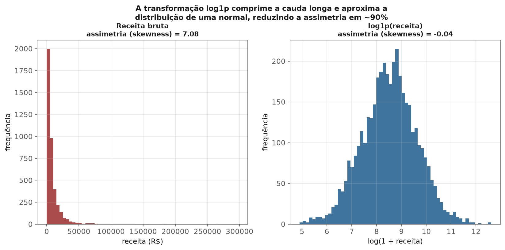
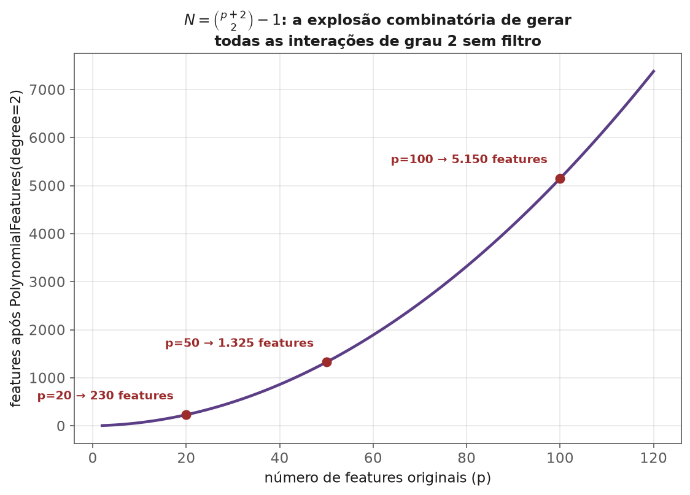
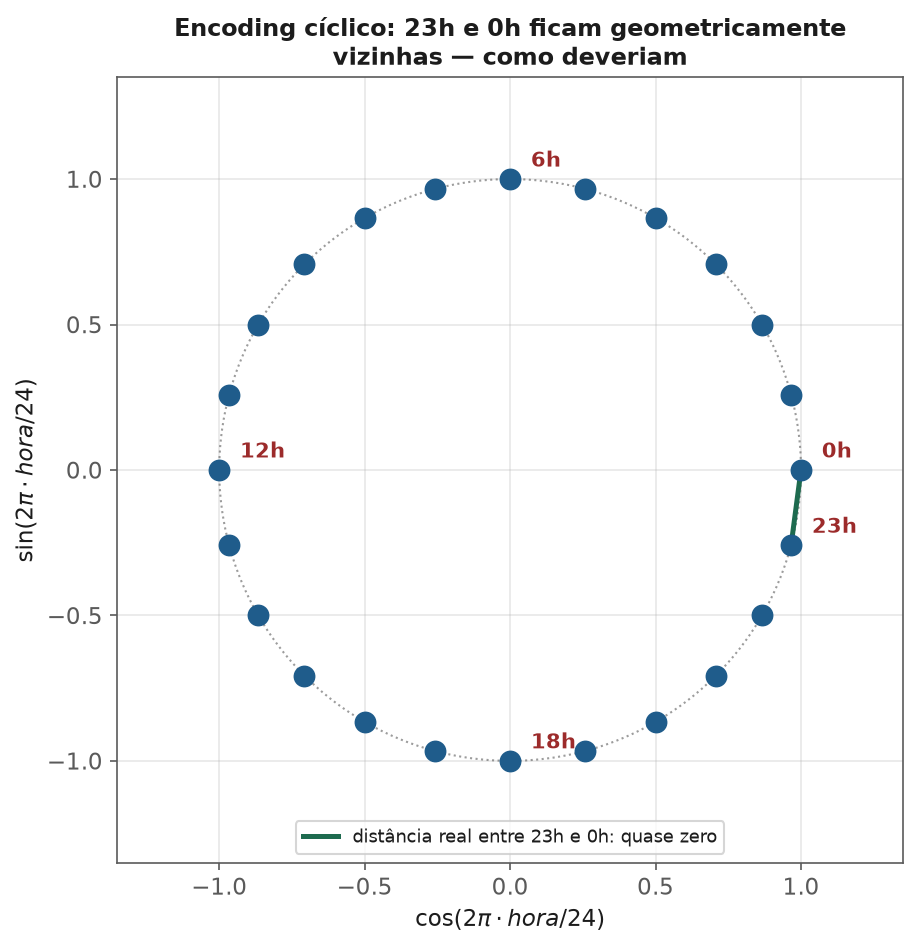
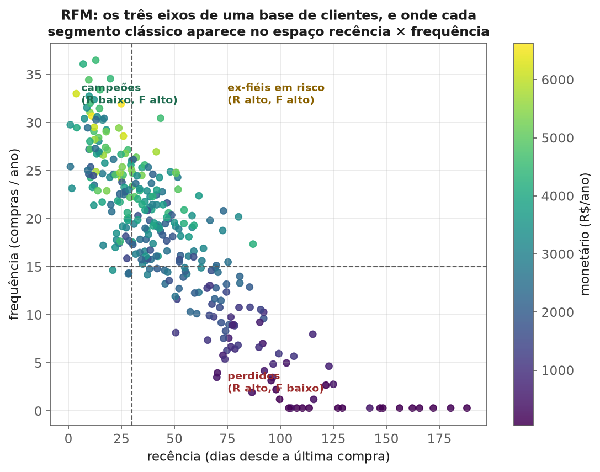

<!-- tema: Preparação de Dados > Feature Engineering -->
<!-- subtitulo: Onde o conhecimento de negócio vira número que o modelo consegue usar -->
<!-- resumo: Nenhum algoritmo, por mais sofisticado, recupera uma informação que nunca chegou até ele em forma numérica. Feature engineering é o processo de traduzir conhecimento de domínio — "cliente que compra toda sexta-feira", "sensor que oscila mais à noite" — em colunas que um modelo consegue processar. Este material cobre transformações numéricas com suas fórmulas exatas, interações e razões de negócio, features temporais e a armadilha de vazamento que mais custa caro em produção, agregação por entidade via RFM, os limites da automação de feature engineering, e as três famílias de método para decidir quais features vale manter. -->
<!-- nivel: Intermediário -->
<!-- prerequisitos: Análise Exploratória; Dados Faltantes e Outliers (módulos deste tema) -->
<!-- duracao: 12 a 16 horas (leitura + 3 notebooks) -->
<!-- notebooks: 01-transformacoes-numericas · 02-features-temporais-e-agregacoes · 03-selecao-de-features · 99-exercicios -->
<!-- autor: Material do curso de ML & DL -->
<!-- versao: 2.0 -->

# Feature Engineering

## Por que este módulo existe

Modelos de gradient boosting e redes neurais são frequentemente descritos como
"aprendem as features sozinhos" — e há verdade nisso, mas é uma meia-verdade
perigosa. Uma árvore de decisão pode aprender que "compra às sextas" importa
**se essa informação existir em alguma coluna**. Se o dataset só tem a data
bruta de cada compra, a árvore jamais vai inventar sozinha o conceito de
"dia da semana" — ela só enxerga o timestamp como um número gigante, quase sem
padrão aproveitável. Feature engineering é o trabalho de expor, explicitamente,
a estrutura que o modelo não tem como descobrir sozinho.

> [!ANALOGIA] Dar dados brutos a um modelo é como entregar ingredientes crus a
> alguém que nunca cozinhou e pedir um prato pronto. Modelos modernos são bons
> cozinheiros — mas picar a cebola, temperar e pré-cozinhar o que precisa de
> pré-cozimento (as features) ainda é o que separa um prato mediano de um bom,
> mesmo com o melhor cozinheiro da casa.

Em praticamente toda competição séria de dados tabulares — Kaggle, KDD Cup,
desafios internos de empresas — o padrão se repete: os times no topo do
ranking quase sempre usam o **mesmo algoritmo** (gradient boosting, quase
sempre) que os times no meio da tabela. A diferença entre a 1ª e a 50ª posição
raramente é o algoritmo. É o conjunto de features. Este módulo trata feature
engineering como a disciplina mais subestimada — e mais lucrativa — do
trabalho de um cientista de dados.

### O que você vai conseguir fazer ao final

- Escolher transformações numéricas (log, Box-Cox, Yeo-Johnson, binning) com
  a fórmula exata e um motivo técnico, não por costume.
- Construir features de interação e razão de negócio sabendo quantificar o
  custo combinatório de gerá-las sem filtro.
- Construir features temporais e de agregação sem vazar informação do futuro
  para o passado — a armadilha mais cara desta área.
- Aplicar RFM (Recência, Frequência, Monetário) como técnica padrão de
  agregação por entidade em churn, crédito e marketing.
- Argumentar, com critério técnico, quando vale automatizar feature
  engineering e quando o trabalho manual ainda vence.
- Aplicar os três tipos de seleção de features (filtro, wrapper, embutido),
  com as fórmulas de cada um, e saber quando cada um é apropriado.
- Reconhecer o custo (dimensionalidade, multicolinearidade, overfitting) de
  criar features demais.

---

## Transformações numéricas

### Log e potência: comprimindo a assimetria

Já visto no tema 1: dados de receita, tempo e contagem costumam ter cauda
longa à direita. Uma transformação log comprime essa cauda e aproxima a
distribuição de uma normal — o que ajuda modelos lineares (cuja função de
perda assume, implicitamente, resíduos bem comportados) e métodos baseados em
distância (onde um único valor extremo dominaria qualquer cálculo).

> [!ARMADILHA] Log de zero é indefinido, e log de negativo não existe nos
> reais. A transformação padrão para lidar com zeros é $\log(1+x)$
> (`np.log1p`), que preserva zero como zero. Para variáveis com valores
> negativos, é preciso um deslocamento antes, ou uma transformação de
> Box-Cox/Yeo-Johnson (que generaliza log e lida com negativos).

### Box-Cox: a família de transformações que generaliza o log

O log é, na verdade, um caso particular de uma família mais ampla de
transformações de potência. A transformação de **Box-Cox** introduz um
parâmetro $\lambda$ que controla a intensidade da correção de assimetria, e
inclui o log como o caso $\lambda = 0$:

> [!FORMULA] Para $x > 0$ e $\lambda \neq 0$:
>
> $$x^{(\lambda)} = \frac{x^\lambda - 1}{\lambda}$$
>
> Para $\lambda = 0$ (o limite da expressão acima quando $\lambda \to 0$):
>
> $$x^{(0)} = \ln(x)$$
>
> $\lambda$ não é escolhido a dedo: ele é **estimado dos dados** por máxima
> verossimilhança (tema 1) — o valor de $\lambda$ que torna a distribuição
> transformada mais próxima de uma normal. $\lambda = 1$ equivale a não
> transformar nada (só um deslocamento); $\lambda = 0{,}5$ é uma raiz
> quadrada reescalada; $\lambda = 0$ é o log.

A exigência $x > 0$ é a limitação central do Box-Cox — ele não lida com
zeros nem negativos. Para esses casos, existe a **Yeo-Johnson**, que separa a
fórmula em dois ramos (positivo e negativo) para funcionar em toda a reta
real:

> [!FORMULA] Para $x \geq 0$, a mesma forma do Box-Cox com um deslocamento de
> $+1$ (o equivalente ao `log1p` generalizado):
>
> $$x^{(\lambda)} = \frac{(x+1)^\lambda - 1}{\lambda} \quad (\lambda \neq 0), \qquad x^{(\lambda)} = \ln(x+1) \quad (\lambda = 0)$$
>
> Para $x < 0$, a versão espelhada, usando $2-\lambda$ no expoente:
>
> $$x^{(\lambda)} = -\frac{(-x+1)^{2-\lambda} - 1}{2-\lambda} \quad (\lambda \neq 2), \qquad x^{(\lambda)} = -\ln(-x+1) \quad (\lambda = 2)$$

> [!NOTA] Na prática, raramente é preciso implementar essas fórmulas à mão —
> `scipy.stats.boxcox` e `sklearn.preprocessing.PowerTransformer` (com
> `method="box-cox"` ou `method="yeo-johnson"`) já estimam $\lambda$
> automaticamente. O que importa é entender **o que** está sendo otimizado
> (aproximar uma normal) e **por que** a família Yeo-Johnson existe (aceitar
> zeros e negativos, algo que Box-Cox e log puro não fazem).

### Um exemplo numérico: comprimindo a cauda de uma distribuição de receita

Considere uma base de 4.000 transações de e-commerce, com receita por pedido
seguindo uma distribuição log-normal — o padrão típico de valores monetários,
com muitos pedidos pequenos e poucos pedidos muito grandes. A assimetria
(skewness, tema 1) medida diretamente nos dados brutos é:

$$g_1(\text{receita bruta}) = 7{,}08$$

Um valor de assimetria acima de 1 já é considerado "altamente assimétrico"
em estatística descritiva — 7,08 é uma cauda extrema, tipicamente causada por
poucos pedidos corporativos ou de atacado que somam centenas de vezes o valor
de um pedido comum. Depois de aplicar `log1p`:

$$g_1(\log(1+\text{receita})) = -0{,}04$$

A assimetria caiu de 7,08 para -0,04 — praticamente zero, o valor esperado de
uma distribuição simétrica. A figura abaixo mostra os dois histogramas lado a
lado: à esquerda, a cauda longa dominando a escala visual (a maioria dos
pedidos comprimida perto de zero); à direita, uma forma aproximadamente
normal, sino bem comportado.



> [!MERCADO] Esse tipo de transformação é rotina em precificação, crédito e
> qualquer variável de "valor monetário" — tíquete médio, limite de crédito,
> saldo de conta, valor de sinistro em seguros. Em regressão linear (tema 4),
> transformar o alvo (não só as features) para log também é comum: prever
> $\log(\text{preço})$ em vez de $\text{preço}$ diretamente estabiliza a
> variância dos resíduos e evita que uma casa de R\$ 10 milhões domine
> sozinha a função de perda de todo o dataset.

### Discretização (binning): quando faz sentido perder granularidade

Transformar uma variável contínua em faixas (`idade` → `"18-25"`, `"26-35"`...)
parece um passo atrás, mas tem usos reais: captura relações **não-monotônicas**
que um modelo linear não veria na variável contínua, aumenta a
interpretabilidade para stakeholders de negócio, e reduz sensibilidade a
outliers extremos dentro de cada faixa.

> [!ARMADILHA] Discretizar sempre **perde informação** — duas pessoas de 26 e
> 34 anos, na mesma faixa "26-35", tornam-se indistinguíveis para o modelo.
> Para modelos que já capturam não-linearidade sozinhos (árvores, gradient
> boosting), binning manual raramente ajuda e frequentemente piora — a árvore
> já encontra o ponto de corte ótimo sozinha, com mais liberdade do que faixas
> fixas definidas a priori.

## Interações e razões de negócio

Uma razão como `receita / n_funcionarios` (produtividade por funcionário)
costuma carregar mais sinal que as duas variáveis originais separadas — porque
codifica, de forma direta, o conceito de negócio que interessa. Interações
(produto de duas features) permitem que um modelo linear capture efeitos que,
sozinho, ele não conseguiria (uma reta não modela "o efeito de $x_1$ depende do
valor de $x_2$" sem um termo de interação explícito).

### Razões que aparecem em praticamente todo setor

Algumas razões de negócio são tão informativas que viraram padrão em suas
respectivas indústrias — o tipo de feature que um analista de domínio propõe
antes mesmo de abrir um notebook:

| Setor | Razão | O que captura |
|---|---|---|
| Crédito | **DTI** — *debt-to-income*, $\frac{\text{dívida mensal}}{\text{renda mensal}}$ | Capacidade de pagamento relativa, não a dívida em valor absoluto |
| Crédito | **Utilização de limite**, $\frac{\text{saldo devedor}}{\text{limite do cartão}}$ | Sinal clássico de risco: uso próximo de 100% do limite prevê inadimplência mesmo com saldo baixo em termos absolutos |
| E-commerce | **Taxa de conversão**, $\frac{\text{pedidos}}{\text{visitas}}$ | Eficiência do funil, independente do volume bruto de tráfego |
| SaaS | **Receita por usuário ativo** (ARPU), $\frac{\text{receita}}{\text{usuários ativos}}$ | Monetização por unidade, comparável entre períodos com bases de tamanhos diferentes |
| Operações | **OEE** (eficiência de equipamento), disponibilidade × performance × qualidade | Um único número que resume três fontes de perda de produtividade industrial |

> [!MERCADO] Em modelos lineares e regressão logística, interações e razões
> **precisam** ser criadas manualmente — o modelo não as descobre sozinho.
> Em árvores e gradient boosting, o modelo já captura muitas interações
> implicitamente (uma sequência de splits em $x_1$ e depois $x_2$ **é** uma
> forma de interação) — mas uma razão de negócio bem escolhida ainda ajuda,
> porque reduz a profundidade de árvore necessária para aprender o mesmo
> padrão, e reduz a variância da estimativa (menos splits = menos overfitting
> por caminho).

### O custo combinatório de gerar interações sem filtro

Criar todas as interações possíveis entre $p$ features com
`PolynomialFeatures(degree=2)` gera todos os monômios de grau até 2 — cada
feature original, cada quadrado, e cada produto de par — excluindo apenas o
termo constante:

> [!FORMULA] O número total de features geradas é:
>
> $$N = \binom{p+2}{2} - 1$$
>
> Essa fórmula cresce **quadraticamente** com $p$ — dobrar o número de
> features originais quadruplica (aproximadamente) o número de features após
> a expansão.

A tabela a seguir torna esse crescimento concreto:

| Features originais ($p$) | Features após grau 2 ($N$) | Fator de multiplicação |
|---|---|---|
| 10 | 65 | 6,5× |
| 20 | 230 | 11,5× |
| 50 | 1.325 | 26,5× |
| 100 | 5.150 | 51,5× |

Um dataset com 50 colunas — nada incomum em CRM, telecom ou dados
transacionais — já produz mais de 1.300 features após uma expansão polinomial
cega, a maioria ruído estatístico sem relação real com o alvo. A figura
abaixo traça essa curva por completo, com os três pontos da tabela marcados.



> [!ARMADILHA] Esse é o mesmo problema de dimensionalidade e
> multicolinearidade visto no tema 2. Interações devem ser guiadas por
> hipótese de negócio (a tabela de razões acima é um exemplo do tipo de
> raciocínio certo) ou filtradas depois com os métodos de seleção da última
> seção deste módulo — nunca geradas às cegas em massa e entregues como estão
> a um modelo linear ou a um algoritmo sensível a colunas redundantes.

### Um exemplo numérico: por que a razão vence a variável bruta

Considere quatro solicitantes de crédito, cada um com renda e dívida mensal
diferentes. Comparados pela dívida em valor absoluto, a ordem de risco
aparente é uma; comparados pelo DTI (dívida ÷ renda), a ordem real de
capacidade de pagamento é outra, e é essa segunda ordem que de fato prevê
inadimplência:

| Solicitante | Renda mensal (R\$) | Dívida mensal (R\$) | Dívida bruta (ranking) | DTI | DTI (ranking) |
|---|---|---|---|---|---|
| A | 15.000 | 4.500 | 1º maior dívida | 0,30 | risco moderado |
| B | 3.000 | 2.100 | 3º maior dívida | 0,70 | **maior risco** |
| C | 8.000 | 4.800 | 2º maior dívida | 0,60 | risco alto |
| D | 4.000 | 800 | 4º menor dívida | 0,20 | **menor risco** |

Pela dívida bruta, o solicitante A parece o de maior risco (maior valor em
reais devido por mês). Pelo DTI, A tem folga considerável (renda alta o
suficiente para absorver a dívida), enquanto B — com a menor dívida em valor
absoluto de todo o grupo, exceto D — compromete 70% da própria renda todo
mês, o pior indicador de capacidade de pagamento do grupo inteiro. Um modelo
que recebe apenas `renda` e `divida` como colunas separadas precisaria
aprender essa relação de divisão sozinho, a partir de exemplos; um modelo que
recebe `DTI` já pronto começa com a resposta certa embutida na própria
feature — e é exatamente esse atalho que justifica o esforço de construí-la.

## Features temporais: a categoria com mais armadilhas de vazamento

### Extraindo estrutura de uma data

Uma data bruta (`2024-03-15 14:32:00`) quase não tem valor preditivo direto —
o valor está na estrutura que se pode extrair dela: dia da semana, hora do
dia, é feriado, é fim de mês (comum em padrões financeiros), é dia de
pagamento de salário (tipicamente dias 5 e 20 no Brasil — um sinal forte em
previsão de consumo e adimplência), dias desde um evento de referência.

> [!FORMULA] **Encoding cíclico.** Hora do dia e dia da semana são
> **circulares** — 23h e 0h são vizinhas, não extremos opostos. Codificar como
> um número linear (`hora = 23` vs. `hora = 0`) faz o modelo achar que estão
> longe. A correção padrão é o par seno/cosseno:
>
> $$\sin\left(\frac{2\pi \cdot hora}{24}\right), \qquad \cos\left(\frac{2\pi \cdot hora}{24}\right)$$
>
> Esse par de coordenadas coloca cada hora num ponto de um círculo — 23h e 0h
> ficam geometricamente próximas, como deveriam. O mesmo princípio se aplica a
> dia da semana (período 7), mês do ano (período 12) e minuto da hora
> (período 60) — qualquer variável cujo valor "dá a volta".

A figura abaixo mostra literalmente o que a fórmula constrói: as 24 horas do
dia dispostas num círculo unitário. Note como 23h e 0h ficam lado a lado — a
distância euclidiana entre os dois pontos $(\cos, \sin)$ é pequena, refletindo
a proximidade real das duas horas, algo que a codificação linear jamais
representaria corretamente.



> [!NOTA] Um efeito colateral útil do encoding cíclico: ele produz sempre 2
> colunas por variável temporal, independente do período (24 para hora, 7
> para dia da semana, 12 para mês) — muito mais compacto que one-hot encoding
> da mesma variável, e sem o problema de alta cardinalidade em variáveis com
> período grande (dia do ano, período 365).

### Features de defasagem (lag) e agregação móvel

Prever vendas de amanhã a partir de vendas dos últimos 7 dias exige criar
colunas como `vendas_ontem`, `media_movel_7_dias`, `vendas_mesma_semana_ano_passado`.
Essas features são centrais em séries temporais (tema 7) e em qualquer
problema onde o histórico de um cliente/entidade importa.

> [!ARMADILHA] **O vazamento temporal é o erro mais caro e mais comum desta
> seção.** Calcular `media_movel_7_dias` usando uma janela que inclui o próprio
> dia que se quer prever (ou dias futuros) vaza informação do futuro. A regra
> não-negociável: toda feature de agregação temporal deve ser calculada usando
> **apenas dados estritamente anteriores** ao ponto que está sendo previsto.

O erro é sutil o suficiente para passar despercebido em uma revisão de
código rápida — a diferença entre a versão errada e a certa é uma única
chamada de método:

```python
# ERRADO: rolling(7) inclui o próprio dia da linha atual na janela.
# O modelo "aprende" usando informação que não existiria no momento real
# da previsão — o resultado parece ótimo no notebook e falha em produção.
df["media_movel_7d"] = df["vendas"].rolling(7).mean()

# CERTO: shift(1) empurra a série um passo para o futuro antes de calcular
# a janela, garantindo que o dia atual nunca entra na própria média.
df["media_movel_7d"] = df["vendas"].shift(1).rolling(7).mean()
```

> [!MERCADO] Esse exato bug — `rolling` sem `shift` — é, na experiência de
> times de dados de mercado, a causa isolada mais comum de um modelo que
> reporta AUC de 0,95 em validação e desempenho medíocre em produção. O
> motivo: a validação cruzada (tema 6) sozinha **não pega esse erro**, porque
> o vazamento existe igualmente em todos os folds — é preciso revisar
> explicitamente a lógica de construção de cada feature temporal, não confiar
> apenas no número de validação.

### Agregações por entidade (cliente, produto, loja)

`n_compras_ultimos_30_dias`, `ticket_medio_historico`, `dias_desde_ultima_compra`
transformam um histórico de eventos em um snapshot por entidade — o padrão
central de feature engineering em problemas de churn, crédito e recomendação.

> [!ARMADILHA] A mesma armadilha de vazamento se aplica aqui: se o "histórico"
> usado para calcular `ticket_medio_historico` inclui a própria transação que
> está sendo classificada (ou transações futuras a ela), o modelo está usando
> informação que não existiria no momento real da decisão. Sempre pergunte:
> "no momento em que essa previsão seria feita de verdade, essa informação já
> existiria?"

## Agregações por entidade: RFM na prática

A forma mais consolidada de agregação por entidade — usada em marketing,
churn e crédito há décadas, muito antes de "feature engineering" ter esse
nome — é **RFM**: Recência, Frequência e Monetário. É o exemplo mais claro de
como transformar um histórico bruto de eventos (uma tabela de transações) em
um punhado de features por cliente que carregam quase todo o sinal preditivo
relevante.

> [!DEFINICAO] Para cada entidade (tipicamente um cliente), calculam-se três
> números a partir do histórico de transações:
>
> - **Recência ($R$):** dias desde a última interação/compra. Quanto menor,
>   mais "quente" o cliente.
> - **Frequência ($F$):** número de compras num período de referência (ex.:
>   últimos 12 meses). Quanto maior, mais engajado.
> - **Monetário ($M$):** valor total ou médio gasto no mesmo período. Quanto
>   maior, mais valioso o cliente.

Cada um dos três eixos costuma ser discretizado em quintis (score de 1 a 5,
tema 1 — a mesma lógica de percentis vista em estatística descritiva), com
**recência invertida** (menor recência = score mais alto, porque "comprou
recentemente" é bom):

$$\text{score}_R(i) = 6 - \text{quintil}(R_i), \qquad \text{score}_F(i) = \text{quintil}(F_i), \qquad \text{score}_M(i) = \text{quintil}(M_i)$$

### Um exemplo numérico: seis clientes, três segmentos

A tabela a seguir aplica RFM a seis clientes fictícios de um e-commerce, com
os scores atribuídos por posição relativa na base (1 = pior quintil, 5 =
melhor):

| Cliente | Recência (dias) | Frequência (compras/ano) | Monetário (R\$/ano) | $R$ | $F$ | $M$ | Segmento |
|---|---|---|---|---|---|---|---|
| A | 5 | 24 | 4.800 | 5 | 5 | 5 | **Campeão** |
| B | 10 | 18 | 3.200 | 5 | 4 | 4 | **Fiel** |
| C | 3 | 1 | 2.500 | 5 | 1 | 4 | **Novo de alto valor** |
| D | 45 | 6 | 900 | 3 | 3 | 3 | Precisa atenção |
| F | 120 | 15 | 3.000 | 1 | 4 | 4 | **Ex-fiel em risco** |
| E | 90 | 2 | 150 | 1 | 1 | 1 | Perdido |

Cada linha conta uma história de negócio diferente que o dado bruto sozinho
não deixa óbvia: o cliente F comprava com frequência e valor altos, mas não
aparece há 120 dias — é candidato prioritário a uma campanha de reativação,
porque o valor histórico dele já provou que ele vale o investimento. O
cliente C é o oposto: só comprou uma vez, mas gastou muito e recentemente —
candidato a nutrição para virar recorrente. Um modelo de churn ou de próxima
compra que recebe apenas `R`, `F`, `M` como features já captura a maior parte
do sinal que separaria esses seis clientes — muito mais do que receberia da
tabela de transações bruta sem agregação nenhuma.



> [!MERCADO] Em churn de assinatura (SaaS, telecom) e em crédito, RFM
> (ou variações dele — "RFM estendido" com número de canais de contato,
> tempo médio entre compras, tendência de gasto) é frequentemente a
> **primeira** rodada de features construída, antes de qualquer coisa mais
> sofisticada — porque tende a capturar, com apenas 3 a 6 números por
> cliente, uma fração enorme do sinal preditivo disponível no histórico
> transacional. É comum um modelo com apenas features RFM já superar um
> baseline ingênuo por uma margem grande, mesmo antes de qualquer feature
> mais elaborada entrar no pipeline.

## Feature engineering automatizada e o limite do trabalho manual

Ferramentas de **síntese automática de features** — como a técnica *Deep
Feature Synthesis*, implementada na biblioteca `featuretools` — automatizam
parte do trabalho descrito até aqui: dado um conjunto de tabelas relacionadas
(clientes, pedidos, itens de pedido) e as chaves que as conectam, a
ferramenta gera automaticamente agregações (`count`, `sum`, `mean`, `std`,
`max`, `min` por entidade e por janela de tempo) em escala — potencialmente
milhares de features candidatas, sem que um analista escreva cada fórmula à
mão.

> [!ARMADILHA] Síntese automática de features **multiplica o risco de
> vazamento temporal**, em vez de eliminá-lo — se os "cutoffs" de tempo
> (o instante em que cada previsão seria feita de verdade) não forem
> configurados explicitamente para cada linha, a ferramenta agrega
> livremente todo o histórico disponível de cada entidade, incluindo eventos
> futuros em relação ao ponto que está sendo previsto. Automatizar a geração
> de fórmulas não automatiza o raciocínio sobre "o que já existiria no
> momento real da decisão" — essa parte continua sendo responsabilidade de
> quem configura o pipeline.

Em termos de código, a diferença entre escrever cada agregação à mão e deixar
uma ferramenta de síntese automática gerar centenas delas é uma questão de
escala, não de princípio — o `cutoff_time` abaixo é o parâmetro que carrega
toda a responsabilidade de evitar vazamento:

```python
import featuretools as ft

# es: um EntitySet ja com as tabelas "clientes" e "pedidos" relacionadas
# pela chave cliente_id, e uma coluna de data em "pedidos".
features, definicoes = ft.dfs(
    entityset=es,
    target_dataframe_name="clientes",
    agg_primitives=["count", "sum", "mean", "std", "max", "min"],
    trans_primitives=["day", "month", "weekday"],
    cutoff_time=cutoffs_por_cliente,  # um timestamp por linha: o instante
                                       # exato em que a previsao seria feita
    max_depth=2,
)
```

Sem o `cutoff_time` calibrado linha a linha, `ft.dfs` agrega o histórico
completo de cada cliente — passado e futuro em relação ao evento que está
sendo previsto — produzindo centenas de features aparentemente poderosas que
são, na verdade, vazamento em escala industrial.

Uma segunda alternativa ao trabalho manual, mais recente e mais associada a
dados não-tabulares, é deixar que o próprio modelo **aprenda** representações
a partir dos dados brutos — **embeddings** aprendidos para texto, imagem ou
sequências categóricas de alta cardinalidade, e redes profundas que compõem
features automaticamente em suas camadas internas (tema 8 desenvolve essa
ideia em detalhe, com embeddings e transfer learning).

### Quando o trabalho manual ainda vence

Apesar dos avanços em automação, feature engineering manual continua sendo o
que separa soluções boas de medianas em um cenário específico e comum:

- **Dados tabulares pequenos ou médios** (a maioria dos problemas reais de
  negócio, fora de big tech): não há dados suficientes para uma rede profunda
  aprender representações do zero; conhecimento de domínio compensa a falta
  de volume.
- **Exigência de interpretabilidade e regulação**: em crédito, seguros e
  saúde, um modelo frequentemente precisa justificar suas decisões (tema 11).
  Uma feature manual como "utilização de limite" é interpretável por
  construção; uma representação aprendida por uma rede neural, tipicamente
  não é.
- **Conhecimento de domínio que nenhum algoritmo "adivinha"**: que dia 5 e
  dia 20 são datas de pagamento de salário no Brasil, que uma razão
  específica é o indicador-padrão de um setor (como DTI em crédito) — isso
  vem de conversa com especialistas de negócio, não de otimização automática
  sobre os dados.

> [!MERCADO] Na prática de mercado, as duas abordagens convivem: um pipeline
> de produção comum começa com features manuais de alto valor conhecido
> (RFM, razões de domínio, encoding temporal correto), roda uma ferramenta de
> síntese automática para gerar candidatas adicionais, e então aplica os
> métodos de seleção da próxima seção para podar o que não ajuda — em vez de
> escolher entre "manual" e "automático" como alternativas excludentes.

## Seleção de features: três famílias de método

| Família | Como funciona | Vantagem | Limite |
|---|---|---|---|
| **Filtro** | Métrica univariada (correlação, informação mútua, variância) entre cada feature e o alvo, independente do modelo | Rápido, escalável | Ignora interações entre features |
| **Wrapper** | Testa subconjuntos de features treinando o modelo real (ex.: eliminação recursiva, RFE) | Considera o modelo final | Caro computacionalmente |
| **Embutido** | O próprio algoritmo de treino penaliza ou zera features (Lasso, importância de árvores) | Eficiente, informado pelo modelo | Específico do algoritmo usado |

> [!NOTA] Filtro por variância (remover colunas quase constantes) e por
> correlação entre pares de features (remover uma de cada par muito
> correlacionado) são passos baratos que valem rodar **sempre**, antes de
> qualquer método mais caro — eliminam candidatas óbvias e reduzem o custo dos
> métodos seguintes.

### Filtro: informação mútua como alternativa não-linear à correlação

Correlação de Pearson (tema 1) só captura relações **lineares** — uma feature
com relação forte, porém curva (em U, por exemplo), pode ter correlação
próxima de zero e ainda assim ser extremamente preditiva. **Informação mútua**
generaliza a ideia de "relação com o alvo" para qualquer forma de
dependência, linear ou não:

> [!FORMULA] A informação mútua entre uma feature $X$ e o alvo $Y$ mede
> quanto saber $X$ reduz a incerteza sobre $Y$:
>
> $$I(X;Y) = \sum_{x}\sum_{y} p(x,y) \, \log\frac{p(x,y)}{p(x)\,p(y)}$$
>
> $I(X;Y) = 0$ se e somente se $X$ e $Y$ forem estatisticamente
> independentes — ao contrário da correlação, que pode ser zero mesmo com uma
> dependência forte, desde que não-linear e simétrica (o exemplo clássico:
> $Y = X^2$ com $X$ simétrico em torno de 0 tem correlação de Pearson igual a
> zero, mas informação mútua alta).

`sklearn.feature_selection.mutual_info_classif` e `mutual_info_regression`
estimam essa quantidade a partir de amostras, sem exigir a forma fechada de
$p(x,y)$.

### Wrapper: eliminação recursiva de features (RFE)

RFE treina o modelo real repetidamente, removendo a feature menos importante
a cada rodada:

1. Treina o modelo com todas as $p$ features.
2. Rankeia as features pela importância que o próprio modelo atribui
   (coeficiente, em modelos lineares; importância de split, em árvores).
3. Remove a feature de menor importância.
4. Repete os passos 1–3 até restar o número de features desejado.

> [!ARMADILHA] RFE herda qualquer viés do modelo usado internamente — se o
> modelo interno é uma árvore e sofre do viés de cardinalidade (módulo
> anterior deste tema, e reforçado no tema 4), o ranking de importância usado
> para eliminar features também herda esse viés. RFE com importância por
> permutação, em vez de importância nativa do modelo, mitiga o problema ao
> custo de mais tempo de computação.

### Embutido: Lasso e importância de árvores

Lasso (regularização L1, tema 4) resolve, para o alvo $y$ e a matriz de
features $X$:

$$\hat{\beta} = \underset{\beta}{\text{argmin}} \; \sum_i (y_i - x_i \cdot \beta)^2 \; + \; \alpha \sum_j |\beta_j|$$

A penalidade $\alpha \sum_j |\beta_j|$ empurra coeficientes de features
irrelevantes exatamente para zero (não apenas próximos de zero, como a
penalidade L2 de Ridge faria) — é seleção de features embutida no próprio
treino, sem nenhum passo separado.

Importância de features de Random Forest e gradient boosting (tema 4) cumpre
papel semelhante, mas com a ressalva já vista: features de alta cardinalidade
tendem a receber importância inflada artificialmente por impureza (MDI),
mesmo sem relação real com o alvo — mais chances de splits "aleatoriamente
úteis" apenas por terem mais valores possíveis. Importância por permutação em
dados de validação continua sendo a checagem mais confiável.

### Um exemplo numérico de seleção em cascata

Um dataset com 200 features brutas, aplicando os três filtros baratos em
sequência antes de qualquer método caro, é uma rotina comum em pipelines de
produção — especialmente quando o dataset combina features manuais (RFM,
razões de domínio) com a saída de uma ferramenta de síntese automática como a
da seção anterior, que facilmente gera centenas de colunas candidatas de uma
vez:

| Etapa | Features restantes | O que foi removido |
|---|---|---|
| Original | 200 | — |
| Filtro de variância (remove quase-constantes) | 178 | 22 colunas com >99% do mesmo valor |
| Filtro de correlação entre pares (threshold 0,95) | 151 | 27 colunas redundantes entre si |
| Informação mútua (top 60 com o alvo) | 60 | 91 colunas com relação fraca ou nula com o alvo |
| RFE com o modelo final (top 25) | 25 | 35 colunas com contribuição marginal ao modelo específico |

Cada etapa é mais cara computacionalmente que a anterior — e é por isso que a
ordem importa: eliminar 49 colunas quase de graça (variância + correlação)
antes de rodar RFE (que treina o modelo repetidamente) economiza uma
quantidade grande de tempo de computação sem perder qualidade de seleção.

> [!MERCADO] Times que rodam ferramentas de AutoML ou busca de hiperparâmetros
> em cima de centenas de features (tema 4 e o restante deste curso tratam de
> tuning em detalhe) sentem esse custo diretamente na conta de nuvem: cada
> combinação de hiperparâmetros testada precisa treinar o modelo do zero, e o
> tempo de treino cresce com o número de features. Reduzir de 200 para 25
> features **antes** de iniciar a busca de hiperparâmetros não é só uma
> questão de qualidade estatística — é uma decisão de orçamento de
> computação, e costuma ser a otimização de custo mais barata disponível
> num pipeline de treino.

## Erros que custam caro — checklist

- Calcular uma feature de agregação temporal sem excluir explicitamente o
  próprio ponto (ou o futuro) da janela — vazamento silencioso, o erro mais
  caro deste módulo.
- Usar `rolling()` sem `shift(1)` antes — o bug específico mais comum de
  vazamento temporal, e o mais fácil de não notar numa revisão de código
  apressada.
- Codificar hora/dia da semana como número linear em vez de seno/cosseno,
  quebrando a proximidade circular.
- Gerar todas as interações possíveis (`PolynomialFeatures` em massa) sem
  filtro, multiplicando dimensionalidade e multicolinearidade — lembre da
  curva $N = \binom{p+2}{2}-1$.
- Discretizar variáveis que um modelo baseado em árvore já processaria melhor
  na forma contínua.
- Confiar em importância de features de árvore (MDI) sem checar se não está
  inflada por cardinalidade alta — prefira permutação em validação.
- Criar razões de negócio sem checar divisão por zero ou por valores muito
  pequenos (que explodem a razão) — um `n_funcionarios = 0` transforma
  qualquer razão em infinito ou `NaN`.
- Rodar síntese automática de features (`featuretools` ou similar) sem
  configurar cutoffs temporais explícitos por linha, multiplicando o risco de
  vazamento em vez de eliminá-lo.
- Aplicar Box-Cox em dados com zeros ou negativos sem perceber a restrição
  $x > 0$ — usar Yeo-Johnson nesse caso, não Box-Cox.

## Para ir além

- Zheng & Casari, *Feature Engineering for Machine Learning* — cobertura
  prática e ampla, com o mesmo espírito deste módulo.
- Kuhn & Johnson, *Feature Engineering and Selection* — tratamento estatístico
  mais formal dos três tipos de seleção.
- Box & Cox (1964), *An Analysis of Transformations* — o artigo original da
  transformação que dá nome à família.
- Kanter & Veeramachaneni (2015), *Deep Feature Synthesis* — o artigo que
  introduz a técnica automatizada por trás de bibliotecas como `featuretools`.
- Documentação do `sklearn.feature_selection` — implementações de referência
  para filtro, wrapper (RFE) e embutido.
- Documentação de `sklearn.preprocessing.PowerTransformer` — implementação de
  referência de Box-Cox e Yeo-Johnson.
