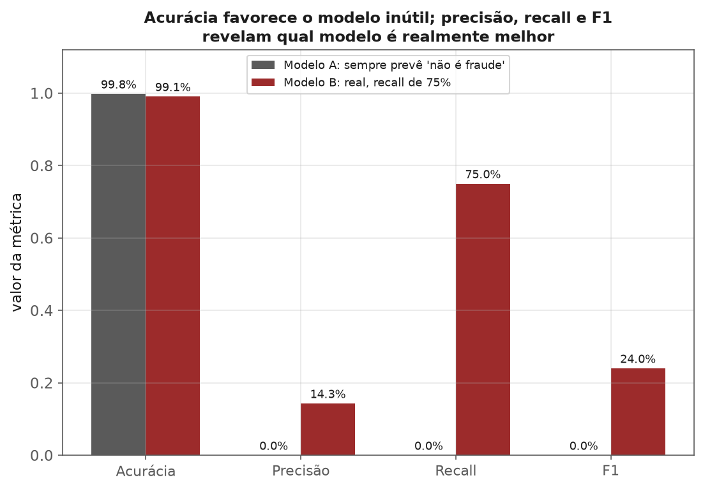
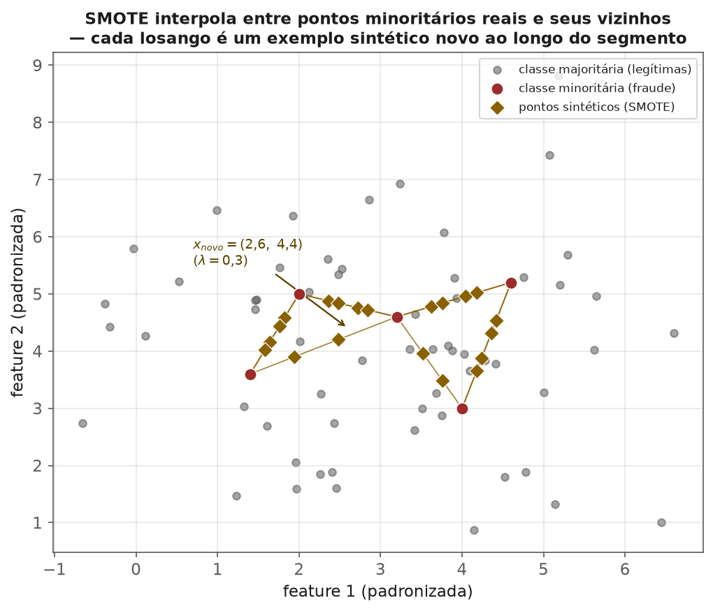

<!-- tema: Preparação de Dados > Dados Desbalanceados -->
<!-- subtitulo: Quando 99% de acurácia significa que o modelo não aprendeu nada -->
<!-- resumo: Fraude, churn, falha de equipamento e diagnóstico de doenças raras compartilham uma característica: a classe que interessa é minoria — às vezes bem menos de 1% dos dados. Um modelo que sempre prevê "não" acerta quase sempre e não serve para nada. Este material cobre, em profundidade, por que acurácia falha nesse regime, o catálogo completo de técnicas de undersampling (aleatório, Tomek Links, NearMiss, ENN) e oversampling (aleatório, SMOTE, Borderline-SMOTE, ADASYN, SMOTE-NC), os métodos combinados, pesos de classe, ajuste de limiar por custo de negócio, e a recalibração de probabilidades necessária quando o modelo treinado em dados reamostrados volta a operar no mundo real desbalanceado. -->
<!-- nivel: Intermediário — encerra o tema de Preparação de Dados -->
<!-- prerequisitos: Todos os módulos anteriores deste tema -->
<!-- duracao: 10 a 14 horas (leitura + 3 notebooks) -->
<!-- notebooks: 01-o-problema-do-desbalanceamento · 02-tecnicas-de-reamostragem · 03-limiar-e-custo · 99-exercicios -->
<!-- autor: Material do curso de ML & DL -->
<!-- versao: 2.0 -->

# Dados Desbalanceados

## Por que este módulo existe

Um modelo de detecção de fraude que prevê "não é fraude" para **toda**
transação acerta 99,8% das vezes, se a fraude real ocorrer em 0,2% dos casos.
Essa acurácia de 99,8% é ao mesmo tempo tecnicamente verdadeira e
completamente inútil — o modelo nunca identifica uma única fraude. Esse é o
problema central deste módulo: quando as classes são desbalanceadas, a métrica
mais intuitiva (acurácia) se torna a métrica mais enganosa, e o algoritmo de
treino, otimizando por padrão a mesma métrica implícita, aprende a ignorar a
classe rara.

> [!ANALOGIA] Treinar um modelo em dados desbalanceados sem nenhum ajuste é
> como preparar alguém para reconhecer uma doença rara mostrando 999 fotos de
> pessoas saudáveis para cada 1 foto de alguém doente. A estratégia que
> minimiza erros nesse treino é simplesmente **nunca diagnosticar a doença** —
> e é exatamente essa estratégia inútil que o algoritmo de otimização padrão
> vai encontrar, porque ela de fato minimiza o erro médio.

Este não é um problema de nicho. É a condição **normal** de boa parte dos
problemas de classificação que geram valor real de negócio: fraude
(tipicamente 0,1%–1% dos casos), churn de clientes de alto valor (às vezes
2%–5%), falha de equipamento industrial (frequentemente menos de 1%),
diagnóstico de doenças raras (pode ser 1 em 10.000), detecção de defeito de
fabricação em linha de produção de alta qualidade (partes por milhão, em
casos extremos). Problemas de classe balanceada — como os datasets de
brinquedo usados para ensinar o algoritmo básico — são, na prática de
mercado, a exceção.

### O que você vai conseguir fazer ao final

- Explicar, com números, por que acurácia (e até, com ressalvas, a função de
  perda padrão) falha em dados desbalanceados — e por que um modelo
  genuinamente útil pode ter acurácia **menor** que um modelo inútil.
- Aplicar e comparar tecnicamente o catálogo completo de reamostragem:
  undersampling (aleatório, Tomek Links, NearMiss, ENN) e oversampling
  (aleatório, SMOTE, Borderline-SMOTE, ADASYN, SMOTE-NC), com a fórmula e o
  algoritmo de cada técnica.
- Usar pesos de classe como alternativa (ou complemento) à reamostragem, com
  a fórmula exata usada pelo `scikit-learn`.
- Ajustar o limiar de decisão a partir do custo real de negócio de cada tipo
  de erro, derivando a fórmula do limiar ótimo em vez de usar 0,5 por
  convenção.
- Recalibrar as probabilidades de um modelo treinado em dados reamostrados
  para que voltem a refletir a prevalência real do problema em produção —
  o passo que a maioria dos tutoriais pula e que mais causa confusão em
  produção.

---

## Por que acurácia falha

$$\text{acurácia} = \frac{\text{acertos}}{\text{total}} = \frac{TP + TN}{TP+TN+FP+FN}$$

onde $TP$ (verdadeiro positivo), $TN$ (verdadeiro negativo), $FP$ (falso
positivo) e $FN$ (falso negativo) vêm da matriz de confusão — o objeto
central deste módulo inteiro:

| | Previsto: negativo | Previsto: positivo |
|---|---|---|
| **Real: negativo** | $TN$ (verdadeiro negativo) | $FP$ (falso positivo) |
| **Real: positivo** | $FN$ (falso negativo) | $TP$ (verdadeiro positivo) |

A partir dela, as métricas que este módulo usa o tempo todo:

$$\text{precisão} = \frac{TP}{TP+FP} \qquad \text{recall} = \frac{TP}{TP+FN} \qquad F_1 = \frac{2 \cdot \text{precisão} \cdot \text{recall}}{\text{precisão}+\text{recall}}$$

### Um exemplo numérico que muda a forma de ler "acurácia" para sempre

Considere um banco processando **100.000 transações**, das quais **200 são
fraude real** (0,2% — uma taxa realista para cartão de crédito). Compare dois
"modelos":

**Modelo A ("preguiçoso"):** sempre prevê "não é fraude", para toda
transação, sem exceção.

**Modelo B (um modelo real, imperfeito, mas útil):** identifica corretamente
150 das 200 fraudes (recall de 75%), ao custo de marcar 900 transações
legítimas como suspeitas.

| Métrica | Modelo A (preguiçoso) | Modelo B (real, útil) |
|---|---|---|
| $TP$ | 0 | 150 |
| $FN$ | 200 | 50 |
| $FP$ | 0 | 900 |
| $TN$ | 99.800 | 98.900 |
| **Acurácia** | **99,80%** | **99,05%** |
| Precisão | indefinida ($0/0$) | 14,3% |
| Recall | 0% | 75,0% |
| $F_1$ | 0% | 24,0% |

Releia a linha de acurácia. **O modelo genuinamente útil — que captura três
em cada quatro fraudes reais — tem acurácia MENOR que o modelo que nunca
detecta nada.** Isso não é um artefato deste exemplo específico: é uma
consequência matemática direta de como a acurácia pondera erros num regime
desbalanceado. Qualquer falso positivo custa exatamente o mesmo, em termos de
acurácia, que um falso negativo — mas com 99.800 negativos reais e apenas 200
positivos reais, é estatisticamente muito mais fácil "gastar" acurácia em
falsos positivos (que competem contra uma base gigante) do que ganhá-la
detectando os poucos positivos que existem.



> [!MERCADO] O antídoto imediato para essa armadilha específica é métrica, não
> técnica de treino: reportar precisão, recall, F1 e PR-AUC (não ROC-AUC
> sozinha) no lugar de acurácia. O tema 6 (Avaliação e Validação) aprofunda
> cada uma dessas métricas — este módulo assume que você vai medir certo, e
> foca em como **treinar** melhor dado o desbalanceamento.

> [!ARMADILHA] ROC-AUC é enganosamente estável sob desbalanceamento severo —
> ela pode parecer "boa" mesmo quando o modelo tem pouquíssima precisão na
> classe rara, porque a taxa de falso positivo (o eixo x da curva ROC) é
> calculada sobre a classe majoritária, que é grande e estável: 900 falsos
> positivos sobre 99.800 negativos reais é uma taxa de apenas 0,9%, o que
> deixa a curva ROC com ótima aparência mesmo com precisão de apenas 14,3%.
> PR-AUC (precisão-recall) é mais sensível ao desempenho real na classe
> minoritária — a métrica preferida quando a classe positiva é rara e é a
> que importa.

Diante desse cenário, existem três famílias de estratégia para melhorar o
que o modelo aprende sobre a classe rara: mudar a **distribuição dos dados de
treino** (reamostragem — os próximos dois capítulos), mudar a **função de
perda** (pesos de classe), ou mudar apenas a **regra de decisão** aplicada às
probabilidades já produzidas (ajuste de limiar). As três não são mutuamente
excludentes, e este módulo cobre cada uma com a profundidade que merece.

## Undersampling: descartar da classe majoritária com critério

**Undersampling** reduz o número de exemplos da classe majoritária até
aproximar a proporção desejada com a minoritária. A versão mais simples é
puramente aleatória; versões mais sofisticadas escolhem **quais** exemplos
descartar de forma inteligente, preservando os mais informativos para a
fronteira de decisão.

### Random Undersampling

Sorteia, sem reposição, um subconjunto da classe majoritária até atingir a
proporção alvo.

> [!FORMULA] Dado $n_{min}$ exemplos da classe minoritária e uma proporção
> alvo $s$ (minoritária / majoritária desejada após reamostragem, com
> $s=1$ significando classes totalmente equilibradas), o número de exemplos
> majoritários a **manter** é:
>
> $$n_{maj}' = \frac{n_{min}}{s}$$
>
> Para o exemplo de fraude ($n_{min}=200$) com $s=1$ (equilíbrio total),
> $n_{maj}' = 200/1 = 200$ — descartando **99.600** das 99.800 transações
> legítimas originais. Com $s=0{,}2$ (um equilíbrio mais moderado, 1 fraude
> para cada 5 legítimas), $n_{maj}' = 200/0{,}2 = 1.000$, descartando
> "apenas" 98.800.

> [!ARMADILHA] Random undersampling **descarta informação real** — no
> exemplo acima, com $s=1$, joga fora mais de 99% dos dados legítimos
> disponíveis. Isso é aceitável quando o dataset original é gigantesco e a
> classe majoritária, mesmo reduzida, ainda tem exemplos suficientes para
> caracterizar bem sua distribuição. É perigoso quando o dataset é modesto —
> undersampling agressivo pode deixar poucos exemplos majoritários para o
> modelo aprender a diferenciar bem as duas classes, prejudicando
> precisamente a métrica (precisão) que mais importa em produção.

### Tomek Links: limpando a fronteira em vez de descartar aleatoriamente

> [!DEFINICAO] Um par $(x_i, x_j)$ de exemplos de classes **diferentes** é um
> **Tomek Link** se não existe nenhum outro ponto $x_k$ tal que
> $d(x_i, x_k) < d(x_i, x_j)$ ou $d(x_j, x_k) < d(x_i, x_j)$ — ou seja, $x_i$
> e $x_j$ são, um para o outro, o vizinho mais próximo de classe diferente.
> Geometricamente, um Tomek Link marca dois pontos "colados" na fronteira
> entre as classes, sem nenhum outro ponto entre eles.

O algoritmo de limpeza: encontre todos os Tomek Links do dataset e remova o
ponto da classe **majoritária** de cada par (às vezes remove-se os dois,
dependendo do objetivo — limpeza de fronteira vs. undersampling puro). Isso
tem um efeito muito diferente do undersampling aleatório: em vez de reduzir a
massa de dados uniformemente, **afia a fronteira de decisão**, removendo
exatamente os pontos majoritários que mais se confundem com a minoritária.

> [!NOTA] Tomek Links raramente reduz o dataset de forma expressiva — a
> quantidade de pares "colados" na fronteira costuma ser pequena comparada
> ao volume total. Por isso, Tomek Links quase nunca é usado sozinho como
> solução de desbalanceamento severo (não resolve uma proporção de 0,2%
> sozinho); seu papel real, como o capítulo de métodos combinados vai
> mostrar, é **limpar ruído depois de outra técnica** ter feito o trabalho
> pesado de equilibrar as proporções.

### NearMiss: três formas de escolher quem fica

**NearMiss** seleciona quais exemplos majoritários manter com base na
distância aos exemplos minoritários — ao contrário do undersampling
aleatório, a seleção é sistemática. Existem três versões:

- **NearMiss-1**: mantém os exemplos majoritários cuja distância média aos
  $k$ vizinhos minoritários mais próximos é **menor** — ou seja, prioriza os
  pontos majoritários mais próximos da fronteira de decisão.
- **NearMiss-2**: mantém os exemplos majoritários cuja distância média aos
  $k$ vizinhos minoritários mais **distantes** é menor — considera a
  estrutura geral da classe minoritária, não só o ponto mais próximo, o que
  reduz a sensibilidade a outliers minoritários isolados.
- **NearMiss-3**: um processo em duas etapas — para cada exemplo
  minoritário, seleciona-se um número fixo de seus vizinhos majoritários
  mais próximos como candidatos; entre esses candidatos, mantêm-se os mais
  distantes na média. O objetivo é garantir que **toda região** da classe
  minoritária tenha exemplos majoritários próximos preservados (boa
  cobertura da fronteira), sendo a versão mais robusta a ruído das três.

> [!MERCADO] NearMiss-1 tende a concentrar os exemplos majoritários mantidos
> bem perto da fronteira, o que pode incluir ruído (majoritários atípicos que
> por acaso caem perto de minoritários). NearMiss-2, por olhar a distância
> média a todos os $k$ vizinhos minoritários mais distantes, tende a
> selecionar exemplos majoritários mais representativos da fronteira "real"
> — na prática, costuma generalizar melhor. Como em quase toda escolha de
> hiperparâmetro deste módulo, a resposta certa é testar as três com
> validação cruzada (tema 6) e deixar a métrica decidir, não a intuição.

### Edited Nearest Neighbours (ENN): removendo ruído, não apenas volume

**ENN** funciona de forma diferente das técnicas anteriores: para cada
exemplo (tipicamente da classe majoritária), observa-se seus $k$ vizinhos
mais próximos (usualmente $k=3$); se a **maioria** desses vizinhos pertence a
uma classe diferente da do próprio exemplo, ele é removido. O efeito é
remover pontos "ruidosos" — majoritários que caem numa vizinhança
predominantemente minoritária (provavelmente erro de rotulagem, outlier, ou
uma região genuína de sobreposição entre classes).

> [!NOTA] ENN, assim como Tomek Links, tende a remover relativamente poucos
> pontos — não é, sozinho, uma solução de desbalanceamento severo. Seu papel
> mais comum, como o próximo capítulo mostra, é o de "faxineiro" aplicado
> **depois** do SMOTE, removendo pontos sintéticos que caíram em zonas de
> sobreposição.

### Cenário real: quando undersampling resolve dois problemas ao mesmo tempo

Uma empresa de anúncios online processa **80 milhões de eventos de clique**
por dia para treinar um modelo de previsão de conversão; a taxa de conversão
real é de aproximadamente 0,3%. Treinar em 80 milhões de linhas diárias, em
um pipeline que precisa retreinar o modelo a cada poucas horas, é caro em
tempo de treino e em memória — mesmo com hardware robusto. Nesse cenário,
undersampling da classe majoritária (não-conversão) não é só uma técnica de
balanceamento: é também uma técnica de **viabilidade computacional**. Reduzir
os não-conversores para, digamos, 5 milhões de exemplos (mantendo os ~240 mil
conversores) equilibra parcialmente as classes **e** corta o tempo de treino
em mais de dez vezes — um trade-off que, em produção, frequentemente pesa tão
forte quanto o argumento estatístico puro.

## Oversampling: sintetizar exemplos da classe minoritária com critério

Enquanto undersampling remove, **oversampling** adiciona exemplos à classe
minoritária. A diferença crítica entre as técnicas desta seção é *como* esses
exemplos novos são criados — de "simplesmente repetir o que já existe" até
"gerar pontos plausíveis e nunca vistos por interpolação geométrica".

### Oversampling aleatório: duplicar exemplos da classe minoritária

Repete exemplos da classe rara (sorteados com reposição) até equilibrar as
proporções.

> [!ARMADILHA] Não perde nenhuma informação da classe majoritária (ao
> contrário do undersampling), mas **duplicatas exatas aumentam
> substancialmente o risco de overfitting**: um modelo baseado em árvore, em
> particular, pode literalmente memorizar as fronteiras ao redor de um
> pequeno número de pontos repetidos várias vezes, em vez de aprender a
> forma geral da região da classe minoritária. Quanto mais severo o
> desbalanceamento original (e portanto maior o fator de repetição
> necessário), pior esse efeito tende a ser — repetir 200 exemplos até
> chegar a 99.800 significa, em média, **quase 500 cópias de cada exemplo
> original**.

### SMOTE: sintetizando novos exemplos por interpolação

**SMOTE** (*Synthetic Minority Oversampling Technique*, Chawla et al., 2002)
não duplica — cria exemplos **novos** e sintéticos da classe minoritária,
interpolando entre um ponto real e um de seus vizinhos mais próximos (também
da classe minoritária):

> [!FORMULA] Para um ponto minoritário $x_i$ e um vizinho minoritário
> $x_{viz}$ escolhido entre os $k$ mais próximos: gera-se um novo ponto
> sintético
>
> $$x_{novo} = x_i + \lambda (x_{viz} - x_i), \qquad \lambda \sim \text{Uniforme}(0, 1)$$
>
> um ponto em algum lugar do segmento de reta entre os dois — nunca fora
> dele, sempre "entre" dois exemplos reais da classe minoritária.

**Exemplo numérico passo a passo.** Considere duas transações fraudulentas
reais, descritas por duas features padronizadas (valor da transação
normalizado, distância geográfica normalizada): $x_i = (2{,}0,\ 5{,}0)$ e seu
vizinho minoritário mais próximo $x_{viz} = (4{,}0,\ 3{,}0)$. Sorteando
$\lambda = 0{,}3$:

$$x_{novo} = (2{,}0,\ 5{,}0) + 0{,}3 \cdot \left[(4{,}0,\ 3{,}0) - (2{,}0,\ 5{,}0)\right]$$

$$x_{novo} = (2{,}0,\ 5{,}0) + 0{,}3 \cdot (2{,}0,\ {-2{,}0}) = (2{,}0,\ 5{,}0) + (0{,}6,\ {-0{,}6}) = (2{,}6,\ 4{,}4)$$

O ponto sintético $(2{,}6,\ 4{,}4)$ fica 30% do caminho de $x_i$ até
$x_{viz}$ — um exemplo plausível de fraude que nunca ocorreu nos dados reais,
mas que preenche o espaço entre dois exemplos que ocorreram.



> [!ARMADILHA] SMOTE opera no espaço de **features contínuas** e assume que
> interpolar entre dois pontos produz um exemplo plausível da classe — o que
> quebra com features categóricas (a "interpolação" entre "cartão físico" e
> "cartão virtual" não tem significado geométrico) e pode gerar pontos
> sintéticos em regiões onde, na verdade, as classes se sobrepõem (perto da
> fronteira de decisão real), piorando a separabilidade em vez de ajudar.

### Borderline-SMOTE: interpolando só onde importa

SMOTE clássico escolhe pontos minoritários para interpolar **uniformemente**
— inclusive pontos que já estão "no meio" da própria classe minoritária,
longe de qualquer fronteira, onde gerar mais sintéticos agrega pouco.
**Borderline-SMOTE** primeiro classifica cada ponto minoritário pela
composição de seus $k$ vizinhos:

- se a **maioria** dos vizinhos é da classe majoritária, o ponto está "em
  perigo" (perto da fronteira) — candidato prioritário para interpolação;
- se **todos** os vizinhos são majoritários, o ponto é tratado como ruído —
  não interpolado;
- se a maioria dos vizinhos é minoritária, o ponto já está numa região
  "segura" — pouco a ganhar interpolando ali.

Só os pontos "em perigo" entram no processo de interpolação do SMOTE,
concentrando os exemplos sintéticos exatamente na região que mais precisa de
reforço: a fronteira de decisão.

### ADASYN: gerando mais sintéticos onde o modelo tem mais dificuldade

**ADASYN** (*Adaptive Synthetic Sampling*) leva a ideia do Borderline-SMOTE
um passo adiante: em vez de uma classificação binária ("em perigo" ou não),
pondera **quantos** pontos sintéticos gerar ao redor de cada exemplo
minoritário, proporcionalmente à dificuldade local.

> [!FORMULA] Para cada ponto minoritário $x_i$, seja $\Delta_i$ o número de
> vizinhos **majoritários** entre os $k$ vizinhos mais próximos de $x_i$
> (quanto maior $\Delta_i$, mais "cercado" por majoritários, mais difícil a
> região). Define-se a proporção de dificuldade local:
>
> $$r_i = \frac{\Delta_i}{k}, \qquad \hat{r}_i = \frac{r_i}{\sum_j r_j}$$
>
> O número de exemplos sintéticos a gerar ao redor de $x_i$ é
> $g_i = \hat{r}_i \cdot G$, onde $G = (n_{maj} - n_{min}) \cdot \beta$ é o
> total de sintéticos necessários para atingir o nível de equilíbrio
> desejado $\beta \in [0, 1]$ ($\beta=1$ equilibra totalmente as classes).
> Pontos minoritários cercados de majoritários ($\Delta_i$ alto) recebem
> proporcionalmente mais vizinhos sintéticos que pontos já em região segura.

O efeito prático: ADASYN concentra ainda mais esforço sintético exatamente
nas regiões onde o classificador mais erra — uma resposta direta e adaptativa
à dificuldade observada nos dados, em vez de uma regra fixa como no SMOTE
clássico.

> [!MERCADO] Uma seguradora de saúde treina um modelo para identificar
> pacientes com risco de uma doença rara e grave (prevalência de 0,4% na
> base de segurados) a partir de histórico de exames e consultas. O espaço
> de features tem duas regiões bem diferentes: pacientes com sintomas
> clássicos (fronteira nítida, fácil separar da população saudável) e
> pacientes com apresentação atípica (misturados com casos saudáveis de
> perfil parecido — a região realmente difícil). SMOTE clássico gastaria
> exemplos sintéticos igualmente nas duas regiões; ADASYN, ao ponderar por
> $\Delta_i$, concentra a geração de sintéticos exatamente nos casos
> atípicos — a região onde o modelo mais precisa de reforço para não
> confundir com a classe saudável, e onde um recall mais alto tem o maior
> valor clínico.

### SMOTE-NC: quando há features categóricas e contínuas misturadas

SMOTE puro não funciona com features categóricas puras. **SMOTE-NC**
(*Nominal and Continuous*) adapta o algoritmo: interpola normalmente as
features contínuas (como no SMOTE original) e, para as features
categóricas, atribui ao ponto sintético o valor da **categoria mais
frequente** entre $x_i$ e seus $k$ vizinhos usados na interpolação — em vez
de tentar interpolar geometricamente algo que não tem geometria. É a técnica
correta para datasets tabulares realistas, que quase sempre misturam os dois
tipos de variável (valor da transação é contínuo; bandeira do cartão é
categórica).

## Métodos combinados: sintetizar e depois limpar

Oversampling puro (SMOTE, ADASYN) tem um efeito colateral: alguns pontos
sintéticos acabam caindo em regiões de sobreposição real entre as classes —
"ruído" introduzido pelo próprio processo de interpolação. A resposta natural
é combinar oversampling com uma técnica de limpeza de fronteira:

- **SMOTETomek**: aplica SMOTE para equilibrar as classes e, em seguida,
  remove todos os Tomek Links resultantes — eliminando tanto o ruído
  sintético quanto pontos majoritários mal posicionados na fronteira.
- **SMOTEENN**: aplica SMOTE e, em seguida, ENN — removendo qualquer ponto
  (sintético ou original) cuja vizinhança discorda majoritariamente da sua
  própria classe. Tende a limpar mais agressivamente que SMOTETomek, porque
  ENN remove com base em maioria de vizinhos, não apenas em pares "colados".

> [!MERCADO] Em benchmarks empíricos amplamente citados na literatura de
> dados desbalanceados, SMOTEENN e SMOTETomek tendem a superar SMOTE puro
> quando há sobreposição real entre as classes (o caso comum em problemas de
> negócio, onde a fronteira raramente é limpa) — o passo de limpeza reduz o
> ruído introduzido pela interpolação, ao custo de um pipeline com mais uma
> etapa e mais uma decisão de hiperparâmetro para validar.

```python
from imblearn.pipeline import Pipeline as ImbPipeline
from imblearn.combine import SMOTETomek
from sklearn.ensemble import RandomForestClassifier

# a reamostragem entra DENTRO do pipeline, nunca antes do split/fold —
# assim ela é recalculada em cada fold de validação cruzada, usando
# apenas os dados de treino daquele fold (ver a armadilha logo abaixo)
pipeline = ImbPipeline([
    ("reamostragem", SMOTETomek(random_state=42)),
    ("modelo", RandomForestClassifier(n_estimators=300, random_state=42)),
])
pipeline.fit(X_treino, y_treino)
```

> [!ARMADILHA] Reamostragem — de qualquer tipo, aleatória, SMOTE, NearMiss ou
> combinada — deve acontecer **só no conjunto de treino**, nunca no conjunto
> de validação/teste, e nunca antes de separar os folds de validação
> cruzada. Testar contra dados reamostrados mede o desempenho num mundo
> artificial que não existe em produção; o teste precisa refletir a
> proporção real que o modelo vai enfrentar. Aplicar SMOTE **antes** do
> `train_test_split` ou antes de dividir os folds de k-fold é uma forma sutil
> e séria de vazamento de dados: pontos sintéticos derivados de um exemplo do
> "treino" podem acabar no "teste" (ou vice-versa), inflando artificialmente
> a métrica de validação. A forma correta é sempre a mostrada acima: dentro
> de um `Pipeline` (do `imbalanced-learn`, não do `scikit-learn` puro — o
> `Pipeline` padrão não sabe lidar com etapas que mudam o número de linhas),
> que recalcula a reamostragem a cada fold, usando apenas os dados de treino
> daquele fold.

## Comparando as técnicas: qual usar em cada cenário

Com o catálogo completo apresentado, a pergunta prática é: por onde começar?
A tabela resume o critério de decisão de cada técnica coberta até aqui.

| Técnica | O que faz | Vale mais quando | Cuidado principal |
|---|---|---|---|
| Random Undersampling | descarta majoritários ao acaso | dataset gigantesco; custo computacional/de treino é a restrição real | perde informação real; risco maior em datasets modestos |
| Tomek Links | remove pares "colados" na fronteira | limpeza fina, quase sempre combinado com outra técnica | efeito pequeno demais para resolver desbalanceamento severo sozinho |
| NearMiss (1/2/3) | descarta majoritários por distância à minoria | quer controle sistemático de quais majoritários ficam, não sorteio | custo $O(n \cdot m)$ de calcular todas as distâncias |
| ENN | remove ruído por maioria de vizinhança | limpar depois de SMOTE/ADASYN | também tem efeito pequeno isolado |
| Oversampling aleatório | duplica minoritários | poucos dados minoritários e modelo tolerante a repetição (ex.: árvores rasas, regularização forte) | overfitting por memorização de duplicatas |
| SMOTE | interpola sintéticos entre vizinhos | features contínuas; quer diversidade sintética, não cópias | não usar direto com categóricas puras |
| Borderline-SMOTE | interpola só perto da fronteira | fronteira de decisão relativamente clara | ignora estrutura da classe minoritária longe da fronteira |
| ADASYN | pondera geração por dificuldade local | dificuldade desigual entre regiões da classe minoritária | mais sensível a outliers/ruído "difícil" que vira alvo de mais síntese |
| SMOTE-NC | interpola contínuas, moda para categóricas | dados tabulares mistos (o caso mais comum na prática) | mais lento que SMOTE puro |
| SMOTETomek / SMOTEENN | sintetiza e depois limpa | sobreposição real entre as classes (o caso comum em negócio) | pipeline mais caro; mais um hiperparâmetro para validar |
| Pesos de classe | pondera a função de perda, não os dados | quer manter o dataset original intacto e evitar custo extra de treino | nem todo algoritmo/implementação aceita pesos por amostra |

> [!NOTA] Uma regra prática que funciona bem como ponto de partida: comece
> pelo mais simples e barato — `class_weight="balanced"` — como baseline.
> Compare com SMOTE (ou SMOTE-NC, se houver categóricas) usando validação
> cruzada estratificada (tema 6) e a métrica certa (PR-AUC, F1, ou a métrica
> derivada do custo de negócio). Só adicione a complexidade de métodos
> combinados (SMOTETomek/SMOTEENN) ou ADASYN se uma análise de erros mostrar
> sobreposição real entre as classes ou dificuldade desigual entre regiões
> — adicionar complexidade sem esse diagnóstico prévio tende a custar mais
> em tempo de validação do que entrega em ganho de métrica.

## Pesos de classe: ajustando a função de perda, não os dados

Em vez de mudar os dados, muda-se a **penalidade** de errar cada classe. A
maioria dos classificadores do `scikit-learn` aceita `class_weight`, que
pondera o erro de cada classe pelo inverso da sua frequência.

> [!FORMULA] O modo `class_weight="balanced"` usa, para cada classe $c$:
>
> $$w_c = \frac{n}{k \cdot n_c}$$
>
> onde $n$ é o total de exemplos, $k$ o número de classes, e $n_c$ a
> contagem de exemplos da classe $c$. Para o exemplo de fraude
> ($n=100.000$, $k=2$, $n_{fraude}=200$, $n_{legítima}=99.800$):
>
> $$w_{fraude} = \frac{100.000}{2 \times 200} = 250 \qquad\qquad w_{legítima} = \frac{100.000}{2 \times 99.800} \approx 0{,}501$$
>
> Errar um exemplo de fraude custa, na função de perda, aproximadamente
> $250 / 0{,}501 \approx 499$ vezes mais que errar um exemplo legítimo —
> quase exatamente a razão de desbalanceamento original (99.800/200 = 499).
> O peso corrige a assimetria de forma proporcional e automática.

> [!NOTA] Pesos de classe e reamostragem atacam o mesmo problema por vias
> diferentes, e frequentemente produzem resultados parecidos. A vantagem dos
> pesos: não alteram o dataset (nenhum ponto sintético, nenhuma duplicata),
> então não há risco de overfitting por repetição, e o custo computacional
> não aumenta (o dataset não cresce) — para os 100.000 exemplos do caso de
> fraude, `class_weight="balanced"` treina sobre 100.000 linhas; SMOTE com
> $s=1$ treinaria sobre quase 200.000. A vantagem da reamostragem: funciona
> com qualquer algoritmo, mesmo os que não aceitam pesos por amostra
> nativamente (e permite combinar geometricamente informações de vizinhança,
> como SMOTE faz, o que pesos sozinhos não conseguem).

## Ajuste de limiar: a alavanca mais barata e mais esquecida

Um classificador probabilístico produz uma probabilidade; a conversão para
"sim/não" usando o limiar padrão de 0,5 é uma **escolha arbitrária**, não uma
lei. Ajustar esse limiar é, com frequência, mais eficaz e muito mais barato do
que reamostrar ou treinar de novo — não exige retreinar nada, apenas mudar a
regra de decisão aplicada às probabilidades já calculadas.

> [!FORMULA] **Derivação do limiar ótimo.** Seja $p = P(y{=}1 \mid x)$ a
> probabilidade prevista (bem calibrada) de um exemplo pertencer à classe
> positiva, $C_{FP}$ o custo de um falso positivo e $C_{FN}$ o custo de um
> falso negativo. O custo esperado de prever positivo é $(1-p)\cdot C_{FP}$
> (o custo só se materializa se o exemplo for, na verdade, negativo); o custo
> esperado de prever negativo é $p \cdot C_{FN}$. A decisão que minimiza o
> custo esperado prevê positivo quando:
>
> $$(1-p)\cdot C_{FP} < p \cdot C_{FN} \quad\Longleftrightarrow\quad p > \frac{C_{FP}}{C_{FP}+C_{FN}}$$
>
> Esse é o **limiar ótimo** sob os custos $C_{FP}$ e $C_{FN}$: quanto mais
> caro um falso negativo em relação a um falso positivo, **mais baixo** deve
> ser o limiar — o modelo passa a soar o alarme com menos evidência, porque
> o custo de deixar passar é maior que o custo de investigar à toa.

**Exemplo numérico.** No caso de fraude, suponha que o valor médio de uma
fraude não detectada custe ao banco $C_{FN} = R\$\,3.000$ (o valor médio da
transação fraudulenta, mais custos de disputa e reputação), e que bloquear
indevidamente uma transação legítima custe $C_{FP} = R\$\,15$ (custo de
suporte ao cliente e fricção de experiência). O limiar ótimo:

$$p^* = \frac{15}{15 + 3.000} = \frac{15}{3.015} \approx 0{,}00498$$

Um limiar de aproximadamente **0,5%** — ordens de grandeza abaixo do 0,5
"padrão". Esse número, embora extremo, é realista: explica por que sistemas
de detecção de fraude de cartão de crédito, na prática, disparam alertas com
qualquer sinal mínimo de risco, gerando muitos falsos positivos "aceitáveis"
em troca de quase nunca deixar passar uma fraude cara.

> [!MERCADO] Em triagem médica de uma doença grave, a mesma lógica se aplica
> com ainda mais força: perder um caso real (falso negativo) tende a ser
> muito mais custoso — em vidas, não só em dinheiro — que investigar um caso
> saudável (falso positivo), levando a limiares de decisão também muito
> abaixo de 0,5. Já em recomendação de conteúdo ou marketing, onde o custo de
> um falso positivo (mostrar um anúncio irrelevante) e de um falso negativo
> (perder uma venda) são mais parecidos, limiares próximos de 0,5 continuam
> fazendo sentido. **Não existe limiar universal — existe o limiar certo para
> a matriz de custo do problema em questão**, e essa matriz é uma decisão de
> negócio, não estatística.

A curva precisão-recall, variando o limiar, mostra exatamente esse trade-off:
um limiar mais baixo aumenta recall (captura mais casos positivos reais) às
custas de precisão (mais falsos positivos), e vice-versa.

## Balanceamento em produção: recalibrando as probabilidades

Este é o capítulo que a maioria dos tutoriais de reamostragem pula, e que
mais causa confusão quando um modelo treinado com SMOTE ou undersampling
finalmente chega à produção: **depois de reamostrar o treino, a
probabilidade prevista pelo modelo deixa de refletir a prevalência real**.

Um modelo treinado num conjunto artificialmente equilibrado 50/50 (via SMOTE,
por exemplo) aprende a associar $p=0{,}5$ ao ponto de decisão neutro **daquela
distribuição de treino** — não à prevalência real de 0,2% que o modelo vai
encontrar em produção. Um `p=0{,}9` de saída não significa "90% de chance
real de fraude"; significa "90% de confiança relativa à distribuição
artificial em que o modelo foi treinado".

> [!FORMULA] **Correção de prior (prior correction).** Seja $p'$ a
> probabilidade produzida pelo modelo treinado nos dados reamostrados, e
> $\beta$ a razão entre as chances (odds) da classe positiva na população
> real e no conjunto de treino reamostrado. Quando o treino foi equilibrado
> para 1:1 (o caso mais comum, com SMOTE ou undersampling visando $s=1$), a
> fórmula se reduz a $\beta = \dfrac{\pi}{1-\pi}$, onde $\pi$ é a prevalência
> real da classe positiva. A probabilidade corrigida é:
>
> $$p_{corrigido} = \frac{p' \cdot \beta}{p' \cdot \beta + (1-p')}$$
>
> Esta é a fórmula clássica de correção de *prior probability shift*
> (Saerens, Latinne & Decaestecker, 2002), aplicada aqui ao caso específico
> de reamostragem para balanceamento de classes.

**Exemplo numérico.** Prevalência real de fraude $\pi = 0{,}002$ (0,2%);
treino balanceado 1:1 via SMOTE. Então
$\beta = 0{,}002 / (1-0{,}002) = 0{,}002/0{,}998 \approx 0{,}002004$. Suponha
que, para uma transação específica, o modelo treinado nos dados reamostrados
produza $p' = 0{,}90$ (90% de "confiança" na escala do treino artificial):

$$p_{corrigido} = \frac{0{,}90 \times 0{,}002004}{0{,}90 \times 0{,}002004 + (1-0{,}90)} = \frac{0{,}0018036}{0{,}0018036 + 0{,}10} \approx 0{,}0177$$

A probabilidade real de fraude dessa transação é de aproximadamente
**1,8%** — muito longe dos "90%" que o número bruto do modelo sugeriria.
Isso não significa que o modelo é ruim: 1,8% ainda é **quase dez vezes** a
prevalência-base de 0,2%, um sinal forte e acionável. Significa que a saída
bruta de um modelo treinado em dados reamostrados **não pode** ser
interpretada como probabilidade real sem essa correção.

> [!ARMADILHA] Essa recalibração é frequentemente ignorada em produção, com
> duas consequências comuns: (1) times de negócio interpretam a saída bruta
> do modelo literalmente ("o modelo disse 90% de chance de fraude!"),
> tomando decisões calibradas para um mundo que não existe; (2) o ajuste de
> limiar do capítulo anterior, se aplicado sobre probabilidades não
> corrigidas, produz um limiar tecnicamente "ótimo" para a distribuição
> errada — o limiar de 0,00498 calculado ali só é válido se $p$ for a
> probabilidade **real**, calibrada à prevalência de produção. A ordem
> correta de operações é: treinar (possivelmente com dados reamostrados) →
> recalibrar as probabilidades para a prevalência real → só então aplicar o
> limiar derivado do custo de negócio.

> [!NOTA] Uma alternativa prática, mais simples que a correção analítica de
> prior, é recalibrar empiricamente com `CalibratedClassifierCV` do
> `scikit-learn` (Platt scaling ou regressão isotônica, tema 6) usando um
> conjunto de validação com a proporção **real** de classes — nunca
> reamostrado. Quando pesos de classe são usados em vez de reamostragem
> (capítulo anterior), esse problema de recalibração normalmente **não**
> aparece, porque os dados de treino continuam refletindo a proporção real;
> é mais um argumento a favor de pesos de classe em cenários onde a
> interpretabilidade da probabilidade de saída importa diretamente ao
> negócio.

## Erros que custam caro — checklist

- Reportar acurácia como métrica principal em um problema com classe rara —
  releia o exemplo do início deste módulo sempre que a tentação aparecer.
- Reamostrar o conjunto de teste/validação, ou reamostrar antes de separar
  treino/teste (ou os folds de validação cruzada), medindo desempenho num
  cenário artificial que não existe em produção.
- Usar SMOTE ingenuamente em features categóricas, gerando pontos sintéticos
  geometricamente sem significado — use SMOTE-NC quando houver mistura de
  tipos.
- Confiar em undersampling aleatório com um dataset já modesto, descartando
  informação majoritária que o modelo precisaria para manter boa precisão.
- Deixar o limiar de decisão em 0,5 por padrão sem considerar o custo real de
  cada tipo de erro — e sem antes recalibrar as probabilidades, se o treino
  usou reamostragem.
- Confiar em ROC-AUC como única métrica quando a classe positiva é rara —
  prefira PR-AUC, precisão, recall e F1.
- Combinar reamostragem agressiva com um limiar padrão de 0,5, ou com um
  limiar de custo calculado sobre probabilidades não recalibradas — em
  ambos os casos o limiar aplicado deixa de refletir a prevalência real.
- Escolher a técnica de reamostragem por hábito (sempre SMOTE, por exemplo)
  em vez de comparar undersampling, oversampling, pesos de classe e métodos
  combinados com validação cruzada — nenhuma técnica domina em todo
  cenário.

## Para ir além

- Chawla et al. (2002), *SMOTE: Synthetic Minority Over-sampling Technique*
  — o artigo original.
- He & Bai (2005), o artigo original do ADASYN — *Adaptive Synthetic
  Sampling Approach for Imbalanced Learning*.
- Mani & Zhang (2003), o artigo que introduz as três variantes de NearMiss.
- He & Garcia, *Learning from Imbalanced Data* — o levantamento mais citado
  da área, cobrindo reamostragem, pesos e métricas.
- Saerens, Latinne & Decaestecker (2002), *Adjusting the Outputs of a
  Classifier to New a Priori Probabilities* — a base formal da correção de
  prior usada no capítulo de recalibração.
- Documentação do `imbalanced-learn` — implementações de referência de
  SMOTE, ADASYN, NearMiss, Tomek Links, ENN e dos métodos combinados
  (embora este módulo construa a lógica de cada técnica do zero, por
  clareza pedagógica).
- Provost & Fawcett, *Data Science for Business*, capítulo sobre matrizes de
  custo — a formalização do raciocínio de custo assimétrico usado neste
  módulo.
