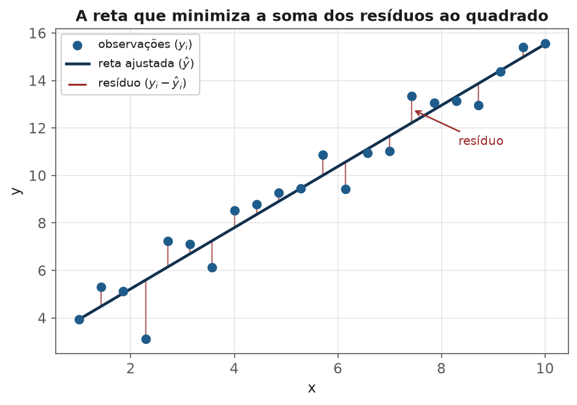
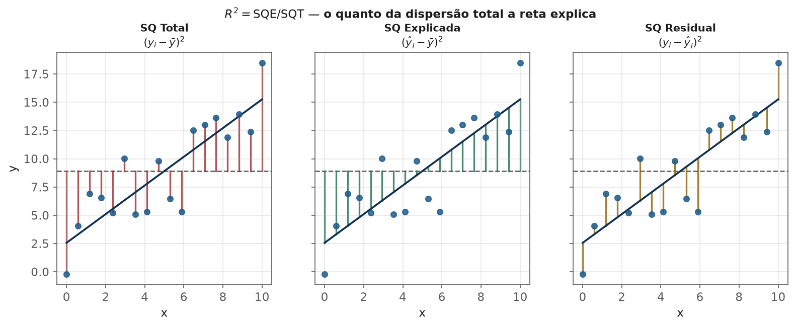
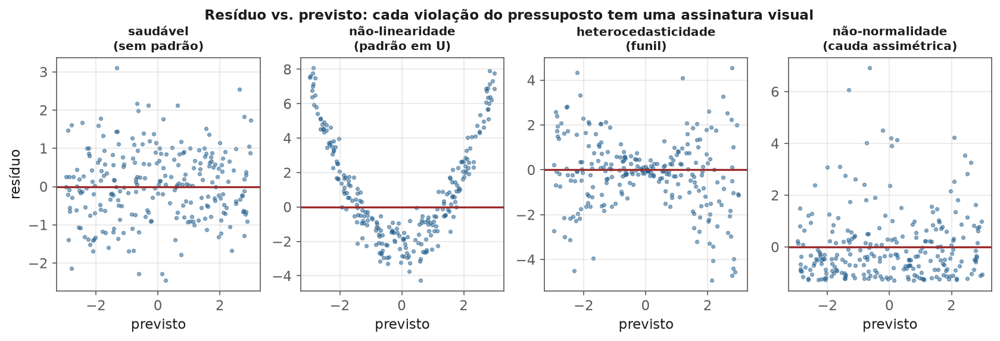

<!-- tema: Aprendizado Supervisionado > Regressão Linear -->
<!-- subtitulo: O modelo mais simples que ainda é o baseline mais honesto do mercado -->
<!-- resumo: Regressão linear não é "o modelo básico que se aprende antes dos de verdade" — é o modelo cuja matemática já foi construída nos temas 2 e 3 (projeção ortogonal, gradiente descendente) e cuja interpretabilidade nenhum modelo mais complexo supera. Este material formaliza o modelo, deriva o diagnóstico de resíduos que decide se ele é adequado, e aplica tudo a um caso real de precificação. -->
<!-- nivel: Intermediário — requer Álgebra Linear e Otimização (tema 2) e Preparação de Dados (tema 3) -->
<!-- prerequisitos: Vetores, Matrizes e Projeções; Cálculo e Gradiente Descendente; todos os módulos do tema 3 -->
<!-- duracao: 8 a 10 horas (leitura + 3 notebooks) -->
<!-- notebooks: 01-regressao-do-zero · 02-pressupostos-e-diagnostico · 03-caso-real-precificacao · 99-exercicios -->
<!-- autor: Material do curso de ML & DL -->
<!-- versao: 1.1 -->

# Regressão Linear

## Por que este módulo existe

Regressão linear é o único modelo deste tema cuja matemática você já construiu
inteira, em dois temas anteriores: o tema 2 mostrou que ajustar uma reta é uma
projeção ortogonal, e que $\hat\beta = (X^\top X)^{-1}X^\top y$ nasce da
exigência de que o resíduo seja perpendicular às features. O tema 3 encheu essa
formulação de cuidados práticos — sem eles, o "modelo mais simples" produz os
erros mais silenciosos. Este módulo não repete a derivação geométrica — ele
formaliza o modelo estatístico por trás dela, o diagnóstico que diz se ele é
adequado, e o caso de uso mais comum em produção: precificação.

> [!ANALOGIA] Se os modelos deste tema fossem ferramentas de uma oficina, a
> regressão linear seria a chave de fenda: simples, previsível, e a primeira
> coisa que um profissional experiente tenta antes de pegar a furadeira
> elétrica. Não porque seja fraca — porque, quando o parafuso é o problema
> certo, nada é mais rápido de usar nem mais fácil de explicar por que
> funcionou.

Vale começar pela imagem que resume o módulo inteiro: uma reta ajustada não é
"a melhor reta que alguém desenhou à mão" — é a reta que minimiza, de forma
matematicamente exata, a soma dos quadrados das distâncias verticais até cada
ponto observado. Essas distâncias são os **resíduos**, e são eles — não a
reta em si — o objeto central de todo o módulo.

### O que você vai conseguir fazer ao final

- Escrever o modelo de regressão linear com os pressupostos estatísticos
  explícitos, não só a fórmula do ajuste.
- Diagnosticar, com gráficos e testes, quando os pressupostos são violados e o
  que fazer a respeito.
- Interpretar coeficientes, intervalos de confiança e $R^2$ com o rigor que o
  tema 1 e o tema 2 já construíram.
- Aplicar regressão linear a um problema real de precificação, incluindo a
  preparação de dados que o tema 3 ensinou.

---

## O modelo estatístico

$$y_i = \beta_0 + \beta_1 x_{i1} + \dots + \beta_p x_{ip} + \varepsilon_i$$

O tema 2 já mostrou **como** encontrar $\hat\beta$ (projeção ortogonal). O que
falta é a parte estatística: $\varepsilon_i$ é modelado como uma variável
aleatória, e é sobre ela que recaem os pressupostos que tornam válidas as
inferências (intervalos de confiança, testes de hipótese sobre coeficientes).

> [!DEFINICAO] Os quatro pressupostos clássicos (memorizáveis pelo acrônimo
> **LINE**): **L**inearidade (a relação entre $X$ e $E[y]$ é de fato linear
> nos parâmetros), **I**ndependência dos erros, **N**ormalidade dos erros, e
> **E**quivariância — variância constante dos erros (homocedasticidade).
> Nenhum desses pressupostos é necessário para *calcular* $\hat\beta$ — o
> tema 2 fez isso com álgebra pura. Eles são necessários para que
> erros-padrão, intervalos de confiança e p-valores dos coeficientes
> **signifiquem o que dizem significar**.

> [!ARMADILHA] Um erro comum: achar que "linear" significa "só retas". A
> regressão é linear **nos parâmetros** — $y = \beta_0 + \beta_1 x + \beta_2
> x^2$ é uma regressão linear (é linear em $\beta_0, \beta_1, \beta_2$), ainda
> que a curva ajustada seja uma parábola. É por isso que polinômios, splines e
> até certas interações cabem no mesmo arcabouço matemático do tema 2 — só
> muda a matriz $X$ que se constrói antes de projetar.

### Um exemplo numérico completo, do início ao fim

Para tornar tudo concreto antes de generalizar, considere uma imobiliária
que registrou o preço de 5 apartamentos (em R$ mil) contra a área (em m²):

| Área (m²) | Preço (R$ mil) |
|---|---|
| 40 | 220 |
| 55 | 290 |
| 70 | 355 |
| 85 | 410 |
| 100 | 495 |

Ajustando $\text{preço} = \beta_0 + \beta_1 \cdot \text{área}$ por mínimos
quadrados (o `sklearn` faz isso numa linha, mas vale ver a conta uma vez):
$\bar x = 70$, $\bar y = 354$, e

$$\beta_1 = \frac{\sum_i (x_i-\bar x)(y_i - \bar y)}{\sum_i (x_i - \bar x)^2}
= \frac{16\,350}{3\,150} \approx 5{,}19, \qquad \beta_0 = \bar y - \beta_1 \bar x \approx -9{,}3$$

O modelo final é $\text{preço} \approx -9{,}3 + 5{,}19 \cdot \text{área}$: cada
metro quadrado adicional soma, em média, **R\$ 5.190** ao preço previsto. Para
um apartamento de 60 m², a previsão é $-9{,}3 + 5{,}19 \times 60 \approx
301{,}9$ mil reais. O intercepto negativo não tem leitura de negócio direta
aqui — nenhum apartamento tem 0 m², e extrapolar a reta para fora da faixa de
dados observada (40 a 100 m²) é sempre arriscado, o assunto da próxima seção.

> [!ARMADILHA] Extrapolação é o erro mais barato de cometer e mais caro de
> pagar. O modelo acima nunca viu um apartamento de 300 m² — usar a mesma
> reta para prever o preço de uma cobertura de 300 m² ($\approx$ R\$ 1,55
> milhão) assume que a relação linear continua válida bem além de onde foi
> observada. Relações lineares em pequenos intervalos frequentemente
> **saturam** ou **aceleram** fora deles — imóveis de luxo têm dinâmica de
> preço diferente de apartamentos padrão.

## Interpretação de coeficientes

Em $y = \beta_0 + \beta_1 x_1 + \beta_2 x_2 + \varepsilon$, o coeficiente
$\beta_1$ é: **o quanto $y$ muda, em média, para um aumento de uma unidade em
$x_1$, mantendo $x_2$ constante.**

> [!NOTA] "Mantendo $x_2$ constante" não é retórica — é o teorema de
> Frisch-Waugh-Lovell do tema 2: $\beta_1$ é literalmente o coeficiente da
> parte de $x_1$ que é **ortogonal** a $x_2$. Quando $x_1$ e $x_2$ são
> correlacionadas, o "efeito isolado" de $x_1$ só existe depois de remover
> dela o que $x_2$ já explica.

> [!ARMADILHA] Coeficientes de features em escalas muito diferentes não são
> diretamente comparáveis em magnitude — um coeficiente de 50.000 numa
> feature em milhões e um coeficiente de 0,003 numa proporção podem
> representar efeitos de importância parecida. Para comparar magnitude de
> efeito entre features, padronize-as antes (tema 3) e compare os
> coeficientes padronizados.

> [!MERCADO] Um caso real de leitura de coeficientes: uma fintech de crédito
> ajusta `limite_aprovado = f(renda, tempo_de_conta, score_bureau, ...)` e
> reporta ao time de risco "cada ano adicional de tempo de conta aumenta o
> limite aprovado em R\$ 340, controlando por renda e score". Essa frase só
> faz sentido porque o coeficiente de `tempo_de_conta` já é, por construção,
> **líquido** do efeito de renda e score — é exatamente essa propriedade que
> torna regressão linear a ferramenta preferida quando o objetivo não é só
> prever, mas **explicar e justificar** uma decisão de crédito para um
> órgão regulador ou para o próprio cliente.

### Erro-padrão, intervalo de confiança e p-valor de um coeficiente

Sob os pressupostos LINE, $\hat\beta_j$ tem uma distribuição amostral com
erro-padrão calculável a partir de $\hat\sigma^2 (X^\top X)^{-1}$ (a diagonal
dessa matriz, mais precisamente). Isso permite testar $H_0: \beta_j = 0$ (tema
1) e construir intervalos de confiança — a mesma lógica de inferência
construída para médias, agora aplicada a coeficientes de regressão.

No exemplo do apartamento, se o erro-padrão de $\hat\beta_1$ fosse
$0{,}62$ (com $n-2=3$ graus de liberdade), o intervalo de confiança de 95%
seria aproximadamente $5{,}19 \pm 3{,}18 \times 0{,}62 \approx [3{,}22,
7{,}16]$ — ou seja, com apenas 5 observações, sabemos que cada metro quadrado
vale **entre R\$ 3.220 e R\$ 7.160**, um intervalo largo que reflete
honestamente quão pouco dado sustenta essa estimativa. É essa largura,
raramente calculada por analistas apressados, que separa "o coeficiente deu
5,19" de "o coeficiente é 5,19 com razoável confiança".

> [!MERCADO] Um coeficiente estatisticamente significativo ($p < 0{,}05$) não
> é automaticamente um coeficiente **relevante** para o negócio — com $n$
> grande, até efeitos minúsculos ficam significativos. E um coeficiente não
> significativo não prova ausência de efeito — pode ser apenas falta de
> poder estatístico (tema 1, módulo 4). Sempre reporte a magnitude do
> coeficiente (e seu intervalo de confiança) junto do p-valor.

## $R^2$: quanto da variância o modelo explica

$$R^2 = \frac{\text{SQ explicada}}{\text{SQ total}} = 1 - \frac{\text{SQ residual}}{\text{SQ total}}$$

Já visto no tema 2 como $\cos^2$ do ângulo entre $y$ e $\hat y$ centrados. A
figura abaixo mostra a mesma ideia de forma mais concreta: a soma de
quadrados **total** (o quanto os dados variam em torno da própria média,
ignorando qualquer modelo), a soma de quadrados **explicada** (o quanto a
reta se afasta da média — a parte que o modelo "capturou") e a soma de
quadrados **residual** (o que sobra, sem explicação). $R^2$ é exatamente a
fração do primeiro painel que o segundo painel recupera.

No exemplo do apartamento, ajustando a reta aos 5 pontos obtemos $R^2
\approx 0{,}996$ — a área explica quase toda a variação de preço nessa
amostra pequena e bem comportada. Em dados reais de mercado imobiliário, com
milhares de imóveis e dezenas de variáveis de confusão (localização, padrão
de acabamento, idade do imóvel), é comum $R^2$ ficar entre $0{,}5$ e $0{,}7$
— e isso **não** é um modelo ruim; é o reflexo de que preço de imóvel
depende de fatores que a área sozinha não captura.

> [!ARMADILHA] $R^2$ **nunca diminui** quando se adiciona uma nova feature ao
> modelo — mesmo uma feature de ruído puro. Isso torna $R^2$ enganoso para
> comparar modelos com números diferentes de features. O **$R^2$ ajustado**
> penaliza pelo número de parâmetros:
>
> $$R^2_{aj} = 1 - (1 - R^2)\frac{n-1}{n-p-1}$$
>
> e só aumenta se a nova feature reduzir o erro mais do que o esperado por
> puro acaso.

## Diagnóstico de resíduos: como saber se o modelo serve

O diagnóstico é a parte prática que decide se os pressupostos LINE são
razoáveis para os dados em mãos — e é também a parte que a maioria dos
cursos introdutórios pula, produzindo profissionais que sabem rodar
`.fit()` mas não sabem dizer se deveriam confiar no resultado.

| Gráfico | O que revela |
|---|---|
| Resíduo vs. valor previsto | Padrão curvo = não-linearidade; funil = heterocedasticidade |
| Q-Q plot dos resíduos | Desvio da reta = não-normalidade dos erros |
| Resíduo vs. cada feature | Padrão restante = a feature precisa de transformação (ex.: log, polinômio) |
| Alavancagem (leverage) vs. resíduo | Pontos influentes que distorcem o ajuste sozinhos |

A figura a seguir mostra as quatro assinaturas visuais mais comuns lado a
lado — o painel "saudável" (sem nenhum padrão discernível) serve de
referência mental para comparar qualquer diagnóstico que você fizer daqui
para frente.

> [!FORMULA] A **distância de Cook** combina alavancagem e magnitude do
> resíduo num único número por observação, medindo o quanto os coeficientes
> mudariam se aquele ponto fosse removido:
>
> $$D_i = \frac{e_i^2}{p \, \hat\sigma^2} \cdot \frac{h_{ii}}{(1-h_{ii})^2}$$
>
> onde $h_{ii}$ é a alavancagem (diagonal da matriz chapéu $H$, tema 2) do
> ponto $i$. Um limiar de referência comum é $D_i > 4/n$. Pontos com
> distância de Cook alta merecem investigação — não remoção automática
> (tema 3, módulo 2: outlier não é sinônimo de erro).

> [!ARMADILHA] Um padrão em forma de funil no gráfico resíduo-vs-previsto
> (heterocedasticidade — variância do erro cresce com o valor previsto) não
> invalida os coeficientes estimados (eles continuam não-viesados), mas
> invalida os erros-padrão calculados da forma clássica — os intervalos de
> confiança ficam errados. A correção mais simples costuma ser transformar o
> alvo (log, se ele for positivo e a variância crescer com a média — o mesmo
> padrão de dados assimétricos do tema 1).

> [!MERCADO] Heterocedasticidade é a regra, não a exceção, em dados
> financeiros: o erro absoluto de previsão de faturamento de uma empresa
> gigante costuma ser maior, em reais, que o erro de uma empresa pequena —
> mas proporcionalmente parecido. É exatamente esse padrão (variância
> proporcional ao nível) que motiva modelar `log(faturamento)` em vez de
> `faturamento` em praticamente toda aplicação de finanças corporativas e
> precificação de seguros.

## Multicolinearidade, de novo

O tema 2 já mostrou que colinearidade **infla variância, não enviesa**
coeficientes. Aqui, a consequência prática: coeficientes instáveis (mudam
muito com pequenas mudanças nos dados), sinais que trocam de forma
contraintuitiva, e intervalos de confiança largos demais para serem úteis.

Um exemplo de mercado real: um modelo de precificação de imóveis com
`area_construida_m2` e `numero_comodos` como features simultâneas costuma
sofrer disso — as duas crescem juntas quase sempre (mais cômodos, mais
área), e o modelo não tem como distinguir de forma confiável qual das duas
realmente move o preço. O sintoma clássico: o coeficiente de
`numero_comodos` aparece **negativo** em algumas execuções, o que não faz
sentido de negócio nenhum — é ruído amostral herdado da colinearidade, não
um efeito real.

> [!MERCADO] VIF acima de 5-10 (tema 2) é o sinal de alerta. As saídas
> práticas: remover uma das features colineares, combiná-las, ou usar
> regularização (Ridge, próximo módulo) — que foi desenhada precisamente para
> estabilizar $X^\top X$ mal condicionada.

## Regressão linear como baseline

> [!MERCADO] Antes de qualquer modelo mais sofisticado, treinar uma regressão
> linear (ou logística, para classificação) é o primeiro passo profissional
> em qualquer projeto novo — não por ingenuidade, mas porque ela estabelece um
> **piso de comparação interpretável**. Se um Random Forest bate a regressão
> linear por uma margem pequena, isso é informação: talvez o problema seja
> majoritariamente linear, e a complexidade extra não compense o custo de
> interpretabilidade perdido. Times de dados sênior costumam exigir esse
> baseline documentado antes de aprovar qualquer modelo de "caixa-preta" em
> produção — é o número contra o qual todo ganho futuro será justificado.

## Erros que custam caro — checklist

- Reportar coeficientes sem checar resíduos — um modelo com pressupostos
  violados pode ter coeficientes tecnicamente calculados e estatisticamente
  sem sentido.
- Comparar magnitude de coeficientes de features em escalas diferentes sem
  padronizar.
- Usar $R^2$ para decidir se vale a pena adicionar uma feature — use $R^2$
  ajustado ou validação cruzada (tema 6).
- Ignorar heterocedasticidade e reportar intervalos de confiança calculados
  da forma clássica mesmo assim.
- Tratar colinearidade removendo features às cegas, sem entender por que
  estão correlacionadas.
- Extrapolar a reta para uma faixa de valores de $x$ nunca observada no
  treino.
- Pular direto para um modelo complexo sem primeiro estabelecer o baseline
  linear.

## Para ir além

- Kutner et al., *Applied Linear Statistical Models* — o tratado de
  referência sobre diagnóstico de regressão.
- Gelman & Hill, *Data Analysis Using Regression and Multilevel Models* — a
  ponte entre a teoria clássica e a prática aplicada moderna.
- Cook & Weisberg, *Residuals and Influence in Regression* — o texto que
  formaliza a distância de Cook e outras medidas de influência.
