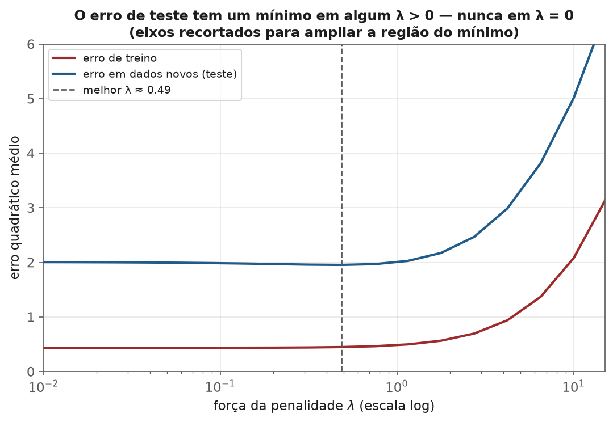
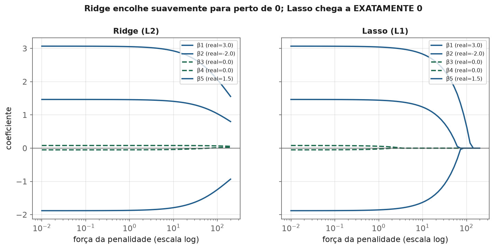
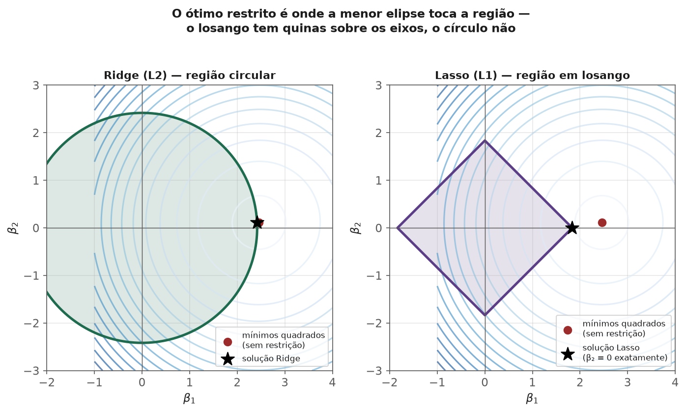

<!-- tema: Aprendizado Supervisionado > Regularização: Ridge, Lasso e Elastic Net -->
<!-- subtitulo: Aceitar um pouco de viés para comprar muito menos variância -->
<!-- resumo: Regressão linear sem regularização confia cegamente nos dados de treino — com features colineares ou em número grande demais, essa confiança produz coeficientes instáveis e overfitting. Ridge, Lasso e Elastic Net penalizam coeficientes grandes, trocando um pouco de viés por uma redução grande de variância. Este material constrói a geometria de cada penalidade, mostra por que Lasso zera coeficientes e Ridge não, e cobre a validação cruzada que escolhe a força da penalidade. -->
<!-- nivel: Intermediário — requer Regressão Linear (módulo anterior) e Cálculo e Gradiente Descendente (tema 2) -->
<!-- prerequisitos: Regressão Linear; Vetores, Matrizes e Projeções -->
<!-- duracao: 8 a 10 horas (leitura + 3 notebooks) -->
<!-- notebooks: 01-ridge-e-lasso · 02-geometria-da-regularizacao · 03-elasticnet-e-tuning · 99-exercicios -->
<!-- autor: Material do curso de ML & DL -->
<!-- versao: 1.1 -->

# Regularização: Ridge, Lasso e Elastic Net

## Por que este módulo existe

O módulo anterior mostrou dois problemas que regressão linear comum não
resolve sozinha: colinearidade infla a variância dos coeficientes, e $R^2$
sempre sobe ao adicionar features — mesmo ruído puro. Regularização ataca os
dois problemas com a mesma ideia: **penalizar coeficientes grandes**,
tornando o modelo mais cético em relação a padrões que poderiam ser ruído
amostral.

> [!ANALOGIA] Regressão linear comum é como um estagiário que aceita
> qualquer padrão que vê nos dados de treino, sem questionar. Regularização é
> um supervisor experiente sussurrando "tem certeza? isso pode ser
> coincidência" toda vez que um coeficiente fica grande demais — o modelo só
> mantém um coeficiente alto se a evidência nos dados for forte o bastante
> para justificar a "objeção".

### O que você vai conseguir fazer ao final

- Explicar a diferença matemática entre a penalidade L2 (Ridge) e L1 (Lasso),
  e por que só uma delas zera coeficientes.
- Visualizar geometricamente por que Lasso produz soluções esparsas.
- Escolher entre Ridge, Lasso e Elastic Net com um argumento técnico.
- Ajustar a força da regularização por validação cruzada, sem vazar o teste
  nesse processo.

---

## O trade-off viés-variância, formalizado

Adicionar uma penalidade ao problema de mínimos quadrados introduz viés
(o modelo já não encontra o mínimo *irrestrito* de erro no treino) em troca de
menos variância (o modelo muda menos entre amostras de treino diferentes).

$$\text{Erro esperado} = \text{Viés}^2 + \text{Variância} + \text{Erro irredutível}$$

> [!FORMULA] Essa decomposição — construída em detalhe no tema 6 — é a
> justificativa formal de toda regularização: um pouco de viés, bem
> escolhido, pode reduzir a variância o suficiente para diminuir o erro total
> esperado em dados novos, mesmo que o erro no treino suba.

A figura a seguir mostra essa troca de forma empírica: um modelo com poucas
observações e muitas features (o cenário onde overfitting é mais severo).
Repare que o erro de **treino** só cresce conforme a penalidade aumenta — mas
o erro em **dados novos** primeiro cai (a regularização está corrigindo
overfitting real) antes de subir de novo (a penalidade ficou forte demais e
começou a introduzir viés que já não compensa).

> [!MERCADO] Esse gráfico é, na prática, o que uma célula de `GridSearchCV`
> produz internamente antes de escolher o melhor hiperparâmetro — e é a
> curva que qualquer cientista de dados deveria olhar pelo menos uma vez por
> projeto, em vez de confiar cegamente no valor de $\lambda$ que o
> `RidgeCV` devolve. Ver a curva inteira revela se o mínimo é bem definido
> (um vale nítido) ou quase plano (qualquer $\lambda$ numa faixa larga serve
> igualmente bem) — informação que só o número final não entrega.

## Ridge: penalidade L2

$$\hat\beta_{Ridge} = \arg\min_\beta \left\{ \|y - X\beta\|^2 + \lambda \|\beta\|_2^2 \right\}$$

A solução tem forma fechada:

$$\hat\beta_{Ridge} = (X^\top X + \lambda I)^{-1} X^\top y$$

> [!FORMULA] Compare com a fórmula de mínimos quadrados do tema 2:
> $(X^\top X)^{-1}X^\top y$. Ridge soma $\lambda I$ à diagonal antes de
> inverter — e essa é a razão pela qual Ridge **sempre** tem solução, mesmo
> quando $X^\top X$ é singular (posto deficiente, colinearidade perfeita). O
> nome técnico dessa soma na diagonal é exatamente o que resolve o problema
> de condicionamento do tema 2: $\lambda I$ eleva todos os autovalores de
> $X^\top X$ em $\lambda$, o que **reduz diretamente o número de condição**
> quando os menores autovalores são o problema.

> [!NOTA] Como $\lambda \to 0$, Ridge tende à solução de mínimos quadrados
> comum. Como $\lambda \to \infty$, todos os coeficientes tendem a zero (mas
> nenhum chega a ser **exatamente** zero, exceto no limite).

### Um exemplo numérico: o efeito na prática

Considere um modelo de precificação de seguro com duas features fortemente
correlacionadas — `idade_do_segurado` e `anos_de_habilitacao` (quem é mais
velho, quase sempre tem CNH há mais tempo). Sem regularização, um ajuste
pode devolver $\hat\beta_{idade} = 340$ e $\hat\beta_{habilitacao} = -180$ —
sinais opostos, sem sentido de negócio (mais idade **e** mais experiência
deveriam reduzir o risco, não um cancelar o outro). Com Ridge ($\lambda=5$,
por exemplo), a mesma base pode produzir $\hat\beta_{idade} = 95$ e
$\hat\beta_{habilitacao} = 60$ — os dois positivos, os dois modestos, e a
soma dos dois efeitos continua explicando o prêmio tão bem quanto antes. A
previsão final mal muda; a **interpretação** fica utilizável.

## Lasso: penalidade L1

$$\hat\beta_{Lasso} = \arg\min_\beta \left\{ \|y - X\beta\|^2 + \lambda \|\beta\|_1 \right\}$$

Sem fórmula fechada — precisa de otimização numérica (coordinate descent é o
algoritmo padrão). A diferença mais importante em relação a Ridge: **Lasso
zera coeficientes exatamente**, produzindo soluções esparsas — uma forma
embutida de seleção de features (tema 3, módulo 3).

A figura abaixo mostra os dois caminhos de coeficiente lado a lado, para o
mesmo conjunto de dados: cinco features, das quais três têm efeito real
(coeficientes $3{,}0$, $-2{,}0$ e $1{,}5$) e duas são puro ruído (coeficiente
real $0$). Acompanhe as curvas conforme a penalidade cresce da esquerda para
a direita.

> [!NOTA] Repare que, no painel do Lasso, as duas curvas tracejadas (as
> features de ruído, com efeito real igual a zero) são as **primeiras** a
> encostar no eixo horizontal — exatamente o comportamento que se espera de
> um bom método de seleção de features: descartar primeiro o que não
> carrega sinal.

### Por que L1 zera e L2 não: a geometria

> [!ANALOGIA] Minimizar erro sujeito a uma penalidade é equivalente a
> minimizar o erro dentro de uma **região restrita** ao redor da origem — uma
> bola para L2 (círculo em 2D), um losango para L1 (quadrado girado 45° em
> 2D). As curvas de nível do erro (elipses) crescem a partir da solução sem
> restrição e "colidem" com a fronteira da região restrita no ponto ótimo.
> Um losango tem **quinas exatamente sobre os eixos** — é muito mais provável
> que a elipse toque a região ali (onde um coeficiente é zero) do que num
> círculo, que não tem quinas em lugar nenhum. Essa diferença geométrica pura
> — quinas vs. superfície lisa — é a razão inteira pela qual L1 produz zeros
> exatos e L2 não.

A figura a seguir desenha essa ideia literalmente, com a solução regularizada
de verdade marcada como uma estrela — repare que ela cai **exatamente** sobre
a fronteira da região em ambos os casos, e que no caso do Lasso ela cai
precisamente sobre uma **quina** do losango, onde $\beta_2 = 0$.

> [!MERCADO] Lasso é a ferramenta certa quando você acredita que **poucas**
> features entre muitas são realmente relevantes (esparsidade real) e quer um
> modelo mais simples de explicar. Ridge é a escolha certa quando muitas
> features têm efeitos pequenos e reais — zerar qualquer uma delas jogaria
> fora sinal genuíno, ainda que fraco.

> [!ARMADILHA] Com features fortemente correlacionadas entre si, Lasso tende
> a escolher **uma** arbitrariamente e zerar as outras — mesmo que todas
> carreguem sinal parecido. Isso torna a escolha específica de qual
> sobrevive instável entre execuções com dados ligeiramente diferentes. Ridge,
> nesse cenário, tende a **dividir** o peso entre as features correlacionadas
> de forma mais estável.

> [!MERCADO] Um caso de mercado clássico: um banco constrói um modelo de
> score de crédito com 40 variáveis cadastrais, muitas delas redundantes
> (renda declarada, renda estimada por bureau, renda média do CEP...).
> Lasso, aplicado a esse cenário, tipicamente reduz o modelo para 10-15
> variáveis não-zero — um modelo que o time de compliance consegue auditar
> variável por variável, em vez de justificar 40 coeficientes simultâneos
> para um órgão regulador.

## Elastic Net: o meio-termo

$$\hat\beta_{EN} = \arg\min_\beta \left\{ \|y - X\beta\|^2 + \lambda_1 \|\beta\|_1 + \lambda_2 \|\beta\|_2^2 \right\}$$

Combina as duas penalidades, com um parâmetro adicional (`l1_ratio` no
`sklearn`) controlando a proporção entre elas. Herda a esparsidade do Lasso
e a estabilidade do Ridge sob colinearidade — o preço é mais um
hiperparâmetro para ajustar.

> [!MERCADO] Elastic Net é a escolha padrão de mercado quando há muitas
> features correlacionadas **e** se espera esparsidade real — o cenário mais
> comum em dados genômicos, texto (bag-of-words) e qualquer dataset com $p$
> próximo de ou maior que $n$. Em genômica, por exemplo, é comum ter
> $n \approx 200$ pacientes e $p \approx 20\,000$ genes candidatos — Lasso
> puro, nesse regime, seleciona no máximo $n$ features (uma limitação
> matemática da penalidade L1 quando $p > n$), enquanto Elastic Net não tem
> essa restrição, porque o termo L2 permite que grupos inteiros de genes
> correlacionados entrem no modelo juntos.

## Escolhendo a força da penalidade: validação cruzada

$\lambda$ (ou o inverso, $C$, na convenção de outras bibliotecas) é um
**hiperparâmetro** — não é estimado pelos dados da mesma forma que $\beta$; é
escolhido por validação cruzada, testando uma grade de valores e escolhendo o
que minimiza o erro em dados que o ajuste de $\beta$ não viu.

> [!ARMADILHA] Ajustar $\lambda$ observando o erro no **mesmo** conjunto de
> teste que depois será usado para reportar o desempenho final é uma forma de
> vazamento (tema 3): o teste deixa de ser "dados nunca vistos" porque
> influenciou a escolha do hiperparâmetro. A prática correta usa um terceiro
> conjunto (validação) ou validação cruzada aninhada — o tema 6 formaliza
> esse esquema em detalhe.

> [!FORMULA] Antes de aplicar qualquer regularização, **padronize as
> features** (tema 3). A penalidade soma os coeficientes ao quadrado (ou em
> valor absoluto) — se as features estão em escalas diferentes, a penalidade
> afeta cada uma de forma desproporcional à sua escala, não à sua real
> importância. Sem padronizar, regularização pune arbitrariamente a feature
> medida em unidades menores. Por exemplo: uma feature `renda_anual` (na
> casa das dezenas de milhares) e uma feature `proporcao_gasto` (entre 0 e
> 1) recebem, sem padronização, penalidades em escalas completamente
> diferentes — o coeficiente de `renda_anual` já começa "pequeno" só por
> causa da unidade, e a penalidade mal o afeta, enquanto o de
> `proporcao_gasto` é esmagado.

## Erros que custam caro — checklist

- Aplicar Ridge/Lasso/Elastic Net sem padronizar as features primeiro.
- Escolher $\lambda$ olhando o desempenho no conjunto de teste final, em vez
  de usar validação cruzada isolada.
- Usar Lasso esperando que ele sempre escolha "as features certas" entre um
  grupo de correlacionadas — a escolha pode ser arbitrária e instável.
- Interpretar um coeficiente zerado pelo Lasso como prova de que a feature
  não tem relação real com o alvo — pode só significar que uma feature
  correlacionada "venceu" a disputa.
- Usar Lasso puro (não Elastic Net) em problemas com $p > n$ esperando
  selecionar mais de $n$ features — a penalidade L1 tem esse limite
  estrutural.
- Regularizar o intercepto junto com os demais coeficientes (a maioria das
  implementações, incluindo `sklearn`, já exclui o intercepto da penalidade
  corretamente por padrão — mas vale confirmar ao implementar do zero).

## Para ir além

- Hastie, Tibshirani & Friedman, *The Elements of Statistical Learning*,
  capítulo 3 — o tratamento matemático de referência sobre regularização.
- Tibshirani (1996), o artigo original do Lasso.
- Zou & Hastie (2005), o artigo original do Elastic Net.
- Documentação do `sklearn.linear_model` (Ridge, Lasso, ElasticNet,
  RidgeCV, LassoCV) — as implementações usadas neste módulo.
