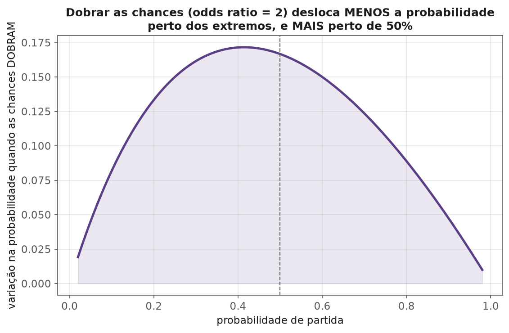
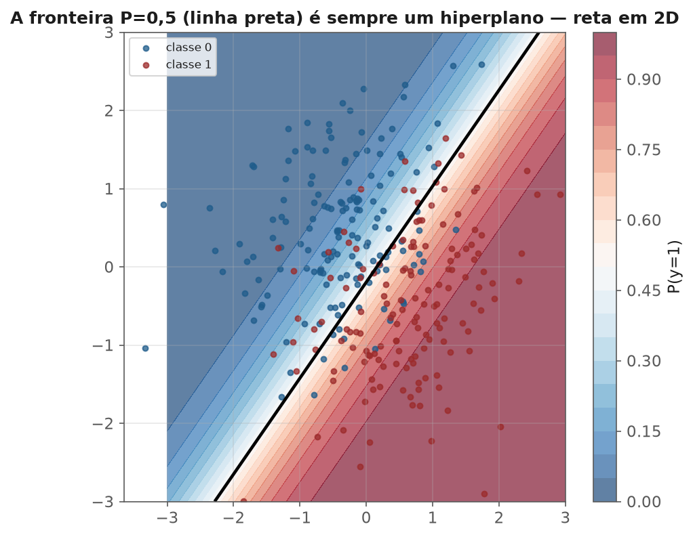

<!-- tema: Aprendizado Supervisionado > Regressão Logística -->
<!-- subtitulo: Por que uma reta não serve para prever probabilidade, e o que a substitui -->
<!-- resumo: Prever uma probabilidade com uma reta produz valores acima de 1 e abaixo de 0 — um problema estrutural, não um detalhe técnico. Regressão logística resolve isso trocando o alvo por uma transformação (o logit) que mapeia probabilidades para toda a reta real, e troca mínimos quadrados por máxima verossimilhança. Este material constrói o modelo do zero, interpreta coeficientes como odds ratio, e aplica tudo a um caso real de crédito. -->
<!-- nivel: Intermediário — requer Regressão Linear e Regularização (módulos deste tema) -->
<!-- prerequisitos: Regressão Linear; Máxima Verossimilhança (tema 1); Cálculo e Gradiente Descendente (tema 2) -->
<!-- duracao: 8 a 10 horas (leitura + 3 notebooks) -->
<!-- notebooks: 01-logistica-do-zero · 02-interpretacao-odds-ratio · 03-caso-real-credito · 99-exercicios -->
<!-- autor: Material do curso de ML & DL -->
<!-- versao: 1.1 -->

# Regressão Logística

## Por que este módulo existe

Prever "vai cancelar ou não" com uma regressão linear comum produz previsões
como $-0{,}3$ ou $1{,}4$ — números que não são probabilidades, porque
probabilidade vive em $[0,1]$ e uma reta não tem limites. Esse não é um
detalhe estético: é a razão estrutural pela qual todo o arcabouço de
inferência do módulo 1 (erros-padrão, testes de hipótese) deixa de valer
quando o alvo é binário. Regressão logística resolve o problema transformando
o alvo, não o modelo — e o resultado é o classificador mais usado, mais
interpretável e mais citado como baseline em toda a indústria.

> [!ANALOGIA] Tentar prever probabilidade com uma reta é como tentar desenhar
> um mapa do mundo inteiro numa folha de papel plana sem nenhuma projeção — em
> algum lugar as distâncias e proporções vão quebrar, porque a Terra é curva e
> o papel é plano. A função logit é a "projeção cartográfica" que faz o mapa
> (a reta) caber no globo (o intervalo $[0,1]$) sem incoerência.

A figura a seguir mostra o problema e a solução lado a lado, no mesmo
dataset: a reta (vermelha) extrapola para fora de $[0,1]$ assim que $x$ se
afasta do centro dos dados — exatamente as regiões sombreadas, onde uma
"probabilidade" de $1{,}3$ ou $-0{,}2$ não significa nada. A sigmoide (azul)
nunca sai desse intervalo, para nenhum valor de $x$.

![Regressão linear extrapola para fora do intervalo [0,1] (áreas sombreadas); a sigmoide da regressão logística nunca sai desse intervalo, para nenhum valor de x.](figuras/reta-vs-sigmoide.png)

### O que você vai conseguir fazer ao final

- Explicar por que regressão linear falha estruturalmente para prever
  probabilidade, e como o logit resolve isso.
- Derivar a função de perda (entropia cruzada) a partir de máxima
  verossimilhança, ligando de volta ao tema 1.
- Interpretar coeficientes como odds ratio, com o cuidado de não confundir
  odds com probabilidade.
- Aplicar regressão logística a um problema real de crédito, incluindo
  regularização (módulo 2) e o cuidado com desbalanceamento (tema 3).

---

## Do linear ao logístico: o problema e a solução

Se $y \in \{0, 1\}$ e modelamos $P(y=1|x) = \beta_0 + \beta_1 x$ diretamente
(regressão linear no rótulo), nada impede a previsão de sair de $[0,1]$. A
solução: modelar uma **transformação** da probabilidade que possa assumir
qualquer valor real.

$$\text{logit}(p) = \ln\left(\frac{p}{1-p}\right) = \beta_0 + \beta_1 x_1 + \dots + \beta_p x_p$$

$p/(1-p)$ é a **razão de chances (odds)** — familiar de apostas ("3 para 1").
$\ln(\text{odds})$ pode ser qualquer número real: odds de 1 (evento tão
provável quanto improvável) dá $\ln(1)=0$; odds acima de 1 dão log positivo;
odds abaixo de 1 dão log negativo, sem limite em nenhuma direção.

Invertendo, chega-se à **função sigmoide**:

$$p = \sigma(z) = \frac{1}{1+e^{-z}}, \qquad z = \beta_0 + \beta_1 x_1 + \dots + \beta_p x_p$$

> [!DEFINICAO] A sigmoide comprime qualquer número real para o intervalo
> $(0,1)$, com formato em S: perto de $z=0$ ela é quase linear; nos extremos,
> achata-se assintoticamente em 0 e 1. É essa forma que garante uma
> probabilidade sempre válida, para qualquer combinação linear das features.

### Um exemplo numérico: calculando a probabilidade na mão

Suponha um modelo de churn com $z = -2{,}1 + 0{,}05 \cdot \text{idade} -
0{,}8 \cdot \text{engajamento\_mensal}$ (engajamento numa escala de 0 a 5).
Para um cliente de 40 anos com engajamento 1:

$$z = -2{,}1 + 0{,}05 \times 40 - 0{,}8 \times 1 = -2{,}1 + 2{,}0 - 0{,}8 = -0{,}9$$

$$p = \sigma(-0{,}9) = \frac{1}{1+e^{0{,}9}} \approx \frac{1}{1+2{,}46} \approx 0{,}289$$

O modelo prevê **28,9% de chance de cancelamento** para esse cliente. Repare
que $z$ negativo já garante $p < 0{,}5$ sem precisar calcular nada além do
sinal — é por isso que a fronteira de decisão de $p=0{,}5$ corresponde
exatamente a $z=0$ (mais adiante, isso vira a definição geométrica de
fronteira de decisão).

## Máxima verossimilhança: de onde vem a função de perda

O tema 1 (módulo 3) construiu máxima verossimilhança como princípio geral de
estimação. Aqui ele decide a função de perda inteira: para dados
$(x_i, y_i)$ com $y_i \in \{0,1\}$ modelados como Bernoulli com parâmetro
$p_i = \sigma(\beta^\top x_i)$, a log-verossimilhança é:

$$\ell(\beta) = \sum_i \left[ y_i \ln p_i + (1-y_i)\ln(1-p_i) \right]$$

> [!FORMULA] Maximizar $\ell(\beta)$ é equivalente a minimizar
> $-\ell(\beta)$ — a **entropia cruzada binária**, a função de perda que
> toda biblioteca usa para treinar regressão logística (e a camada final de
> praticamente toda rede neural de classificação, tema 8). Não é uma escolha
> arbitrária de engenharia: é a consequência direta de assumir que $y$ segue
> uma Bernoulli e usar máxima verossimilhança.

Vale sentir o formato dessa perda com um exemplo: se o modelo prevê
$\hat p = 0{,}9$ para uma observação que de fato é $y=1$, a contribuição à
perda é $-\ln(0{,}9) \approx 0{,}105$ — pequena, o modelo acertou com
confiança. Se o mesmo $\hat p=0{,}9$ for dado para uma observação que na
verdade é $y=0$, a contribuição é $-\ln(1-0{,}9) = -\ln(0{,}1) \approx
2{,}30$ — mais de 20 vezes maior. A entropia cruzada **pune erros confiantes
de forma desproporcional**, o que é exatamente o comportamento desejado: um
modelo que erra "tenho quase certeza que é 1" quando era 0 deveria pagar caro
por isso.

> [!ARMADILHA] Ao contrário da regressão linear, **não existe fórmula fechada**
> para $\hat\beta$ da regressão logística — a equação $\nabla \ell(\beta) = 0$
> não tem solução analítica. O ajuste usa métodos iterativos: gradiente
> descendente (tema 2) ou, mais comumente na prática, variantes de Newton
> (IRLS — *Iteratively Reweighted Least Squares*), que convergem mais rápido
> por usar informação de segunda ordem (a Hessiana, tema 2).

### Separação perfeita: quando o ajuste diverge

> [!ARMADILHA] Se uma única feature (ou combinação delas) separa
> **perfeitamente** as duas classes, a verossimilhança é maximizada quando o
> coeficiente daquela feature tende a **infinito** — o algoritmo de
> otimização diverge ou para num limite arbitrário definido pelo número
> máximo de iterações. Isso costuma acontecer com datasets pequenos ou uma
> feature de vazamento (tema 3) forte demais. O sintoma: coeficientes
> gigantescos e erros-padrão enormes. A correção mais simples é regularização
> (módulo 2) — Ridge/Lasso aplicados à logística sempre têm solução finita.

> [!MERCADO] Um caso real e recorrente: um analista júnior inclui
> `motivo_do_encerramento` como feature num modelo de "vai cancelar?" — mas
> essa coluna só é preenchida **depois** do cancelamento acontecer. O modelo
> "aprende" perfeitamente (separação perfeita, acurácia de treino de 100%) e
> falha completamente em produção, porque a feature nunca vai existir no
> momento real da previsão. É o mesmo vazamento de alvo do tema 3, módulo 4
> — e a separação perfeita durante o treino é, com frequência, o primeiro
> sinal de alarme que expõe o problema.

## Interpretando coeficientes: odds ratio

$$\frac{P(y=1|x_1+1)/P(y=0|x_1+1)}{P(y=1|x_1)/P(y=0|x_1)} = e^{\beta_1}$$

Aumentar $x_1$ em uma unidade multiplica a **razão de chances** por
$e^{\beta_1}$ — não soma um valor fixo à probabilidade, e não multiplica a
probabilidade diretamente.

> [!ARMADILHA] A confusão mais comum do módulo: $e^{\beta_1} = 1{,}5$
> **não** significa "50% mais provável" em termos de probabilidade — significa
> que as **chances** (odds) aumentam 50%. Se a probabilidade de base já é
> alta (perto de 1), esse aumento de odds se traduz em uma mudança pequena na
> probabilidade; se a probabilidade de base é baixa, o mesmo aumento de odds
> pode mudar bastante a probabilidade. A relação entre odds e probabilidade
> não é linear.

A figura abaixo quantifica exatamente essa não-linearidade: para o mesmo
odds ratio de 2 (as chances dobram), o quanto a probabilidade realmente se
move depende de onde ela começa. Perto de 0% ou 100%, quase nada muda; perto
de 50%, a mudança é máxima.

> [!MERCADO] Em modelos de crédito e saúde, reportar odds ratio (não só o
> coeficiente bruto) é prática padrão de mercado — é a forma que analistas de
> negócio e reguladores esperam ver, precisamente porque tem interpretação
> multiplicativa direta ("cada atraso anterior praticamente dobra as chances
> de inadimplência"). Um relatório de crédito típico traz uma tabela como:
> `n_atrasos_12m`: odds ratio 1,85 (IC 95%: [1,62, 2,11]) — lido como "cada
> atraso adicional nos últimos 12 meses multiplica as chances de
> inadimplência por 1,85, mantendo as demais variáveis constantes".

## Fronteira de decisão: um hiperplano, de novo

Classificar como 1 quando $p \geq 0{,}5$ equivale a classificar como 1 quando
$z = \beta^\top x \geq 0$ — a fronteira de decisão é o **hiperplano**
$\beta^\top x = 0$, a mesma estrutura geométrica linear vista em toda
regressão linear (tema 2). Regressão logística é, geometricamente, um
classificador **linear**: ela separa o espaço de features em duas regiões
usando um hiperplano, ainda que a saída seja uma probabilidade suave em vez
de um rótulo duro — visível no gradiente de cores da figura a seguir, que
fica mais intenso conforme se afasta da fronteira em qualquer direção.

> [!NOTA] Essa é a razão pela qual regressão logística falha em problemas
> onde a fronteira real entre classes não é aproximadamente linear (um XOR,
> um círculo dentro de outro) — o mesmo tipo de limitação que motivou o
> módulo de SVM com kernels e, mais adiante, redes neurais com camadas
> ocultas (tema 8).

## Multiclasse: softmax e one-vs-rest

Para $K$ classes, duas estratégias comuns: **one-vs-rest** (treinar $K$
classificadores binários, cada um "esta classe vs. todas as outras") e a
generalização direta via **softmax**:

$$P(y=k|x) = \frac{e^{\beta_k^\top x}}{\sum_{j=1}^K e^{\beta_j^\top x}}$$

que reduz exatamente à sigmoide quando $K=2$.

> [!MERCADO] Um sistema de triagem de tickets de suporte com 5 categorias
> (`financeiro`, `técnico`, `cancelamento`, `elogio`, `outro`) é um caso
> típico de multiclasse via softmax — o modelo devolve uma distribuição de
> probabilidade sobre as 5 categorias, e a categoria de maior probabilidade
> vira o roteamento automático do ticket. É a mesma matemática usada na
> camada final de classificação de praticamente toda rede neural (tema 8).

## Erros que custam caro — checklist

- Interpretar o coeficiente bruto (não exponenciado) como se fosse
  interpretável diretamente em termos de probabilidade.
- Confundir "as chances dobraram" com "a probabilidade dobrou".
- Ignorar sinais de separação perfeita (coeficientes e erros-padrão
  anormalmente grandes) e reportar o modelo como se tivesse convergido bem —
  investigue vazamento antes de comemorar.
- Usar o limiar de 0,5 sem considerar o desbalanceamento de classes ou o
  custo assimétrico de erros (tema 3, módulo 5).
- Esquecer que a fronteira de decisão é linear — aplicar regressão logística
  simples a um problema com fronteira claramente não-linear sem antes tentar
  features de interação ou um modelo não-linear.
- Não regularizar quando há muitas features ou risco de separação perfeita.

## Para ir além

- Hosmer, Lemeshow & Sturdivant, *Applied Logistic Regression* — o texto de
  referência sobre interpretação e diagnóstico.
- Agresti, *Categorical Data Analysis* — o tratamento formal de odds ratio e
  modelos para dados categóricos.
- McCullagh & Nelder, *Generalized Linear Models* — o arcabouço unificado
  (GLM) do qual a regressão logística é um caso particular.
