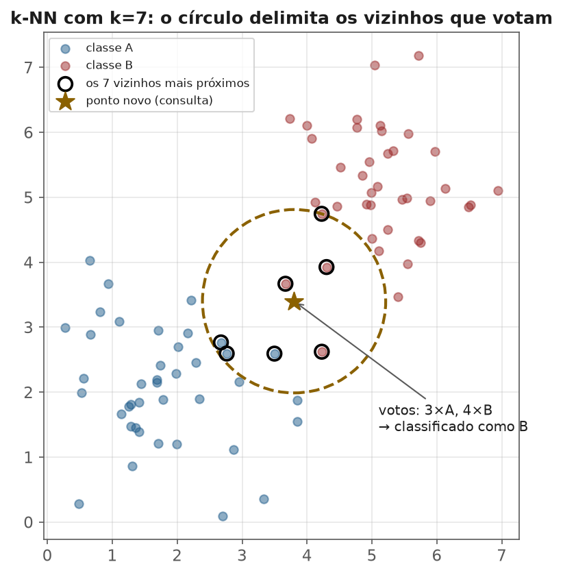
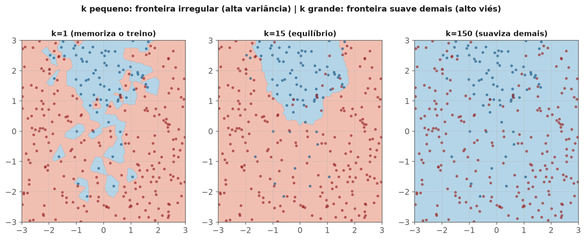
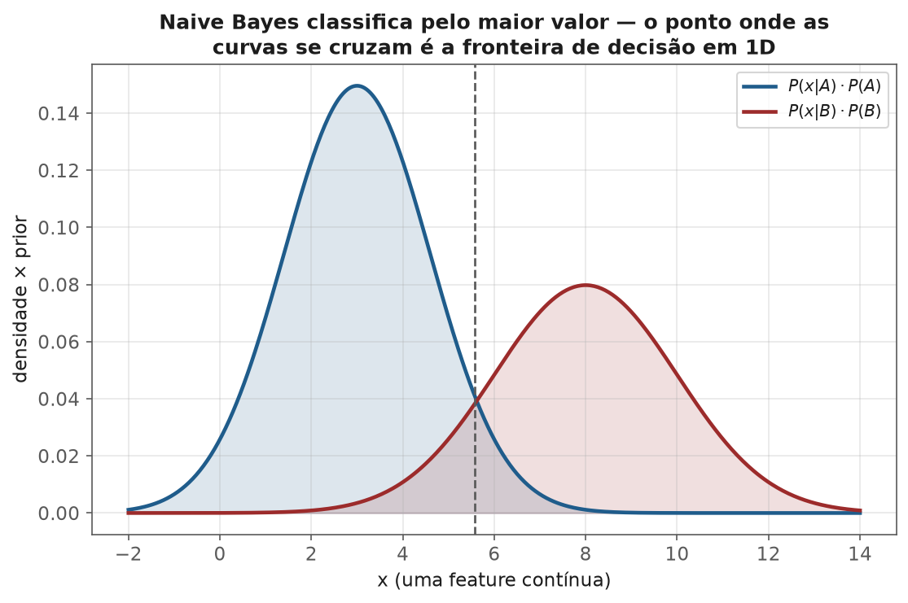

<!-- tema: Aprendizado Supervisionado > k-NN e Naive Bayes -->
<!-- subtitulo: O modelo que não aprende nada e o que assume tudo independente — dois extremos que ainda ganham de modelos sofisticados -->
<!-- resumo: k-NN e Naive Bayes representam as duas filosofias mais opostas de aprendizado supervisionado. k-NN não constrói modelo nenhum — decide olhando os vizinhos mais parecidos no momento da previsão. Naive Bayes assume que todas as features são independentes entre si, uma premissa quase sempre falsa que, mesmo assim, produz um classificador rápido e surpreendentemente competente. Este material constrói os dois do zero e mapeia exatamente onde cada um vence e onde cada um quebra. -->
<!-- nivel: Intermediário — requer Vetores, Matrizes e Projeções (tema 2) e Teorema de Bayes (tema 1) -->
<!-- prerequisitos: Vetores, Matrizes e Projeções; Teorema de Bayes; Preparação de Dados (tema 3) -->
<!-- duracao: 6 a 8 horas (leitura + 2 notebooks) -->
<!-- notebooks: 01-knn · 02-naive-bayes · 99-exercicios -->
<!-- autor: Material do curso de ML & DL -->
<!-- versao: 1.1 -->

# k-NN e Naive Bayes

## Por que este módulo existe

Os módulos anteriores construíram modelos que **aprendem parâmetros**: uma
regressão ajusta $\beta$, minimizando uma perda sobre o dataset inteiro, e
depois descarta os dados de treino — só os coeficientes importam na hora de
prever. Este módulo apresenta dois modelos que quebram essa lógica de formas
opostas. k-NN **não aprende parâmetro nenhum**: ele guarda o dataset de
treino inteiro e decide, a cada nova previsão, olhando para os vizinhos mais
próximos. Naive Bayes aprende parâmetros, mas parte de uma suposição
extrema — que todas as features são **independentes entre si** dado a
classe — quase sempre falsa e, ainda assim, competitiva.

> [!ANALOGIA] k-NN decide como alguém sem experiência prévia decidiria: "os
> cinco casos mais parecidos com este que eu já vi tinham esse resultado,
> então aposto nesse resultado". Naive Bayes decide como um burocrata
> excessivamente simplificador: "vou avaliar cada evidência separadamente e
> multiplicar as probabilidades, mesmo sabendo que elas provavelmente não são
> independentes na vida real" — e, surpreendentemente, ainda assim acerta
> bastante.

### O que você vai conseguir fazer ao final

- Implementar k-NN do zero e explicar por que ele exige padronização e sofre
  com a maldição da dimensionalidade.
- Escolher $k$ por validação cruzada, entendendo o trade-off viés-variância
  que ele controla.
- Implementar Naive Bayes Gaussiano do zero a partir do teorema de Bayes
  (tema 1) e da suposição de independência condicional.
- Explicar por que Naive Bayes funciona bem na prática apesar de sua premissa
  ser quase sempre falsa.

---

## k-NN: aprendizado baseado em instância

**O algoritmo inteiro:** para classificar um ponto novo, encontre os $k$
pontos de treino mais próximos (por alguma métrica de distância, tema 2) e
vote pela classe majoritária entre eles (ou, em regressão, tire a média dos
valores). Não há nada além disso — a figura a seguir mostra o algoritmo
inteiro em uma única imagem: um ponto novo (a estrela), o círculo que
delimita seus $k=7$ vizinhos mais próximos, e a contagem de votos que decide
a classe final.

> [!DEFINICAO] k-NN é chamado de **lazy learner** (aprendiz preguiçoso): não
> existe fase de "treino" que produza um modelo compacto — todo o trabalho
> acontece no momento da previsão (`predict`), quando o algoritmo precisa
> calcular distância até todos (ou muitos) os pontos de treino. Isso é o
> oposto de um modelo como regressão linear, que faz todo o trabalho pesado
> no `fit` e o `predict` é uma simples multiplicação de matrizes.

> [!MERCADO] Essa característica "preguiçosa" tem uma consequência real de
> engenharia: um sistema de recomendação por similaridade (produtos
> parecidos, usuários parecidos) que usa k-NN precisa manter **todo** o
> catálogo em memória (ou numa estrutura de busca como um índice de
> vizinhos aproximados) para responder em tempo real — diferente de um
> modelo paramétrico, que pode ser exportado como um punhado de números e
> rodar num celular sem conexão.

### Por que padronizar é obrigatório (revisão do tema 2 e 3)

k-NN mede distância — e o tema 2 já mostrou que features em escalas
diferentes distorcem qualquer cálculo de distância, deixando a feature de
maior escala numérica dominar sozinha. Sem padronizar, k-NN na prática usa
(quase) só a feature com maior variância numérica.

Um exemplo concreto: comparando dois clientes com `idade` (variando de 20 a
70) e `renda_mensal` (variando de 1.500 a 30.000), a distância euclidiana ao
quadrado entre dois clientes é dominada quase inteiramente pela diferença de
renda — uma diferença de 10 anos de idade (contribuição $10^2=100$) é
irrelevante perto de uma diferença de R\$ 5.000 de renda (contribuição
$5000^2 = 25\,000\,000$). Sem padronizar, o modelo efetivamente ignora
idade por completo, não porque ela seja irrelevante, mas porque a unidade em
que foi medida é "pequena" comparada à da renda.

### A maldição da dimensionalidade

> [!ARMADILHA] Em dimensões altas, um fenômeno contraintuitivo acontece: a
> distância entre o ponto mais próximo e o mais distante de um ponto de
> referência **tende a ficar proporcionalmente pequena** — todos os pontos
> ficam "igualmente distantes". Isso acontece porque o volume do espaço
> cresce exponencialmente com o número de dimensões, e os dados ficam cada
> vez mais esparsos dentro dele. O conceito de "vizinho mais próximo" perde
> força discriminativa exatamente quando mais features são adicionadas sem
> discriminar as informativas das irrelevantes — a razão pela qual seleção de
> features (tema 3) importa ainda mais para k-NN do que para a maioria dos
> modelos.

### Escolhendo k: o trade-off viés-variância, de novo

| $k$ | Comportamento |
|---|---|
| $k=1$ | Segue cada ponto de treino exatamente — variância altíssima, fronteira de decisão irregular, overfitting |
| $k$ grande | Suaviza demais, pode ignorar estrutura local real — mais viés, mais estável |
| $k$ ótimo | Escolhido por validação cruzada (tema 6), minimizando erro em dados não vistos |

> [!FORMULA] $k=1$ classifica cada ponto de treino perfeitamente (o vizinho
> mais próximo de um ponto de treino é ele mesmo) — erro de treino zero, e
> ainda assim pode ter erro de generalização alto. É o exemplo mais direto de
> "erro de treino zero não significa modelo bom" do currículo inteiro.

A figura a seguir mostra o mesmo dataset classificado com três valores de
$k$: a fronteira de $k=1$ tem "ilhas" e reentrâncias que seguem cada ponto
individual (inclusive ruído); a de $k=150$ é uma linha quase reta que ignora
a curvatura real da fronteira; $k=15$ fica no equilíbrio.

### k-NN ponderado e k-NN para regressão

Em vez de um voto igualitário entre os $k$ vizinhos, pondera-se pelo inverso
da distância — vizinhos mais próximos pesam mais. Para regressão,
`KNeighborsRegressor` simplesmente tira a média (ponderada ou não) do valor
dos $k$ vizinhos, em vez de votar por classe.

## Naive Bayes: tudo é independente (mesmo sabendo que não é)

Do teorema de Bayes (tema 1):

$$P(y|x_1,\dots,x_p) = \frac{P(x_1,\dots,x_p|y)\,P(y)}{P(x_1,\dots,x_p)}$$

Estimar $P(x_1,\dots,x_p|y)$ diretamente exigiria dados suficientes para
cobrir toda combinação possível de features — inviável na prática. A
suposição "naive" resolve isso à força:

$$P(x_1,\dots,x_p|y) \approx \prod_{j=1}^p P(x_j|y)$$

— cada feature é condicionalmente independente das outras, dado $y$. Isso
reduz o problema a estimar $p$ distribuições univariadas simples, uma por
feature, em vez de uma distribuição conjunta complexa. Para features
contínuas (Gaussian NB), cada $P(x_j|y)$ é simplesmente uma normal ajustada
com a média e o desvio-padrão daquela feature **dentro** de cada classe — a
figura a seguir mostra exatamente essas duas curvas para uma única feature,
com a fronteira de decisão exatamente onde elas se cruzam.

> [!ARMADILHA] Essa suposição é **quase sempre falsa**: `renda` e
> `tempo_de_emprego`, por exemplo, tipicamente são correlacionadas mesmo
> dentro de uma mesma classe. O nome "naive" existe exatamente por isso.

### Por que funciona mesmo sendo "errado"

> [!NOTA] Classificação só precisa da **ordem relativa** das probabilidades
> posteriores entre as classes, não do valor exato de cada uma. Mesmo que a
> suposição de independência distorça a magnitude das probabilidades
> estimadas (Naive Bayes é notoriamente mal-calibrado — tema 6), a
> distorção frequentemente afeta todas as classes de forma parecida,
> preservando qual classe tem a maior probabilidade estimada — que é tudo que
> a decisão final precisa.

### As três variantes comuns

| Variante | Assume que a distribuição de cada feature (dada a classe) é | Uso típico |
|---|---|---|
| Gaussian NB | Normal, por classe | Features contínuas |
| Multinomial NB | Multinomial (contagens) | Contagens de palavras, bag-of-words (tema 9) |
| Bernoulli NB | Bernoulli (presença/ausência) | Features binárias |

### O problema da frequência zero e a suavização de Laplace

Se uma categoria nunca apareceu com uma classe específica no treino,
$P(x_j|y)=0$ para essa combinação — e como as probabilidades se multiplicam,
**um único zero zera o produto inteiro**, não importa quão forte seja a
evidência das outras features.

> [!FORMULA] **Suavização de Laplace (add-one smoothing):** soma um pseudo-
> contador pequeno a cada contagem antes de estimar a probabilidade:
>
> $$P(x_j=v|y) = \frac{\text{contagem}(x_j=v, y) + \alpha}{\text{contagem}(y) + \alpha \cdot |\text{valores possíveis de } x_j|}$$
>
> com $\alpha=1$ sendo o padrão clássico. Isso garante que nenhuma
> probabilidade estimada seja exatamente zero, mesmo para combinações nunca
> observadas no treino.

Um exemplo concreto: um filtro de spam viu 200 e-mails legítimos no treino,
e nenhum deles continha a palavra "criptomoeda". Sem suavização,
$P(\text{"criptomoeda"}|\text{legítimo}) = 0$ — e qualquer e-mail legítimo
novo que mencione criptomoeda (um funcionário do setor financeiro, por
exemplo) seria classificado como spam com 100% de confiança, não importa o
resto do conteúdo. Com $\alpha=1$ e um vocabulário de 5.000 palavras
possíveis, a probabilidade estimada vira $1/(200+5000) \approx 0{,}0002$ —
pequena, mas não nula, permitindo que outras palavras do e-mail ainda
influenciem a decisão.

> [!MERCADO] Filtros de spam foram, historicamente, a aplicação que tornou
> Naive Bayes famoso fora da academia — rápido o suficiente para classificar
> milhões de e-mails por segundo, com uma taxa de acerto competitiva mesmo
> décadas antes de redes neurais serem práticas em produção. A mesma lógica
> ainda sustenta classificadores de triagem de tickets, categorização de
> produtos em e-commerce e detecção inicial de conteúdo tóxico, sempre como
> baseline rápido antes de um modelo mais caro.

## Comparando os dois: onde cada um vence

> [!MERCADO] k-NN tende a vencer quando a fronteira de decisão real é
> complexa e não-linear, há poucas features (dimensionalidade baixa a
> moderada) e o dataset não é gigante (custo de previsão cresce com $n$).
> Naive Bayes tende a vencer quando há **muitas** features (texto,
> bag-of-words — tema 9), o dataset é grande, velocidade de treino e
> previsão importam, e uma suposição aproximada de independência não destrói
> o sinal principal.

## Erros que custam caro — checklist

- Aplicar k-NN sem padronizar features primeiro.
- Escolher $k=1$ ou um valor arbitrário sem validação cruzada.
- Usar k-NN em datasets de altíssima dimensionalidade sem antes reduzir ou
  selecionar features (tema 3, 5).
- Esquecer a suavização de Laplace e deixar uma única categoria não vista
  zerar toda a previsão do Naive Bayes.
- Interpretar as probabilidades de saída do Naive Bayes como bem calibradas
  sem verificar (tema 6).
- Ignorar o custo computacional de k-NN em produção com datasets grandes —
  cada previsão exige (na implementação ingênua) uma varredura completa do
  treino.

## Para ir além

- Cover & Hart (1967), o artigo original que formaliza k-NN e suas
  garantias assintóticas.
- Domingos & Pazzani (1997), *On the Optimality of the Simple Bayesian
  Classifier under Zero-One Loss* — a explicação formal de por que Naive
  Bayes funciona apesar da suposição errada.
- Bishop, *Pattern Recognition and Machine Learning*, capítulos sobre
  métodos não-paramétricos e classificadores Bayesianos.
