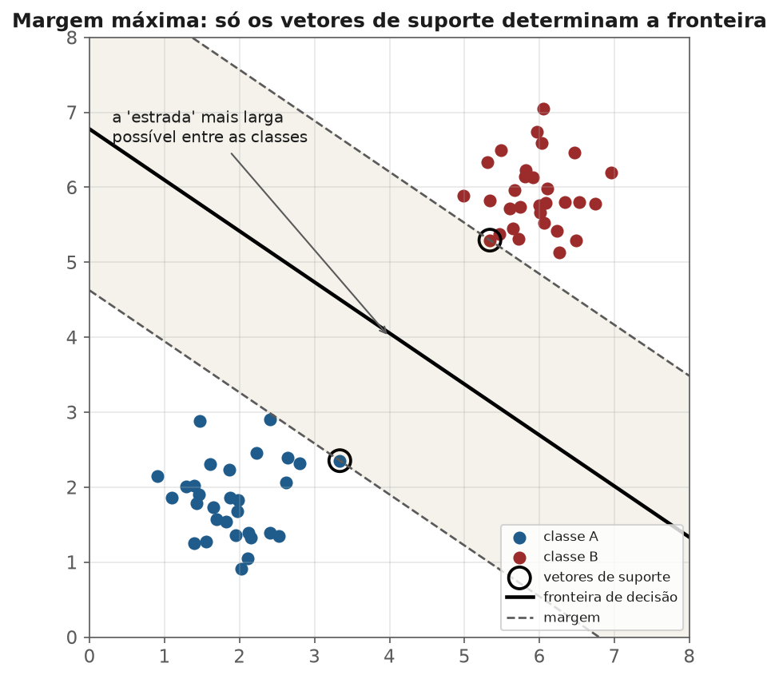
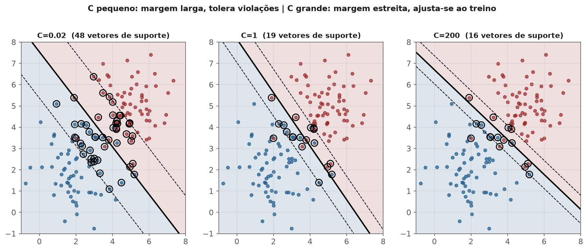
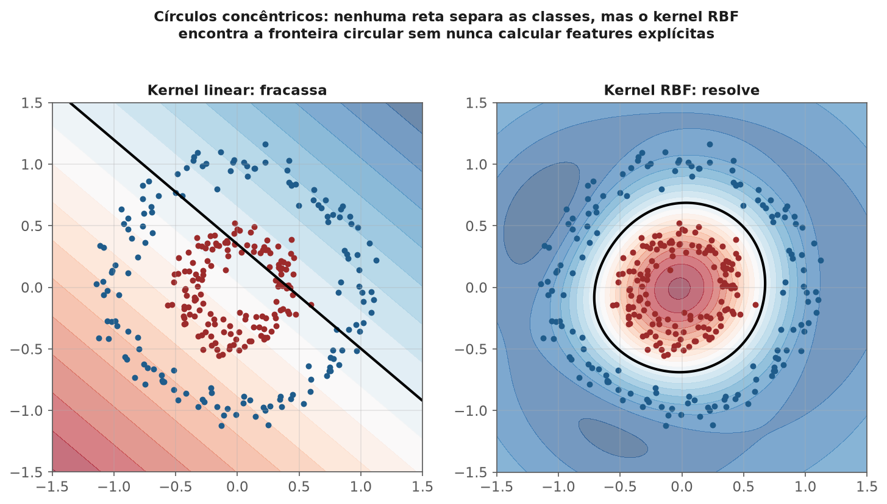

<!-- tema: Aprendizado Supervisionado > Máquinas de Vetores de Suporte -->
<!-- subtitulo: Entre infinitas fronteiras que separam as classes, escolher a mais folgada -->
<!-- resumo: Regressão logística encontra UMA fronteira linear que separa as classes, mas não diz por que essa e não outra igualmente válida. SVM responde: escolha a fronteira com a maior margem de segurança possível — e, ao formular o problema em termos de produtos internos, ganha de graça o truque do kernel, que permite fronteiras não-lineares sem nunca calcular explicitamente as features expandidas. Este material constrói margem máxima, vetores de suporte e o truque do kernel do zero. -->
<!-- nivel: Intermediário a Avançado — requer Vetores, Matrizes e Projeções e Cálculo e Gradiente Descendente (tema 2) -->
<!-- prerequisitos: Vetores, Matrizes e Projeções; Regressão Logística (módulo deste tema) -->
<!-- duracao: 8 a 10 horas (leitura + 2 notebooks) -->
<!-- notebooks: 01-margem-e-svm-linear · 02-kernels · 99-exercicios -->
<!-- autor: Material do curso de ML & DL -->
<!-- versao: 1.1 -->

# Máquinas de Vetores de Suporte

## Por que este módulo existe

Quando duas classes são linearmente separáveis, existem **infinitas** retas
(ou hiperplanos, tema 2) que as separam perfeitamente — regressão logística
encontra uma delas, mas não garante que seja a mais robusta a dados novos. A
pergunta natural: entre todas as fronteiras que separam as classes
perfeitamente no treino, qual generaliza melhor? SVM responde com uma ideia
geométrica limpa — a fronteira que deixa a **maior margem de segurança** dos
dois lados — e essa escolha, formulada corretamente, produz de brinde uma das
ferramentas mais poderosas do aprendizado supervisionado: o truque do kernel.

> [!ANALOGIA] Imagine desenhar uma estrada reta entre duas cidades vizinhas
> sem passar por cima de nenhuma casa dos dois lados. Existem várias
> larguras e posições possíveis para essa estrada. A escolha mais segura é a
> mais **larga** possível — a que deixa o maior respiro até a casa mais
> próxima de cada lado. Essa é literalmente a otimização que a SVM resolve:
> maximizar a largura da "estrada" (a margem) entre as classes.

A figura a seguir mostra essa "estrada" literalmente: a faixa sombreada é a
margem, a linha central é a fronteira de decisão, e os dois pontos
destacados — um de cada classe — são os únicos que realmente importam para
essa geometria: os **vetores de suporte**.

### O que você vai conseguir fazer ao final

- Formular o problema de margem máxima e explicar por que só alguns pontos
  (os vetores de suporte) determinam a fronteira final.
- Distinguir margem rígida de margem suave, e o papel do hiperparâmetro $C$.
- Explicar o truque do kernel: como calcular produtos internos num espaço de
  features expandido sem nunca visitá-lo explicitamente.
- Escolher entre kernel linear, polinomial e RBF com um argumento técnico.

---

## Margem máxima: a formulação geométrica

Para um hiperplano separador $w^\top x + b = 0$ (a mesma estrutura de
regressão logística, tema anterior), a distância de um ponto $x_i$ até o
hiperplano é $|w^\top x_i + b| / \|w\|$ (tema 2 — projeção e norma). Definindo
$y_i \in \{-1, +1\}$, o problema de margem máxima é:

$$\max_{w,b} \frac{2}{\|w\|} \quad \text{sujeito a} \quad y_i(w^\top x_i + b) \geq 1 \; \forall i$$

Equivalente (e mais tratável numericamente) a minimizar $\|w\|^2/2$ sob as
mesmas restrições — um problema de otimização **convexa** (tema 2, módulo 3),
com garantia de mínimo global.

> [!DEFINICAO] **Vetores de suporte** são os pontos que ficam exatamente
> sobre a margem (a restrição vira igualdade, $y_i(w^\top x_i+b)=1$). São
> **eles, e só eles**, que determinam $w$ e $b$ — remover qualquer outro
> ponto do treino não muda a fronteira encontrada. Isso torna SVM uma
> técnica de **representação esparsa** da fronteira de decisão: a maioria do
> dataset é irrelevante depois de treinado.

> [!MERCADO] Essa esparsidade tem uma consequência prática direta: um
> modelo SVM treinado pode ser resumido por um pequeno subconjunto de
> pontos (os vetores de suporte), diferentemente de k-NN (módulo anterior),
> que precisa do dataset de treino inteiro para prever. Em bioinformática,
> onde um problema típico tem $n=200$ pacientes e $p=15\,000$ genes, essa
> esparsidade é uma das razões pelas quais SVM ainda é competitivo: o
> modelo final pode depender de apenas 20-30 pacientes "de fronteira",
> tornando-o mais barato de armazenar e mais fácil de auditar caso a caso.

## Margem suave: quando os dados não são perfeitamente separáveis

Na prática, quase nenhum dataset real é linearmente separável sem erro.
Introduzindo variáveis de folga $\xi_i \geq 0$ que permitem violações
controladas da margem:

$$\min_{w,b,\xi} \frac{1}{2}\|w\|^2 + C\sum_i \xi_i \quad \text{sujeito a} \quad
y_i(w^\top x_i + b) \geq 1 - \xi_i, \;\; \xi_i \geq 0$$

> [!FORMULA] $C$ controla o trade-off entre margem larga e violações
> toleradas — a mesma lógica de viés-variância dos módulos anteriores,
> reaparecendo com um nome diferente:
>
> - $C$ **pequeno**: prioriza margem larga, tolera mais violações — mais
>   viés, menos variância, fronteira mais suave.
> - $C$ **grande**: prioriza classificar cada ponto de treino corretamente,
>   tolera pouca violação — menos viés, mais variância, risco de overfitting.

A figura abaixo mostra o mesmo par de classes (com alguma sobreposição real)
ajustado com três valores de $C$. Repare como o número de vetores de suporte
cai conforme $C$ cresce — menos pontos "sobre a margem", mais pontos
classificados com folga.

> [!ARMADILHA] $C \to \infty$ recupera a margem rígida — e se os dados não
> forem de fato separáveis, o problema de otimização não tem solução
> viável. Um sintoma prático de $C$ grande demais: desempenho de treino
> quase perfeito e desempenho de validação muito pior — o mesmo padrão de
> overfitting visto em k-NN com $k=1$.

## O truque do kernel

A formulação **dual** do problema de otimização (via multiplicadores de
Lagrange, fora do escopo deste módulo em detalhe) expressa a solução usando
os dados **apenas através de produtos internos** $x_i^\top x_j$. Essa
propriedade é o que torna o truque do kernel possível.

> [!DEFINICAO] Se uma fronteira não é linearmente separável no espaço
> original, ela pode se tornar separável num espaço de features **expandido**
> $\phi(x)$ (por exemplo, incluindo termos quadráticos). O problema é que
> calcular $\phi(x)$ explicitamente pode ser caro ou até ter dimensão
> infinita. O truque: se existe uma função $K(x_i, x_j) = \phi(x_i)^\top
> \phi(x_j)$ que calcula o produto interno **no espaço expandido sem nunca
> calcular $\phi$ explicitamente**, todo o problema (que só usa produtos
> internos) pode ser resolvido usando $K$ diretamente.

O exemplo clássico que prova o ponto: dois círculos concêntricos (a classe
interna e a classe externa) não têm **nenhuma** reta que os separe — mas
projetados num espaço com mais uma dimensão (por exemplo, a distância ao
centro), viram perfeitamente separáveis por um plano. O kernel RBF alcança
esse mesmo efeito sem nunca construir essa dimensão extra explicitamente.

### Os kernels mais usados

| Kernel | Fórmula | Intuição |
|---|---|---|
| Linear | $K(x_i,x_j) = x_i^\top x_j$ | Fronteira linear — equivalente à SVM linear |
| Polinomial | $K(x_i,x_j) = (x_i^\top x_j + c)^d$ | Fronteiras curvas de grau $d$, incluindo interações |
| RBF (Gaussiano) | $K(x_i,x_j) = e^{-\gamma \lVert x_i-x_j \rVert^2}$ | Equivalente a um espaço de features de dimensão **infinita** |

> [!NOTA] O kernel RBF mede **similaridade decrescente com a distância** —
> pontos próximos têm $K$ perto de 1, pontos distantes têm $K$ perto de 0. É
> o kernel padrão de mercado quando não há razão para acreditar numa
> fronteira linear ou polinomial específica, por ser extremamente flexível.

> [!ARMADILHA] $\gamma$ no kernel RBF controla o alcance de cada ponto:
> $\gamma$ grande faz cada ponto influenciar só uma vizinhança minúscula
> (fronteira muito irregular, risco alto de overfitting — parecido com $k=1$
> em k-NN); $\gamma$ pequeno faz cada ponto influenciar uma região enorme
> (fronteira quase linear, risco de underfitting). $C$ e $\gamma$ devem ser
> ajustados **juntos** por validação cruzada (tema 6) — otimizar um sem o
> outro raramente encontra o melhor par.

> [!MERCADO] Um caso de mercado típico de kernel polinomial: um sistema de
> recomendação simples que usa SVM sobre features de interação
> usuário-produto — o grau $d=2$ captura automaticamente termos como
> "idade × categoria do produto", sem que ninguém precise construir essas
> interações manualmente (tema 3, módulo 3). Na prática, porém, RBF costuma
> ser preferido por sua flexibilidade e menor número de hiperparâmetros a
> ajustar ($\gamma$ e $C$, contra $d$, $c$ e $C$ do polinomial).

## Por que escalonar é, de novo, obrigatório

SVM depende de produtos internos e distâncias — a mesma vulnerabilidade a
escalas diferentes já vista em k-NN e em qualquer método baseado em distância
(temas 2 e 3). Sem padronizar, features de maior escala numérica dominam o
kernel inteiro, independente de sua real importância. Num caso real de
scoring de crédito, uma feature `renda_anual` (na casa das dezenas de
milhares) ao lado de `numero_dependentes` (0 a 5) faz o kernel RBF, sem
padronização, tratar `numero_dependentes` como praticamente irrelevante —
qualquer distância entre dois clientes é dominada pela diferença de renda,
não importa quão parecidos sejam em outras dimensões.

## Erros que custam caro — checklist

- Não escalonar features antes de treinar qualquer SVM, especialmente com
  kernel RBF.
- Ajustar $C$ e $\gamma$ separadamente em vez de fazer uma busca conjunta
  por validação cruzada.
- Usar kernel RBF em datasets muito grandes sem considerar o custo
  computacional — o treino de SVM com kernel não-linear escala mal com $n$
  (tipicamente $O(n^2)$ a $O(n^3)$), tornando-o impraticável além de
  algumas dezenas de milhares de exemplos sem aproximações.
- Esquecer que, para a maioria dos problemas tabulares modernos, gradient
  boosting (módulo 8) costuma superar SVM em desempenho preditivo com menos
  ajuste de hiperparâmetro — SVM continua relevante especialmente em
  problemas com poucas amostras e muitas features (texto, bioinformática).
- Interpretar $C$ grande como "modelo melhor" sem checar overfitting na
  validação.

## Para ir além

- Cortes & Vapnik (1995), o artigo original de Support Vector Networks.
- Schölkopf & Smola, *Learning with Kernels* — o tratamento completo do
  truque do kernel e suas generalizações.
- Boyd & Vandenberghe, *Convex Optimization* (já citado no tema 2) — a base
  formal da dualidade Lagrangiana usada para derivar a formulação dual.
