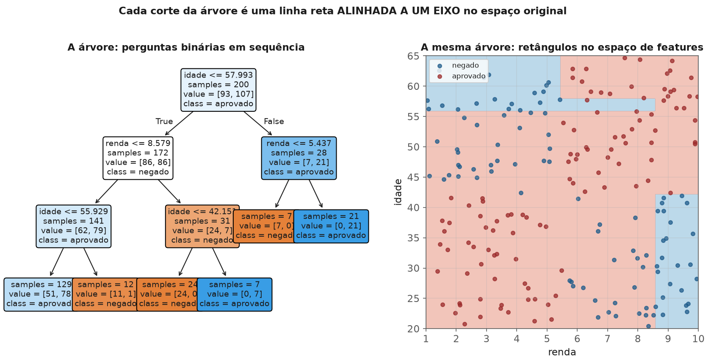
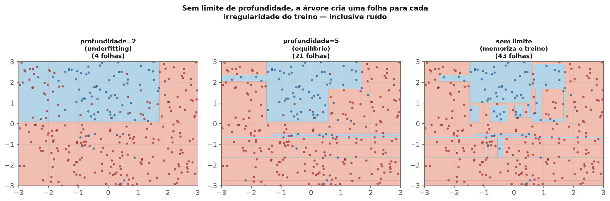

<!-- tema: Aprendizado Supervisionado > Árvores de Decisão -->
<!-- subtitulo: O modelo que pergunta uma coisa de cada vez até decidir -->
<!-- resumo: Uma árvore de decisão não precisa de kernel, não precisa de escalonamento e captura não-linearidade e interações sozinha — ao custo de uma tendência quase incontrolável a decorar o conjunto de treino. Este material constrói o algoritmo guloso de particionamento recursivo do zero, formaliza os critérios de impureza que decidem cada corte, e mostra por que uma árvore sozinha quase sempre sobreajusta — preparando o terreno para o módulo de Random Forest e Boosting. -->
<!-- nivel: Intermediário -->
<!-- prerequisitos: Preparação de Dados (tema 3); noções de entropia (tema 1, estatística bayesiana) -->
<!-- duracao: 6 a 8 horas (leitura + 2 notebooks) -->
<!-- notebooks: 01-arvore-do-zero · 02-poda-e-hiperparametros · 99-exercicios -->
<!-- autor: Material do curso de ML & DL -->
<!-- versao: 1.1 -->

# Árvores de Decisão

## Por que este módulo existe

Todos os modelos deste tema, até aqui, produzem uma fronteira de decisão
**suave** — uma reta, um hiperplano, uma curva contínua vinda de um kernel.
Uma árvore de decisão faz algo radicalmente diferente: particiona o espaço
de features em retângulos (ou hipercubos, em mais dimensões), fazendo uma
pergunta binária de cada vez — "`renda > 5000`?", depois "`idade < 30`?" — até
chegar a uma folha com uma previsão. É um modelo que qualquer pessoa de
negócio lê e entende sem estatística nenhuma, e é também, sozinho, um dos
modelos mais propensos a overfitting que existe — o que faz dele, quase
sempre, uma peça de um modelo maior (módulos 7 e 8), não o produto final.

> [!ANALOGIA] Uma árvore de decisão é um fluxograma de triagem: "o paciente
> tem febre? Se sim, teve contato com alguém doente? Se sim, isolar; se não,
> observar." Cada pergunta reduz a incerteza sobre o diagnóstico final. O
> problema começa quando o fluxograma fica tão detalhado e específico que
> vira uma lista memorizada de casos individuais, em vez de um protocolo que
> generaliza.

A figura a seguir mostra a mesma árvore de duas formas: como fluxograma de
perguntas (esquerda) e como a partição retangular que essas perguntas
produzem no espaço de features (direita). São a mesma coisa vista de dois
ângulos — cada nó da árvore é um corte reto, alinhado a um eixo, no espaço
original.

### O que você vai conseguir fazer ao final

- Implementar o algoritmo de particionamento recursivo guloso do zero,
  incluindo o cálculo de impureza que decide cada corte.
- Explicar Gini e entropia, e por que ambos levam a árvores parecidas na
  prática.
- Diagnosticar overfitting numa árvore e aplicar poda (pré ou pós) para
  corrigi-lo.
- Explicar por que árvores não precisam de escalonamento, e por que são
  instáveis a pequenas mudanças nos dados.

---

## Particionamento recursivo: o algoritmo

1. Para o nó atual, teste todos os cortes possíveis (cada feature, em cada
   limiar possível entre valores observados).
2. Escolha o corte que **mais reduz a impureza** dos dois nós filhos
   resultantes.
3. Repita recursivamente em cada filho, até um critério de parada (folha
   pura, profundidade máxima, poucos exemplos restantes).

> [!DEFINICAO] Esse algoritmo é **guloso** (greedy): a cada passo, escolhe o
> melhor corte **local**, sem considerar se uma sequência diferente de
> cortes produziria uma árvore melhor no fim. Encontrar a árvore
> globalmente ótima é computacionalmente inviável (NP-difícil) — o algoritmo
> guloso é uma aproximação prática, não uma garantia de otimalidade.

## Critérios de impureza

Para classificação, com $p_k$ a proporção da classe $k$ num nó:

$$\text{Gini}(nó) = 1 - \sum_k p_k^2 \qquad
\text{Entropia}(nó) = -\sum_k p_k \log_2 p_k$$

> [!FORMULA] Os dois medem a mesma ideia — "quão misturado está este nó" —
> com pesos ligeiramente diferentes. Gini é computacionalmente mais barato
> (sem logaritmo) e é o padrão do `scikit-learn`; entropia vem da teoria da
> informação (tema 1) e é mais sensível a nós muito desbalanceados. Na
> prática, árvores treinadas com um ou outro raramente diferem muito.

### Um exemplo numérico: calculando Gini e o ganho de um corte

Considere um nó com 100 clientes: 60 que renovaram a assinatura e 40 que
cancelaram. $p_{renovou} = 0{,}6$, $p_{cancelou} = 0{,}4$:

$$\text{Gini(pai)} = 1 - (0{,}6^2 + 0{,}4^2) = 1 - (0{,}36 + 0{,}16) = 0{,}48$$

Suponha que o corte `tempo_de_uso > 6 meses` produza dois filhos: um com 70
clientes (55 renovaram, 15 cancelaram) e outro com 30 clientes (5 renovaram,
25 cancelaram):

$$\text{Gini(filho 1)} = 1 - (0{,}786^2 + 0{,}214^2) \approx 0{,}337, \qquad
\text{Gini(filho 2)} = 1 - (0{,}167^2 + 0{,}833^2) \approx 0{,}278$$

$$\text{Ganho} = 0{,}48 - \left(\frac{70}{100} \times 0{,}337 + \frac{30}{100}
\times 0{,}278\right) = 0{,}48 - 0{,}319 = 0{,}161$$

Esse número (0,161) é comparado contra o ganho de **todos os outros cortes
possíveis** (outras features, outros limiares) — o algoritmo escolhe sempre
o corte de maior ganho.

O **ganho de informação** de um corte é a redução ponderada de impureza:

$$\text{Ganho} = \text{Impureza(pai)} - \sum_{filho} \frac{n_{filho}}{n_{pai}} \text{Impureza(filho)}$$

O algoritmo escolhe, em cada nó, o corte que maximiza esse ganho.

> [!NOTA] Para **regressão**, o critério análogo é a redução de variância
> (equivalente a MSE): escolhe-se o corte que mais reduz a soma de
> quadrados dos resíduos nos nós filhos em relação ao pai — a mesma lógica
> de "impureza", trocando proporção de classe por dispersão de valores
> contínuos.

## Por que uma árvore sozinha sobreajusta

> [!ARMADILHA] Sem limite de profundidade, uma árvore pode crescer até que
> **cada folha tenha um único exemplo de treino** — erro de treino zero,
> exatamente como k-NN com $k=1$ (módulo anterior). O modelo memorizou o
> treino em vez de aprender um padrão generalizável. Esse é o comportamento
> **padrão**, não uma falha rara — árvores sem restrição de crescimento
> sobreajustam quase sempre.

A figura a seguir mostra três profundidades no mesmo dataset: profundidade
2 mal captura a curvatura real da fronteira (poucas folhas, viés alto);
sem limite, a árvore cria dezenas de folhas minúsculas, algumas para
isolar um único ponto de ruído — visível nos "dedos" estreitos da fronteira
à direita.

### Pré-poda: limitar o crescimento

`max_depth`, `min_samples_split`, `min_samples_leaf` impedem a árvore de
crescer além de um ponto, definido antes do treino.

### Pós-poda: crescer tudo, depois cortar

**Poda por complexidade de custo** (`ccp_alpha` no `sklearn`) cresce a árvore
inteira e depois remove sub-árvores que não melhoram o desempenho o
suficiente para justificar a complexidade extra, segundo um parâmetro
$\alpha$ que penaliza o número de folhas — a mesma lógica de regularização
do módulo 2, aplicada à estrutura da árvore em vez de a coeficientes.

> [!MERCADO] Pré-poda é mais barata computacionalmente (a árvore nunca cresce
> além do necessário); pós-poda costuma encontrar árvores um pouco melhores,
> porque considera a estrutura completa antes de decidir o que cortar — ao
> custo de treinar a árvore cheia primeiro.

## Por que árvores não precisam de escalonamento

Cada corte compara uma única feature contra um limiar — a operação é
invariante a qualquer transformação **monotônica** daquela feature
(multiplicar por uma constante positiva, aplicar log). Isso é uma vantagem
prática real: nenhum dos cuidados de escalonamento dos módulos anteriores
(regressão, k-NN, SVM) se aplica a árvores. Um analista pode alimentar a
árvore com `renda` em reais ou em milhares de reais — a estrutura da árvore
(quais features, em qual ordem, quais limiares relativos) não muda em nada,
só o número exibido no limiar.

> [!ARMADILHA] Isso não significa que árvores são imunes a todo problema de
> feature engineering. Cardinalidade alta ainda pode inflar artificialmente
> a importância de uma feature (tema 3, módulo 3) — o mecanismo é diferente
> (mais pontos de corte possíveis, não escala numérica), mas o efeito
> prático de auditar features de alta cardinalidade continua necessário.

## Instabilidade: o problema que motiva o próximo módulo

> [!ARMADILHA] Uma pequena mudança no dataset de treino — remover algumas
> linhas, adicionar ruído mínimo — pode mudar **qual** feature é escolhida
> no primeiro corte, e isso se propaga para uma árvore com estrutura
> completamente diferente daí em diante. Árvores de decisão têm **variância
> altíssima**: o mesmo problema, resolvido com uma amostra ligeiramente
> diferente dos mesmos dados, pode produzir um modelo visualmente muito
> diferente.

> [!MERCADO] Essa instabilidade não é só uma curiosidade acadêmica — é
> exatamente o que o módulo 7 (Bagging e Random Forest) explora: **calcular
> a média de muitas árvores instáveis, treinadas em variações dos dados,
> produz um modelo muito mais estável que qualquer árvore individual.** Uma
> árvore sozinha raramente é o modelo final em produção — ela é o
> "aprendiz fraco" que ensembles (módulos 7 e 8) combinam. Um caso comum:
> um analista treina uma árvore de decisão para explicar rotatividade de
> funcionários, apresenta a árvore para a diretoria como "a explicação",
> e no mês seguinte, com mais uma leva de dados, a árvore muda de estrutura
> completamente — não porque o fenômeno mudou, mas porque a árvore sempre
> teve essa instabilidade inerente.

## Erros que custam caro — checklist

- Treinar uma árvore sem nenhuma restrição de profundidade e reportar o
  desempenho de treino como se fosse representativo.
- Interpretar a estrutura de uma única árvore como "a" explicação
  definitiva do fenômeno, ignorando a alta variância do modelo.
- Esquecer que cardinalidade alta ainda infla importância de features em
  árvores, mesmo sem o problema de escala.
- Escolher `max_depth` ou `min_samples_leaf` sem validação cruzada.
- Achar que "árvore não precisa de preparação de dados" significa "não
  precisa de nenhum cuidado do tema 3" — nulos, outliers e vazamento
  continuam problemas reais.

## Para ir além

- Breiman, Friedman, Olshen & Stone, *Classification and Regression Trees*
  (CART) — o texto fundador do algoritmo usado até hoje.
- Quinlan, *C4.5: Programs for Machine Learning* — a linhagem alternativa
  baseada em entropia e ganho de informação.
- Hastie, Tibshirani & Friedman, *The Elements of Statistical Learning*,
  capítulo 9 — o tratamento matemático de árvores dentro do arcabouço mais
  amplo de aprendizado estatístico.
