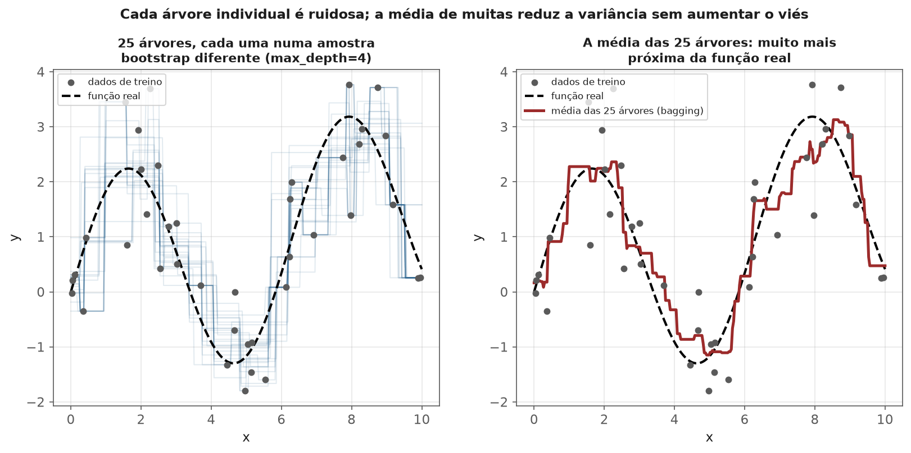
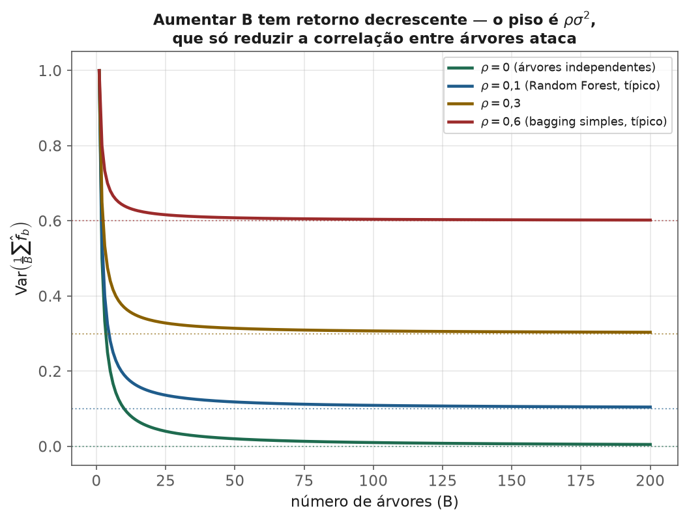
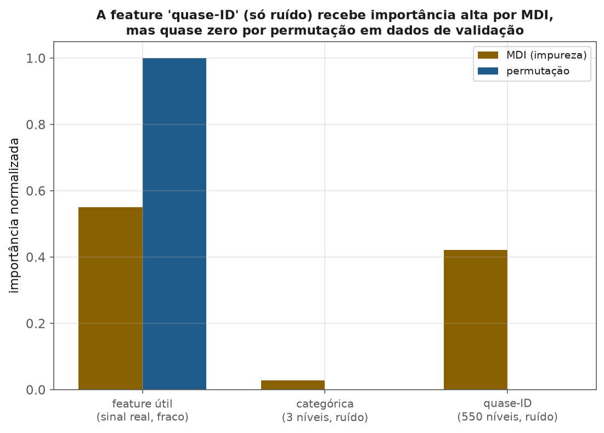

<!-- tema: Aprendizado Supervisionado > Bagging e Random Forest -->
<!-- subtitulo: Transformando a instabilidade de uma árvore em vantagem coletiva -->
<!-- resumo: O módulo anterior terminou com um problema — árvores de decisão têm variância altíssima, mudando de estrutura com pequenas variações no treino. Este módulo mostra que esse "defeito" é explorável: calcular a média de muitas árvores instáveis, cada uma treinada numa amostra bootstrap diferente, reduz a variância sem aumentar o viés. Random Forest injeta uma segunda fonte de aleatoriedade — subamostragem de features — para descorrelacionar as árvores ainda mais. Este material constrói bagging do zero, mede o ganho de descorrelação, e formaliza os dois tipos de importância de features. -->
<!-- nivel: Intermediário — requer Árvores de Decisão (módulo anterior) e Estimadores e Bootstrap (tema 1) -->
<!-- prerequisitos: Árvores de Decisão; Intervalos de Confiança e Bootstrap (tema 1) -->
<!-- duracao: 8 a 10 horas (leitura + 3 notebooks) -->
<!-- notebooks: 01-bagging-e-variancia · 02-random-forest · 03-importancia-de-features · 99-exercicios -->
<!-- autor: Material do curso de ML & DL -->
<!-- versao: 1.1 -->

# Bagging e Random Forest

## Por que este módulo existe

O módulo anterior identificou o defeito central de árvores de decisão:
variância altíssima — pequenas mudanças no treino produzem árvores
estruturalmente diferentes. A reação ingênua seria tentar estabilizar cada
árvore individual. A reação inteligente, e o assunto deste módulo, é o
oposto: **aceitar que cada árvore é instável, treinar muitas delas em
variações dos dados, e usar a média**. O resultado — bagging, e sua
evolução, Random Forest — transforma o pior defeito de árvores individuais
na fonte da força do ensemble.

> [!ANALOGIA] Perguntar a **uma pessoa** para adivinhar o peso de um boi
> numa feira produz um palpite ruidoso. Perguntar a **mil pessoas
> independentes** e tirar a média produz uma estimativa notavelmente
> precisa — é a "sabedoria das multidões". Bagging faz exatamente isso com
> árvores: cada árvore individual é um "palpite" ruidoso e enviesado por sua
> amostra específica; a média de muitas reduz o ruído sem introduzir nenhum
> viés novo, desde que os palpites sejam suficientemente independentes uns
> dos outros.

A figura a seguir mostra isso literalmente, num problema de regressão
sintético: 25 árvores rasas, cada uma treinada numa amostra bootstrap
diferente do mesmo conjunto de 40 pontos, produzem previsões visivelmente
ruidosas e "em degraus" (esquerda) — mas a média dessas 25 previsões
(direita) segue a função real muito mais de perto do que qualquer árvore
individual conseguiria sozinha.

### O que você vai conseguir fazer ao final

- Explicar matematicamente por que a média de estimadores reduz variância, e
  o papel crítico da correlação entre eles.
- Implementar bagging do zero e medir a redução de variância diretamente.
- Explicar a segunda fonte de aleatoriedade do Random Forest (subamostragem
  de features) e por que ela descorrelaciona as árvores além do que bagging
  sozinho consegue.
- Usar o erro out-of-bag como validação "de graça", e escolher entre
  importância por impureza e por permutação com um argumento técnico.

---

## Bagging: bootstrap aggregating

**O algoritmo:** para $b = 1, \dots, B$, sorteie uma amostra bootstrap (com
reposição, tema 1) do dataset de treino, treine um modelo nela, e agregue as
previsões dos $B$ modelos (média para regressão, voto majoritário para
classificação).

> [!FORMULA] Para $B$ estimadores com variância individual $\sigma^2$ e
> correlação par a par $\rho$, a variância da média é:
>
> $$\text{Var}\left(\frac{1}{B}\sum_b \hat{f}_b\right) = \rho\sigma^2 + \frac{1-\rho}{B}\sigma^2$$
>
> Conforme $B \to \infty$, o segundo termo desaparece, mas o **primeiro
> termo, $\rho\sigma^2$, não** — é um piso que só a correlação entre os
> estimadores determina. Essa fórmula é a peça central de todo este módulo:
> **aumentar $B$ além de um ponto tem retorno decrescente; reduzir $\rho$
> (a correlação entre árvores) é o que continua valendo a pena.**

### Um exemplo numérico: quantas árvores realmente valem a pena

Suponha $\sigma^2 = 1$ (a variância de uma única árvore) e $\rho = 0{,}3$
(correlação típica de bagging simples sem subamostragem de features). Com
$B=10$ árvores:

$$\text{Var} = 0{,}3 \times 1 + \frac{1-0{,}3}{10} \times 1 = 0{,}3 + 0{,}07 = 0{,}37$$

Com $B=100$:

$$\text{Var} = 0{,}3 + \frac{0{,}7}{100} = 0{,}3 + 0{,}007 = 0{,}307$$

Passar de 10 para 100 árvores (10× mais custo de treino e de inferência)
reduziu a variância de apenas 0,37 para 0,307 — uma melhora de 17%, com dez
vezes mais trabalho. Só reduzindo $\rho$ (por exemplo, para 0,1, o que
Random Forest faz) o piso cairia de fato, para 0,1 + termo decrescente — uma
melhora estrutural, não incremental.

A figura abaixo generaliza esse cálculo: cada curva é a mesma fórmula, para
diferentes valores de $\rho$. Note como todas as curvas achatam rapidamente
— o ganho real de aumentar $B$ além de algumas dezenas é pequeno — mas o
**piso** de cada curva (a linha pontilhada) só muda quando $\rho$ muda.

> [!NOTA] Árvores de decisão são o "material-base" ideal para bagging
> precisamente porque têm variância alta (muito a ganhar reduzindo) e, sem
> nenhuma poda agressiva, viés baixo (a agregação não introduz viés
> sistemático novo). Modelos de viés alto e variância baixa (como uma
> regressão linear simples) ganham pouco com bagging — não há muita
> variância para reduzir.

> [!MERCADO] Esse cálculo explica um comportamento observado o tempo todo em
> produção: um time de ML aumenta `n_estimators` de 100 para 1000 esperando
> ganho proporcional de desempenho, e observa uma melhora de menos de 1% no
> AUC, ao custo de 10× mais tempo de inferência. O modelo já estava perto do
> piso $\rho\sigma^2$ — o problema não é quantidade de árvores, é
> correlação entre elas, e é isso que Random Forest ataca diretamente na
> próxima seção.

## Random Forest: uma segunda fonte de aleatoriedade

Bagging sozinho tem uma limitação: se uma feature é muito mais informativa
que as outras, **toda** árvore do bagging tende a escolhê-la no primeiro
corte — as árvores continuam parecidas (correlação $\rho$ alta), mesmo vindo
de amostras bootstrap diferentes.

> [!DEFINICAO] Random Forest adiciona: em cada corte, considere apenas um
> subconjunto **aleatório** de features (tipicamente $\sqrt{p}$ para
> classificação, $p/3$ para regressão) como candidatas, em vez de todas.
> Isso força árvores diferentes a explorar features diferentes,
> **reduzindo $\rho$** diretamente — o termo que bagging sozinho não ataca.

> [!MERCADO] Esse é o motivo pelo qual Random Forest tipicamente supera
> bagging simples de árvores, mesmo usando exatamente o mesmo algoritmo de
> árvore por baixo — a diferença inteira está em reduzir a correlação entre
> os membros do ensemble, não em melhorar cada árvore individualmente.

## Erro out-of-bag: validação de graça

Cada amostra bootstrap deixa de fora, em média, cerca de **36,8%** dos
dados originais ($\lim_{n\to\infty}(1-1/n)^n = e^{-1} \approx 0.368$) — as
observações **out-of-bag (OOB)** daquela árvore.

> [!FORMULA] Para cada observação do treino, é possível calcular a
> previsão usando **apenas as árvores que não a viram** no treino (ela
> estava fora da amostra bootstrap daquelas árvores) — produzindo uma
> estimativa de erro de generalização **sem separar um conjunto de
> validação à parte**. O erro OOB tende a se aproximar do erro de validação
> cruzada, ao custo computacional de nada além do próprio treino do
> ensemble.

> [!MERCADO] Em datasets pequenos (poucos milhares de linhas), separar 20%
> para validação pode custar caro — menos dados de treino para um modelo já
> escasso de exemplos. O erro OOB permite treinar com 100% dos dados
> disponíveis e ainda obter uma estimativa honesta de generalização, sem o
> trade-off. É por isso que `oob_score=True` é praticamente gratuito de
> ativar em qualquer `RandomForestClassifier`/`RandomForestRegressor`.

## Dois tipos de importância de features

### Importância por impureza (MDI — Mean Decrease Impurity)

Soma, sobre todas as árvores e todos os cortes que usam aquela feature, a
redução de impureza (Gini, módulo anterior) proporcionada.

> [!ARMADILHA] Como visto no tema 3 (módulo 3), MDI é **enviesada a favor de
> features de alta cardinalidade** — quanto mais valores distintos uma
> feature pode assumir, mais chances o algoritmo guloso tem de encontrar
> **algum** corte que pareça bom por puro acaso, mesmo sem relação real com
> o alvo. Esse viés é sistemático, não um problema raro.

### Importância por permutação

Embaralha os valores de uma feature (destruindo sua relação real com o
alvo, mas preservando sua distribuição marginal) e mede o quanto o
desempenho do modelo **cai**. Quanto maior a queda, mais importante a
feature era de fato.

A figura a seguir torna o viés de cardinalidade concreto com um experimento
simples: um Random Forest é treinado com três features — uma com sinal real
(mas fraco), uma categórica de baixa cardinalidade (3 níveis, puro ruído) e
uma de altíssima cardinalidade (550 níveis, também puro ruído, funcionando
quase como um identificador único por linha). MDI atribui à feature de alta
cardinalidade uma importância comparável à da feature realmente útil —
porque ela oferece tantos pontos de corte possíveis que a árvore sempre
encontra algum que reduz impureza por acaso. Medida em dados de validação
(não vistos no treino), a importância por permutação dessa mesma feature
cai para praticamente zero, revelando o que ela sempre foi: ruído.

> [!MERCADO] Importância por permutação, calculada em dados de **validação**
> (não de treino), é mais confiável que MDI precisamente porque não sofre
> do viés de cardinalidade — ela mede o efeito real no desempenho preditivo,
> não uma propriedade estrutural de quantos cortes uma feature permite. Um
> caso real e recorrente: um `customer_id` ou `numero_do_pedido` deixado por
> engano no conjunto de features aparece como uma das mais "importantes" por
> MDI — e um analista menos cuidadoso pode até tentar "entender por que o ID
> do pedido prevê churn", quando na verdade é só um artefato de
> cardinalidade. Permutação em validação mostra imediatamente que essa
> "importância" desaparece. O tema 11 (Interpretabilidade) aprofunda essa e
> outras técnicas — este módulo estabelece a base.

## Erros que custam caro — checklist

- Usar poucas árvores (`n_estimators` baixo) e não perceber que o erro
  ainda está caindo — mais árvores quase nunca pioram o resultado, só
  custam mais tempo de treino.
- Aumentar `n_estimators` muito além do ponto de retorno decrescente
  esperando ganhos proporcionais, sem entender que o piso é ditado pela
  correlação entre árvores, não pela quantidade.
- Confiar cegamente em importância por impureza (MDI) para decidir quais
  features remover, sem checar se o resultado é consistente com importância
  por permutação em dados de validação.
- Esquecer que o erro OOB já é uma estimativa de validação gratuita, e
  separar um conjunto de validação adicional desnecessariamente em datasets
  pequenos.
- Não ajustar `max_features` — o parâmetro que controla diretamente a
  descorrelação entre árvores, e que faz Random Forest ser mais que
  "bagging de árvores".
- Achar que Random Forest sempre supera Gradient Boosting (próximo módulo)
  — em dados tabulares, boosting tende a vencer com ajuste cuidadoso, ainda
  que Random Forest seja mais robusto a hiperparâmetros mal escolhidos.

## Para ir além

- Breiman (2001), *Random Forests* — o artigo original, com a decomposição
  de variância usada neste módulo.
- Breiman (1996), *Bagging Predictors* — o artigo que introduz bagging.
- Louppe, *Understanding Random Forests* (tese de doutorado) — tratamento
  moderno e completo, incluindo os dois tipos de importância de features.
