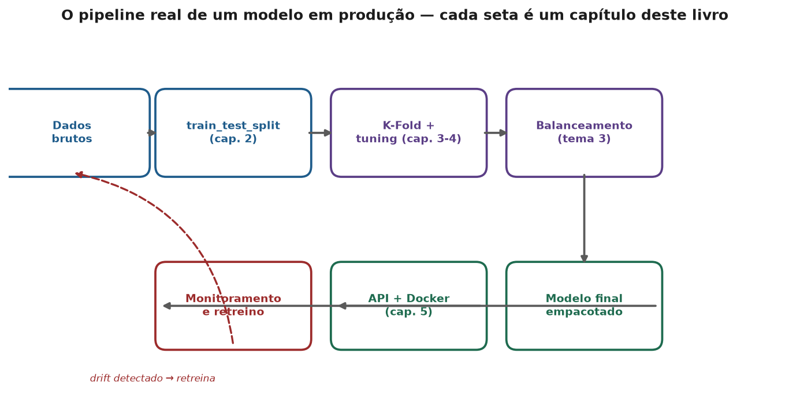
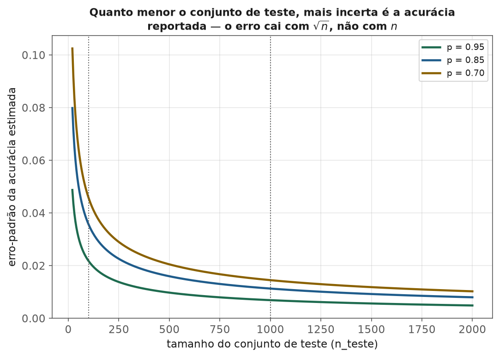
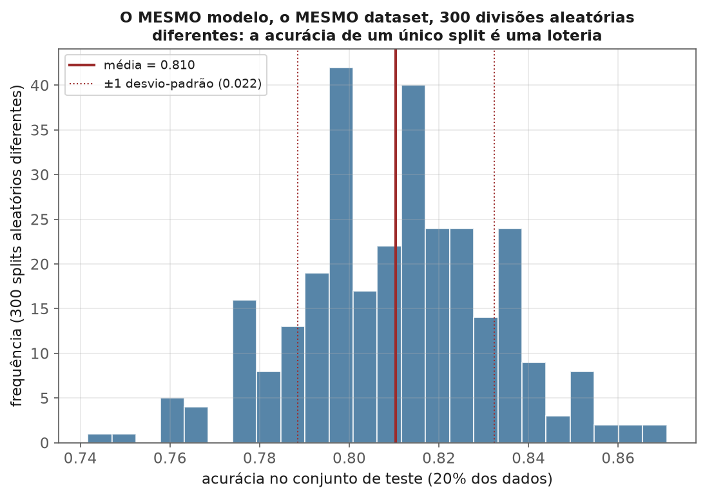
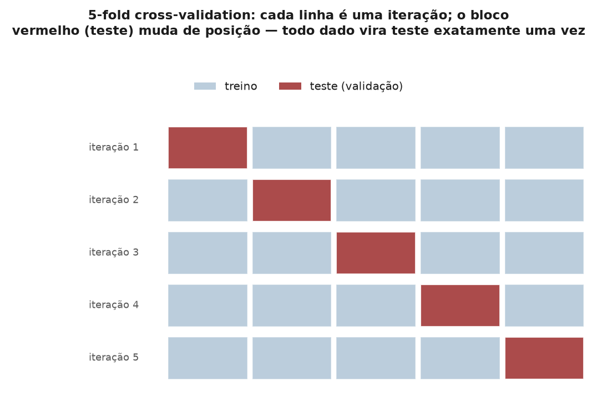
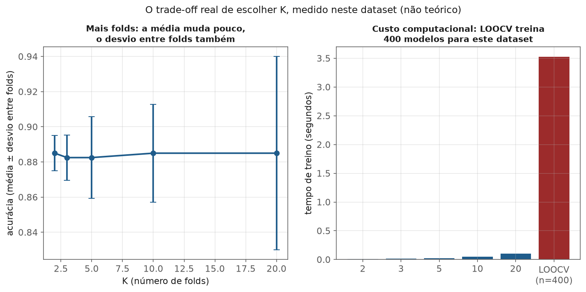
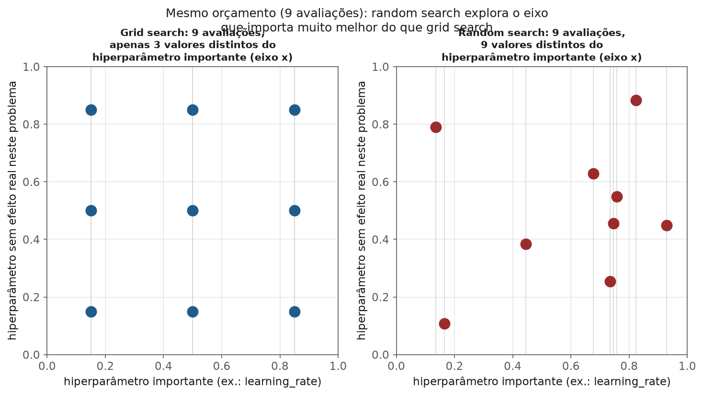
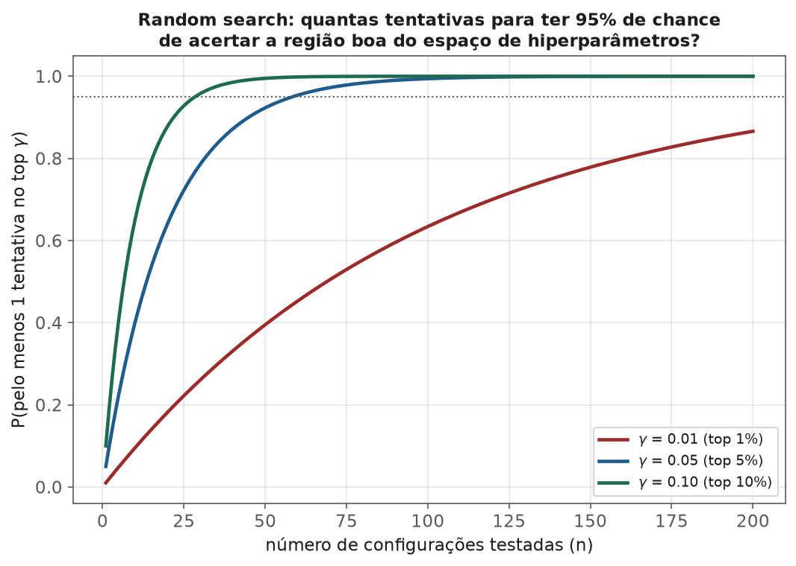
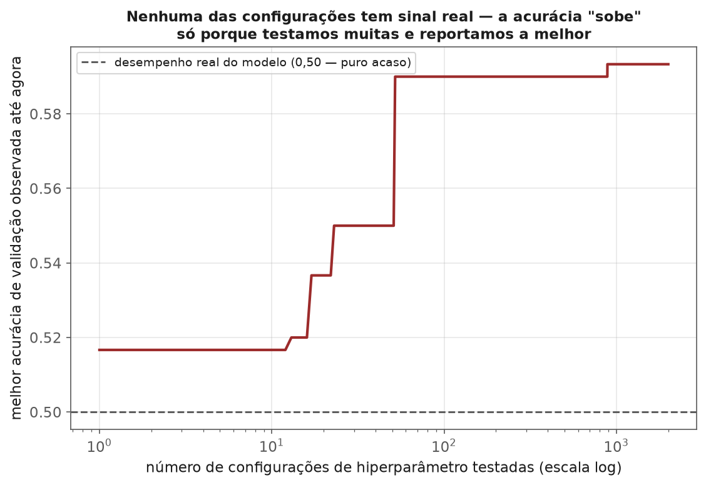
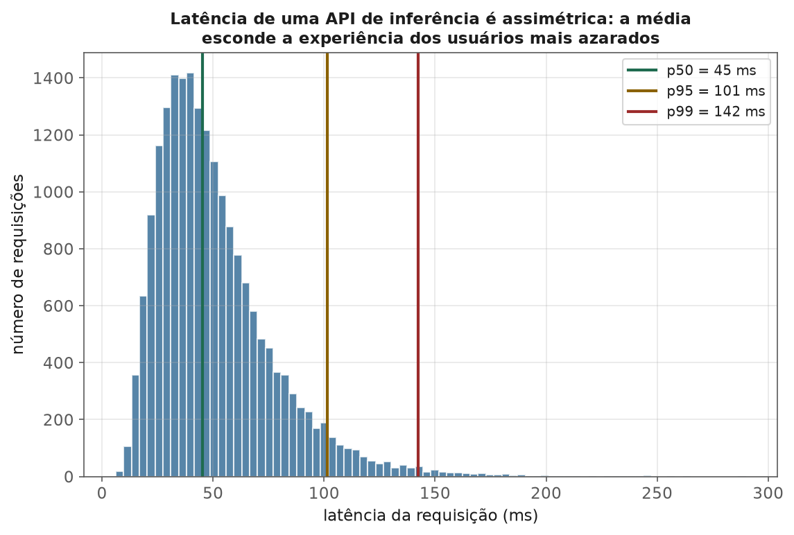
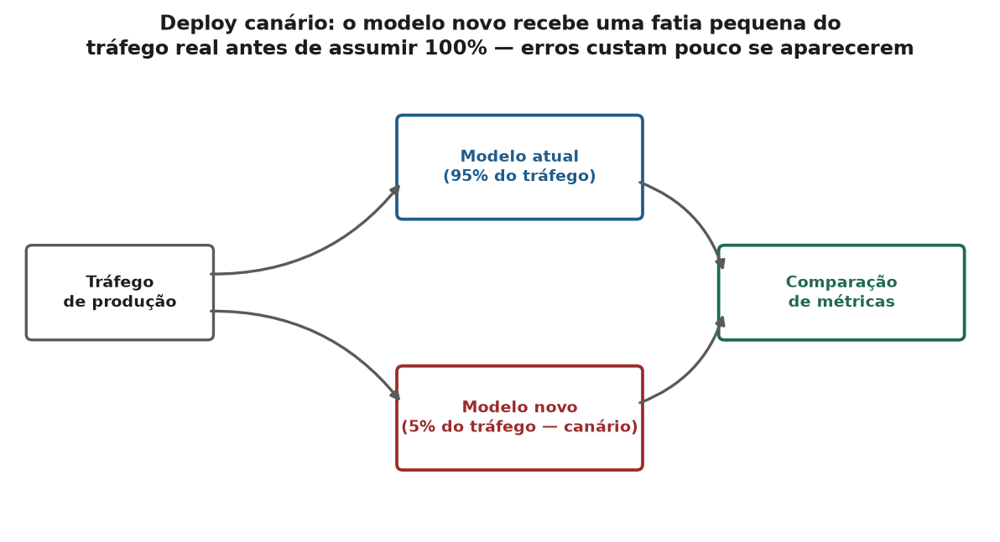

<!-- tema: Aprendizado Supervisionado > Do Notebook à Produção -->
<!-- subtitulo: O livro dois deste tema — validação, tuning e deploy: o que cerca todo algoritmo dos 8 módulos anteriores -->
<!-- resumo: Os 8 módulos deste tema ensinam algoritmos — como cada modelo aprende a partir dos dados. Este livro ensina o que cerca qualquer algoritmo, independente de qual você escolheu: como dividir dados sem se enganar (train_test_split), como validar sem otimismo (K-Fold e suas variantes), como ajustar hiperparâmetros sem overfitar a própria validação (fine-tuning) e, principalmente, como um modelo treinado vira um sistema real — serializado, servido por uma API, containerizado e monitorado em produção. Fecha com um estudo de caso ponta a ponta que costura tudo isso numa única narrativa, do primeiro split ao deploy. -->
<!-- nivel: Intermediário/Avançado — assume os 8 módulos deste tema -->
<!-- prerequisitos: Todos os módulos deste tema; Estimadores e Bootstrap (tema 1); Dados Desbalanceados (tema 3) -->
<!-- duracao: 16 a 20 horas de leitura -->
<!-- autor: Material do curso de ML & DL -->
<!-- versao: 1.0 -->

# Do Notebook à Produção: Validação, Tuning e Deploy de Modelos

## Por que este livro existe

Os 8 módulos anteriores deste tema ensinaram **algoritmos**: como uma
regressão linear encontra seus coeficientes, como uma árvore escolhe onde
cortar, como um SVM encontra a margem máxima, como boosting corrige seus
próprios erros. Isso é necessário, mas não é suficiente. Um cientista de
dados que domina todos os oito algoritmos e não sabe responder com confiança
a três perguntas — "esse número que você reportou é real?", "esses
hiperparâmetros foram escolhidos de forma honesta?", "como isso vira um
sistema que uma aplicação de verdade consegue chamar?" — produz protótipos de
notebook, não modelos de produção.

Este é o livro dois do tema. Ele não introduz nenhum algoritmo novo — cada
capítulo se aplica igualmente a uma regressão logística, a uma Random Forest
ou a um XGBoost. Em vez disso, ele cobre a **metodologia que envolve
qualquer algoritmo**: a maneira disciplinada de dividir dados, validar
resultados, ajustar hiperparâmetros e, no capítulo mais extenso deste
material, transformar um objeto Python treinado num serviço que responde a
requisições HTTP, sobrevive a picos de tráfego, é observável e pode ser
revertido se algo der errado.

> [!ANALOGIA] Dominar os 8 módulos anteriores é como dominar receitas de
> cozinha — saber exatamente o ponto do risoto, a temperatura do forno para
> cada corte de carne, a proporção certa de tempero. Mas um cozinheiro que
> nunca trabalhou numa cozinha de restaurante de verdade não sabe cronometrar
> vinte pratos simultâneos, não sabe o que fazer quando o fornecedor de um
> ingrediente falha em cima da hora, e não tem processo para garantir que o
> prato de terça-feira tenha o mesmo sabor do de sexta. Este livro é sobre
> operar a cozinha, não sobre mais uma receita.

A figura a seguir é o mapa deste livro: cada seta é um capítulo. Dados brutos
entram, são divididos de forma honesta, o modelo é treinado e validado com
K-Fold, seus hiperparâmetros são ajustados por busca (fine-tuning), a classe
minoritária é balanceada quando necessário (tema 3), o resultado é empacotado
e servido por uma API containerizada, e — o elo que a maioria dos cursos
esquece — o sistema em produção é monitorado, e o que ele observa realimenta
o próximo ciclo de retreino.



### O que você vai conseguir fazer ao final

- Explicar, com uma fórmula e não só intuição, por que a acurácia de um único
  `train_test_split` é uma estimativa incerta — e quantificar essa incerteza.
- Escolher entre K-Fold, K-Fold estratificado, Group K-Fold e validação
  temporal a partir da estrutura real dos seus dados, não por hábito.
- Comparar Grid Search, Random Search, otimização bayesiana e Hyperband pelo
  critério certo: eficiência amostral por unidade de orçamento computacional.
- Reconhecer e evitar o overfitting silencioso que acontece quando se testa
  hiperparâmetros demais contra o mesmo conjunto de validação.
- Serializar, empacotar, servir por API REST, containerizar e monitorar um
  modelo — as cinco competências que separam um notebook de um sistema.
- Seguir, do início ao fim, um estudo de caso que aplica tudo isso numa única
  narrativa coerente: previsão de inadimplência de crédito, do split ao
  deploy.

---

## train_test_split: a primeira decisão de validação

Antes de qualquer algoritmo, antes de qualquer hiperparâmetro, existe uma
decisão que condiciona a validade de tudo que vem depois: **como separar os
dados que o modelo vai ver do treino daqueles que vão medir seu desempenho
real**. Essa decisão parece trivial — é uma linha de código, `train_test_split`
— mas a maioria dos erros de validação deste tema (e de todos os outros temas
que assumem "divida os dados corretamente") nasce exatamente aqui.

### Por que dividir: o viés de otimismo do erro de treino

Um modelo é ajustado para **minimizar o erro no conjunto que ele vê durante o
treino**. Medir seu desempenho nesse mesmo conjunto mede, portanto, o quão bem
ele memorizou os dados que já conhecia — não sua capacidade de generalizar
para dados novos.

> [!FORMULA] Para qualquer modelo ajustado por minimização de erro empírico,
> o erro esperado no próprio conjunto de treino é uma estimativa
> **otimisticamente enviesada** do erro de generalização:
>
> $$\mathbb{E}[\text{erro}_{\text{treino}}] \leq \mathbb{E}[\text{erro}_{\text{generalização}}]$$
>
> A desigualdade é estrita sempre que o modelo tem capacidade de se ajustar
> ao ruído específico da amostra de treino — o que é o caso de praticamente
> todo modelo usado na prática, da regressão linear (que já se ajusta ao
> ruído dessa amostra específica) a uma árvore profunda (que pode, no limite,
> memorizar cada ponto). O tamanho dessa lacuna — o **gap de generalização**
> — é exatamente o que o tema 6 (Viés, Variância e Curvas de Aprendizado)
> formaliza; aqui basta saber que ela existe e que ela é a razão de existir
> um conjunto de teste.

### Anatomia do `train_test_split`

```python
from sklearn.model_selection import train_test_split

X_treino, X_teste, y_treino, y_teste = train_test_split(
    X, y,
    test_size=0.2,       # fração reservada para teste
    random_state=42,     # reprodutibilidade: mesmo split sempre
    shuffle=True,        # embaralha antes de dividir (padrão)
    stratify=y,          # preserva a proporção de classes em ambos os lados
)
```

Cada parâmetro carrega uma decisão que não é neutra:

- **`test_size`**: fração dos dados reservada para teste. Não existe um
  valor "correto" universal — é um trade-off, discutido na próxima seção.
- **`random_state`**: fixa a semente do embaralhamento aleatório. Sem ele,
  cada execução produz um split diferente, e um resultado reportado hoje não
  é reproduzível amanhã — inclusive por você mesmo. Fixar `random_state` não
  é sobre "escolher o melhor split"; é sobre poder reproduzir exatamente o
  experimento que gerou um número específico.
- **`shuffle`**: embaralha os dados antes de dividir. É o comportamento
  correto quando as linhas são independentes entre si (a ordem no arquivo é
  arbitrária). É o comportamento **errado** quando existe uma ordem
  temporal relevante — ponto que a próxima subseção desenvolve.
- **`stratify=y`**: garante que a proporção de cada classe no treino e no
  teste seja aproximadamente igual à proporção no dataset completo. Sem
  isso, um dataset com 2% de fraude pode, por puro acaso de um embaralhamento
  aleatório, gerar um conjunto de teste com 0,5% ou 4% de fraude — mudando
  drasticamente as métricas medidas, sem que nada tenha mudado no modelo.

> [!MERCADO] `stratify` é obrigatório, não opcional, sempre que a classe de
> interesse é minoritária — o cenário inteiro do módulo de Dados
> Desbalanceados (tema 3). Ignorá-lo é mais comum do que parece: o padrão do
> `train_test_split` é **não** estratificar, então esquecer o parâmetro é o
> caminho de menor resistência, e o único sintoma é uma métrica de validação
> ruidosa que parece "má sorte" — quando é, na verdade, um erro de
> metodologia sistemático e evitável.

### O tamanho da divisão: um trade-off, não uma convenção

80/20, 70/30, 90/10 — nenhuma dessas proporções é "a correta". Existe uma
tensão direta entre dois objetivos:

| Mais dados para **treino** | Mais dados para **teste** |
| :-- | :-- |
| Modelo aprende com mais exemplos → menos viés, geralmente melhor desempenho real | Estimativa de desempenho é mais precisa (próxima seção quantifica isso) |
| Estimativa de desempenho é mais incerta (poucos exemplos de teste) | Modelo treina com menos dados → pode aprender pior |

> [!NOTA] Para datasets grandes (centenas de milhares de linhas ou mais), a
> tensão praticamente desaparece — mesmo 5% de teste já é um conjunto de
> milhares de exemplos, suficiente para uma estimativa precisa, e 95% de
> treino ainda é abundante. A escolha do tamanho da divisão só é realmente
> difícil, e realmente importante, em datasets pequenos — exatamente o
> regime em que o próximo capítulo (K-Fold) se torna a ferramenta certa em
> vez de um único split.

### Quanto vale, de fato, a acurácia de um único split?

Aqui está o ponto central deste capítulo, e o que justifica tudo que vem no
capítulo seguinte. A acurácia medida num conjunto de teste é, ela mesma, uma
**estimativa estatística** — sujeita a erro-padrão, exatamente como uma média
amostral (tema 1). Para uma métrica de proporção como acurácia, o erro-padrão
tem uma fórmula fechada:

> [!FORMULA] Se a acurácia real do modelo é $p$, e o conjunto de teste tem
> $n_{teste}$ exemplos independentes, o erro-padrão da acurácia **estimada**
> é:
>
> $$\text{erro-padrão}(\hat{p}) = \sqrt{\frac{p(1-p)}{n_{teste}}}$$
>
> Para $p = 0{,}85$ e $n_{teste} = 100$: erro-padrão $\approx 0{,}0357$ — um
> intervalo de confiança de 95% de aproximadamente $\pm 7$ pontos percentuais
> em torno da acurácia relatada. Com $n_{teste} = 1000$, o erro-padrão cai
> para $\approx 0{,}0113$ — um intervalo de $\pm 2{,}2$ pontos. O erro-padrão
> cai com $\sqrt{n}$, não com $n$: quadruplicar o conjunto de teste só reduz
> a incerteza pela metade.



O experimento a seguir torna isso impossível de ignorar: o **mesmo** modelo
(regressão logística), treinado e avaliado no **mesmo** dataset sintético de
1200 linhas, usando 300 divisões `train_test_split` diferentes (apenas o
`random_state` muda, `test_size=0,2` fixo). A acurácia medida variou de
74,2% a 87,1%, com média de 81,0% e desvio-padrão de 2,2 pontos percentuais
entre os splits.



> [!ARMADILHA] Um relatório de projeto ou um README de repositório que diz
> "o modelo atingiu 87% de acurácia" sem mencionar o desvio-padrão dessa
> estimativa está, no experimento acima, potencialmente reportando o
> resultado mais otimista de uma distribuição cujo centro real é 81%. Isso
> não é fraude — é o resultado natural de rodar `train_test_split` uma única
> vez com um `random_state` favorável, mesmo sem intenção. É exatamente esse
> problema que o capítulo seguinte, K-Fold, ataca: em vez de confiar num
> único split, calcular a métrica em **vários** splits e reportar a média (e
> o desvio) diretamente.

### Vazamento de dados: dividir antes de qualquer transformação

O tema 3 (módulo 4, Encoding e Vazamento) já estabeleceu a regra geral: toda
transformação que aprende algo dos dados — um `StandardScaler` que calcula
média e desvio, um `SimpleImputer` que calcula a mediana, uma seleção de
features — deve ser ajustada **somente** no conjunto de treino, nunca no
dataset completo antes da divisão.

> [!ARMADILHA] Fazer `scaler.fit(X)` no dataset inteiro e só depois dividir
> em treino/teste parece inofensivo — é "só" uma normalização. Mas a média e
> o desvio-padrão usados para normalizar o conjunto de treino agora carregam
> informação estatística do conjunto de teste (seus valores entraram no
> cálculo da média global). O conjunto de teste deixa de representar dados
> genuinamente não vistos. A correção nunca falha: `X_treino, X_teste = train_test_split(...)`
> **primeiro**, depois `scaler.fit(X_treino)` e `scaler.transform(X_teste)` —
> ou, de forma ainda mais segura, embutir tudo isso num `Pipeline` do
> scikit-learn, que aplica essa disciplina automaticamente inclusive dentro
> de cada fold de validação cruzada (capítulo seguinte).

### Quando o `shuffle` aleatório é o erro: dados com ordem temporal

Se as linhas do dataset têm uma ordem temporal relevante — transações ao
longo do tempo, medições de sensores, histórico de preços — embaralhar antes
de dividir cria um cenário que **nunca existe em produção**: o modelo treina
com dados de datas futuras em relação a alguns pontos de teste. Isso não é
apenas teoricamente errado; ele infla a métrica de validação de forma
sistemática, porque padrões que só existem por proximidade temporal (uma
promoção específica, uma mudança de regulação, uma tendência de mercado)
vazam do "futuro" (no treino) para o "passado" (no teste).

> [!MERCADO] Uma equipe de crédito treina um modelo de aprovação de empréstimo
> com `train_test_split(shuffle=True)` sobre três anos de dados históricos, e
> reporta AUC de validação de 0,91 — excelente. Em produção, o AUC real cai
> para 0,79 nos primeiros meses. O motivo, descoberto depois: o embaralhamento
> aleatório colocou aplicações de 2023 no treino e aplicações de 2021 no
> teste — o modelo "viu o futuro" (mudanças de política de crédito, um novo
> perfil de cliente atraído por uma campanha) durante o treino, e pareceu
> generalizar bem para um passado que, na verdade, ele já conhecia
> indiretamente. A correção correta é uma divisão **cronológica**: treinar em
> tudo até uma data de corte, testar apenas no período seguinte — uma
> validação **fora do tempo** (*out-of-time*, OOT), o padrão-ouro em modelos
> de crédito e risco. O tema 7 (Séries Temporais) e a seção de validação
> temporal do próximo capítulo aprofundam essa divisão especificamente.

---

## Validação cruzada: K-Fold e suas variantes

Um único `train_test_split`, como o capítulo anterior mostrou, produz uma
estimativa de desempenho com incerteza real — no experimento anterior, um
desvio de ±2,2 pontos percentuais em torno da média verdadeira. **Validação
cruzada** ataca esse problema diretamente: em vez de confiar numa única
divisão, divide-se os dados em $K$ partes, treina-se e testa-se $K$ vezes
(usando cada parte como teste exatamente uma vez), e reporta-se a média — e
o desvio — dessas $K$ medições.

### O algoritmo K-Fold

> [!DEFINICAO] **K-Fold cross-validation**: particione o dataset em $K$
> subconjuntos ("folds") de tamanho aproximadamente igual. Para
> $k = 1, \dots, K$: treine o modelo usando todos os folds **exceto** o
> $k$-ésimo, e avalie no fold $k$. Ao final, cada ponto do dataset foi usado
> para teste exatamente uma vez, e para treino em $K-1$ das $K$ iterações.
> O resultado reportado é:
>
> $$\widehat{CV}_K = \frac{1}{K}\sum_{k=1}^{K} L_k$$
>
> onde $L_k$ é a métrica de erro (ou desempenho) medida no fold $k$.



```python
from sklearn.model_selection import cross_val_score, StratifiedKFold

skf = StratifiedKFold(n_splits=5, shuffle=True, random_state=0)
scores = cross_val_score(modelo, X, y, cv=skf, scoring="roc_auc")
print(scores.mean(), scores.std())
```

> [!ARMADILHA] `cross_val_score` recebe o modelo **não treinado** e treina um
> modelo novo em cada fold — mas se qualquer pré-processamento (escala,
> seleção de features, imputação) for feito **antes** de chamar essa função,
> em vez de dentro de um `Pipeline` passado como `modelo`, esse
> pré-processamento continua vendo o dataset inteiro, inclusive o fold que
> naquela iteração é teste. É a mesma armadilha de vazamento do capítulo
> anterior, mas replicada $K$ vezes silenciosamente. A correção: sempre
> `cross_val_score(Pipeline([...]), X, y, cv=...)`, nunca
> `cross_val_score(modelo, scaler.transform(X), y, cv=...)`.

### Um trade-off medido de verdade: quantos folds usar

A escolha de $K$ não é neutra. Um dataset sintético de 400 exemplos, com
regressão logística, validado com $K \in \{2, 3, 5, 10, 20\}$ e também com
*leave-one-out* (LOOCV, o caso extremo $K=n$), produziu os seguintes
resultados medidos (não teóricos):

| K | Acurácia média | Desvio entre folds | Tempo de treino |
| :-: | :-: | :-: | :-: |
| 2 | 0,885 | 0,010 | 0,011 s |
| 3 | 0,883 | 0,013 | 0,016 s |
| 5 | 0,883 | 0,023 | 0,025 s |
| 10 | 0,885 | 0,028 | 0,052 s |
| 20 | 0,885 | 0,055 | 0,100 s |
| LOOCV (K=400) | 0,883 | 0,322 | 3,523 s |



A média mal se move — o modelo é o mesmo, os dados são os mesmos. O que muda
é o **desvio entre folds** (que cresce com $K$, porque cada fold de teste
fica menor e sua métrica individual fica mais ruidosa — no LOOCV extremo,
cada fold tem exatamente 1 exemplo, então cada "acurácia" de fold é 0 ou 1,
inflando artificialmente esse desvio) e o **custo computacional** (que cresce
quase linearmente com $K$, porque cada fold exige treinar um modelo do
zero). LOOCV, no limite, treina um modelo por linha do dataset — 400 modelos
neste exemplo de brinquedo, e seria computacionalmente inviável num dataset
de produção com milhões de linhas.

> [!NOTA] $K=5$ e $K=10$ são o padrão de mercado por um motivo empírico, não
> arbitrário: Kohavi (1995) mostrou que esses valores equilibram bem viés
> (cada fold de treino usa 80-90% dos dados, próximo do dataset completo),
> variância da estimativa e custo computacional. LOOCV tem viés quase nulo
> (cada treino usa praticamente todos os dados disponíveis) mas variância
> alta e custo proibitivo — o pior dos dois mundos para a maioria dos casos
> reais, exceto em datasets muito pequenos (dezenas de exemplos), onde não
> sobra alternativa.

### Estratificação, repetição e agrupamento

**K-Fold estratificado** (`StratifiedKFold`) faz para validação cruzada o
que `stratify=y` faz para um único split: preserva a proporção de classes em
cada fold. É o padrão recomendado sempre que há desbalanceamento de classes
(tema 3) — sem isso, um fold pode por acaso ficar quase sem exemplos da
classe rara, tornando sua métrica de validação praticamente inútil.

**K-Fold repetido** (`RepeatedStratifiedKFold`) roda o processo inteiro de
K-Fold várias vezes, cada vez com um embaralhamento diferente, e agrega
todos os resultados. Isso não muda o viés da estimativa, mas reduz a
variância da própria estimativa de variância — útil quando se precisa de um
intervalo de confiança mais estável sobre o desempenho do modelo, ao custo
de $R \times K$ treinos em vez de $K$.

> [!MERCADO] **Group K-Fold**: a armadilha de vazamento mais séria e mais
> ignorada em validação cruzada. Se o dataset tem **múltiplas linhas por
> entidade real** — vários exames do mesmo paciente, várias transações do
> mesmo cliente, várias fotos do mesmo produto — um K-Fold comum pode colocar
> algumas linhas de um paciente no treino e outras linhas do **mesmo**
> paciente no teste. O modelo não está sendo testado em dados genuinamente
> novos: ele pode ter memorizado padrões específicos daquele paciente (idade,
> hospital, características do exame que se repetem) e "acertar" o teste por
> reconhecimento, não por generalização real. `GroupKFold` garante que todas
> as linhas de uma mesma entidade fiquem inteiramente no treino **ou**
> inteiramente no teste — nunca divididas. Esse é, sistematicamente, um dos
> erros mais caros de detectar depois do fato: o modelo parece excelente em
> validação e desempenha muito pior com pacientes/clientes genuinamente
> novos em produção.

### Validação temporal: o análogo correto para dados com ordem

Como o capítulo anterior estabeleceu, dados com ordem temporal não podem ser
embaralhados. O análogo do K-Fold para esse caso é `TimeSeriesSplit`: em vez
de folds aleatórios, cada iteração usa uma janela de treino que só contém o
**passado** em relação à janela de teste seguinte — replicando, em múltiplas
iterações, a mesma lógica de validação fora do tempo (OOT) do capítulo
anterior. O tema 7 (Séries Temporais) desenvolve essa técnica em
profundidade (inclusive janela expansiva vs. janela deslizante); aqui, o
ponto é reconhecer que ela existe e é a escolha correta sempre que
`shuffle=True` seria um erro.

### Validação aninhada: a forma correta de tunar e reportar

Existe uma armadilha sutil que conecta este capítulo ao próximo: se você usa
K-Fold para **escolher** os melhores hiperparâmetros (testando várias
configurações, cada uma avaliada pelos mesmos $K$ folds) e depois reporta o
melhor score de validação encontrado nesse processo como o desempenho final
do modelo, esse número está **enviesado para cima** — você escolheu, entre
várias tentativas, a que teve mais sorte nesses folds específicos.

> [!DEFINICAO] **Validação cruzada aninhada** (*nested cross-validation*)
> resolve isso com dois laços: um laço **externo** de K-Fold que reserva uma
> fatia dos dados inteiramente fora do processo de tuning, e um laço
> **interno** de K-Fold, aplicado somente aos dados de treino de cada
> iteração externa, que faz a busca de hiperparâmetros. O score reportado é a
> média das avaliações do laço externo — em dados que nunca influenciaram
> qual configuração de hiperparâmetros foi escolhida. O custo computacional
> é $K_{externo} \times K_{interno} \times |\text{configurações testadas}|$
> treinos — caro, mas é o preço de um número honesto. O próximo capítulo
> retoma esse ponto em detalhe, porque é exatamente aqui que a maioria dos
> pipelines de tuning se engana.

---

## Fine-tuning: otimização de hiperparâmetros

> [!DEFINICAO] Neste livro, "fine-tuning" é usado no sentido clássico de
> aprendizado de máquina tabular: o processo de **buscar a melhor combinação
> de hiperparâmetros** de um modelo (profundidade de uma árvore, taxa de
> aprendizado de um boosting, `C` de um SVM) usando validação cruzada como
> critério de comparação. Em deep learning, o mesmo termo também nomeia uma
> técnica diferente — continuar treinando os pesos de um modelo **já
> pré-treinado** numa tarefa nova (tema 8, módulo 7, Transfer Learning). É a
> mesma palavra em dois contextos distintos; este capítulo trata do primeiro
> sentido, que se aplica a qualquer um dos 8 algoritmos deste tema.

Hiperparâmetros — diferente dos parâmetros do modelo (coeficientes de uma
regressão, pesos de uma rede) — não são aprendidos pelo algoritmo de treino;
são escolhidos **antes** do treino e controlam como ele acontece. Encontrar
uma boa combinação é, ele mesmo, um problema de busca — e a forma como essa
busca é feita importa tanto quanto o algoritmo escolhido.

### Grid Search: busca exaustiva, custo combinatório

**Grid Search** testa **todas** as combinações de um conjunto pré-definido
de valores para cada hiperparâmetro.

> [!FORMULA] Para $h$ hiperparâmetros, cada um com $v_i$ valores candidatos,
> o número total de combinações testadas é:
>
> $$|\text{grid}| = \prod_{i=1}^{h} v_i$$
>
> Combinado com validação cruzada de $K$ folds, o número total de modelos
> treinados é $K \times |\text{grid}|$. Um exemplo realista: ajustar um
> XGBoost em 4 hiperparâmetros (`max_depth`, `learning_rate`,
> `n_estimators`, `subsample`), cada um com 5 valores candidatos, gera
> $5^4 = 625$ combinações. Com 5-fold, isso são **3.125 treinos completos**
> — para um dataset grande, com XGBoost, isso pode significar horas ou dias
> de computação para uma única rodada de tuning.

```python
from sklearn.model_selection import GridSearchCV

grid = {
    "max_depth": [3, 5, 7, 9, 12],
    "learning_rate": [0.01, 0.03, 0.1, 0.3, 0.5],
    "n_estimators": [100, 300, 500, 800, 1200],
    "subsample": [0.6, 0.7, 0.8, 0.9, 1.0],
}
busca = GridSearchCV(modelo, grid, cv=5, scoring="average_precision", n_jobs=-1)
busca.fit(X_treino, y_treino)
```

### Random Search: por que sortear vence testar tudo

Bergstra & Bengio (2012) mostraram um resultado contraintuitivo: em espaços
de hiperparâmetros de dimensão razoavelmente alta, **sortear** combinações
aleatoriamente costuma encontrar configurações tão boas quanto (ou melhores
que) Grid Search, com o mesmo orçamento computacional — porque, na prática,
poucos hiperparâmetros realmente importam para um problema específico, e
Grid Search desperdiça avaliações testando exaustivamente também os que não
importam.



A figura acima é o argumento visual: com 9 avaliações, um grid $3\times3$
testa apenas **3 valores distintos** do hiperparâmetro que de fato afeta o
desempenho (eixo x) — as outras 6 avaliações são "desperdiçadas" testando o
mesmo valor importante em combinação com variações do hiperparâmetro
irrelevante (eixo y). Random Search, com o mesmo orçamento de 9 avaliações,
testa **9 valores distintos** do hiperparâmetro importante.

> [!FORMULA] Se existe uma região "boa" do espaço de hiperparâmetros que
> cobre uma fração $\gamma$ do espaço total, a probabilidade de que **pelo
> menos uma** das $n$ tentativas aleatórias caia nessa região é:
>
> $$P(\text{pelo menos 1 acerto}) = 1-(1-\gamma)^n$$
>
> Para $\gamma = 0{,}05$ (a região boa é 5% do espaço) e $n=60$ tentativas:
> $P \approx 1-(0{,}95)^{60} \approx 0{,}954$ — mais de 95% de chance de
> acertar a região boa, **independente de quantas dimensões o espaço de
> hiperparâmetros tem**. Essa é a heurística prática por trás da
> recomendação comum de "60 tentativas de random search" como ponto de
> partida razoável.



```python
from sklearn.model_selection import RandomizedSearchCV
from scipy.stats import loguniform, randint

espaco = {
    "max_depth": randint(3, 13),
    "learning_rate": loguniform(0.005, 0.5),
    "n_estimators": randint(100, 1500),
    "subsample": loguniform(0.5, 1.0),
}
busca = RandomizedSearchCV(modelo, espaco, n_iter=60, cv=5,
                            scoring="average_precision", random_state=0, n_jobs=-1)
```

### Otimização bayesiana: buscar informada pelo que já foi testado

Grid e Random Search tratam cada tentativa como independente das anteriores.
**Otimização bayesiana** faz diferente: constrói um modelo probabilístico
(tipicamente um Processo Gaussiano) da relação entre hiperparâmetros e
desempenho, usando todas as tentativas já feitas, e escolhe o próximo ponto a
testar maximizando uma **função de aquisição** que equilibra explorar
regiões incertas e explorar regiões já promissoras.

> [!FORMULA] A função de aquisição mais comum, *Expected Improvement* (EI),
> escolhe o próximo ponto $x$ que maximiza o ganho esperado sobre o melhor
> resultado já observado $f^*$:
>
> $$EI(x) = \mathbb{E}\left[\max(f(x) - f^*,\ 0)\right]$$
>
> Pontos com alta incerteza no modelo probabilístico (pouco explorados) e
> pontos com média prevista alta (promissores) recebem $EI$ alto — é assim
> que o método equilibra exploração e aproveitamento automaticamente, sem
> precisar de um parâmetro manual para essa troca.

> [!MERCADO] Otimização bayesiana (bibliotecas como Optuna, Hyperopt e
> scikit-optimize) compensa principalmente quando cada avaliação é **cara** —
> um XGBoost com milhões de linhas, uma rede neural com horas de treino por
> configuração. Para modelos rápidos de treinar, o overhead de manter e
> atualizar o modelo probabilístico a cada iteração pode não valer a pena
> frente a simplesmente rodar mais iterações de Random Search — a decisão é
> sobre custo por avaliação, não sobre qual método é "melhor" em abstrato.

### Successive Halving e Hyperband: tuning sob orçamento fixo

Quando o orçamento computacional é a restrição central — comum em ambientes
com GPU compartilhada ou custo de nuvem por hora —, **Successive Halving**
oferece uma estratégia diferente: começar com **muitas** configurações,
cada uma treinada com **pouco** orçamento (poucas épocas, poucas árvores,
uma fração pequena dos dados), eliminar a metade (ou outra fração) de pior
desempenho, e dar às sobreviventes mais orçamento — repetindo até sobrar
poucas configurações, cada uma agora treinada com orçamento completo.
**Hyperband** (Li et al., 2018) generaliza essa ideia rodando várias
"rodadas" de Successive Halving com diferentes balanços entre número de
configurações e orçamento por configuração, evitando o risco de eliminar
cedo demais uma configuração que só melhora com mais orçamento.

| Método | Eficiência amostral | Paralelizável | Quando usar |
| :-- | :-- | :-- | :-- |
| Grid Search | Baixa em alta dimensão | Sim, trivialmente | Poucos hiperparâmetros (≤2-3), espaço pequeno e bem conhecido |
| Random Search | Boa, robusta à dimensão | Sim, trivialmente | Ponto de partida padrão para a maioria dos casos |
| Otimização bayesiana | Alta, usa o histórico | Parcialmente | Avaliações caras (treino demorado), orçamento de poucas dezenas de tentativas |
| Successive Halving / Hyperband | Alta sob orçamento fixo | Sim, com coordenação | Ambientes com custo de computação explícito e restritivo (nuvem, GPU compartilhada) |

### A armadilha final: overfitting ao próprio conjunto de validação

O capítulo anterior encerrou apontando para este problema. Aqui está a
demonstração honesta, com dados simulados: 2.000 configurações de
hiperparâmetro **sem nenhum sinal real** (previsões literalmente aleatórias,
50% de acerto esperado) foram "avaliadas" contra um conjunto de validação de
300 exemplos. A melhor acurácia observada entre as primeiras 10 tentativas
foi 51,7%; entre as primeiras 100, subiu para 59,0%; entre as primeiras
1.000, para 59,3%.



Nenhuma dessas configurações é genuinamente melhor que as outras — todas têm
exatamente o mesmo desempenho esperado (50%). O que sobe é o **máximo entre
muitas tentativas ruidosas**, o mesmo fenômeno estatístico do problema de
comparações múltiplas (tema 1, módulo 4): testar hipóteses (ou, aqui,
configurações) demais contra o mesmo conjunto de dados garante que algumas
"vençam" por puro acaso.

> [!ARMADILHA] Esse é exatamente o motivo pelo qual a validação cruzada
> aninhada (fim do capítulo anterior) existe: se a busca de hiperparâmetros
> testa centenas de configurações usando os mesmos folds de validação, o
> melhor score encontrado está inflado — não porque o processo esteja
> "errado", mas porque **selecionar o máximo entre muitas tentativas é, ele
> mesmo, uma forma de overfitting**, só que ao conjunto de validação em vez
> de ao conjunto de treino. A defesa é sempre a mesma: um conjunto de teste
> final, nunca tocado durante nenhuma etapa de tuning, usado exatamente uma
> vez, no fim.

> [!MERCADO] Uma equipe de fintech testa 500 configurações de XGBoost contra
> o mesmo fold de validação, seleciona a de maior AUC, e a envia para
> produção. O desempenho real fica **abaixo** do que a segunda ou terceira
> colocada teria entregue — porque a campeã, em parte, venceu por ruído
> específico daquele fold, não por ser genuinamente superior. Um conjunto de
> teste final, separado antes de qualquer tuning e consultado só ao final
> (ou, melhor ainda, validação aninhada completa), teria revelado isso antes
> do deploy, não depois.

---

## Colocando um modelo em produção: da API ao mundo real

Este é o capítulo que a maioria dos cursos de machine learning pula — e é o
ponto em que a maior parte dos projetos reais falha. Um modelo treinado e
validado corretamente, mas que nunca sai do notebook, não gera nenhum valor.
Este capítulo cobre o caminho completo: serializar o modelo, empacotá-lo,
servi-lo por uma API, containerizá-lo, e o que observar depois que ele está
no ar.

### Do notebook ao sistema: o que muda

> [!ANALOGIA] Um modelo dentro de um notebook Jupyter é como um protótipo de
> carro de corrida rodando exclusivamente numa pista de testes fechada,
> conduzido por um piloto que conhece cada detalhe do veículo. Um modelo em
> produção é o mesmo carro entregue a milhares de motoristas desconhecidos,
> em estradas reais, com chuva, buracos e outros carros — e precisa
> funcionar de forma previsível mesmo assim, sem um piloto de testes por
> perto para intervir a cada problema.

Concretamente, o que muda ao sair do notebook:

- **Reprodutibilidade**: o ambiente que treinou o modelo (versões exatas de
  bibliotecas, dados exatos) precisa ser recuperável meses depois, para
  depurar um problema ou retreinar.
- **Contrato de dados**: o notebook aceitava um DataFrame do pandas
  arbitrário; a API precisa validar rigorosamente o formato de cada
  requisição — tipos, faixas de valores, campos obrigatórios.
- **Latência**: no notebook, "rápido o suficiente" significa segundos. Em
  produção, uma API síncrona costuma ter um orçamento de dezenas ou poucas
  centenas de milissegundos por requisição.
- **Escala**: o notebook processa um lote de cada vez, sob controle direto.
  Uma API em produção pode receber centenas ou milhares de requisições por
  segundo, simultaneamente, de fontes que não controlam seu ritmo.
- **Observabilidade**: quando o modelo erra num notebook, você vê o erro na
  tela. Em produção, ninguém está olhando — o sistema precisa registrar o
  que precisa ser registrado sozinho.

### Serializando o modelo

O primeiro passo de empacotamento é salvar o modelo treinado num formato que
possa ser carregado depois, fora do processo que o treinou.

| Formato | Como funciona | Vantagem | Cuidado |
| :-- | :-- | :-- | :-- |
| `pickle` / `joblib` | Serializa o objeto Python inteiro (bytes específicos da versão da biblioteca) | Simples, funciona com qualquer estimador scikit-learn | **Não é seguro** contra fontes não confiáveis (próxima caixa); frágil a mudanças de versão de biblioteca |
| Formato nativo (XGBoost `.json`/`.ubj`, LightGBM texto) | Cada biblioteca define seu próprio formato, independente da versão do Python | Mais portável entre versões e linguagens; geralmente mais rápido para carregar | Só funciona para aquela biblioteca específica |
| ONNX | Formato aberto e padronizado, exporta o grafo de computação do modelo | Roda em qualquer linguagem com runtime ONNX (C++, Java, JavaScript) sem depender do Python | Exige uma etapa extra de exportação/conversão; nem toda operação customizada é suportada |

> [!ARMADILHA] `pickle.load()` (e, por extensão, `joblib.load()`, que usa o
> mesmo mecanismo por baixo) **executa código Python arbitrário** contido no
> arquivo — não é apenas leitura passiva de dados. Carregar um arquivo
> `.pkl` de origem não confiável é, em termos de segurança, equivalente a
> rodar um script desconhecido. Isso é uma vulnerabilidade real e catalogada
> (deserialização de dados não confiáveis, CWE-502) — nunca carregue um
> modelo serializado que veio de uma fonte que você não controla ou não
> verificou, e trate o artefato de modelo com o mesmo rigor de controle de
> acesso que um binário executável.

### O pipeline inteiro, não só o modelo

> [!MERCADO] Um dos bugs de produção mais comuns e mais caros em ML se chama
> *train/serve skew*: o código de pré-processamento usado no treino (em um
> notebook ou script) e o código de pré-processamento usado na API de
> produção (frequentemente reescrito por outra pessoa, em outra linguagem ou
> outro repositório) divergem sutilmente ao longo do tempo — uma mudança de
> lógica de negócio é aplicada só de um lado, uma feature é calculada com um
> arredondamento diferente. O modelo em produção começa a receber inputs
> ligeiramente diferentes dos que ele foi treinado para esperar, e a
> qualidade cai silenciosamente, sem nenhum erro explícito. A defesa direta:
> serializar o `Pipeline` inteiro (pré-processamento + modelo) como **um
> único artefato**, garantindo que exatamente o mesmo código transforma os
> dados no treino e na inferência.

```python
import joblib
from sklearn.pipeline import Pipeline

pipeline_completo = Pipeline([
    ("preprocessamento", pre_processador),   # scaler, encoder, etc.
    ("modelo", melhor_modelo),               # o estimador já ajustado
])
joblib.dump(pipeline_completo, "modelo_producao_v3.joblib")

# na API, meses depois, em outro processo:
pipeline_completo = joblib.load("modelo_producao_v3.joblib")
predicao = pipeline_completo.predict(dados_novos)
```

### Arquiteturas de deploy: batch, online e streaming

| Arquitetura | Como funciona | Latência | Exemplo real |
| :-- | :-- | :-- | :-- |
| **Batch** | Roda periodicamente (ex.: diariamente), score todos os registros de uma vez, grava os resultados | Não crítica (minutos a horas são aceitáveis) | Score de risco de churn calculado toda madrugada para toda a base de clientes |
| **Online (síncrono)** | Um serviço (API REST) recebe uma requisição, calcula, responde na hora | Crítica (dezenas a centenas de ms) | Decisão de aprovar/negar uma transação de cartão no momento da compra |
| **Streaming** | Um consumidor processa eventos continuamente de uma fila (Kafka, Kinesis) conforme chegam | Próxima do tempo real (segundos) | Detecção de anomalia em sensores de uma linha de produção |

A escolha não é estética — batch é mais simples de operar e mais barato
quando a decisão não precisa ser instantânea; online é obrigatório quando a
decisão bloqueia uma ação do usuário em tempo real; streaming faz sentido
quando o volume de eventos é alto e contínuo e a latência aceitável fica
entre as duas outras opções.

### Construindo uma API real com FastAPI

O esqueleto abaixo é deliberadamente completo o suficiente para rodar: carrega
o pipeline uma única vez na inicialização (não a cada requisição — recarregar
o modelo a cada chamada é um erro de desempenho comum), valida o formato de
entrada com Pydantic, e expõe um endpoint de saúde separado do de predição.

```python
from fastapi import FastAPI, HTTPException
from pydantic import BaseModel, Field
import joblib
import numpy as np

app = FastAPI(title="API de Score de Crédito", version="3.0")
pipeline = None  # carregado no startup, não a cada requisição


@app.on_event("startup")
def carregar_modelo():
    global pipeline
    pipeline = joblib.load("modelo_producao_v3.joblib")


class RequisicaoScore(BaseModel):
    renda_mensal: float = Field(gt=0, description="Renda mensal em reais")
    idade: int = Field(ge=18, le=100)
    tempo_emprego_meses: int = Field(ge=0)
    divida_total: float = Field(ge=0)
    ja_teve_atraso: bool


class RespostaScore(BaseModel):
    probabilidade_inadimplencia: float
    decisao: str
    versao_modelo: str


@app.get("/health")
def health():
    return {"status": "ok", "modelo_carregado": pipeline is not None}


@app.post("/predict", response_model=RespostaScore)
def prever(req: RequisicaoScore):
    if pipeline is None:
        raise HTTPException(status_code=503, detail="modelo ainda não carregado")
    entrada = np.array([[req.renda_mensal, req.idade,
                          req.tempo_emprego_meses, req.divida_total,
                          int(req.ja_teve_atraso)]])
    prob = float(pipeline.predict_proba(entrada)[0, 1])
    limiar = 0.35  # ajustado por custo de negócio — ver módulo de Dados Desbalanceados
    decisao = "negar" if prob > limiar else "aprovar"
    return RespostaScore(probabilidade_inadimplencia=prob,
                          decisao=decisao, versao_modelo="v3")
```

> [!NOTA] Pydantic (a base dos modelos `RequisicaoScore` e `RespostaScore`
> acima) não é um detalhe estético — é a linha de defesa que impede que um
> valor de tipo errado, um campo faltando ou uma idade negativa cheguem até o
> pipeline treinado. Um modelo treinado com features numéricas bem
> comportadas pode se comportar de forma imprevisível (não necessariamente
> travar — às vezes só prever mal, silenciosamente) diante de um input fora
> do domínio que ele aprendeu. Validar na borda da API é mais barato do que
> depurar uma previsão estranha depois.

### Containerização com Docker

Um contêiner empacota o código da API junto com **exatamente** as versões de
Python e de bibliotecas usadas no treino — eliminando a classe inteira de
bugs "funciona na minha máquina" causados por uma versão diferente do
scikit-learn silenciosamente mudando o comportamento de uma transformação.

```dockerfile
FROM python:3.12-slim

WORKDIR /app
COPY requirements.txt .
RUN pip install --no-cache-dir -r requirements.txt

COPY modelo_producao_v3.joblib .
COPY app.py .

EXPOSE 8000
CMD ["uvicorn", "app:app", "--host", "0.0.0.0", "--port", "8000"]
```

> [!MERCADO] Além de reprodutibilidade, contêineres são o que torna a
> escala horizontal trivial: subir 10 réplicas idênticas da mesma imagem
> atrás de um balanceador de carga é uma operação de infraestrutura padrão
> (Kubernetes, ECS, Cloud Run), independente de qual modelo está dentro.
> Sem containerização, cada máquina que serve o modelo precisa ter suas
> dependências instaladas manualmente e mantidas em sincronia — um processo
> que não escala e que diverge silenciosamente ao longo do tempo.

### Escala além de uma API artesanal

Uma API FastAPI com um pipeline scikit-learn carregado em memória atende bem
a maioria dos casos de uso tabular. Em volumes muito altos, com necessidade
de agrupar (*batch*) requisições para aproveitar GPU, ou servindo dezenas de
modelos diferentes simultaneamente, ferramentas dedicadas de *model serving*
entram em jogo:

| Ferramenta | Foco |
| :-- | :-- |
| **TorchServe** / **TF Serving** | Servir modelos de deep learning (PyTorch/TensorFlow) com batching automático e otimizações de runtime |
| **BentoML** | Empacotar modelos de qualquer framework com uma API consistente, próxima do fluxo deste capítulo |
| **KServe / Seldon Core** | Servir modelos em Kubernetes com escala automática, canário e explicabilidade integrados |
| **Endpoints gerenciados de nuvem** (SageMaker, Vertex AI) | Terceirizar toda a infraestrutura de serving, ao custo de menos controle e mais dependência do provedor |

A decisão de usar uma dessas ferramentas em vez de uma API artesanal é sobre
volume, heterogeneidade de modelos e orçamento de engenharia disponível —
não uma etapa obrigatória de todo projeto.

### Latência: por que a média engana

> [!DEFINICAO] **Percentis de latência** (p50, p95, p99) descrevem a
> distribuição completa do tempo de resposta, não só seu centro. $p95=120ms$
> significa que 95% das requisições respondem em até 120ms — e 5% demoram
> mais que isso. A média sozinha esconde exatamente essa cauda, que é
> frequentemente a experiência que mais importa (o usuário mais azarado, o
> caso que trava um fluxo crítico).

A distribuição de latência de uma API real quase nunca é simétrica —
tipicamente tem cauda longa à direita (a maioria das requisições é rápida,
uma minoria é bem mais lenta, por contenção de recursos, garbage collection,
ou variação de carga). Numa simulação com essa forma realista:



Neste exemplo simulado, a mediana (p50) foi de 45ms, mas o p95 foi de 101ms e
o p99 de 142ms — usuários no percentil 99 esperam mais que o triplo do tempo
do usuário mediano. Reportar apenas a latência média (aqui, 51ms) esconde
completamente essa cauda.

> [!NOTA] Duas alavancas reduzem latência de forma direta: **batching** de
> requisições (agrupar várias entradas numa única chamada ao modelo,
> aumentando throughput às custas de uma pequena latência adicional de
> espera pelo lote se encher — um trade-off real, não uma melhoria grátis) e
> redução do próprio modelo (quantização, destilação — comprimir um modelo
> grande num substituto mais rápido com perda controlada de qualidade,
> aprofundado no tema 8 de Deep Learning). O problema de **cold start**
> — o atraso de inicializar um contêiner ou função serverless do zero antes
> da primeira requisição — é outra fonte comum de picos de latência em
> arquiteturas que escalam para zero entre picos de tráfego.

### Monitoramento em produção: o que observar

Um modelo em produção não é um artefato estático — o mundo que ele descreve
muda, e o desempenho medido na validação não é uma garantia permanente.
Três categorias merecem monitoramento contínuo:

- **Drift de covariáveis (input drift)**: a distribuição das features que
  chegam em produção se afasta da distribuição vista no treino (ex.: um
  novo canal de aquisição de clientes muda o perfil de renda observado).
- **Drift de predição (prediction drift)**: a distribução das saídas do
  modelo muda — mesmo sem saber ainda se isso reflete um problema real ou
  uma mudança genuína no mundo.
- **Decaimento de desempenho**: quando o rótulo verdadeiro se torna
  disponível (às vezes com atraso de dias, meses ou mais — um empréstimo só
  revela se houve inadimplência muito depois da decisão de aprovação), a
  métrica real pode ser recalculada e comparada com a validação original.

> [!NOTA] Este capítulo apresenta o conceito; o tema 13 (MLOps e Produção,
> módulo Data Drift e Retreino) desenvolve os testes estatísticos formais de
> detecção de cada tipo de drift. O que vale reter aqui é uma lista mínima
> do que registrar desde o primeiro dia em produção, porque reconstituir
> esse histórico depois do fato é impossível: cada requisição de entrada,
> cada predição de saída, o timestamp, a versão exata do modelo que
> respondeu, a latência da chamada, e — assim que disponível — o rótulo
> verdadeiro correspondente.

### Versionamento, rollout gradual e rollback

Um **registro de modelos** (*model registry* — MLflow é a ferramenta mais
comum) rastreia qual versão exata está em produção, com qual conjunto de
métricas de validação, treinada com qual código e quais dados — a base para
poder reverter com confiança se algo der errado.

Trocar a versão em produção raramente deve ser um evento de tudo-ou-nada:

- **Deploy canário**: a versão nova recebe uma fatia pequena do tráfego real
  (ex.: 5%) enquanto a versão atual continua respondendo ao restante; as
  métricas de ambas são comparadas antes de aumentar gradualmente a fatia do
  modelo novo até 100%.
- **Shadow deployment**: a versão nova roda em paralelo com a versão atual,
  recebendo os mesmos inputs reais, mas suas respostas são apenas
  **registradas**, nunca servidas ao usuário — permitindo comparar as duas
  versões em dados de produção genuínos, com risco zero, antes de expor o
  modelo novo a qualquer usuário real.



> [!MERCADO] Um teste canário ou shadow bem desenhado é, na prática, um A/B
> test — a mesma lógica estatística do tema 1 (módulo 6, A/B Testing),
> aplicada à comparação entre duas versões de modelo em vez de duas versões
> de produto. A pergunta ("essa diferença de métrica é real ou é ruído
> amostral do tráfego que cada versão recebeu?") e as ferramentas para
> respondê-la são exatamente as mesmas.

Ter sempre a versão anterior pronta para reassumir 100% do tráfego
instantaneamente — sem precisar retreinar ou reconstruir nada — é o que torna
um deploy reversível em minutos, não em dias.

### CI/CD para machine learning

O pipeline de entrega contínua de um sistema de ML estende o CI/CD de
software convencional com verificações específicas: testes de **validação de
dados** (o schema de entrada mudou? apareceram valores fora do esperado?) e
testes de **validação de modelo** (a nova versão supera um limiar mínimo de
desempenho no conjunto de teste antes de ser promovida?), muitas vezes
disparando retreino automático quando o monitoramento de drift indica
necessidade. O tema 13 (módulo Pipelines e Reprodutibilidade) desenvolve essa
automação em detalhe; este capítulo garante que, ao chegar lá, os conceitos
de empacotamento, serving e monitoramento já sejam familiares.

### Checklist de produção — antes de apertar "deploy"

- [ ] O pipeline de pré-processamento e o modelo estão serializados **juntos**,
  num único artefato versionado?
- [ ] O carregamento do modelo usa um formato seguro para a origem do
  arquivo (nunca um pickle de fonte não verificada)?
- [ ] A API valida o schema de entrada (tipos, faixas, campos obrigatórios)
  antes de chamar o modelo?
- [ ] A latência foi medida sob carga realista, olhando p95/p99 — não só a
  média?
- [ ] Existe uma versão anterior pronta para rollback imediato?
- [ ] Cada requisição, predição, versão de modelo e latência estão sendo
  registrados, desde o primeiro dia?
- [ ] Existe um plano de deploy gradual (canário ou shadow), não um
  chaveamento direto de 100% do tráfego?
- [ ] O ambiente de execução (dependências, versões) está containerizado e
  reproduzível?

---

## Estudo de caso ponta a ponta: do split ao deploy

Este capítulo final costura os cinco anteriores numa única narrativa
coerente: prever probabilidade de inadimplência de um empréstimo, do
primeiro `train_test_split` até um esqueleto de API pronto para
containerizar. O objetivo não é introduzir nada novo — é mostrar que os
capítulos anteriores não são tópicos isolados, são etapas sequenciais do
mesmo pipeline.

### 1. Os dados (visão rápida — EDA e feature engineering são o tema 3)

```python
import pandas as pd
from sklearn.datasets import make_classification

# Em um projeto real, isso viria de um data warehouse; aqui, dados
# sintéticos com a mesma estrutura de um problema de crédito.
X, y = make_classification(
    n_samples=20_000, n_features=8, n_informative=5,
    weights=[0.88, 0.12],   # 12% de inadimplência — desbalanceado, como no mundo real
    random_state=42,
)
colunas = ["renda_mensal", "idade", "tempo_emprego_meses", "divida_total",
           "score_bureau", "n_produtos_ativos", "utilizacao_limite", "atrasos_12m"]
df = pd.DataFrame(X, columns=colunas)
df["inadimplente"] = y
```

### 2. Split honesto — capítulo 2

```python
from sklearn.model_selection import train_test_split

X_treino, X_teste, y_treino, y_teste = train_test_split(
    df[colunas], df["inadimplente"],
    test_size=0.2, stratify=df["inadimplente"], random_state=42,
)
# X_teste e y_teste não são tocados de novo até a avaliação final da seção 5.
```

### 3. Pipeline com balanceamento — tema 3

```python
from sklearn.pipeline import Pipeline
from sklearn.preprocessing import StandardScaler
from sklearn.ensemble import GradientBoostingClassifier

pipeline = Pipeline([
    ("escala", StandardScaler()),
    ("modelo", GradientBoostingClassifier(random_state=42)),
    # class_weight não existe nativamente em GradientBoostingClassifier —
    # em produção, usar sample_weight no fit ou trocar para um classificador
    # que aceite class_weight="balanced" (módulo de Dados Desbalanceados, tema 3)
])
```

### 4. K-Fold + tuning — capítulos 3 e 4

```python
from sklearn.model_selection import RandomizedSearchCV, StratifiedKFold
from scipy.stats import randint, uniform

espaco = {
    "modelo__n_estimators": randint(100, 600),
    "modelo__max_depth": randint(2, 6),
    "modelo__learning_rate": uniform(0.01, 0.29),
}
cv_interno = StratifiedKFold(n_splits=5, shuffle=True, random_state=0)
busca = RandomizedSearchCV(
    pipeline, espaco, n_iter=40, cv=cv_interno,
    scoring="average_precision",  # PR-AUC — a métrica certa para classe rara (tema 3)
    random_state=0, n_jobs=-1,
)
busca.fit(X_treino, y_treino)
melhor_pipeline = busca.best_estimator_
```

### 5. Avaliação final — o conjunto de teste, tocado uma única vez

```python
from sklearn.metrics import average_precision_score, classification_report

proba_teste = melhor_pipeline.predict_proba(X_teste)[:, 1]
print("PR-AUC no teste (nunca visto durante o tuning):",
      average_precision_score(y_teste, proba_teste))
print(classification_report(y_teste, proba_teste > 0.5))
```

> [!NOTA] Esse é o ponto em que a disciplina do capítulo 3 (validação
> aninhada) se paga: `X_teste`/`y_teste` não participaram de nenhuma das 40
> iterações de busca de hiperparâmetro nem dos 5 folds internos usados para
> avaliá-las. O número de PR-AUC obtido aqui é a estimativa mais honesta
> disponível do desempenho real do modelo.

### 6. Serialização e API — capítulo 5

```python
import joblib
joblib.dump(melhor_pipeline, "modelo_credito_v1.joblib")
```

O esqueleto de API do capítulo anterior se aplica sem alteração estrutural —
basta trocar o schema Pydantic pelas 8 colunas deste dataset e o nome do
arquivo `.joblib` carregado no `startup`.

### 7. Plano de monitoramento dos primeiros 30 dias

- Registrar toda requisição e predição, com a versão do modelo (`v1`).
- Comparar a distribuição das 8 features recebidas em produção com a
  distribuição do conjunto de treino semanalmente — um primeiro alerta
  manual de drift, antes de automatizar os testes estatísticos do tema 13.
- Assim que os primeiros desfechos reais de inadimplência estiverem
  disponíveis (tipicamente meses depois da decisão), recalcular o PR-AUC
  real e compará-lo com o 0,XX obtido na avaliação da seção 5.
- Manter o pipeline de treino (seções 1-4) versionado e re-executável, para
  que um retreino, quando necessário, seja uma reexecução do mesmo processo
  documentado — não um esforço artesanal do zero.

Este é o pipeline completo: uma linha reta da primeira divisão de dados até
um sistema observável em produção, sem nenhum salto de fé no meio do
caminho.

---

## Erros que custam caro — checklist consolidado

- Reportar a acurácia (ou qualquer métrica) de um único `train_test_split`
  sem desvio-padrão ou sem validação cruzada — um número sem incerteza
  associada é, na melhor das hipóteses, incompleto.
- Esquecer `stratify=y` num problema com classes desbalanceadas.
- Ajustar qualquer transformação (`scaler`, `imputer`, seleção de features)
  fora de um `Pipeline`, vazando informação do conjunto de teste ou dos
  folds de validação.
- Usar `shuffle=True` (o padrão) em dados com ordem temporal relevante, em
  vez de uma divisão cronológica ou `TimeSeriesSplit`.
- Rodar K-Fold comum em dados com múltiplas linhas por entidade
  (paciente, cliente, produto) em vez de `GroupKFold`.
- Reportar o melhor score de uma busca de hiperparâmetros como desempenho
  final, sem um conjunto de teste (ou validação aninhada) inteiramente fora
  do processo de tuning.
- Rodar centenas de configurações de hiperparâmetro contra o mesmo fold de
  validação sem reconhecer que isso, por si só, é uma forma de overfitting.
- Carregar um artefato de modelo serializado (`pickle`/`joblib`) de origem
  não verificada.
- Duplicar a lógica de pré-processamento entre o código de treino e o
  código de servir o modelo, em vez de empacotar o `Pipeline` inteiro.
- Medir só a latência média de uma API, ignorando p95/p99 — a cauda é onde
  os usuários mais afetados vivem.
- Fazer o deploy de um modelo novo para 100% do tráfego de uma vez, sem
  canário, shadow deployment, ou plano de rollback imediato.
- Colocar um modelo em produção sem nenhum log estruturado de entrada,
  saída e versão — tornando drift e decaimento de desempenho invisíveis até
  que o dano de negócio já esteja feito.

---

## Para ir além

- Kohavi (1995), *A Study of Cross-Validation and Bootstrap for Accuracy
  Estimation and Model Selection* — a referência empírica clássica por trás
  da recomendação de $K=5$ ou $K=10$.
- Bengio & Grandvalet (2004), *No Unbiased Estimator of the Variance of
  K-Fold Cross-Validation* — a demonstração formal de que a variância entre
  folds subestima a incerteza real da estimativa, por causa da sobreposição
  entre os conjuntos de treino de folds diferentes.
- Bergstra & Bengio (2012), *Random Search for Hyper-Parameter Optimization*
  — o artigo por trás da comparação Grid vs. Random deste capítulo.
- Li et al. (2018), *Hyperband: A Novel Bandit-Based Approach to
  Hyperparameter Optimization* — o método de Successive Halving generalizado
  descrito neste capítulo.
- Sculley et al. (2015), *Hidden Technical Debt in Machine Learning Systems*
  — o artigo mais citado da área sobre por que sistemas de ML acumulam
  dívida técnica além do código do modelo em si; leitura essencial antes de
  qualquer primeiro deploy real.
- Huyen, *Designing Machine Learning Systems* — cobertura completa e prática
  de todo o capítulo de produção: serving, monitoramento, versionamento e
  as arquiteturas discutidas aqui.
- Documentação oficial do FastAPI e do scikit-learn `Pipeline`/`GridSearchCV`
  /`RandomizedSearchCV` — referência de implementação para o código deste
  livro.
