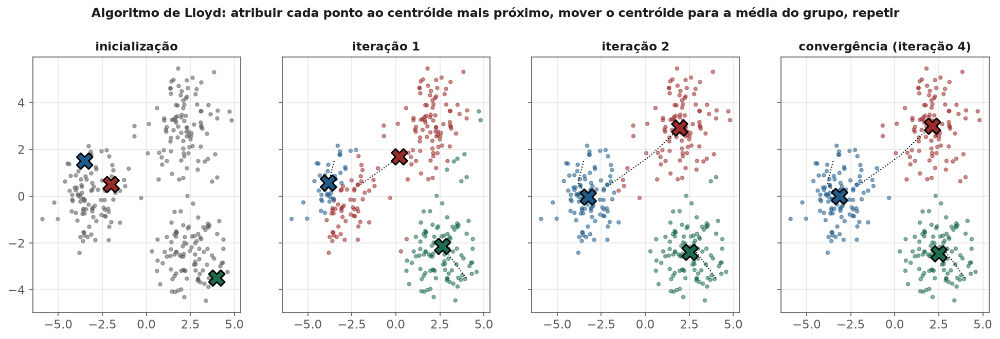
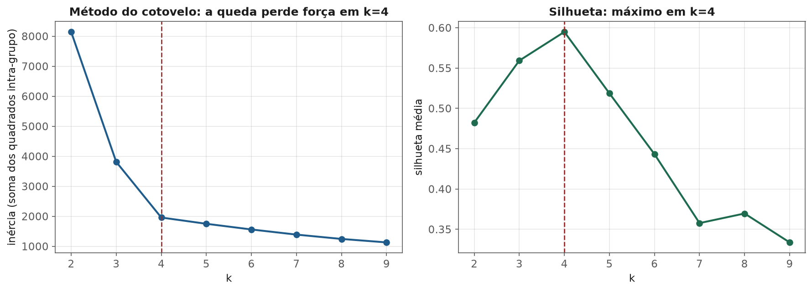
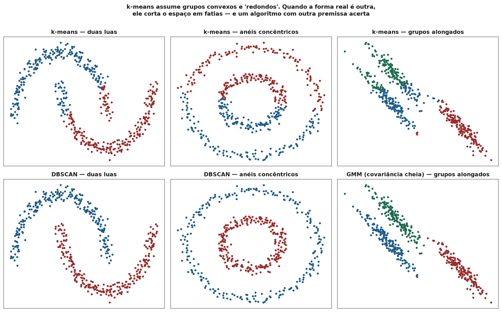
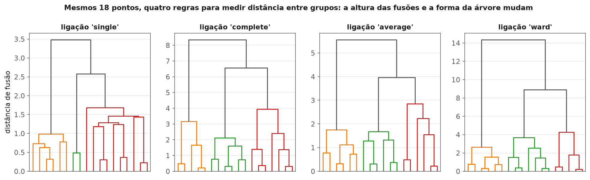
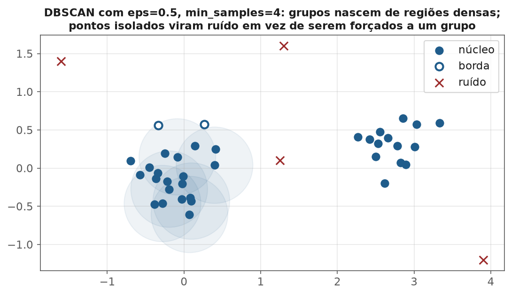
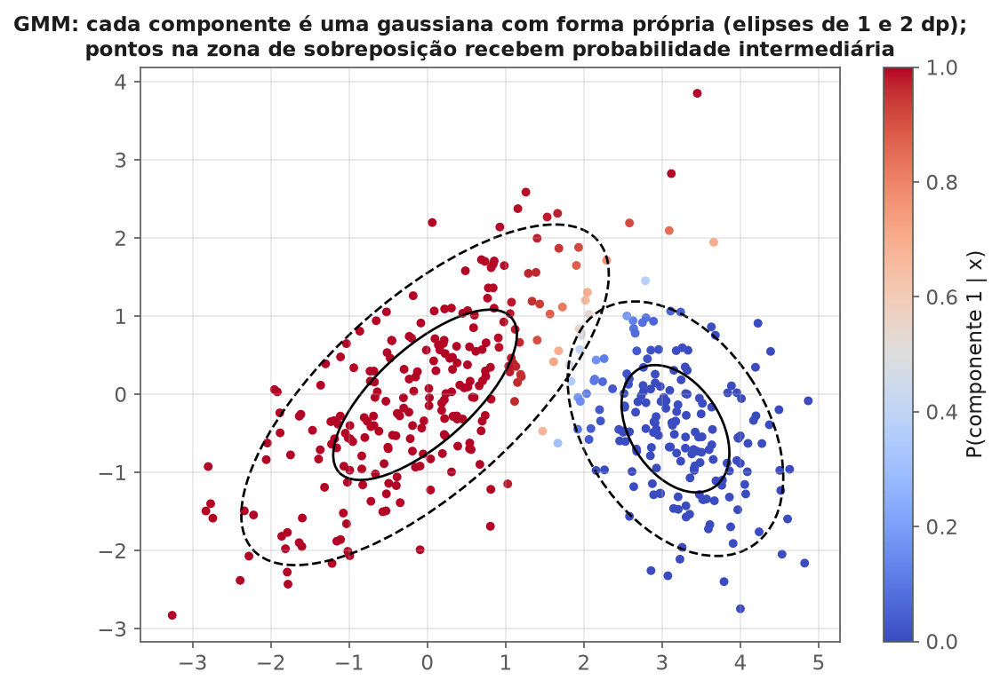

<!-- tema: Aprendizado Não Supervisionado > Clustering -->
<!-- subtitulo: Encontrar grupos que ninguém rotulou — e provar que eles significam alguma coisa -->
<!-- resumo: Clustering é a tarefa de agrupar observações parecidas sem que ninguém diga quais são os grupos certos. Isso o torna ao mesmo tempo uma das ferramentas mais usadas do mercado (segmentação de clientes, organização de catálogos, triagem de documentos) e uma das mais fáceis de usar mal: todo algoritmo de clustering SEMPRE devolve grupos, mesmo quando não existe estrutura nenhuma nos dados. Este material cobre a escolha da distância, k-means do algoritmo de Lloyd ao k-means++, os critérios para escolher k (cotovelo, silhueta, Calinski-Harabasz, Davies-Bouldin, BIC), clustering hierárquico e seus critérios de ligação, DBSCAN e HDBSCAN para grupos de forma arbitrária, misturas gaussianas e o algoritmo EM, e fecha com um protocolo de avaliação e um caso real de segmentação de clientes. -->
<!-- nivel: Intermediário — abre o tema de Aprendizado Não Supervisionado -->
<!-- prerequisitos: Estatística Descritiva e Distribuições (tema 1); Vetores e Projeções (tema 2); Escalonamento e Feature Engineering (tema 3) -->
<!-- duracao: 12 a 14 horas (leitura + 4 notebooks) -->
<!-- notebooks: 01-kmeans · 02-hierarquico-e-dbscan · 03-gmm-e-avaliacao · 04-caso-real-segmentacao · 99-exercicios -->
<!-- autor: Material do curso de ML & DL -->
<!-- versao: 1.0 -->

# Clustering

## Por que este módulo existe

Todo o tema anterior partiu de um privilégio: existia uma coluna $y$ dizendo
a resposta certa para cada linha. O modelo aprendia comparando sua previsão
com essa resposta, e a métrica de avaliação era uma conta direta — acertou
ou errou. Em **aprendizado não supervisionado** esse privilégio desaparece.
Não há rótulo, não há resposta certa, e a pergunta muda de "qual o valor de
$y$ para este cliente?" para "que **estrutura** existe nestes dados que eu
ainda não conheço?".

Clustering é a forma mais comum dessa pergunta: dividir as observações em
grupos tais que observações do mesmo grupo sejam parecidas entre si e
diferentes das de outros grupos. A definição parece simples, mas cada palavra
esconde uma decisão: "parecidas" segundo qual distância? "Grupos" de que
forma — esferas, faixas, regiões densas de formato qualquer? Quantos grupos?
E, o mais difícil, como saber se o resultado **significa** alguma coisa?

> [!ANALOGIA] Imagine receber 5.000 fotos de animais sem legenda e ter de
> organizá-las em pastas. Você pode separar por espécie, por cor da pelagem,
> por ambiente (água, terra, ar), ou por tamanho — todas são organizações
> "corretas", e cada uma serve a um propósito diferente. Clustering é
> exatamente isso: o algoritmo encontra **uma** organização possível, guiado
> pela distância que você escolheu. Não existe a organização verdadeira à
> espera de ser descoberta; existe a organização útil para o que você
> pretende fazer com ela.

> [!ARMADILHA] Todo algoritmo de clustering **sempre devolve grupos** —
> inclusive quando aplicado a ruído puro, sem estrutura nenhuma. Pedir
> `KMeans(n_clusters=5)` sobre dados uniformemente espalhados produz cinco
> grupos arrumadinhos, com centróides, tamanhos e perfis médios que parecem
> perfeitamente interpretáveis. O algoritmo não tem como dizer "não há grupos
> aqui". Essa responsabilidade é sua, e o capítulo de avaliação deste módulo
> existe para dar as ferramentas para exercê-la.

Onde clustering aparece no mercado:

- **Segmentação de clientes** — agrupar clientes por comportamento de compra
  (recência, frequência, valor) para desenhar ações de marketing distintas.
- **Organização de catálogo** — agrupar produtos, músicas ou artigos por
  similaridade de conteúdo ou de padrão de consumo.
- **Triagem de documentos e tickets** — agrupar reclamações de clientes por
  tema antes de alguém ler uma por uma.
- **Pré-processamento** — usar o grupo de cada observação como feature de um
  modelo supervisionado, ou para estratificar amostras.
- **Detecção de anomalias** — pontos longe de qualquer grupo são candidatos a
  anomalia (tema do módulo 3).

### O que você vai conseguir fazer ao final

- Escolher a medida de distância e o escalonamento **antes** do algoritmo, e
  explicar por que essa escolha costuma pesar mais que a do próprio
  algoritmo.
- Executar o algoritmo de Lloyd (k-means) à mão num exemplo pequeno e
  explicar por que ele converge para mínimos locais — e como o k-means++
  mitiga isso.
- Escolher $k$ combinando cotovelo, silhueta, Calinski-Harabasz,
  Davies-Bouldin e BIC, sabendo o que cada critério premia.
- Usar clustering hierárquico, DBSCAN e misturas gaussianas, reconhecendo a
  premissa geométrica de cada um e o tipo de dado em que cada um vence.
- Avaliar um agrupamento sem rótulos (índices internos, estabilidade) e com
  rótulos parciais (ARI, NMI) — e, principalmente, pela utilidade de negócio.

---

## Distância: a decisão que vem antes do algoritmo

Todo método deste módulo depende de uma noção de "parecido", e essa noção é
uma **medida de distância** (ou de similaridade) entre dois vetores de
features $\mathbf{x}$ e $\mathbf{z}$. As três mais usadas:

$$d_{euclid}(\mathbf{x}, \mathbf{z}) = \sqrt{\sum_{j=1}^{p} (x_j - z_j)^2} \qquad d_{manhattan}(\mathbf{x}, \mathbf{z}) = \sum_{j=1}^{p} |x_j - z_j|$$

$$d_{cosseno}(\mathbf{x}, \mathbf{z}) = 1 - \frac{\mathbf{x} \cdot \mathbf{z}}{\|\mathbf{x}\| \, \|\mathbf{z}\|}$$

- **Euclidiana**: a distância "em linha reta" do tema 2. É a premissa
  implícita do k-means (que minimiza distâncias euclidianas ao quadrado).
- **Manhattan**: soma das diferenças absolutas; menos sensível a uma única
  feature com diferença enorme, porque não eleva ao quadrado.
- **Cosseno**: mede o **ângulo** entre os vetores, ignorando o comprimento.
  É a escolha natural para texto (tema 9) e para perfis de consumo, onde
  importa a *proporção* entre as features, não o volume total.

### Escala: o erro mais comum de todo o módulo

Considere dois clientes descritos por idade (anos) e renda mensal (reais):
$A = (25, 5.000)$, $B = (60, 5.200)$ e um terceiro $C = (26, 9.000)$. Qual é
mais parecido com $A$?

$$d(A, B) = \sqrt{35^2 + 200^2} = \sqrt{1.225 + 40.000} \approx 203$$

$$d(A, C) = \sqrt{1^2 + 4.000^2} \approx 4.000$$

Na escala original, $B$ (35 anos mais velho) é considerado **vinte vezes
mais parecido** com $A$ do que $C$ (um ano de diferença), só porque a renda
está medida em unidades que produzem números grandes. A idade praticamente
não participa da distância. Depois de padronizar cada coluna (tema 3,
módulo 4) — digamos, com desvio-padrão de 12 anos para idade e R\$ 2.500 para
renda — as diferenças viram $A$–$B$: $(2{,}92;\ 0{,}08)$ e $A$–$C$:
$(0{,}08;\ 1{,}60)$, e o veredito se inverte: $d(A,B) \approx 2{,}92$ e
$d(A,C) \approx 1{,}60$.

> [!ARMADILHA] Rodar k-means, hierárquico ou DBSCAN sobre features em
> escalas diferentes não é "um pouco pior" — é agrupar por **uma única
> coluna**, a de maior variância numérica. O sintoma típico é um
> agrupamento em que os perfis médios dos grupos diferem quase só em renda,
> faturamento ou alguma outra coluna monetária. Padronize (ou transforme com
> log e depois padronize, se a coluna for muito assimétrica) **antes** de
> qualquer método baseado em distância.

> [!NOTA] Padronizar não é neutro: dá a cada feature o **mesmo peso** na
> distância. Se você tem 12 features de comportamento digital e 2 de
> perfil demográfico, o agrupamento será dominado pelo comportamento digital
> simplesmente porque ele tem mais colunas. Escolher quais features entram,
> e com que peso, é uma decisão de modelagem com consequência direta nos
> grupos — não um detalhe técnico. Redução de dimensionalidade (módulo 2)
> ajuda quando há muitas features correlacionadas.

## k-means: o algoritmo de Lloyd

k-means é o algoritmo de clustering mais usado do mundo, e sua formulação é
um problema de otimização explícito. Dado $k$, procura-se a partição dos
dados em grupos $C_1, \dots, C_k$ que minimiza a **inércia** — a soma dos
quadrados das distâncias de cada ponto ao centróide do seu grupo:

> [!FORMULA] Objetivo do k-means (inércia, ou WCSS — *within-cluster sum of
> squares*):
>
> $$J(C_1, \dots, C_k) = \sum_{c=1}^{k} \sum_{\mathbf{x}_i \in C_c} \|\mathbf{x}_i - \boldsymbol{\mu}_c\|^2, \qquad \boldsymbol{\mu}_c = \frac{1}{|C_c|}\sum_{\mathbf{x}_i \in C_c} \mathbf{x}_i$$
>
> Encontrar o mínimo global dessa função é NP-difícil. O algoritmo de Lloyd
> encontra um mínimo **local** alternando dois passos, cada um dos quais
> nunca aumenta $J$.

O algoritmo de Lloyd:

1. **Inicialização:** escolha $k$ centróides iniciais.
2. **Passo de atribuição:** atribua cada ponto ao centróide mais próximo.
3. **Passo de atualização:** recalcule cada centróide como a média dos
   pontos atribuídos a ele.
4. Repita 2 e 3 até que nenhuma atribuição mude.

Por que converge? O passo 2 minimiza $J$ sobre as atribuições com os
centróides fixos (cada ponto escolhe o termo menor possível); o passo 3
minimiza $J$ sobre os centróides com as atribuições fixas (a média é o ponto
que minimiza a soma de quadrados — o mesmo resultado do tema 1 sobre a média
como estimador de mínimos quadrados). Como $J$ nunca sobe e existe um
número finito de partições, o algoritmo sempre para.

### Um exemplo numérico, na mão

Seis pontos em uma dimensão: $x = [1, 2, 4, 7, 9, 10]$, com $k=2$ e
centróides iniciais $\mu_1 = 1$ e $\mu_2 = 4$.

**Iteração 1 — atribuição.** O ponto 2 fica com $\mu_1$ (distância 1 contra
2); o ponto 7 fica com $\mu_2$ (distância 3 contra 6). Grupos: $\{1, 2\}$ e
$\{4, 7, 9, 10\}$. **Atualização:** $\mu_1 = 1{,}5$ e
$\mu_2 = (4+7+9+10)/4 = 7{,}5$. Inércia:

$$J = (0{,}5^2 + 0{,}5^2) + (3{,}5^2 + 0{,}5^2 + 1{,}5^2 + 2{,}5^2) = 0{,}5 + 21 = 21{,}5$$

**Iteração 2 — atribuição.** O ponto 4 agora está a 2,5 de $\mu_1$ e a 3,5
de $\mu_2$: **muda de grupo**. Grupos: $\{1, 2, 4\}$ e $\{7, 9, 10\}$.
**Atualização:** $\mu_1 = 7/3 \approx 2{,}33$ e $\mu_2 = 26/3 \approx 8{,}67$.

$$J = (1{,}78 + 0{,}11 + 2{,}78) + (2{,}78 + 0{,}11 + 1{,}78) \approx 9{,}33$$

**Iteração 3.** O ponto 4 está a 1,67 de $\mu_1$ e a 4,67 de $\mu_2$; o 7
está a 4,67 de $\mu_1$ e a 1,67 de $\mu_2$. Nenhuma atribuição muda: o
algoritmo convergiu, com a inércia caindo de 21,5 para 9,33.

### Mínimos locais e o k-means++

O resultado do algoritmo de Lloyd depende da inicialização. Com centróides
iniciais ruins — dois deles caindo no mesmo grupo natural, por exemplo — ele
pode convergir para uma partição claramente pior, e **nunca** sair dela,
porque cada passo só desce localmente.

> [!DEFINICAO] **k-means++** (Arthur & Vassilvitskii, 2007) escolhe os
> centróides iniciais de forma espalhada: o primeiro é sorteado
> uniformemente entre os pontos; cada centróide seguinte é sorteado com
> probabilidade proporcional a $D(\mathbf{x})^2$, o quadrado da distância de
> cada ponto ao centróide já escolhido mais próximo. Pontos longe de todos os
> centróides existentes têm muito mais chance de virar o próximo centróide.
> O resultado tem garantia teórica: a inércia esperada fica a no máximo um
> fator $O(\log k)$ do ótimo global — antes mesmo de rodar Lloyd.

Na prática, o `scikit-learn` combina duas defesas: `init="k-means++"` (o
padrão) e `n_init`, que roda o algoritmo inteiro várias vezes com
inicializações diferentes e fica com a de menor inércia.

> [!MERCADO] Em bases de milhões de clientes, rodar k-means completo várias
> vezes custa caro: cada iteração é $O(n \cdot k \cdot p)$. A variante
> `MiniBatchKMeans` atualiza os centróides com pequenos lotes aleatórios em
> vez da base inteira, trocando uma inércia ligeiramente pior (tipicamente
> poucos por cento) por uma redução de tempo de uma ou duas ordens de
> grandeza. É a versão usada em pipelines de segmentação que recalculam os
> grupos diariamente.

## Escolhendo k

k-means exige $k$ como entrada, e a inércia **sempre diminui** quando $k$
aumenta — no limite, com $k = n$, cada ponto é seu próprio centróide e
$J = 0$. Por isso, minimizar a inércia não serve para escolher $k$. Os
critérios abaixo tentam equilibrar coesão interna e separação entre grupos.

### Método do cotovelo

Plote a inércia em função de $k$ e procure o ponto em que a queda perde
força — o "cotovelo". Antes dele, cada grupo a mais separa grupos naturais
que estavam fundidos (grande ganho); depois dele, cada grupo a mais só corta
um grupo natural ao meio (ganho pequeno).

No conjunto de 600 pontos gerados com 4 grupos verdadeiros usado na figura
abaixo, a inércia cai de 8.144 ($k=2$) para 3.813 ($k=3$) e 1.959 ($k=4$) —
e depois só para 1.750 ($k=5$) e 1.561 ($k=6$). A queda de $k=3$ para $k=4$
é de 1.854; de $k=4$ para $k=5$, só 209. O cotovelo está em $k=4$.

### Coeficiente de silhueta

> [!FORMULA] Para cada ponto $i$, seja $a(i)$ a distância média de $i$ aos
> outros pontos do **seu** grupo e $b(i)$ a menor distância média de $i$ aos
> pontos de **outro** grupo (o grupo vizinho mais próximo). A silhueta do
> ponto é:
>
> $$s(i) = \frac{b(i) - a(i)}{\max\{a(i),\ b(i)\}}, \qquad -1 \leq s(i) \leq 1$$
>
> $s(i)$ perto de 1: o ponto está bem dentro do seu grupo e longe do
> vizinho. Perto de 0: está na fronteira. Negativo: estaria melhor no grupo
> vizinho. A **silhueta média** sobre todos os pontos resume o agrupamento
> inteiro.

**Exemplo numérico**, com o resultado final do exemplo de Lloyd (grupos
$\{1, 2, 4\}$ e $\{7, 9, 10\}$). Para o ponto 4:
$a = (|4-1| + |4-2|)/2 = 2{,}5$ e
$b = (|4-7| + |4-9| + |4-10|)/3 \approx 4{,}67$, logo
$s = (4{,}67 - 2{,}5)/4{,}67 \approx 0{,}46$. Para o ponto 1:
$a = (1 + 3)/2 = 2$ e $b = (6 + 8 + 9)/3 \approx 7{,}67$, logo
$s \approx 0{,}74$. O ponto 4, mais perto da fronteira, tem silhueta menor —
exatamente o que a intuição espera.

> [!NOTA] Nos mesmos dados, a silhueta média foi 0,482 para $k=2$, 0,559
> para $k=3$, **0,595 para $k=4$**, e depois caiu para 0,519 ($k=5$) e 0,443
> ($k=6$). Silhueta tem um custo: calcular $a(i)$ e $b(i)$ exige todas as
> distâncias par a par, $O(n^2)$. Para bases grandes, calcule-a numa amostra
> aleatória de alguns milhares de pontos (`silhouette_score(...,
> sample_size=5000)`).

### Outros índices internos

> [!FORMULA] **Calinski-Harabasz** (maior é melhor) — razão entre a
> dispersão *entre* grupos e a dispersão *dentro* dos grupos, cada uma
> dividida por seus graus de liberdade:
>
> $$CH = \frac{\operatorname{tr}(B_k)/(k-1)}{\operatorname{tr}(W_k)/(n-k)}$$
>
> onde $\operatorname{tr}(W_k)$ é a própria inércia e $\operatorname{tr}(B_k) = \sum_c |C_c| \, \|\boldsymbol{\mu}_c - \boldsymbol{\mu}\|^2$
> mede a distância dos centróides à média global. É a estatística F da
> ANOVA (tema 1) aplicada aos grupos.
>
> **Davies-Bouldin** (menor é melhor) — para cada grupo, o pior caso de
> "espalhamento relativo à separação" com relação a qualquer outro grupo:
>
> $$DB = \frac{1}{k}\sum_{c=1}^{k} \max_{c' \neq c} \frac{s_c + s_{c'}}{d(\boldsymbol{\mu}_c, \boldsymbol{\mu}_{c'})}$$
>
> onde $s_c$ é a distância média dos pontos do grupo $c$ ao seu centróide.

> [!ARMADILHA] Todos esses índices premiam grupos **compactos e
> convexos** — a mesma premissa do k-means. Aplicados a um resultado de
> DBSCAN com grupos em forma de lua ou anel (próximo capítulo), eles podem
> apontar o agrupamento *errado* como melhor. Um índice interno não mede "a
> verdade"; mede o quão bem o resultado satisfaz a noção de grupo embutida
> no índice.

> [!MERCADO] Na prática de segmentação, o $k$ final quase nunca é o que
> maximiza um índice — é o maior $k$ que o negócio consegue **operar**. Se
> o time de CRM tem capacidade para desenhar e manter cinco réguas de
> comunicação distintas, um agrupamento com nove segmentos é inútil, por
> melhor que seja sua silhueta. Os índices servem para descartar valores de
> $k$ claramente ruins e para detectar a ausência de estrutura; a escolha
> entre os valores razoáveis restantes é uma decisão de negócio.

## Onde k-means falha

k-means atribui cada ponto ao centróide mais próximo, e isso divide o
espaço em **células de Voronoi** — regiões convexas separadas por
hiperplanos. Daí seguem premissas implícitas que o algoritmo nunca anuncia:

- **Grupos convexos e aproximadamente esféricos.** Uma lua, um anel ou uma
  faixa curva não cabem numa célula convexa.
- **Variância parecida entre grupos.** Um grupo muito espalhado ao lado de
  um grupo compacto tem sua borda "roubada" pelo centróide vizinho.
- **Tamanhos não muito desiguais.** A inércia é uma soma sobre pontos;
  mover a fronteira para dentro de um grupo grande reduz mais a soma do que
  preservar um grupo pequeno inteiro.
- **Toda observação pertence a algum grupo.** Não existe a noção de ruído:
  um outlier é forçado para o grupo mais próximo e puxa seu centróide.

> [!NOTA] "Falhar" aqui significa não recuperar os grupos que *nós*
> desenhamos. Do ponto de vista do seu próprio objetivo, o k-means não
> falhou — ele encontrou uma partição de baixa inércia. Por isso a escolha
> do algoritmo é, no fundo, a escolha de uma **definição de grupo**: esferas
> em torno de centros (k-means), regiões densas conectadas (DBSCAN) ou
> distribuições de probabilidade com forma própria (GMM).

## Clustering hierárquico

Em vez de uma partição com $k$ fixo, o clustering hierárquico constrói uma
**árvore de partições**. A versão aglomerativa (a mais usada):

1. Comece com cada ponto como seu próprio grupo ($n$ grupos).
2. Encontre os dois grupos mais próximos e funda-os.
3. Repita até restar um único grupo.

O registro dessas fusões, com a distância em que cada uma ocorreu, é o
**dendrograma**. Cortar o dendrograma numa altura $h$ produz a partição com
os grupos que existiam naquela distância — e escolher $k$ vira escolher
onde cortar, **depois** de ver a árvore inteira.

### Critérios de ligação

"Os dois grupos mais próximos" exige definir distância entre **grupos**,
não entre pontos. Cada definição é um critério de ligação:

> [!FORMULA] Para grupos $A$ e $B$:
>
> $$d_{single}(A,B) = \min_{a \in A,\ b \in B} d(a,b) \qquad d_{complete}(A,B) = \max_{a \in A,\ b \in B} d(a,b)$$
>
> $$d_{average}(A,B) = \frac{1}{|A|\,|B|}\sum_{a \in A}\sum_{b \in B} d(a,b) \qquad \Delta_{ward}(A,B) = \frac{|A|\,|B|}{|A|+|B|}\,\|\boldsymbol{\mu}_A - \boldsymbol{\mu}_B\|^2$$
>
> Ward funde o par que **menos aumenta a inércia total** — é o critério
> hierárquico mais parecido com o k-means.

**Exemplo numérico.** Grupos $A = \{1, 2\}$ e $B = \{4, 7\}$ na reta.
Single: menor distância $= |2 - 4| = 2$. Complete: maior distância
$= |1 - 7| = 6$. Average: média de $\{3, 6, 2, 5\} = 4$. Ward:
$\frac{2 \cdot 2}{4}(1{,}5 - 5{,}5)^2 = 1 \cdot 16 = 16$ — a inércia do grupo
fundido ($\{1,2,4,7\}$, média 3,5, inércia 21) menos as inércias de $A$
(0,5) e de $B$ (4,5).

- **Single**: acompanha formas alongadas e curvas, mas sofre de
  **encadeamento** — uma ponte de poucos pontos basta para fundir dois
  grupos inteiros.
- **Complete**: produz grupos compactos, de diâmetro parecido; sensível a
  outliers (o máximo é dominado pelo ponto mais distante).
- **Average**: meio-termo entre os dois.
- **Ward**: o padrão do `scikit-learn`; grupos compactos de tamanho
  equilibrado, com as mesmas premissas do k-means.

> [!ARMADILHA] O clustering aglomerativo guarda a matriz de distâncias
> par a par: memória $O(n^2)$. Com 100.000 pontos, são $10^{10}$ pares — cerca
> de 40 GB em precisão simples. O método é excelente para até algumas dezenas
> de milhares de pontos e para **explorar** a estrutura (o dendrograma é uma
> visualização muito informativa), mas não escala para bases de milhões de
> linhas sem amostragem.

> [!MERCADO] Hierárquico é o método natural quando a própria estrutura
> hierárquica interessa: taxonomia de produtos (categoria → subcategoria →
> linha), agrupamento de genes por perfil de expressão, organização de
> documentos jurídicos por tema e subtema. Um único dendrograma responde
> "quais são os 3 grandes grupos?" e "quais são os 12 subgrupos?" sem
> retreinar nada.

## DBSCAN: grupos como regiões densas

DBSCAN (*Density-Based Spatial Clustering of Applications with Noise*,
Ester et al., 1996) troca a pergunta "qual o centro mais próximo?" por
"este ponto está numa região densa?". Tem dois hiperparâmetros: o raio
$\varepsilon$ (`eps`) e o número mínimo de pontos `min_samples`.

> [!DEFINICAO] Seja $N_\varepsilon(\mathbf{x})$ o conjunto de pontos a
> distância até $\varepsilon$ de $\mathbf{x}$ (incluindo o próprio
> $\mathbf{x}$).
>
> - **Ponto-núcleo:** $|N_\varepsilon(\mathbf{x})| \geq$ `min_samples`.
> - **Ponto de borda:** não é núcleo, mas está a até $\varepsilon$ de algum
>   ponto-núcleo.
> - **Ruído:** nem núcleo, nem borda.
>
> Um grupo é um conjunto maximal de pontos-núcleo conectados entre si por
> cadeias de vizinhanças, mais os pontos de borda alcançados por eles.

**Exemplo numérico.** Pontos na reta: $[1;\ 1{,}5;\ 2;\ 2{,}2;\ 5;\ 8;\ 8{,}3;\ 8{,}5]$,
com $\varepsilon = 0{,}6$ e `min_samples` $=3$.

- O ponto 1,5 tem na vizinhança $\{1;\ 1{,}5;\ 2\}$: 3 pontos — **núcleo**.
  O ponto 2 tem $\{1{,}5;\ 2;\ 2{,}2\}$ — **núcleo**.
- O ponto 1 tem só $\{1;\ 1{,}5\}$, mas está a 0,5 do núcleo 1,5 —
  **borda**. O ponto 2,2 tem $\{2;\ 2{,}2\}$ e está a 0,2 do núcleo 2 —
  **borda**.
- 8, 8,3 e 8,5 estão todos a até 0,5 uns dos outros: três **núcleos**.
- O ponto 5 não tem ninguém a menos de 0,6: **ruído**.

Resultado: dois grupos, $\{1;\ 1{,}5;\ 2;\ 2{,}2\}$ e $\{8;\ 8{,}3;\ 8{,}5\}$, e um
ponto de ruído. O número de grupos **não foi informado** ao algoritmo — ele
emergiu da densidade.

Vantagens diretas sobre k-means: encontra grupos de **forma arbitrária**,
não exige $k$, e tem uma noção explícita de **ruído** — pontos que não
pertencem a grupo nenhum, em vez de serem forçados ao grupo mais próximo.

### Escolhendo eps: o gráfico da k-distância

Para cada ponto, calcule a distância ao seu $k$-ésimo vizinho mais próximo
(com $k$ = `min_samples`), ordene esses valores e plote. Pontos dentro de
grupos têm $k$-distância pequena; pontos de ruído, grande. O "joelho" da
curva — onde ela sobe abruptamente — é um bom candidato para
$\varepsilon$. Uma regra prática para `min_samples` é algo entre $p+1$ e
$2p$, onde $p$ é o número de features.

> [!ARMADILHA] DBSCAN usa **um único** $\varepsilon$ para o espaço inteiro.
> Se os grupos têm densidades muito diferentes — um grupo compacto de
> clientes corporativos ao lado de um grupo esparso de pessoas físicas —,
> qualquer $\varepsilon$ falha: pequeno demais fragmenta o grupo esparso em
> ruído; grande demais funde grupos compactos vizinhos. Além disso, em alta
> dimensão as distâncias se concentram (a maldição da dimensionalidade do
> tema 4), e a noção de "vizinhança densa" perde contraste.

> [!NOTA] **HDBSCAN** (Campello, Moulavi & Sander, 2013; disponível como
> `sklearn.cluster.HDBSCAN`) resolve o problema das densidades diferentes:
> roda DBSCAN para *todos* os valores de $\varepsilon$ ao mesmo tempo,
> constrói uma hierarquia de grupos por densidade e extrai os grupos mais
> **estáveis** ao longo dessa hierarquia. O único hiperparâmetro importante
> passa a ser `min_cluster_size`, muito mais fácil de escolher que
> $\varepsilon$ — por isso HDBSCAN virou a escolha padrão de muitos times
> para clustering baseado em densidade.

## Misturas gaussianas e o algoritmo EM

k-means dá a cada ponto uma atribuição **dura**: pertence a exatamente um
grupo. Um **modelo de mistura gaussiana** (GMM) supõe que os dados foram
gerados por $K$ distribuições normais multivariadas, cada uma com média,
covariância e peso próprios, e dá a cada ponto uma **probabilidade** de ter
vindo de cada componente.

> [!FORMULA] Densidade de uma mistura de $K$ gaussianas:
>
> $$p(\mathbf{x}) = \sum_{k=1}^{K} \pi_k \, \mathcal{N}(\mathbf{x} \mid \boldsymbol{\mu}_k, \boldsymbol{\Sigma}_k), \qquad \sum_{k} \pi_k = 1$$
>
> Os parâmetros $\pi_k$ (pesos), $\boldsymbol{\mu}_k$ (médias) e
> $\boldsymbol{\Sigma}_k$ (covariâncias) são estimados por máxima
> verossimilhança (tema 1, módulo 3) — mas a verossimilhança de uma mistura
> não tem solução fechada, e é aí que entra o EM.

### O algoritmo EM (Expectation-Maximization)

Alterna dois passos, numa estrutura idêntica à do algoritmo de Lloyd:

> [!FORMULA] **Passo E** — com os parâmetros atuais, calcule a
> **responsabilidade** de cada componente por cada ponto (a probabilidade a
> posteriori, pelo teorema de Bayes do tema 1):
>
> $$\gamma_{ik} = \frac{\pi_k \, \mathcal{N}(\mathbf{x}_i \mid \boldsymbol{\mu}_k, \boldsymbol{\Sigma}_k)}{\sum_{j=1}^{K} \pi_j \, \mathcal{N}(\mathbf{x}_i \mid \boldsymbol{\mu}_j, \boldsymbol{\Sigma}_j)}$$
>
> **Passo M** — reestime cada componente como uma média **ponderada** pelas
> responsabilidades, com $N_k = \sum_i \gamma_{ik}$:
>
> $$\boldsymbol{\mu}_k = \frac{1}{N_k}\sum_{i} \gamma_{ik}\,\mathbf{x}_i \qquad \boldsymbol{\Sigma}_k = \frac{1}{N_k}\sum_{i} \gamma_{ik}\,(\mathbf{x}_i - \boldsymbol{\mu}_k)(\mathbf{x}_i - \boldsymbol{\mu}_k)^T \qquad \pi_k = \frac{N_k}{n}$$
>
> Cada iteração nunca diminui a verossimilhança. Assim como Lloyd, EM
> converge para um ótimo **local** — daí o `n_init` também no
> `GaussianMixture`.

**Exemplo numérico do passo E.** Em uma dimensão, duas componentes
$\mathcal{N}(0, 1)$ e $\mathcal{N}(4, 1)$, com pesos iguais. Para o ponto
$x = 1{,}5$: a densidade da primeira é $\varphi(1{,}5) \approx 0{,}1295$ e a
da segunda é $\varphi(1{,}5 - 4) = \varphi(-2{,}5) \approx 0{,}0175$. Então

$$\gamma_{1} = \frac{0{,}1295}{0{,}1295 + 0{,}0175} \approx 0{,}88$$

— o ponto é atribuído 88% à primeira componente e 12% à segunda. Para
$x = 2$, exatamente no meio, as duas densidades são iguais e
$\gamma_1 = 0{,}5$: o GMM declara incerteza total, algo que o k-means não
tem como expressar.

> [!NOTA] **k-means é um caso-limite do GMM.** Se todas as componentes têm a
> mesma covariância esférica $\sigma^2 I$ e $\sigma \to 0$, as
> responsabilidades viram 0 ou 1 (cada ponto é inteiramente do componente
> mais próximo) e o passo M vira o cálculo de médias do Lloyd. O GMM
> generaliza o k-means em duas direções: forma (elipses com orientação
> própria) e incerteza (atribuição suave).

### Tipos de covariância e escolha de K pelo BIC

O parâmetro `covariance_type` controla a flexibilidade de cada componente:
`spherical` (uma variância por componente — círculos), `diag` (elipses
alinhadas aos eixos), `tied` (todas as componentes com a mesma elipse) e
`full` (cada componente com sua elipse de orientação livre). Mais
flexibilidade significa mais parâmetros e mais risco de sobreajuste.

> [!FORMULA] Como o GMM é um modelo probabilístico, $K$ pode ser escolhido
> por um critério de informação que penaliza o número de parâmetros $q$:
>
> $$\text{BIC} = q \ln n - 2 \ln \hat{L}$$
>
> Para covariância `full` em $p$ dimensões: $q = Kp + K\frac{p(p+1)}{2} + (K-1)$.
> Com $p = 2$ e $K = 3$, são $6 + 9 + 2 = 17$ parâmetros. Escolhe-se o $K$
> (e o `covariance_type`) de **menor** BIC.

> [!MERCADO] A pertinência suave é valiosa quando a decisão de negócio
> tolera ambiguidade. Um varejista que segmenta clientes em "caçadores de
> promoção" e "fiéis à marca" pode tratar um cliente com 55%/45% de forma
> diferente de um com 98%/2% — por exemplo, mandando para o cliente ambíguo
> uma comunicação neutra, e reservando a oferta agressiva para quem o modelo
> tem certeza de ser sensível a preço. Com k-means, os dois clientes
> receberiam o mesmo rótulo e a mesma ação.

## Avaliando um agrupamento

Sem rótulo, não existe acurácia. A avaliação de um agrupamento combina
quatro perspectivas, e nenhuma delas sozinha é suficiente.

**1. Índices internos** (silhueta, Calinski-Harabasz, Davies-Bouldin):
medem coesão e separação usando só os dados. Úteis para comparar $k$ e para
detectar ausência de estrutura (silhueta média abaixo de ~0,25 costuma
indicar grupos pouco distintos), mas carregam a premissa de grupos convexos.

**2. Índices externos**, quando existe um rótulo de referência para uma
parte dos dados (uma amostra rotulada manualmente, uma classificação
antiga):

> [!FORMULA] **ARI** (*Adjusted Rand Index*): proporção de pares de pontos
> em que as duas partições concordam (juntos em ambas ou separados em
> ambas), **corrigida pelo acaso** — vale 0 para uma partição aleatória e 1
> para concordância perfeita, podendo ser negativo. **NMI** (*Normalized
> Mutual Information*): a informação mútua entre as duas partições,
> normalizada para $[0, 1]$. Ambos são invariantes à permutação dos nomes
> dos grupos — o "grupo 1" de um e o "grupo 3" do outro podem ser o mesmo.

**3. Estabilidade**: um agrupamento que significa algo deve sobreviver a
pequenas perturbações. Reamostre os dados (bootstrap, tema 1), reagrupe, e
compare as partições com ARI. Grupos que aparecem e desaparecem entre
reamostragens são artefatos do algoritmo, não estrutura dos dados.

**4. Utilidade**: os grupos diferem em algo que importa e que **não** foi
usado para formá-los? Clientes agrupados por comportamento de navegação
deveriam, se os grupos forem reais, diferir também em taxa de conversão,
ticket médio ou churn — variáveis que ficaram de fora do agrupamento. Essa
**validação externa por variável de desfecho** é, no mercado, o teste mais
convincente de todos.

> [!ARMADILHA] Um erro sutil é usar a mesma variável para formar e para
> validar os grupos: agrupar clientes por valor gasto e depois "descobrir"
> que os grupos diferem em valor gasto. Isso não valida nada — é tautologia.
> Reserve as variáveis de desfecho para a validação.

### Resumo: qual algoritmo para qual situação

| Algoritmo | Definição de grupo | Precisa de k? | Ruído | Escala | Use quando |
| :-- | :-- | :-: | :-: | :-- | :-- |
| k-means | esfera em torno de um centro | sim | não | milhões (MiniBatch) | grupos compactos, base grande, baseline |
| Hierárquico (Ward) | fusões de menor custo | corte depois | não | até ~20 mil | quer a hierarquia, base pequena |
| Hierárquico (single) | cadeia de vizinhos | corte depois | não | até ~20 mil | formas alongadas, sem pontes de ruído |
| DBSCAN | região densa conectada | não | sim | centenas de milhares | formas arbitrárias, densidade uniforme |
| HDBSCAN | região densa estável | não | sim | centenas de milhares | densidades diferentes entre grupos |
| GMM | distribuição gaussiana | sim (BIC) | não | centenas de milhares | quer probabilidades, grupos elípticos |

## Caso real: segmentação de clientes

O notebook `04-caso-real-segmentacao` percorre um caso completo; aqui está
o protocolo, que vale para qualquer segmentação.

1. **Defina a pergunta de negócio antes das features.** "Quero réguas de
   comunicação diferentes por perfil de compra" leva a features de
   comportamento; "quero planejar lojas por perfil regional" leva a
   features geográficas e demográficas.
2. **Construa as features RFM** (tema 3, módulo 3) — *Recência* (dias
   desde a última compra), *Frequência* (número de pedidos) e *Valor*
   (gasto total) — e outras de comportamento relevantes.
3. **Trate a assimetria e a escala.** Frequência e valor têm cauda longa:
   aplique $\log(1 + x)$ e depois padronize. Sem isso, os poucos clientes de
   valor altíssimo viram grupos de um ou dois pontos.
4. **Agrupe com vários $k$** e compare silhueta, cotovelo e, principalmente,
   o **perfil** de cada grupo (médias das features na escala original).
5. **Nomeie os grupos.** Se não for possível dar um nome de negócio a um
   grupo ("fiéis de alto valor", "novos promissores", "em risco de
   abandono", "hibernando"), ele provavelmente não é acionável.
6. **Valide com uma variável de fora**, como churn nos 90 dias seguintes ou
   resposta a uma campanha anterior.
7. **Planeje o re-treino e a estabilidade de nomes.** Um cliente muda de
   segmento com o tempo — e o "grupo 2" de um mês pode ser o "grupo 4" do
   mês seguinte se o algoritmo for rodado do zero. Em produção, mantenha os
   centróides e atribua os clientes novos ao centróide mais próximo, ou
   alinhe os rótulos entre execuções.

> [!MERCADO] Uma rede de farmácias com 3 milhões de clientes no programa de
> fidelidade segmentou a base por RFM mais proporção de compras de
> medicamento contínuo versus higiene e beleza. Cinco segmentos saíram do
> k-means; um deles — clientes de medicamento contínuo com recência
> crescente — tinha churn em 90 dias três vezes maior que a média, apesar de
> essa informação não ter sido usada no agrupamento. Esse segmento virou o
> alvo de uma régua de lembrete de recompra. O valor não estava na silhueta
> do agrupamento; estava em ter encontrado um grupo **acionável** cujo
> comportamento de desfecho confirmava que ele era real.

## Erros que custam caro — checklist

- Rodar qualquer método baseado em distância sem padronizar as features
  (e sem aplicar log às colunas de cauda longa) — o agrupamento vira um
  agrupamento pela coluna de maior escala.
- Escolher $k$ unicamente pela inércia, que sempre cai com $k$.
- Aceitar grupos sem verificar se existe estrutura: todo algoritmo devolve
  grupos, inclusive em ruído puro.
- Usar k-means em dados cujos grupos têm formas curvas, densidades muito
  diferentes ou muitos outliers, sem nem visualizar a estrutura.
- Rodar k-means com `n_init=1` e confiar num único mínimo local.
- Aplicar hierárquico aglomerativo em uma base de centenas de milhares de
  linhas e descobrir a memória $O(n^2)$ quando a máquina trava.
- Validar os grupos com as mesmas variáveis usadas para formá-los.
- Retreinar a segmentação do zero todo mês sem alinhar rótulos, fazendo
  clientes "trocarem de segmento" sem mudar de comportamento.
- Apresentar os grupos como verdade descoberta, em vez de uma organização
  útil condicionada à escolha de features, distância e algoritmo.

## Para ir além

- Hastie, Tibshirani & Friedman, *The Elements of Statistical Learning*,
  capítulo 14 — a referência para k-means, hierárquico e misturas.
- Arthur & Vassilvitskii (2007), *k-means++: The Advantages of Careful
  Seeding* — a inicialização usada por padrão hoje.
- Ester, Kriegel, Sander & Xu (1996), o artigo original do DBSCAN; e
  Campello, Moulavi & Sander (2013), o do HDBSCAN.
- Bishop, *Pattern Recognition and Machine Learning*, capítulo 9 — a
  derivação completa do EM para misturas gaussianas.
- Rousseeuw (1987), *Silhouettes: a graphical aid to the interpretation
  and validation of cluster analysis* — o artigo da silhueta.
- Hennig (2015), *What are the true clusters?* — uma discussão lúcida sobre
  por que não existe "o agrupamento verdadeiro".
