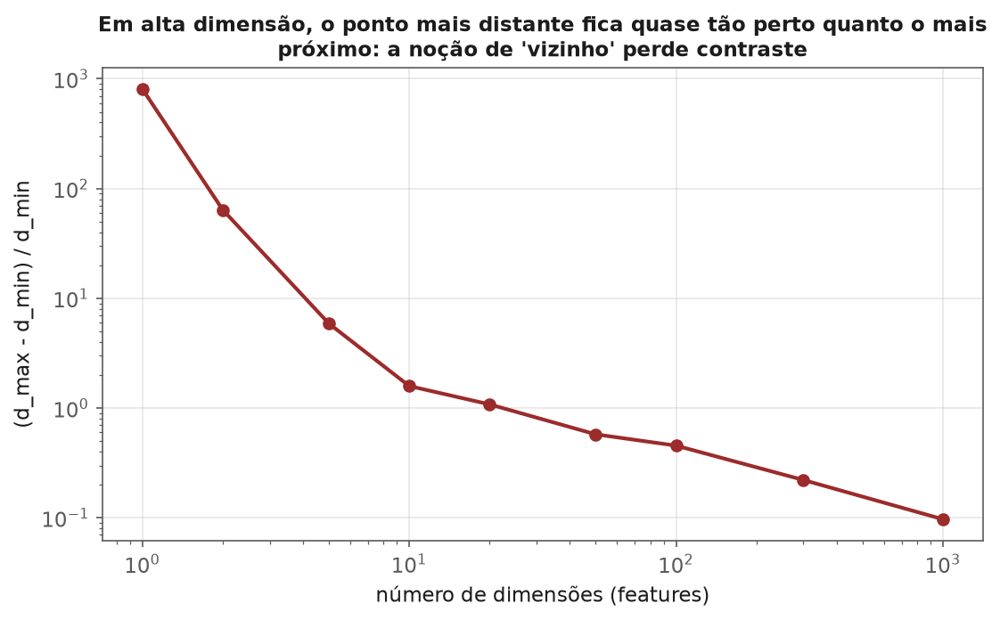
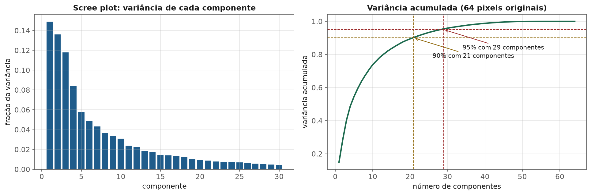
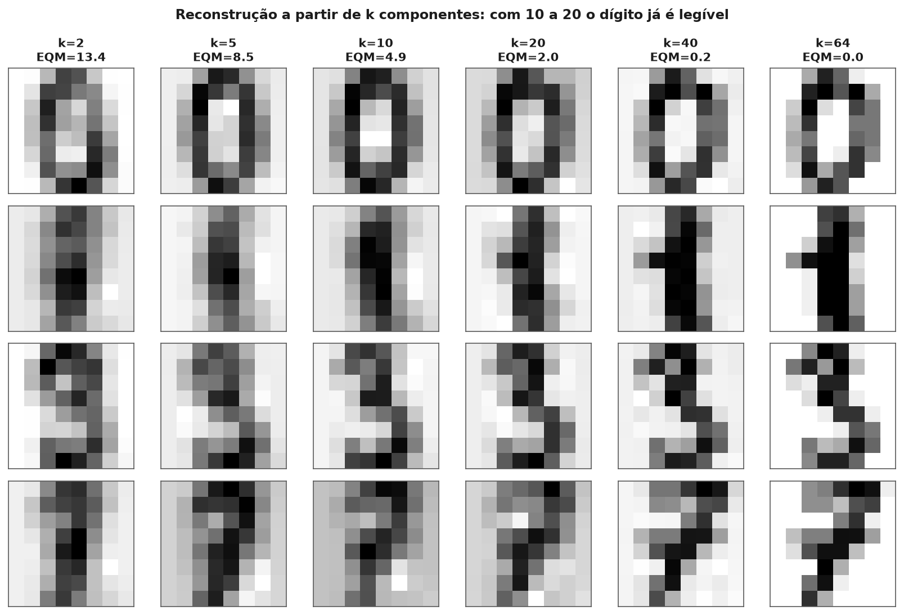
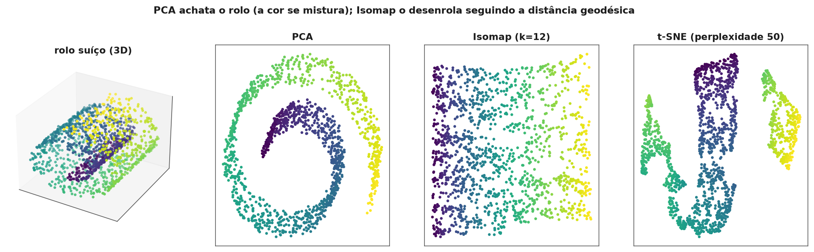
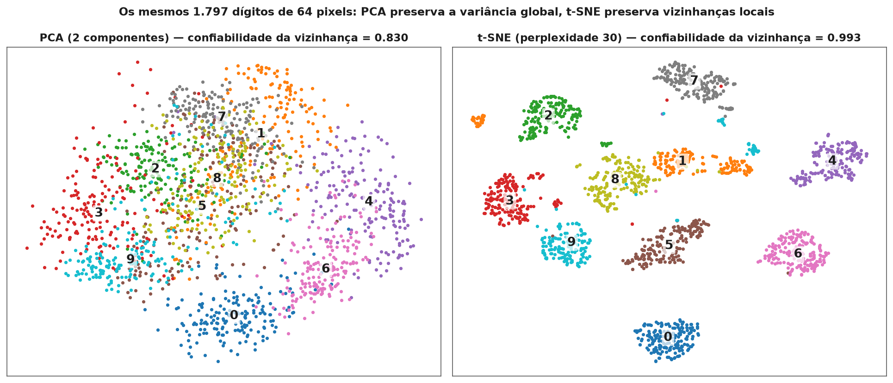
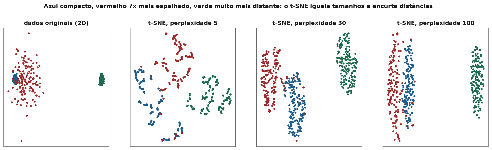

<!-- tema: Aprendizado Não Supervisionado > Redução de Dimensionalidade -->
<!-- subtitulo: Comprimir preservando o que importa — e não se deixar enganar por um gráfico bonito em 2D -->
<!-- resumo: Dados reais chegam com dezenas, centenas ou milhares de colunas, muitas delas redundantes. Reduzir a dimensionalidade serve a dois propósitos diferentes que quase todo material mistura: comprimir para modelar (preservar a variância global, com uma transformação reaplicável a dados novos) e projetar para enxergar (preservar vizinhanças locais num mapa 2D). Este material cobre a maldição da dimensionalidade, PCA de ponta a ponta — derivação pela SVD, escolha do número de componentes, o efeito da escala, a interpretação de cargas e o uso como pré-processamento —, Kernel PCA e manifold learning (Isomap), t-SNE com suas fórmulas e armadilhas, UMAP e autoencoders, fechando com uma tabela de decisão e um checklist de erros. -->
<!-- nivel: Intermediário -->
<!-- prerequisitos: Clustering (módulo anterior); Decomposições, SVD e PCA (tema 2); Escalonamento (tema 3) -->
<!-- duracao: 9 a 11 horas (leitura + 2 notebooks) -->
<!-- notebooks: 01-pca-aplicado · 02-tsne-e-manifolds · 99-exercicios -->
<!-- autor: Material do curso de ML & DL -->
<!-- versao: 1.0 -->

# Redução de Dimensionalidade

## Por que este módulo existe

Um cadastro de crédito com 300 variáveis de bureau, um catálogo de produtos
descrito por embeddings de 768 dimensões, uma linha de produção com 120
sensores, uma imagem de 28×28 pixels (784 números). Dados com muitas
colunas são a regra, não a exceção — e muitas dessas colunas contam quase a
mesma história. Os 120 sensores de uma linha de produção provavelmente
respondem a meia dúzia de fatores físicos (temperatura do forno, velocidade
da esteira, umidade); as 300 variáveis de bureau giram em torno de poucos
eixos (endividamento, histórico de atraso, tempo de relacionamento).

**Reduzir a dimensionalidade** é encontrar uma representação com menos
colunas que preserve o que importa dos dados originais. O tema 2 construiu a
maquinaria matemática (autovalores, SVD, PCA do zero); este módulo trata de
**usar** essa maquinaria e seus parentes não lineares com critério.

> [!ANALOGIA] Uma fotografia é uma redução de dimensionalidade: um objeto 3D
> vira uma imagem 2D. Uma boa foto de um rosto preserva quase tudo que
> permite reconhecer a pessoa; uma foto tirada exatamente de cima da cabeça
> perde quase tudo. Escolher o **ângulo** da foto é o que PCA faz — encontra
> a direção de onde os dados parecem mais "espalhados", mais informativos. E
> assim como uma foto, nenhuma projeção preserva tudo: sempre existe algo
> que ficou escondido atrás.

### Dois objetivos que não devem ser confundidos

Este é o eixo do módulo inteiro. Reduzir dimensionalidade serve a dois
propósitos com exigências opostas:

1. **Comprimir para modelar** — reduzir 300 colunas a 40 antes de treinar um
   modelo, acelerar uma busca por vizinhos, remover ruído, eliminar
   colinearidade. Aqui é preciso preservar a **estrutura global** (a
   variância) e ter uma **transformação reaplicável** a dados novos: o
   cliente que chega amanhã precisa passar pela mesma projeção.
2. **Projetar para enxergar** — fazer um mapa 2D que permita a um humano ver
   agrupamentos, outliers e gradientes. Aqui importa preservar
   **vizinhanças locais** (quem é parecido com quem), e a transformação não
   precisa ser reaplicável.

PCA é a ferramenta natural do primeiro objetivo; t-SNE e UMAP, do segundo.
Usar um no lugar do outro é a origem da maioria dos erros deste tema.

### O que você vai conseguir fazer ao final

- Explicar, com números, por que distâncias perdem contraste em alta
  dimensão e o que isso faz com métodos baseados em vizinhança.
- Aplicar PCA corretamente: padronizar quando necessário, escolher o número
  de componentes por mais de um critério, interpretar cargas e usar PCA
  dentro de um `Pipeline` sem vazamento.
- Reconhecer quando PCA **atrapalha** um modelo supervisionado — porque ele
  ignora o alvo.
- Usar t-SNE sabendo o que suas fórmulas preservam e o que distorcem, e
  listar as conclusões que **não** podem ser tiradas de um gráfico t-SNE.
- Situar Isomap, Kernel PCA, UMAP e autoencoders numa tabela de decisão.

---

## A maldição da dimensionalidade

O tema 4 (módulo de k-NN) apresentou a maldição da dimensionalidade como um
problema de volume: para cobrir o espaço com a mesma densidade de pontos, o
número de pontos necessário cresce exponencialmente com a dimensão. Há uma
segunda face, ainda mais relevante para este tema: a **concentração das
distâncias**.

Sorteie 500 pontos uniformemente num hipercubo de $d$ dimensões e um ponto
de consulta $q$. Calcule a distância de $q$ ao vizinho mais próximo
($d_{min}$) e ao mais distante ($d_{max}$). O **contraste relativo**

$$\text{contraste} = \frac{d_{max} - d_{min}}{d_{min}}$$

mede o quanto "o mais próximo" é de fato mais próximo que "o mais distante".
Na simulação que gerou a figura abaixo, o contraste foi de 806 em $d=1$, de
64 em $d=2$, de 1,6 em $d=10$, de 0,45 em $d=100$ e de apenas **0,10 em
$d=1000$** — isto é, com mil dimensões, o ponto mais distante estava só 10%
mais longe que o mais próximo.



> [!NOTA] A intuição: a distância euclidiana ao quadrado é uma **soma** de
> $d$ termos independentes, $\sum_j (x_j - q_j)^2$. Pela lei dos grandes
> números (tema 1), uma soma de muitos termos independentes concentra-se em
> torno da sua média, com desvio relativo que cai como $1/\sqrt{d}$. Todas
> as distâncias convergem para o mesmo valor. É por isso que k-NN,
> clustering por distância e DBSCAN degradam em alta dimensão — e por isso
> reduzir a dimensionalidade **antes** deles costuma ajudar.

> [!ARMADILHA] A concentração é dramática para dimensões **independentes**.
> Dados reais raramente são assim: 300 variáveis de bureau muito
> correlacionadas vivem, na prática, perto de um subespaço de dimensão bem
> menor — a chamada **dimensão intrínseca**. Toda a redução de
> dimensionalidade se apoia nessa hipótese: os dados ocupam uma região de
> dimensão baixa dentro do espaço de dimensão alta. Quando ela é falsa
> (colunas genuinamente independentes e todas relevantes), não há o que
> comprimir sem perder informação.

## PCA: comprimir preservando variância

### A formulação, em uma página

PCA encontra direções ortogonais — os **componentes principais** — ordenadas
pela variância dos dados projetados nelas. O primeiro componente é a direção
de maior variância; o segundo, a de maior variância entre as ortogonais ao
primeiro; e assim por diante.

> [!FORMULA] Com $X$ centrada (média de cada coluna subtraída), de
> dimensão $n \times p$, a matriz de covariância é
> $S = \frac{1}{n-1} X^T X$. Os componentes principais são os autovetores
> de $S$, e a variância ao longo de cada um é o autovalor correspondente:
>
> $$S\,\mathbf{v}_j = \lambda_j \mathbf{v}_j, \qquad \lambda_1 \geq \lambda_2 \geq \dots \geq \lambda_p \geq 0$$
>
> Na prática, calcula-se pela SVD da matriz centrada, $X = U \Sigma V^T$
> (tema 2): as colunas de $V$ são os componentes, e
> $\lambda_j = \sigma_j^2/(n-1)$. A **fração de variância explicada** pelo
> componente $j$ é $\lambda_j / \sum_k \lambda_k$. A projeção dos dados nos
> $k$ primeiros componentes é $Z = X V_k$ — os **escores**.

Duas leituras equivalentes do mesmo resultado: PCA **maximiza a variância**
projetada e, ao mesmo tempo, **minimiza o erro de reconstrução** — a soma
dos quadrados das distâncias entre cada ponto e sua projeção no subespaço de
$k$ dimensões. O erro de reconstrução com $k$ componentes é exatamente a
soma dos autovalores descartados, $\sum_{j>k} \lambda_j$.

### Um exemplo numérico com duas variáveis

Suponha duas variáveis com variâncias 4 e 3 e covariância 2 entre elas —
isto é, a matriz de covariância tem $s_{11} = 4$, $s_{22} = 3$ e
$s_{12} = s_{21} = 2$.

Os autovalores saem da equação característica
$\lambda^2 - \operatorname{tr}(S)\,\lambda + \det(S) = 0$, com
$\operatorname{tr}(S) = 7$ e $\det(S) = 4 \cdot 3 - 2 \cdot 2 = 8$:

$$\lambda = \frac{7 \pm \sqrt{49 - 32}}{2} = \frac{7 \pm 4{,}123}{2} \quad\Rightarrow\quad \lambda_1 \approx 5{,}56, \quad \lambda_2 \approx 1{,}44$$

O primeiro componente explica $5{,}56/7 \approx 79{,}4\%$ da variância total.
Seu autovetor sai de $(4 - 5{,}56)\,v_1 + 2\,v_2 = 0$, isto é,
$v_2 \approx 0{,}78\,v_1$; normalizado, $\mathbf{v}_1 \approx (0{,}788;\ 0{,}615)$.
As duas variáveis entram com o **mesmo sinal** e pesos parecidos: o
primeiro componente é uma espécie de "média ponderada" das duas — o padrão
típico quando as variáveis são positivamente correlacionadas.

> [!NOTA] O sinal de um componente é arbitrário: $\mathbf{v}_1$ e
> $-\mathbf{v}_1$ são igualmente válidos. Bibliotecas diferentes (ou versões
> diferentes da mesma biblioteca) podem devolver sinais opostos. Nunca
> interprete "o componente 1 é positivo para renda" sem fixar uma convenção
> de sinal — por exemplo, a de que a maior carga em módulo seja positiva.

### Quantos componentes manter

Não existe um número certo; existem quatro critérios, que devem ser
usados juntos:

- **Variância acumulada:** o menor $k$ que explica 90% ou 95% da variância.
  Nos dígitos manuscritos de 8×8 pixels (64 colunas), 90% da variância é
  explicada por **21** componentes e 95% por **29** — menos da metade das
  colunas originais.
- **Cotovelo do scree plot:** o ponto em que a variância de cada componente
  adicional para de cair rápido.
- **Regra de Kaiser:** com dados padronizados (matriz de correlação), manter
  os componentes com autovalor maior que 1 — os que explicam mais do que
  uma variável original sozinha. É uma heurística grosseira, que tende a
  superestimar $k$ quando há muitas variáveis.
- **Desempenho no uso final:** se o PCA é pré-processamento de um modelo,
  $k$ é um **hiperparâmetro** como qualquer outro, escolhido por validação
  cruzada do modelo inteiro (tema 6).





### Escala: PCA na covariância ou na correlação

PCA procura as direções de maior **variância** — e variância depende da
unidade de medida. Se uma coluna é renda em reais (variância da ordem de
$10^7$) e as outras são proporções entre 0 e 1 (variância da ordem de
$10^{-2}$), o primeiro componente será, na prática, a própria coluna de
renda, explicando 99,9% da "variância" — não porque renda seja
importante, mas porque ela é medida com números grandes.

> [!ARMADILHA] É o mesmo erro do módulo de clustering, com uma agravante: o
> resultado **parece** um sucesso. "O primeiro componente explica 99,9% da
> variância!" soa como compressão perfeita, quando significa apenas que uma
> coluna tem unidade muito maior que as outras. Padronize as colunas (o que
> equivale a fazer PCA na matriz de **correlação**) sempre que elas
> estiverem em unidades diferentes. A exceção legítima é quando todas as
> colunas estão na mesma unidade e a diferença de variância é informativa —
> pixels de uma imagem, por exemplo, ou retornos de ações.

### Interpretando cargas

A matriz de **cargas** (*loadings*) diz quanto cada variável original
contribui para cada componente. Com dados padronizados, a carga da variável
$i$ no componente $j$ é $v_{ij}\sqrt{\lambda_j}$ — a correlação entre a
variável e o componente.

> [!MERCADO] Em risco de crédito é comum aplicar PCA a dezenas de variáveis
> de bureau e descobrir que o primeiro componente carrega positivamente em
> todas as medidas de endividamento (saldo em cartão, cheque especial,
> número de contratos ativos) — um eixo que o time passa a chamar de
> "alavancagem" — e o segundo contrasta histórico de atraso com tempo de
> relacionamento. Nomear componentes assim ajuda a comunicar o modelo, mas
> exige cautela: um componente é uma combinação de **todas** as variáveis,
> e o nome captura só as maiores cargas. Quando a interpretabilidade
> importa muito, **rotações** como varimax ou **Sparse PCA** (que força a
> maioria das cargas a zero) produzem componentes mais fáceis de nomear.

## PCA como pré-processamento

O uso mais comum de PCA em produção é como uma etapa de um `Pipeline`
supervisionado:

```python
from sklearn.pipeline import Pipeline
from sklearn.preprocessing import StandardScaler
from sklearn.decomposition import PCA
from sklearn.linear_model import LogisticRegression

pipe = Pipeline([
    ("escala", StandardScaler()),
    ("pca", PCA(n_components=0.95)),   # float: mantém 95% da variância
    ("modelo", LogisticRegression(max_iter=2000)),
])
# n_components vira hiperparâmetro buscado por validação cruzada:
# GridSearchCV(pipe, {"pca__n_components": [10, 20, 40, 0.95]}, cv=5)
```

Três benefícios reais: remove **colinearidade** (os componentes são
ortogonais — útil para modelos lineares, tema 4), reduz **ruído** (os
últimos componentes costumam concentrar variação aleatória) e acelera o
treino de modelos cujo custo cresce com o número de colunas.

> [!ARMADILHA] Ajustar o PCA na base inteira e só depois separar treino e
> teste é **vazamento** (tema 3, módulo 4): os componentes foram escolhidos
> olhando a variância dos dados de teste. O efeito costuma ser pequeno, mas
> em bases pequenas e com muitas colunas pode inflar a métrica. Dentro de
> um `Pipeline`, o PCA é reajustado em cada fold usando só os dados de
> treino daquele fold.

### A armadilha que ninguém avisa: PCA ignora o alvo

PCA é **não supervisionado**: escolhe direções de maior variância sem saber
qual é a variável que você quer prever. Nada garante que a informação
preditiva esteja nas direções de maior variância.

> [!ARMADILHA] Imagine um problema de detecção de falha em que a diferença
> entre peça boa e peça defeituosa está numa variação **sutil** de um
> sensor (variância pequena), enquanto a variação grande dos dados vem de
> fatores irrelevantes para a falha (o turno, o lote de matéria-prima). O
> PCA com poucos componentes preserva a variação irrelevante e **descarta**
> justamente a direção que separa as classes. O modelo treinado depois do
> PCA fica pior do que o treinado nos dados originais. O notebook
> `01-pca-aplicado` constrói exatamente esse cenário. Se o objetivo é
> reduzir dimensão **para prever**, alternativas supervisionadas como PLS
> (*Partial Least Squares*) ou LDA (*Linear Discriminant Analysis*)
> escolhem direções considerando o alvo.

### Variantes de PCA para o mundo real

- **`PCA(svd_solver="randomized")`**: SVD aleatorizada, muito mais rápida
  quando só os primeiros $k$ componentes interessam e $p$ é grande.
- **`IncrementalPCA`**: ajusta em lotes, para bases que não cabem na
  memória.
- **`TruncatedSVD`**: SVD **sem centralizar**, o que preserva a esparsidade
  — a escolha para matrizes esparsas como TF-IDF de texto (tema 9), onde é
  conhecida como **LSA** (*Latent Semantic Analysis*).
- **`KernelPCA`**: aplica o truque do kernel (tema 4, SVM) para encontrar
  componentes **não lineares** — por exemplo, separar dois anéis
  concêntricos que nenhuma projeção linear separa. Custa $O(n^2)$ em
  memória e não tem uma reconstrução exata.

## Manifold learning: quando a estrutura é curva

A hipótese do **manifold** diz que dados de alta dimensão vivem perto de uma
superfície de dimensão baixa — mas essa superfície pode ser **curva**. O
exemplo canônico é o rolo suíço: uma folha 2D enrolada em 3D. Dois pontos
em voltas adjacentes do rolo estão perto em linha reta (distância
euclidiana), mas longe **ao longo da folha** (distância geodésica). PCA,
que só enxerga direções retas, achata o rolo e mistura as voltas.

> [!DEFINICAO] **Isomap** (Tenenbaum, de Silva & Langford, 2000) estima a
> distância geodésica em três passos: (1) liga cada ponto aos seus $k$
> vizinhos mais próximos, formando um grafo; (2) calcula a distância entre
> todos os pares como o **caminho mais curto no grafo**; (3) aplica MDS
> clássico (escalonamento multidimensional) a essas distâncias, encontrando
> coordenadas de baixa dimensão que as preservem. **LLE** (*Locally Linear
> Embedding*) segue outra ideia: reconstrói cada ponto como combinação
> linear dos seus vizinhos e procura coordenadas de baixa dimensão que
> preservem esses mesmos pesos.



> [!ARMADILHA] Isomap e LLE são sensíveis ao número de vizinhos $k$ e a
> "atalhos": se $k$ for grande demais, o grafo liga voltas adjacentes do
> rolo e a distância geodésica volta a ser euclidiana. São métodos
> importantes conceitualmente, mas pouco usados em produção — t-SNE e UMAP
> dominaram a visualização, e PCA e autoencoders dominaram a compressão.

## t-SNE: um mapa de vizinhanças

t-SNE (*t-distributed Stochastic Neighbor Embedding*, van der Maaten &
Hinton, 2008) é o método de visualização mais usado da última década. Ele
não tenta preservar distâncias; tenta preservar **quem é vizinho de quem**,
convertendo distâncias em probabilidades.

> [!FORMULA] **No espaço original**, a afinidade de $j$ como vizinho de $i$
> usa uma gaussiana centrada em $i$, com largura $\sigma_i$ própria:
>
> $$p_{j \mid i} = \frac{\exp\left(-\|\mathbf{x}_i - \mathbf{x}_j\|^2 / 2\sigma_i^2\right)}{\sum_{k \neq i} \exp\left(-\|\mathbf{x}_i - \mathbf{x}_k\|^2 / 2\sigma_i^2\right)}, \qquad p_{ij} = \frac{p_{j \mid i} + p_{i \mid j}}{2n}$$
>
> **No mapa 2D**, a afinidade usa uma distribuição t de Student com 1 grau
> de liberdade (cauda pesada):
>
> $$q_{ij} = \frac{\left(1 + \|\mathbf{y}_i - \mathbf{y}_j\|^2\right)^{-1}}{\sum_{k \neq l} \left(1 + \|\mathbf{y}_k - \mathbf{y}_l\|^2\right)^{-1}}$$
>
> As posições $\mathbf{y}_i$ são ajustadas por gradiente descendente (tema
> 2) para minimizar a divergência de Kullback-Leibler entre as duas
> distribuições:
>
> $$\text{KL}(P \,\|\, Q) = \sum_{i \neq j} p_{ij} \log \frac{p_{ij}}{q_{ij}}$$

### Perplexidade

A largura $\sigma_i$ de cada ponto é escolhida para que a distribuição
$p_{\cdot \mid i}$ tenha uma **perplexidade** fixa, definida pelo usuário:

$$\text{Perp}(P_i) = 2^{H(P_i)}, \qquad H(P_i) = -\sum_j p_{j \mid i} \log_2 p_{j \mid i}$$

A perplexidade funciona como um **número efetivo de vizinhos**: com
perplexidade 30, cada ponto distribui sua atenção como se tivesse cerca de
30 vizinhos relevantes. Pontos em regiões densas recebem $\sigma_i$
pequeno; em regiões esparsas, $\sigma_i$ grande — por isso o t-SNE
"normaliza" a densidade, e grupos de densidades muito diferentes aparecem
com tamanhos parecidos no mapa. Valores típicos ficam entre 5 e 50.

### Por que ele preserva o local e distorce o global

A assimetria da divergência KL explica tudo. Cada termo
$p_{ij}\log(p_{ij}/q_{ij})$ é ponderado por $p_{ij}$:

- Se dois pontos são **vizinhos** no original ($p_{ij}$ grande) e ficam
  **longe** no mapa ($q_{ij}$ pequeno), o termo é grande — por exemplo,
  $p = 0{,}1$ e $q = 0{,}01$ contribuem $0{,}1 \cdot \ln 10 \approx 0{,}23$. O
  otimizador é fortemente pressionado a aproximá-los.
- Se dois pontos são **distantes** no original ($p_{ij}$ quase zero) e
  ficam **perto** no mapa, o termo é quase zero, porque é multiplicado por
  $p_{ij}$. O otimizador quase não se importa.

Resultado: vizinhanças são preservadas com cuidado; distâncias grandes são
praticamente ignoradas. A cauda pesada da t de Student no mapa resolve o
**problema de aglomeração** (*crowding*): em 2D não há espaço para acomodar
todos os vizinhos moderadamente próximos de um ponto de alta dimensão, e a
cauda pesada permite empurrar os moderadamente distantes para longe sem
grande penalidade, abrindo espaço entre os grupos.



> [!NOTA] A **trustworthiness** (Venna & Kaski, 2001), disponível em
> `sklearn.manifold.trustworthiness`, mede quanto os vizinhos de cada ponto
> no mapa eram de fato vizinhos no espaço original, numa escala de 0 a 1. É
> a métrica certa para comparar métodos de visualização, justamente porque
> mede o que eles se propõem a preservar.

### O que um gráfico t-SNE NÃO permite concluir

> [!ARMADILHA] Quatro leituras erradas, e muito comuns, de um mapa t-SNE:
>
> 1. **Tamanho de grupo não significa nada.** O t-SNE expande grupos densos
>    e contrai grupos esparsos. Um grupo desenhado grande não é mais
>    heterogêneo que um pequeno.
> 2. **Distância entre grupos não significa nada** (ou quase). Dois grupos
>    desenhados longe podem estar próximos no original, e vice-versa.
> 3. **Grupos podem ser artefato.** Com perplexidade baixa, até dados sem
>    estrutura se fragmentam em "ilhas". Sempre compare perplexidades
>    diferentes e sementes diferentes antes de acreditar num grupo.
> 4. **Os eixos não têm significado.** Não existe "t-SNE 1 alto" como
>    existe "componente 1 alto" no PCA.



Além disso, t-SNE **não tem** `transform`: não existe uma função que leve
um ponto novo para o mapa já construído (a implementação do
`scikit-learn` só oferece `fit_transform`). Para incluir dados novos, é
preciso refazer o mapa inteiro — o que muda as posições de todos os
pontos. Por isso t-SNE não serve como pré-processamento de um modelo em
produção.

> [!MERCADO] Em biologia de célula única (*single-cell RNA-seq*), com
> dezenas de milhares de genes por célula, mapas t-SNE e UMAP viraram a
> figura padrão de qualquer artigo — e também a fonte de uma crítica
> recorrente: tipos celulares "descobertos" porque formavam uma ilha no
> mapa, que não sobreviviam a outra perplexidade ou a outro pipeline de
> normalização. A prática recomendada hoje é agrupar no espaço de alta
> dimensão (ou num PCA com dezenas de componentes) e usar o t-SNE/UMAP
> **só para visualizar** o resultado do agrupamento — nunca para
> agrupar.

> [!NOTA] O custo exato do t-SNE é $O(n^2)$; a aproximação de Barnes-Hut
> (padrão do `scikit-learn`) reduz para $O(n \log n)$, e implementações
> como openTSNE e FIt-SNE escalam para milhões de pontos. Uma prática
> comum e eficaz é aplicar PCA para ~50 componentes antes do t-SNE: remove
> ruído, acelera muito e raramente altera o mapa.

## UMAP e autoencoders

### UMAP

UMAP (*Uniform Manifold Approximation and Projection*, McInnes, Healy &
Melville, 2018) segue a mesma ideia geral do t-SNE — construir um grafo de
vizinhanças no espaço original e procurar um mapa de baixa dimensão com um
grafo parecido —, com fundamentação em topologia (conjuntos simpliciais
fuzzy) e uma função de perda de entropia cruzada que, ao contrário da KL do
t-SNE, também penaliza pontos distantes que ficam próximos no mapa.

Diferenças práticas que importam:

- **Mais rápido** que t-SNE e escala melhor para milhões de pontos.
- Tende a preservar **mais estrutura global** (a posição relativa entre
  grupos é um pouco mais significativa — mas ainda longe de confiável).
- **Tem `transform`**: pontos novos podem ser projetados no mapa existente,
  o que permite usá-lo como etapa de pré-processamento (com cautela).
- Dois hiperparâmetros principais: `n_neighbors` (análogo à perplexidade:
  local vs. global) e `min_dist` (o quão apertados os pontos podem ficar no
  mapa).

> [!NOTA] UMAP está no pacote `umap-learn` (`pip install umap-learn`), fora
> do `scikit-learn` e fora do ambiente deste curso — por isso os notebooks
> usam t-SNE. Tudo o que foi dito sobre as armadilhas do t-SNE (tamanhos,
> distâncias, grupos-artefato) vale também para UMAP.

### Autoencoders

Um **autoencoder** é uma rede neural treinada para reproduzir a própria
entrada, passando por uma camada estreita no meio — o **gargalo**:

$$x \ \rightarrow\ \text{codificador} \ \rightarrow\ z \in \mathbb{R}^k \ \rightarrow\ \text{decodificador} \ \rightarrow\ \hat{x}, \qquad \text{minimizar}\ \|x - \hat{x}\|^2$$

Como a rede é obrigada a reconstruir $\mathbf{x}$ a partir de apenas $k$
números, o gargalo $\mathbf{z}$ aprende uma representação comprimida.

> [!NOTA] **Um autoencoder linear é PCA.** Com codificador e decodificador
> lineares e perda quadrática, o gargalo aprende exatamente o mesmo
> subespaço que os $k$ primeiros componentes principais (Baldi & Hornik,
> 1989) — possivelmente numa base rotacionada. O ganho dos autoencoders vem
> das **ativações não lineares**, que permitem comprimir estruturas curvas.
> O preço: mais dados, mais hiperparâmetros, treino mais lento e nenhuma
> garantia de ótimo global. O tema 8 (Deep Learning) volta a eles; o
> notebook `02-tsne-e-manifolds` treina um autoencoder pequeno com o
> `MLPRegressor` do `scikit-learn`.

> [!MERCADO] O uso de autoencoders que mais aparece no mercado não é
> compressão — é **detecção de anomalias**: treinado só com dados normais,
> o autoencoder reconstrói bem o que é normal e mal o que é anômalo, e o
> erro de reconstrução vira um escore de anomalia. É um dos temas do
> próximo módulo.

## Tabela de decisão

| Método | Linear? | Preserva | Transforma dados novos? | Escala | Uso principal |
| :-- | :-: | :-- | :-: | :-- | :-- |
| PCA | sim | variância global | sim | milhões (randomized, incremental) | compressão, pré-processamento, ruído |
| TruncatedSVD | sim | variância (sem centrar) | sim | matrizes esparsas enormes | texto (LSA), recomendação |
| Kernel PCA | não | variância no espaço do kernel | sim (aproximado) | até ~10 mil | estrutura não linear moderada |
| Isomap / LLE | não | distância geodésica / pesos locais | limitado | até ~10 mil | ensino, manifolds limpos |
| t-SNE | não | vizinhanças locais | não | ~100 mil (Barnes-Hut) | visualização exploratória |
| UMAP | não | vizinhanças, parte do global | sim | milhões | visualização; pré-processamento com cautela |
| Autoencoder | não (em geral) | o que a perda de reconstrução premia | sim | milhões (com GPU) | compressão não linear, anomalias |

## Erros que custam caro — checklist

- Rodar PCA sem padronizar colunas em unidades diferentes — e comemorar um
  primeiro componente que "explica 99% da variância".
- Ajustar o PCA na base inteira antes do split (vazamento).
- Assumir que as direções de maior variância são as mais preditivas —
  PCA ignora o alvo; valide o modelo com e sem PCA.
- Escolher o número de componentes por uma única regra, sem validar no uso
  final.
- Interpretar o sinal de um componente sem fixar convenção.
- Tirar conclusões de tamanhos de grupos, distâncias entre grupos ou eixos
  de um mapa t-SNE/UMAP.
- Acreditar num grupo que aparece com uma perplexidade e desaparece com
  outra.
- Agrupar (clustering) nas coordenadas do t-SNE em vez de no espaço
  original ou num PCA.
- Usar t-SNE como etapa de um pipeline de produção — ele não tem
  `transform`.

## Para ir além

- Jolliffe & Cadima (2016), *Principal component analysis: a review and
  recent developments* — revisão curta e completa sobre PCA.
- van der Maaten & Hinton (2008), *Visualizing Data using t-SNE* — o artigo
  original.
- Wattenberg, Viégas & Johnson (2016), *How to Use t-SNE Effectively*
  (Distill) — a referência interativa sobre as armadilhas do t-SNE.
- McInnes, Healy & Melville (2018), *UMAP: Uniform Manifold Approximation
  and Projection for Dimension Reduction*.
- Tenenbaum, de Silva & Langford (2000), *A Global Geometric Framework for
  Nonlinear Dimensionality Reduction* — o artigo do Isomap.
- Kobak & Berens (2019), *The art of using t-SNE for single-cell
  transcriptomics* — boas práticas de t-SNE numa área que depende dele.
