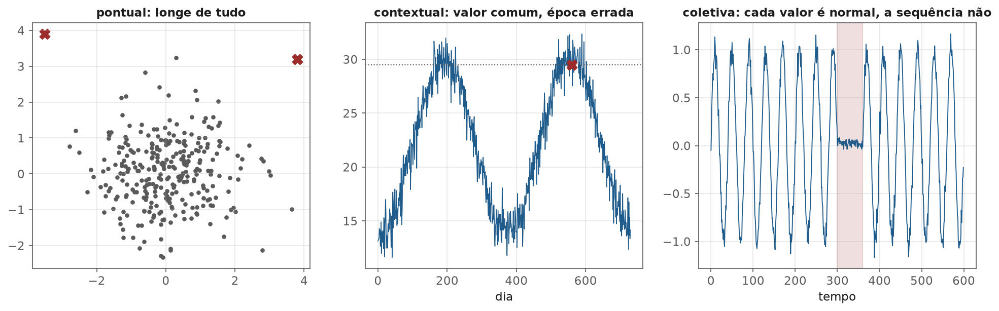
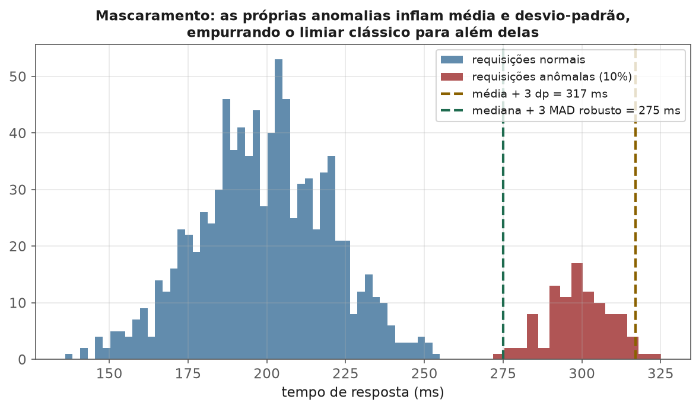
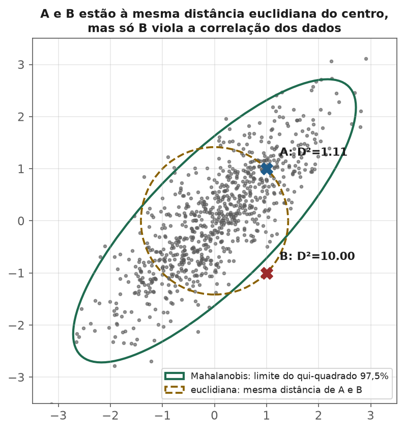
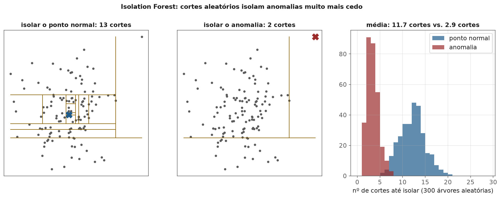
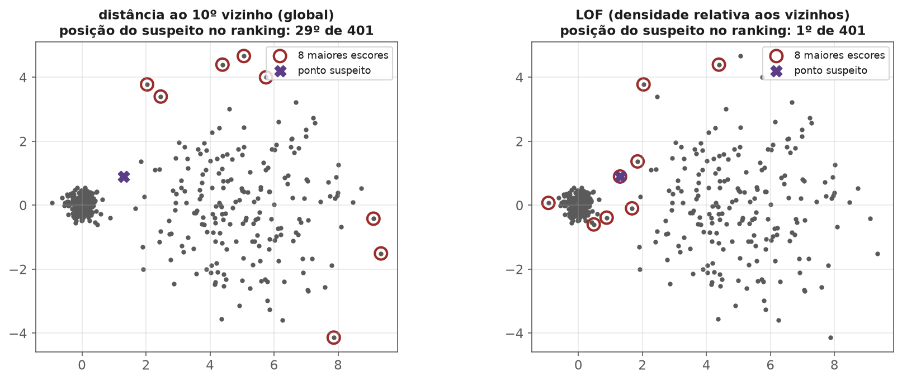

<!-- tema: Aprendizado Não Supervisionado > Detecção de Anomalias -->
<!-- subtitulo: Encontrar o raro sem saber, de antemão, como ele se parece -->
<!-- resumo: Fraude, invasão de rede, falha de equipamento e erro de cadastro têm algo em comum: são raros, caros e mudam de forma o tempo todo — o que torna o aprendizado supervisionado insuficiente sozinho. Este material cobre os três tipos de anomalia (pontual, contextual e coletiva), os três regimes de rótulo (não supervisionado, novidade e supervisionado), os métodos estatísticos robustos (z-score com mediana e MAD, cercas de Tukey, distância de Mahalanobis com covariância robusta), Isolation Forest e LOF com suas fórmulas e exemplos numéricos, One-Class SVM e erro de reconstrução, a avaliação com orçamento de alertas (precisão@k) e a arquitetura de um sistema real de detecção de fraude, que combina escores não supervisionados com modelos supervisionados. -->
<!-- nivel: Intermediário/Avançado — encerra o tema de Aprendizado Não Supervisionado -->
<!-- prerequisitos: Clustering e Redução de Dimensionalidade (módulos anteriores); Dados Desbalanceados (tema 3); Árvores de Decisão (tema 4) -->
<!-- duracao: 10 a 12 horas (leitura + 3 notebooks) -->
<!-- notebooks: 01-metodos-estatisticos · 02-isolation-forest-e-lof · 03-caso-real-fraude · 99-exercicios -->
<!-- autor: Material do curso de ML & DL -->
<!-- versao: 1.0 -->

# Detecção de Anomalias

## Por que este módulo existe

O tema 3 (Dados Desbalanceados) tratou de problemas em que a classe rara
tem **rótulo**: sabemos quais transações do passado foram fraude e
treinamos um classificador. Esse cenário é o ideal — e quase nunca é o
cenário completo. Em detecção de anomalias, três dificuldades aparecem
juntas:

- **Rótulos são escassos ou inexistentes.** Uma falha de turbina pode
  acontecer duas vezes em uma década; um novo tipo de ataque de rede não
  tem nenhum exemplo histórico.
- **Rótulos chegam atrasados e incompletos.** Uma fraude de cartão só é
  confirmada quando o cliente contesta a fatura, semanas depois; as
  fraudes que ninguém contestou nunca recebem rótulo.
- **O raro muda de forma.** Fraudadores se adaptam ao modelo que os
  bloqueia. Um classificador supervisionado aprende a reconhecer as
  fraudes de **ontem**; a fraude de amanhã pode não se parecer com nenhuma
  delas.

**Detecção de anomalias** é a família de métodos que procura observações
que se desviam do padrão da maioria, sem precisar (ou sem depender só) de
exemplos rotulados do que é anômalo. A premissa central: anomalias são
**poucas** e **diferentes** — e essas duas propriedades, por si só, já
permitem encontrá-las.

> [!ANALOGIA] Um segurança de shopping experiente não tem uma lista de
> todos os comportamentos criminosos possíveis. Ele conhece muito bem o
> comportamento **normal** — o ritmo de quem passeia, de quem compra, de
> quem espera alguém — e presta atenção em quem destoa: a pessoa que passa
> pela mesma porta seis vezes em dez minutos, o carrinho parado há uma hora
> no mesmo lugar. Nem todo comportamento destoante é crime (pode ser alguém
> perdido), mas quase todo crime destoa. Detecção de anomalias é isso:
> modelar o normal com cuidado e investigar o que foge dele.

### O que você vai conseguir fazer ao final

- Classificar um problema quanto ao tipo de anomalia (pontual, contextual,
  coletiva) e ao regime de rótulo, e escolher a família de método adequada.
- Aplicar métodos estatísticos **robustos** e explicar, com números, por
  que a média e o desvio-padrão falham na presença das próprias anomalias.
- Calcular a distância de Mahalanobis à mão e usá-la com um limiar do
  qui-quadrado.
- Explicar Isolation Forest e LOF a partir das fórmulas, sabendo quando
  cada um vence.
- Avaliar um detector pelo que o negócio consegue investigar — precisão e
  recall no orçamento de alertas — e desenhar um sistema que combine
  escores não supervisionados com modelos supervisionados.

---

## O que é uma anomalia

Não existe definição matemática universal. A definição operacional mais
útil é a de Hawkins (1980): *uma observação que se desvia tanto das demais
que desperta suspeita de ter sido gerada por um mecanismo diferente*. A
palavra-chave é **mecanismo**: a anomalia interessa porque sugere que algo
diferente aconteceu — uma fraude, uma falha, um erro de digitação.

### Três tipos

- **Pontual:** uma observação isolada muito diferente das demais — uma
  compra de R\$ 45.000 num cartão cujo maior gasto histórico foi R\$ 800.
- **Contextual (ou condicional):** o valor é normal em um contexto e
  anômalo em outro — 29 °C é uma temperatura comum no verão e anômala em
  julho numa cidade do sul; um pico de acessos às 3h da manhã é anômalo,
  o mesmo pico às 20h não.
- **Coletiva:** cada observação é normal isoladamente, mas a **sequência**
  ou o **conjunto** não é — um sinal de eletrocardiograma que "congela"
  num valor plausível por dois segundos; dezenas de compras pequenas e
  normais em sequência rápida, testando se um cartão roubado funciona.

> [!NOTA] Anomalias contextuais e coletivas se reduzem a pontuais com a
> **feature certa**. A temperatura de julho vira pontual quando a feature é
> "temperatura menos a média histórica do mês"; o teste de cartão vira
> pontual quando a feature é "número de transações do cartão na última
> hora". Boa parte do trabalho real de detecção de anomalias é feature
> engineering (tema 3) que transforma contexto em números.

### Anomalia não é ruído — e outlier não é erro

Um valor extremo pode ser (1) um **erro** de medição ou digitação, que deve
ser corrigido ou descartado; (2) um evento **legítimo e raro**, como o
cliente que de fato comprou um carro no cartão; ou (3) o **sinal** que se
procura, como a fraude. O tema 3 (módulo 2) tratou outliers como problema
de qualidade de dados; aqui eles são o objeto de estudo. Um detector não
distingue os três casos — ele aponta o que é diferente, e a interpretação
fica com quem investiga.

### Três regimes de rótulo

| Regime | O que se tem no treino | Pergunta | Exemplos de método |
| :-- | :-- | :-- | :-- |
| Não supervisionado (*outlier detection*) | dados misturados, sem rótulo | quais pontos desta base são diferentes? | Isolation Forest, LOF, z robusto |
| Novidade (*novelty detection*) | só dados **normais** | este ponto novo é diferente do normal? | One-Class SVM, LOF com `novelty=True`, autoencoder |
| Supervisionado | exemplos rotulados das duas classes | este ponto é da classe rara? | classificação desbalanceada (tema 3) |

> [!ARMADILHA] No `scikit-learn`, `LocalOutlierFactor` funciona de dois
> modos diferentes. No padrão (`novelty=False`), ele só dá escores para os
> pontos do próprio treino (`fit_predict`) — não existe `predict` para
> pontos novos. Com `novelty=True`, ele deve ser treinado **só com dados
> normais** e passa a ter `predict` e `score_samples` para dados novos.
> Usar o modo novidade treinando com dados contaminados por anomalias faz o
> modelo aprender as anomalias como parte do "normal".

## Métodos estatísticos: simples, rápidos e frequentemente suficientes

### O z-score e o problema do mascaramento

O ponto de partida é o **z-score** (tema 1): quantos desvios-padrão uma
observação está da média, $z = (x - \bar{x})/s$, com $|z| > 3$ como regra
clássica de alerta. Para uma normal, só 0,27% das observações passam desse
limiar por acaso.

O problema é que $\bar{x}$ e $s$ são calculados com **todos** os dados —
inclusive as anomalias. Se elas são numerosas ou extremas, elas próprias
puxam a média e inflam o desvio-padrão, e o limiar se afasta até ficar
**além** delas. Esse efeito se chama **mascaramento**.

**Exemplo numérico.** Tempo de resposta de uma API: 900 requisições
normais em torno de 200 ms (desvio-padrão 20 ms) e 100 requisições lentas
(10% do total, por causa de um servidor com defeito) em torno de 300 ms.
Na amostra que gerou a figura abaixo, a média foi 209 ms e o desvio-padrão
**36 ms** — quase o dobro do desvio real das requisições normais, inflado
pelas lentas. O limiar clássico ficou em $209 + 3 \times 36 \approx 317$ ms,
acima de quase todas as requisições lentas: o z-score detectou **só 4%**
delas.

### A versão robusta: mediana e MAD

A mediana e o **MAD** (*median absolute deviation*) são estatísticas
robustas (tema 1, módulo 1): até metade dos dados pode ser contaminada
antes que elas se desloquem arbitrariamente.

> [!FORMULA] O z-score robusto troca média por mediana e desvio-padrão por
> MAD reescalado:
>
> $$z_{rob} = \frac{x - \text{mediana}(x)}{1{,}4826 \cdot \text{MAD}}, \qquad \text{MAD} = \text{mediana}\left(|x_i - \text{mediana}(x)|\right)$$
>
> O fator 1,4826 (o inverso do quantil 75% da normal padrão, $1/0{,}6745$)
> faz com que $1{,}4826 \cdot \text{MAD}$ estime o desvio-padrão quando os
> dados são normais — assim o limiar $|z_{rob}| > 3$ tem a mesma leitura do
> clássico.

No mesmo exemplo: mediana de 202,6 ms e MAD de 16,3 ms, o que dá um
desvio robusto de $1{,}4826 \times 16{,}3 \approx 24{,}2$ ms e um limiar de
$202{,}6 + 3 \times 24{,}2 \approx 275$ ms. O z robusto detectou **99%** das
requisições lentas, sem nenhum falso alarme entre as normais.

> [!NOTA] As **cercas de Tukey** — o critério do boxplot, com alerta abaixo
> de $Q_1 - 1{,}5\,\text{IQR}$ ou acima de $Q_3 + 1{,}5\,\text{IQR}$ — também
> são robustas, porque quartis resistem a contaminação. Ambos os métodos
> supõem uma distribuição aproximadamente simétrica; para variáveis de
> cauda longa (valores monetários, contagens), aplique $\log(1+x)$ antes,
> ou quase toda a cauda direita legítima será marcada como anômala.

### Mahalanobis: anomalia multivariada

Métodos univariados olham uma coluna de cada vez, e perdem anomalias que
só aparecem na **combinação** de colunas. Uma pessoa com 1,90 m não é
anômala; uma com 45 kg também não; uma com 1,90 m **e** 45 kg é. A
distância de Mahalanobis mede o afastamento levando em conta a correlação
entre as variáveis.

> [!FORMULA] Para um vetor $\mathbf{x}$, com média $\boldsymbol{\mu}$ e
> matriz de covariância $\Sigma$:
>
> $$D^2(\mathbf{x}) = (\mathbf{x} - \boldsymbol{\mu})^T \, \Sigma^{-1} \, (\mathbf{x} - \boldsymbol{\mu})$$
>
> Se os dados são normais multivariados em $p$ dimensões, $D^2$ segue uma
> distribuição qui-quadrado com $p$ graus de liberdade — o que dá um limiar
> com interpretação probabilística: $D^2 > \chi^2_{p;\,0{,}975}$ marca os
> 2,5% mais improváveis.

**Exemplo numérico.** Duas variáveis padronizadas com correlação 0,8:
$\Sigma$ tem 1 na diagonal e 0,8 fora dela. Sua inversa é
$\frac{1}{1 - 0{,}64}$ vezes a matriz com 1 na diagonal e $-0{,}8$ fora,
isto é, $2{,}778$ vezes essa matriz. Compare dois pontos à **mesma**
distância euclidiana do centro, $\sqrt{2}$:

- $A = (1, 1)$, na direção da correlação:
  $D^2 = 2{,}778 \times (1 - 2 \cdot 0{,}8 + 1) = 2{,}778 \times 0{,}4 \approx 1{,}11$.
- $B = (1, -1)$, contra a correlação:
  $D^2 = 2{,}778 \times (1 + 2 \cdot 0{,}8 + 1) = 2{,}778 \times 3{,}6 = 10{,}0$.

Com $p = 2$, o limiar de 97,5% é $\chi^2_{2;\,0{,}975} \approx 7{,}38$: $B$ é
anômalo, $A$ não. A distância euclidiana trataria os dois como iguais.

> [!ARMADILHA] O mascaramento volta, agora em várias dimensões: se $\mu$ e
> $\Sigma$ são estimados com dados contaminados, as anomalias distorcem a
> elipse a seu favor. A solução robusta é o **MCD** (*Minimum Covariance
> Determinant*, Rousseeuw, 1984): estima média e covariância usando só o
> subconjunto de $h$ pontos (tipicamente cerca de metade mais um) cuja
> matriz de covariância tem o **menor determinante** — o subconjunto mais
> "compacto", que tende a excluir as anomalias. No `scikit-learn`, é o
> `MinCovDet`, usado internamente pelo `EllipticEnvelope`.

> [!MERCADO] Em monitoramento industrial, Mahalanobis com covariância
> robusta sobre algumas dezenas de sensores é, até hoje, uma das primeiras
> linhas de defesa — em especial na forma do **gráfico $T^2$ de Hotelling**
> do controle estatístico de processos, que é exatamente $D^2$ monitorado
> ao longo do tempo. É barato, interpretável (dá para decompor $D^2$ na
> contribuição de cada sensor) e tem um limiar com significado
> probabilístico. Sua limitação é a premissa de uma única nuvem elíptica:
> uma planta que opera em vários regimes diferentes precisa de um modelo
> por regime — ou de um método que não suponha forma nenhuma.

## Isolation Forest

Os métodos anteriores modelam o **normal** (uma média, uma elipse) e medem
o afastamento dele. O Isolation Forest (Liu, Ting & Zhou, 2008) inverte a
lógica: tenta **isolar** cada ponto, e parte da observação de que
anomalias, por serem poucas e diferentes, são isoladas com muito menos
esforço.

O algoritmo constrói árvores completamente aleatórias: em cada nó, sorteia
uma feature e um ponto de corte uniforme entre o mínimo e o máximo dela
naquele nó, e divide os dados. Repete até cada ponto ficar sozinho numa
folha (ou até uma profundidade máxima). O número de cortes necessários
para isolar um ponto é o **comprimento do caminho** $h(\mathbf{x})$ da raiz
até sua folha.

Um ponto no meio da nuvem precisa de muitos cortes, porque está cercado de
vizinhos que precisam ser separados dele; um ponto afastado cai sozinho
num dos lados logo nos primeiros cortes. Na figura abaixo, com 121 pontos,
isolar o ponto normal exigiu em média 11,7 cortes; isolar a anomalia, 2,9.

> [!FORMULA] O escore de anomalia normaliza o comprimento médio do caminho
> sobre todas as árvores, $E[h(\mathbf{x})]$, pelo comprimento médio
> esperado de uma busca sem sucesso numa árvore binária de busca com $n$
> pontos:
>
> $$c(n) = 2H(n-1) - \frac{2(n-1)}{n}, \qquad H(i) \approx \ln(i) + 0{,}5772$$
>
> $$s(\mathbf{x}, n) = 2^{-E[h(\mathbf{x})]/c(n)}$$
>
> $s$ perto de 1 indica anomalia; $s$ bem abaixo de 0,5, ponto normal; $s$
> perto de 0,5 para todos os pontos indica que não há anomalias
> distinguíveis.

**Exemplo numérico.** O padrão do algoritmo é construir cada árvore numa
subamostra de $n = 256$ pontos. Então
$H(255) \approx \ln 255 + 0{,}5772 \approx 6{,}119$ e
$c(256) \approx 2 \times 6{,}119 - 2 \times 255/256 \approx 10{,}25$. Um ponto
isolado, em média, em 4 cortes tem escore $s = 2^{-4/10{,}25} \approx 0{,}76$
(anômalo); um isolado em 10,25 cortes tem $s = 0{,}5$; um isolado em 14
cortes tem $s = 2^{-14/10{,}25} \approx 0{,}39$ (normal).

Três detalhes que fazem o método funcionar na prática:

- **Subamostragem** (`max_samples=256`): cada árvore vê só uma pequena
  amostra. Parece desperdício, mas reduz o **mascaramento** (menos
  anomalias juntas em cada árvore para se protegerem mutuamente) e o
  **encharcamento** (*swamping*, normais próximos de anomalias sendo
  confundidos com elas). Também torna o método muito rápido: custo linear
  em $n$.
- **Não usa distância**: não precisa de escalonamento e lida bem com
  features de escalas diferentes. Mas sofre com **features irrelevantes**:
  cada corte sorteia uma feature, e se a anomalia aparece em só 3 de 50
  colunas, a maioria dos cortes é desperdiçada nas outras 47. Nesse
  cenário, o notebook `02-isolation-forest-e-lof` mostra o Isolation Forest
  caindo para o pior lugar entre os métodos do módulo — selecionar as
  features relevantes antes ajuda muito.
- **`contamination`** não muda o modelo — só define o **limiar** que separa
  o rótulo -1 (anomalia) do 1 (normal) em `predict`. O escore
  (`score_samples`) é o mesmo para qualquer valor de `contamination`.

> [!ARMADILHA] Deixar `contamination="auto"` e usar `predict` como se
> fosse a resposta final é um erro comum: o limiar resultante não tem
> relação com a sua taxa real de anomalias nem com a capacidade do seu time
> de investigar alertas. Use o **escore** e escolha o limiar pelo
> orçamento de investigação (último capítulo). Outra limitação conhecida:
> os cortes paralelos aos eixos criam "faixas" artificiais de escore baixo
> ao longo das direções dos eixos; o **Extended Isolation Forest** usa
> cortes em direções aleatórias para corrigir isso.

## LOF: densidade relativa aos vizinhos

Isolation Forest e Mahalanobis têm uma noção **global** de anomalia: longe
do conjunto como um todo. Mas imagine duas populações com densidades muito
diferentes — clientes corporativos, com comportamento muito homogêneo, e
pessoas físicas, com comportamento muito espalhado. Um cliente corporativo
ligeiramente fora do padrão corporativo é muito suspeito, mesmo estando
**mais perto** do centro geral do que uma pessoa física perfeitamente
normal. O **LOF** (*Local Outlier Factor*, Breunig et al., 2000) compara a
densidade de cada ponto com a densidade dos **seus vizinhos**.

> [!FORMULA] Com $N_k(A)$ os $k$ vizinhos mais próximos de $A$ e
> $d_k(B)$ a distância de $B$ ao seu $k$-ésimo vizinho:
>
> **Distância de alcançabilidade** (suaviza distâncias muito pequenas):
>
> $$\text{reach}_k(A, B) = \max\{d_k(B),\ d(A, B)\}$$
>
> **Densidade local de alcançabilidade** (o inverso da distância média):
>
> $$\text{lrd}_k(A) = \left( \frac{1}{k}\sum_{B \in N_k(A)} \text{reach}_k(A, B) \right)^{-1}$$
>
> **Fator local de outlier** (densidade média dos vizinhos dividida pela
> própria):
>
> $$\text{LOF}_k(A) = \frac{1}{k}\sum_{B \in N_k(A)} \frac{\text{lrd}_k(B)}{\text{lrd}_k(A)}$$

A leitura é direta: $\text{LOF} \approx 1$ significa que o ponto tem a
mesma densidade que seus vizinhos (normal, seja numa região densa ou
esparsa); $\text{LOF} \gg 1$ significa que ele está numa região muito menos
densa que a de seus vizinhos. **Exemplo numérico:** se os vizinhos de $A$
têm densidade local média de 2,0 (vizinhos a cerca de 0,5 unidade entre si)
e $A$ tem densidade 0,5 (seus vizinhos estão, em média, a 2 unidades
dele), então $\text{LOF}(A) = 2{,}0/0{,}5 = 4$: $A$ está numa região quatro
vezes mais rarefeita que a de seus vizinhos.

> [!NOTA] Na figura, a distância ao $k$-ésimo vizinho — uma noção global —
> coloca o ponto suspeito apenas em 29º lugar, atrás de dezenas de pontos
> perfeitamente normais da periferia do grupo esparso. O LOF, que compara
> o ponto com seus próprios vizinhos (todos do grupo denso), dá a ele o
> maior escore da base. O preço: LOF é baseado em distância (precisa de
> escalonamento, sofre em alta dimensão) e custa $O(n^2)$ no pior caso.
> O hiperparâmetro $k$ (`n_neighbors`) define o que é "local"; valores
> entre 10 e 50 são comuns, e ele deve ser maior que o tamanho dos
> pequenos grupos de anomalias que se quer detectar — senão um bando de
> anomalias vira sua própria vizinhança densa.

## Outros métodos: One-Class SVM e erro de reconstrução

**One-Class SVM** (Schölkopf et al., 2001) aplica a ideia de margem do tema
4 a uma única classe: procura, no espaço de um kernel (tipicamente RBF), a
fronteira que envolve a maior parte dos dados normais, deixando no máximo
uma fração $\nu$ de fora. O hiperparâmetro $\nu$ é um limite superior para
a fração de pontos de treino tratados como anomalia. Funciona bem em
**detecção de novidade** com dados de dimensão moderada, mas escala mal
(custo entre $O(n^2)$ e $O(n^3)$) e é sensível ao $\gamma$ do kernel.

**Erro de reconstrução.** Qualquer método de redução de dimensionalidade
(módulo anterior) aprende a comprimir e reconstruir os dados **normais**.
Observações anômalas, que não seguem a estrutura aprendida, são mal
reconstruídas:

$$\text{escore}(\mathbf{x}) = \|\mathbf{x} - \hat{\mathbf{x}}\|^2$$

Com PCA, $\hat{\mathbf{x}}$ é a projeção nos $k$ primeiros componentes; com
um autoencoder, a saída da rede. É o método padrão para dados de alta
dimensão com estrutura forte — imagens de inspeção visual, espectros,
séries de sensores em janelas — e a base de muitos sistemas de manutenção
preditiva.

> [!MERCADO] Em manutenção preditiva de motores elétricos, é comum treinar
> um autoencoder (ou um PCA) com janelas de vibração de motores **saudáveis**
> e monitorar o erro de reconstrução em produção. Rolamentos começando a
> falhar produzem assinaturas de frequência que o modelo nunca viu, e o
> erro sobe semanas antes da quebra. O regime é o de **novidade**: o
> treino usa só dados normais, porque exemplos de falha são raros demais
> para um classificador — e cada falha tem uma assinatura um pouco
> diferente.

## Avaliação: o orçamento de alertas

Sem rótulos, não há métrica de desempenho — há só a inspeção manual dos
casos com maior escore. Com alguns rótulos (casos investigados no passado,
fraudes confirmadas), a avaliação deve refletir **como o detector é
usado**: um time com capacidade limitada investiga, todo dia, os casos com
maior escore.

> [!DEFINICAO] **Precisão@k**: fração dos $k$ casos de maior escore que
> são de fato anomalias. **Recall@k**: fração de todas as anomalias que
> estão entre os $k$ casos de maior escore. Quando $k$ é a capacidade de
> investigação (o **orçamento de alertas**), essas duas métricas respondem
> diretamente às perguntas do negócio: "quanto do tempo do meu time é
> gasto com casos reais?" e "quanto do problema eu estou pegando?".

**Exemplo numérico.** Um banco processa 1 milhão de transações por dia,
das quais 0,1% (1.000) são fraude. O time de prevenção investiga 500 casos
por dia. Se o detector tem precisão@500 de 40%, o time encontra 200 fraudes
por dia — recall de 20%. Dobrar a precisão (para 80%) dobra as fraudes
encontradas **sem contratar ninguém**; dobrar o time, com a mesma precisão
média nos alertas adicionais, também dobraria — mas a precisão costuma
cair conforme se desce no ranking. É por isso que a curva
precisão@k × recall@k, e não um número isolado, é o objeto de decisão.

> [!ARMADILHA] ROC-AUC é uma métrica ruim para detecção de anomalias com
> prevalência muito baixa, pelo mesmo motivo discutido no tema 3: a taxa
> de falso positivo é calculada sobre uma base gigante de normais e quase
> não se mexe. Um detector com ROC-AUC de 0,98 pode ter precisão@k
> medíocre. Prefira PR-AUC (*average precision*) e, principalmente,
> precisão e recall no $k$ que o negócio consegue operar.

> [!NOTA] Rótulos de detecção de anomalias vêm com **viés de seleção**: só
> se sabe se um caso era fraude se alguém o investigou — e só se investiga
> o que o detector atual (ou o anterior) apontou. Anomalias que nenhum
> detector apontou nunca recebem rótulo e parecem "normais" na base de
> avaliação. Uma prática para medir o que está escapando é investigar
> também uma pequena **amostra aleatória** de casos não alertados.

## Caso real: um sistema de detecção de fraude

Sistemas reais de fraude raramente usam um único método. A arquitetura
típica combina camadas:

1. **Regras de negócio** — "bloquear transação acima de R\$ 10.000 em
   cartão emitido há menos de 7 dias". Rápidas, auditáveis e escritas por
   especialistas; pegam os padrões conhecidos e óbvios.
2. **Features de contexto e comportamento** — valor relativo à média do
   próprio cliente, distância da localização habitual, número de
   transações na última hora, dispositivo novo. É aqui que anomalias
   contextuais e coletivas viram pontuais.
3. **Modelo supervisionado** — um gradient boosting (tema 4) treinado com o
   histórico de fraudes confirmadas, com tratamento de desbalanceamento
   (tema 3). É o componente mais preciso para fraudes **conhecidas**.
4. **Escores não supervisionados** — Isolation Forest, LOF ou erro de
   reconstrução, que capturam o que é **diferente** mesmo sem nunca ter
   sido rotulado. Entram de duas formas: como **feature** do modelo
   supervisionado e como fila **separada** de investigação para casos
   estranhos que o supervisionado considera seguros. A diferença importa:
   como feature, o escore só ajuda nos padrões que já têm rótulo (o modelo
   aprende a usá-lo onde viu fraude); só a fila separada alcança os tipos
   de fraude que ainda não aconteceram no histórico.
5. **Ciclo de feedback** — os casos investigados viram rótulos, que
   retreinam o modelo supervisionado. O notebook `03-caso-real-fraude`
   mostra por que a camada não supervisionada é indispensável: um tipo de
   fraude que **não existia** no histórico de treino passa despercebido pelo
   modelo supervisionado e é parcialmente capturado pelo detector de
   anomalias.

> [!MERCADO] Em meios de pagamento, a decisão precisa sair em dezenas de
> milissegundos, durante a autorização da compra. Isso restringe o que roda
> em tempo real: árvores de boosting e Isolation Forest (com escore
> calculado por percurso em árvores) são rápidos; LOF, que precisa buscar
> vizinhos numa base grande a cada transação, raramente vai para o caminho
> crítico — costuma rodar em lote, em revisões posteriores. A escolha do
> método é também uma decisão de **latência**, tema do tema 13.

### Resumo: qual método para qual situação

| Método | Noção de anomalia | Precisa escalonar? | Escala | Força | Fraqueza |
| :-- | :-- | :-: | :-- | :-- | :-- |
| z robusto / Tukey | longe da mediana, uma coluna por vez | não | ilimitada | simples, interpretável | não vê combinações |
| Mahalanobis + MCD | fora da elipse dos dados | não (é invariante) | milhões (p moderado) | limiar probabilístico | supõe uma nuvem elíptica |
| Isolation Forest | fácil de isolar | não | milhões | rápido, insensível à escala | noção global; perde força com muitas features irrelevantes |
| LOF | densidade menor que a dos vizinhos | sim | dezenas de milhares | anomalias locais | lento; sofre em alta dimensão |
| One-Class SVM | fora da fronteira do normal | sim | dezenas de milhares | novidade com kernel | escala mal; sensível a gamma |
| Erro de reconstrução | mal comprimido | sim | milhões | alta dimensão estruturada | exige treino só com normais |

## Erros que custam caro — checklist

- Usar média e desvio-padrão para definir limiar numa base contaminada —
  as próprias anomalias escondem a si mesmas (mascaramento).
- Aplicar z-score em variáveis de cauda longa sem transformar, marcando
  toda a cauda legítima como anômala.
- Olhar uma coluna de cada vez quando a anomalia está na combinação.
- Usar `contamination` (ou o `predict` com o limiar padrão) como decisão
  final, em vez de escolher o limiar pelo orçamento de investigação.
- Treinar um detector de novidade (One-Class SVM, LOF com `novelty=True`,
  autoencoder) com dados contaminados por anomalias.
- Avaliar com ROC-AUC quando a prevalência é de 0,1% — use precisão@k,
  recall@k e PR-AUC.
- Esquecer que os rótulos vêm só dos casos investigados, e concluir que o
  detector é ótimo porque "nada que ele deixou passar era fraude".
- Confiar só no modelo supervisionado num domínio adversarial — ele não
  enxerga o tipo de anomalia que ainda não aconteceu.
- Não monitorar a taxa de alertas em produção: se ela dobra de um dia para
  o outro, ou o mundo mudou ou o pipeline de features quebrou (tema 13).

## Para ir além

- Chandola, Banerjee & Kumar (2009), *Anomaly Detection: A Survey* — a
  taxonomia clássica de tipos de anomalia e métodos.
- Liu, Ting & Zhou (2008), *Isolation Forest* — o artigo original, curto e
  muito legível.
- Breunig, Kriegel, Ng & Sander (2000), *LOF: Identifying Density-Based
  Local Outliers*.
- Rousseeuw & Van Driessen (1999), *A Fast Algorithm for the Minimum
  Covariance Determinant Estimator* — o algoritmo usado pelo `MinCovDet`.
- Aggarwal, *Outlier Analysis* (Springer) — o livro-texto da área.
- Hariri, Kind & Brunner (2021), *Extended Isolation Forest*.
