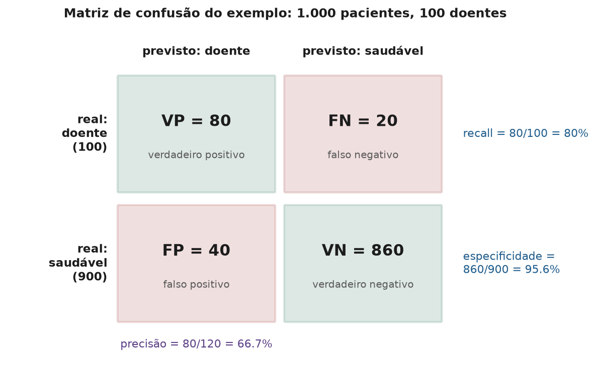
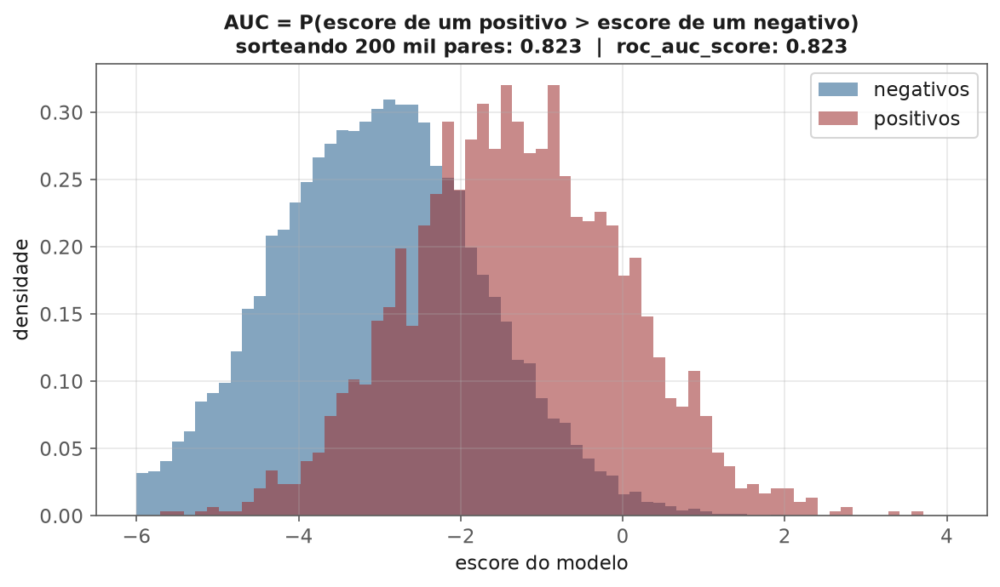
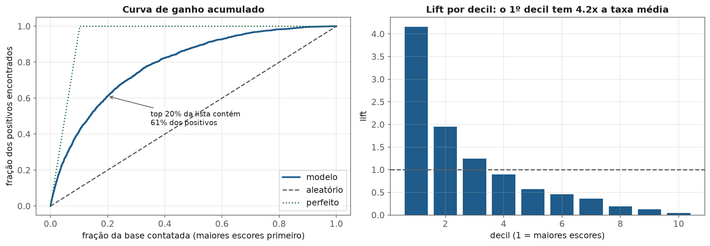
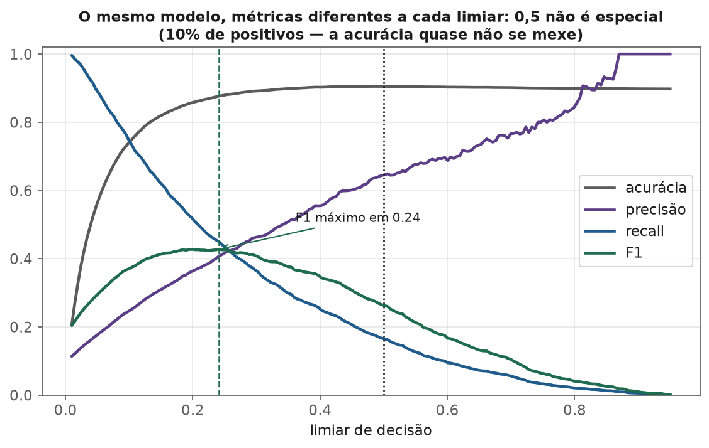
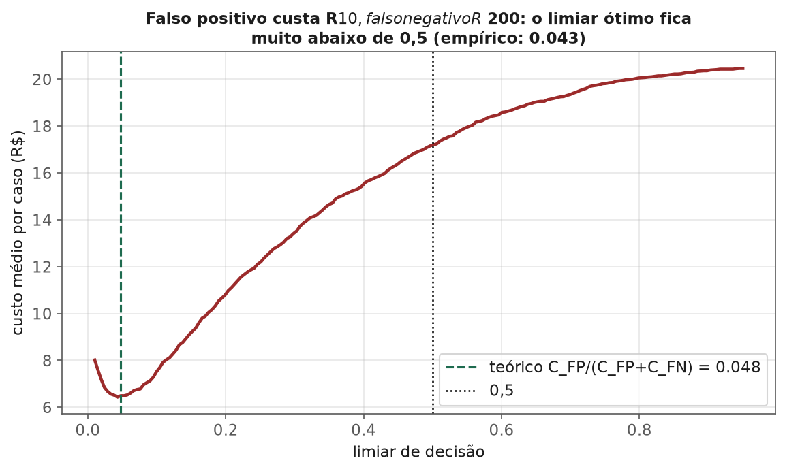

<!-- tema: Avaliação e Validação de Modelos > Métricas de Classificação -->
<!-- subtitulo: A métrica é a definição de "bom" — escolha a errada e o modelo otimiza o problema errado -->
<!-- resumo: Todo modelo de classificação é avaliado por um número, e esse número decide qual modelo vai para produção. Este material constrói, a partir da matriz de confusão, o catálogo completo de métricas de classificação — acurácia, precisão, recall, especificidade, F-beta, acurácia balanceada, MCC e kappa —, mostra como a prevalência muda a precisão pelo teorema de Bayes, trata o caso multiclasse (macro, micro, ponderada), explica ROC-AUC como probabilidade de ordenar um par, PR-AUC e average precision, Gini e KS do mercado de crédito, curvas de ganho e lift, e fecha com a escolha do limiar pelo custo de negócio, intervalos de confiança por bootstrap e o teste de McNemar para comparar dois modelos no mesmo conjunto de teste. -->
<!-- nivel: Intermediário — abre o tema de Avaliação e Validação -->
<!-- prerequisitos: Testes de Hipótese e Bootstrap (tema 1); Dados Desbalanceados (tema 3); Regressão Logística (tema 4) -->
<!-- duracao: 10 a 12 horas (leitura + 3 notebooks) -->
<!-- notebooks: 01-matriz-de-confusao-e-metricas · 02-roc-e-pr · 03-metrica-guiada-por-custo · 99-exercicios -->
<!-- autor: Material do curso de ML & DL -->
<!-- versao: 1.0 -->

# Métricas de Classificação

## Por que este módulo existe

Os temas anteriores usaram métricas o tempo todo — acurácia, AUC, F1,
PR-AUC — quase sempre como ferramenta, raramente como objeto de estudo.
Este tema inverte a perspectiva. A pergunta deixa de ser "qual modelo é
melhor?" e passa a ser "**o que significa ser melhor**, e como saber se a
diferença que eu medi é real?".

A escolha da métrica não é um detalhe técnico no fim do projeto. Ela é a
**definição operacional do problema**. Um modelo de triagem de câncer
otimizado por acurácia, um modelo de fraude otimizado por ROC-AUC e um
modelo de marketing otimizado por F1 podem estar, os três, resolvendo com
competência o problema errado — porque o número que eles maximizam não é o
número que o negócio precisa.

> [!ANALOGIA] Uma escola que avalia professores só pela taxa de aprovação
> dos alunos vai, com o tempo, ter professores excelentes em aprovar alunos
> — o que não é o mesmo que professores excelentes em ensinar. Métricas
> moldam o comportamento de quem é avaliado por elas (a **lei de Goodhart**:
> quando uma medida vira meta, deixa de ser uma boa medida). Um modelo de
> machine learning é o avaliado mais obediente que existe: ele otimiza
> exatamente o que você mandou, sem nenhum bom senso sobre o que você
> quis dizer.

### O que você vai conseguir fazer ao final

- Calcular, a partir de uma matriz de confusão, todas as métricas de
  classificação usuais — e explicar o que cada uma ignora.
- Prever como a precisão de um modelo muda quando a prevalência muda, sem
  retreinar nada.
- Escolher entre média macro, micro e ponderada num problema multiclasse.
- Interpretar ROC-AUC como probabilidade, saber quando PR-AUC é mais
  informativa e traduzir AUC em Gini e KS para conversar com o mercado de
  crédito.
- Escolher o limiar de decisão pelo custo e pela capacidade operacional, e
  comparar dois modelos com um teste estatístico em vez de "no olho".

---

## A matriz de confusão

Todo classificador binário, depois de escolhido um limiar, produz quatro
contagens. Usaremos a notação em português, com a equivalente em inglês
entre parênteses, porque ambas aparecem na literatura e nas bibliotecas:

- **VP** — verdadeiro positivo (TP): era positivo e o modelo disse positivo.
- **FN** — falso negativo (FN): era positivo e o modelo disse negativo.
- **FP** — falso positivo (FP): era negativo e o modelo disse positivo.
- **VN** — verdadeiro negativo (TN): era negativo e o modelo disse negativo.

O exemplo que atravessa o módulo: um exame de triagem aplicado a **1.000
pacientes**, dos quais **100 têm a doença**. O modelo acerta 80 dos 100
doentes e dá alarme falso para 40 dos 900 saudáveis.

### As métricas de base

> [!FORMULA] Com $n = VP + FN + FP + VN$:
>
> $$\text{acurácia} = \frac{VP + VN}{n} \qquad \text{precisão} = \frac{VP}{VP + FP} \qquad \text{recall} = \frac{VP}{VP + FN} \qquad \text{especificidade} = \frac{VN}{VN + FP}$$
>
> Recall também se chama **sensibilidade** ou taxa de verdadeiro positivo
> (TPR); a taxa de falso positivo é $\text{FPR} = 1 - \text{especificidade}$.
> A precisão também se chama valor preditivo positivo (VPP).

No exemplo: acurácia $= 940/1.000 = 94\%$; precisão $= 80/120 \approx 66{,}7\%$;
recall $= 80/100 = 80\%$; especificidade $= 860/900 \approx 95{,}6\%$.

Cada métrica responde a uma pergunta diferente — e ignora o resto:

- **Precisão:** "quando o modelo alarma, com que frequência acerta?" —
  ignora os doentes que ficaram sem alarme.
- **Recall:** "de todos os doentes, quantos o modelo encontrou?" — ignora
  quantos saudáveis foram incomodados.
- **Especificidade:** "de todos os saudáveis, quantos foram deixados em
  paz?" — ignora os doentes.
- **Acurácia:** "quantos acertos no total?" — mistura tudo, dominada pela
  classe majoritária.

> [!ARMADILHA] O classificador que diz "saudável" para todo mundo tem
> acurácia de **90%** neste exemplo — só 4 pontos abaixo do modelo real — e
> não encontra um único doente. O tema 3 (módulo de Dados Desbalanceados)
> já mostrou esse efeito; aqui fica a regra geral: **acurácia só é
> informativa quando as classes são aproximadamente balanceadas e os dois
> tipos de erro custam parecido**. Fora disso, ela é a métrica mais
> enganosa do catálogo.

### F-beta: combinar precisão e recall com pesos

> [!FORMULA] A média harmônica ponderada de precisão ($P$) e recall ($R$):
>
> $$F_\beta = (1 + \beta^2)\,\frac{P \cdot R}{\beta^2 P + R}$$
>
> Com $\beta = 1$, precisão e recall pesam igual (é o $F_1$, que também
> se escreve $F_1 = \frac{2\,VP}{2\,VP + FP + FN}$). Com $\beta = 2$, o
> recall pesa quatro vezes mais ($\beta^2$); com $\beta = 0{,}5$, a precisão
> pesa mais.

No exemplo, $F_1 = 160/220 \approx 0{,}727$ e
$F_2 = 5 \cdot 0{,}667 \cdot 0{,}8 / (4 \cdot 0{,}667 + 0{,}8) \approx 0{,}769$ —
maior que o $F_1$, porque o modelo é melhor em recall (80%) que em
precisão (67%), e o $F_2$ premia o recall.

Por que média **harmônica** e não aritmética? Porque ela é dominada pelo
menor dos dois valores: um modelo com precisão 100% e recall 1% tem média
aritmética de 50,5% e $F_1$ de apenas 2%. O $F_1$ não deixa um dos lados
compensar o colapso do outro.

> [!ARMADILHA] $F_1$ ignora completamente os **verdadeiros negativos**. Isso
> é conveniente quando a classe negativa é enorme e desinteressante (fraude,
> busca de documentos), mas faz o $F_1$ mudar de valor se você simplesmente
> **trocar qual classe chama de positiva** — algo que acurácia, MCC e
> kappa não fazem. Sempre declare qual é a classe positiva ao reportar
> $F_1$.

### Métricas que usam a matriz inteira: acurácia balanceada, MCC e kappa

> [!FORMULA] **Acurácia balanceada**: a média do recall de cada classe.
>
> $$\text{acurácia balanceada} = \frac{\text{recall} + \text{especificidade}}{2}$$
>
> **Coeficiente de correlação de Matthews (MCC)**: a correlação de Pearson
> entre o rótulo real e o previsto, calculada direto da matriz:
>
> $$\text{MCC} = \frac{VP \cdot VN - FP \cdot FN}{\sqrt{(VP+FP)(VP+FN)(VN+FP)(VN+FN)}}$$
>
> **Kappa de Cohen**: a concordância observada $p_o$ (a acurácia) corrigida
> pela concordância esperada por acaso $p_e$, dadas as proporções de cada
> classe no real e no previsto:
>
> $$\kappa = \frac{p_o - p_e}{1 - p_e}$$

**No exemplo:** acurácia balanceada $= (0{,}80 + 0{,}956)/2 \approx 0{,}878$.
MCC $= (80 \cdot 860 - 40 \cdot 20)/\sqrt{120 \cdot 100 \cdot 900 \cdot 880} = 68.000/97.488 \approx 0{,}698$.
Para o kappa, o modelo prevê "doente" para 12% dos pacientes e 10% são
doentes, então $p_e = 0{,}12 \cdot 0{,}10 + 0{,}88 \cdot 0{,}90 = 0{,}804$ e
$\kappa = (0{,}94 - 0{,}804)/(1 - 0{,}804) \approx 0{,}694$.

O classificador que diz "saudável" para todos tem acurácia 90%, mas
acurácia balanceada 0,5, MCC 0 e kappa 0 — essas três métricas **não se
deixam enganar** pelo desbalanceamento.

> [!MERCADO] MCC é considerado por boa parte da literatura a métrica escalar
> mais honesta para classificação binária desbalanceada (Chicco & Jurman,
> 2020), porque só é alto quando o modelo vai bem nos **quatro** quadrantes.
> Na prática de mercado, porém, ele é pouco conhecido por times de negócio;
> o caminho mais eficaz costuma ser reportar precisão e recall (que qualquer
> gestor entende) no limiar de operação, e usar MCC ou PR-AUC internamente
> para comparar modelos.

## A prevalência muda a precisão

Recall e especificidade são propriedades do modelo **condicionadas à
classe real**: "dado que o paciente é doente, qual a chance de o modelo
alarmar?". Elas não dependem de quantos doentes existem na população. A
precisão, ao contrário, depende — e o teorema de Bayes (tema 1, módulo 5)
diz exatamente como.

> [!FORMULA] Com prevalência $\pi$ (fração de positivos na população):
>
> $$\text{precisão} = \frac{\text{recall} \cdot \pi}{\text{recall} \cdot \pi + (1 - \text{especificidade})(1 - \pi)}$$

**Exemplo numérico.** O mesmo exame (recall 80%, especificidade 95,6%)
aplicado a uma população com prevalência de **1%**, em vez de 10%:

$$\text{precisão} = \frac{0{,}80 \cdot 0{,}01}{0{,}80 \cdot 0{,}01 + 0{,}044 \cdot 0{,}99} = \frac{0{,}0080}{0{,}0080 + 0{,}0440} \approx 15{,}4\%$$

O modelo é exatamente o mesmo; a precisão caiu de 66,7% para 15,4% porque
agora há muito mais saudáveis para gerar falsos positivos. De cada 100
alarmes, 85 são falsos.

> [!ARMADILHA] Um modelo validado num conjunto de teste com prevalência
> artificial — por exemplo, um teste balanceado 50/50 montado para "facilitar
> a avaliação", ou uma amostra de hospital de referência, onde a doença é
> muito mais comum que na população geral — vai reportar uma precisão que
> **não se repete em produção**. Recall e especificidade viajam entre
> populações; precisão, $F_1$ e acurácia não. Sempre avalie na prevalência
> em que o modelo vai operar, ou recalcule a precisão com a fórmula acima.

## Métricas multiclasse

Com $K$ classes, a matriz de confusão é $K \times K$, e precisão, recall e
$F_1$ são calculados **por classe** (cada classe como "positiva" contra
todas as outras). A questão é como resumir $K$ números em um:

- **Macro:** média simples das métricas por classe. Cada classe pesa igual,
  não importa quão rara — uma classe rara com desempenho ruim derruba a
  média.
- **Ponderada (*weighted*):** média ponderada pelo número de exemplos de
  cada classe. Dominada pelas classes grandes.
- **Micro:** soma VP, FP e FN de todas as classes e calcula a métrica uma
  vez. Em classificação com um único rótulo por exemplo, micro-precisão,
  micro-recall e micro-$F_1$ são todos **iguais à acurácia**.

**Exemplo numérico.** Um classificador de tickets de suporte com três
classes: "dúvida" (800 tickets, $F_1 = 0{,}95$), "reclamação" (150,
$F_1 = 0{,}70$) e "cancelamento" (50, $F_1 = 0{,}40$). A média macro é
$(0{,}95 + 0{,}70 + 0{,}40)/3 \approx 0{,}683$; a ponderada é
$0{,}8 \cdot 0{,}95 + 0{,}15 \cdot 0{,}70 + 0{,}05 \cdot 0{,}40 = 0{,}885$.
Se o que importa para o negócio são os cancelamentos — os tickets raros
em que um cliente está indo embora —, a ponderada de 0,885 esconde o
problema e a macro de 0,683 o revela.

> [!NOTA] Regra prática: use **macro** quando todas as classes importam
> igualmente (ou as raras importam mais); **ponderada** quando o custo de
> erro é proporcional ao volume; e sempre olhe a tabela por classe
> (`classification_report`) antes de confiar em qualquer média.

## Métricas de ranking: ROC-AUC e PR-AUC

As métricas até aqui exigem um limiar. Muitas vezes, porém, o que se quer
avaliar é o **escore** em si — a capacidade do modelo de colocar positivos
acima de negativos —, independentemente do limiar que será escolhido
depois. Para isso servem as curvas ROC e precisão-recall.

### A curva ROC e o significado da AUC

A curva ROC plota a taxa de verdadeiro positivo (recall) contra a taxa de
falso positivo, variando o limiar de $+\infty$ (ninguém é positivo, ponto
$(0,0)$) até $-\infty$ (todos são positivos, ponto $(1,1)$). Um modelo
aleatório fica na diagonal; um perfeito passa pelo canto $(0, 1)$.

A área sob a curva, a **AUC**, tem uma interpretação probabilística
exata, que é a forma mais útil de pensar nela:

> [!FORMULA] A AUC é a probabilidade de que um positivo sorteado ao acaso
> receba um escore **maior** que um negativo sorteado ao acaso:
>
> $$\text{AUC} = P(s^+ > s^-) = \frac{1}{n_+\, n_-}\sum_{i \in +}\ \sum_{j \in -} \left[\mathbf{1}(s_i > s_j) + \frac{1}{2}\,\mathbf{1}(s_i = s_j)\right]$$
>
> É a estatística $U$ de Mann-Whitney (tema 1, testes não paramétricos)
> dividida pelo número de pares.

**Exemplo numérico.** Três positivos com escores $\{0{,}9;\ 0{,}6;\ 0{,}4\}$ e
quatro negativos com $\{0{,}7;\ 0{,}3;\ 0{,}2;\ 0{,}1\}$. Dos $3 \times 4 = 12$
pares: o 0,9 vence os 4 negativos; o 0,6 vence 3 (perde para o 0,7); o 0,4
vence 3. Total: $10/12 \approx 0{,}833$.

> [!MERCADO] No mercado de crédito, a AUC costuma aparecer disfarçada de
> **Gini** — $\text{Gini} = 2 \cdot \text{AUC} - 1$, que vai de 0 (aleatório)
> a 1 (perfeito) — e ao lado da estatística **KS** (Kolmogorov-Smirnov), a
> maior distância vertical entre as curvas de distribuição acumulada dos
> escores de bons e maus pagadores, que equivale a
> $\max(\text{TPR} - \text{FPR})$ ao longo dos limiares. Um modelo de
> crédito com AUC 0,75 é apresentado como "Gini de 50"; KS acima de 40 é
> considerado bom para modelos de concessão. As três métricas medem a
> mesma coisa — separação entre as classes — em escalas diferentes.

### Precisão-recall e average precision

A curva precisão-recall plota precisão contra recall ao longo dos
limiares. Sua área é resumida pela **average precision** (AP):

$$\text{AP} = \sum_{k} (R_k - R_{k-1})\, P_k$$

— a média das precisões em cada ponto em que o recall aumenta, ponderada
pelo aumento. Diferente da ROC, a linha de base da curva PR **não** é fixa:
um modelo aleatório tem precisão igual à prevalência em todos os níveis de
recall, então AP de 0,10 é "aleatório" com 10% de positivos e ótima com
0,1% de positivos.

### Por que a ROC é otimista quando a classe positiva é rara

Os dois eixos da ROC são taxas condicionadas à classe real (TPR sobre os
positivos, FPR sobre os negativos), e por isso a curva **não muda** com a
prevalência. Isso é uma vantagem (a ROC descreve o modelo, não a
população) e uma armadilha (a ROC não mostra o que o usuário do modelo vai
viver). Com 1% de positivos, uma FPR de 5% — que parece baixa no gráfico
ROC — gera cinco falsos positivos para cada positivo real.

> [!NOTA] Nenhuma das duas é "a certa". ROC-AUC é ótima para comparar
> modelos entre populações e períodos (é estável), e para problemas em que
> as duas classes importam. PR-AUC é mais informativa quando a classe
> positiva é rara e é o foco — fraude, doença rara, busca —, porque reflete
> diretamente a experiência de quem recebe os alertas. Reportar as duas,
> com a prevalência ao lado, é o padrão mais honesto.

### Curvas de ganho e lift

Em marketing e cobrança, a pergunta operacional é: "se eu contatar os $x\%$
clientes de maior escore, que fração dos positivos eu alcanço?". A **curva
de ganho acumulado** responde exatamente isso, e o **lift** é a razão entre
a taxa de positivos num segmento da lista ordenada e a taxa média da base.

> [!MERCADO] "Lift de 4 no primeiro decil" é a frase que vende um modelo
> para uma diretoria de marketing: contatar os 10% de maior escore rende
> quatro vezes mais respostas por contato do que uma campanha aleatória.
> Convertida em custo por resposta, a curva de ganho vira diretamente o
> argumento financeiro do projeto — e define até onde descer na lista
> (o ponto em que a margem de mais um contato fica negativa).

## Do escore à decisão: o limiar

A curva ROC e a AUC avaliam o escore; em produção, porém, alguém precisa
decidir "sim" ou "não". Três formas de escolher o limiar, em ordem crescente
de conexão com o negócio:

1. **Otimizar uma métrica** — o limiar que maximiza $F_1$, ou a estatística
   de Youden ($J = \text{TPR} - \text{FPR}$, o ponto da ROC mais distante da
   diagonal, que é também o KS). Fácil, mas arbitrário: $F_1$ supõe que
   precisão e recall valem o mesmo.
2. **Minimizar o custo esperado** — com custo $C_{FP}$ por falso positivo e
   $C_{FN}$ por falso negativo, e probabilidades **calibradas** (módulo 5),
   o limiar ótimo é
   $$p^* = \frac{C_{FP}}{C_{FP} + C_{FN}}$$
   (a derivação completa está no tema 3, módulo de Dados Desbalanceados).
3. **Respeitar a capacidade** — quando só é possível agir sobre $k$ casos
   (investigar 50 alertas, ligar para 2.000 clientes), o "limiar" é
   simplesmente o $k$-ésimo maior escore, e as métricas relevantes são
   precisão@$k$ e recall@$k$ (módulo de Detecção de Anomalias, tema 5).

> [!ARMADILHA] Comparar modelos pela AUC e depois operar num limiar
> específico pode escolher o modelo errado. Dois modelos com curvas ROC que
> se cruzam têm AUCs parecidas, mas um deles pode ser muito melhor **na
> região da curva em que você vai operar** (por exemplo, com FPR abaixo de
> 1%, a única região aceitável para bloquear transações). Quando o ponto de
> operação é conhecido, compare os modelos **no ponto de operação** — pelo
> custo, ou por métricas como TPR a FPR fixa, ou pela AUC parcial.

## Quão certo é o número? Incerteza e comparação

Toda métrica calculada num conjunto de teste é uma **estimativa** com
erro-padrão — o livro dois do tema 4 mostrou isso para a acurácia. Duas
ferramentas resolvem a maior parte dos casos:

**Intervalo de confiança por bootstrap** (tema 1, módulo 3): reamostre o
conjunto de teste com reposição milhares de vezes, recalcule a métrica em
cada reamostra e use os percentis 2,5% e 97,5% como intervalo de 95%.
Funciona para qualquer métrica — inclusive $F_1$, AUC e AP, que não têm
fórmula simples de erro-padrão.

**Teste de McNemar** para comparar dois classificadores **no mesmo conjunto
de teste**. O que importa são só os casos em que eles discordam:

> [!FORMULA] Seja $b$ o número de exemplos que o modelo 1 acerta e o
> modelo 2 erra, e $c$ o contrário. Sob a hipótese de desempenho igual,
> $b$ e $c$ deveriam ser parecidos, e
>
> $$\chi^2 = \frac{(|b - c| - 1)^2}{b + c}$$
>
> segue aproximadamente uma qui-quadrado com 1 grau de liberdade (o $-1$ é
> a correção de continuidade). Com $b = 40$ e $c = 20$:
> $\chi^2 = 19^2/60 \approx 6{,}02$, p-valor $\approx 0{,}014$.

> [!ARMADILHA] Comparar dois modelos com dois intervalos de confiança
> independentes ("os intervalos se sobrepõem, então não há diferença")
> ignora que os dois foram avaliados **nos mesmos exemplos** — seus erros
> são correlacionados, e a diferença entre eles é muito mais precisa do que
> cada métrica isolada. Testes pareados (McNemar para acertos, bootstrap
> pareado ou o teste de DeLong para AUC) exploram essa correlação e
> detectam diferenças que a comparação de intervalos não detecta.

## Qual métrica para qual problema

| Situação | Métrica principal | Por quê |
| :-- | :-- | :-- |
| Classes balanceadas, erros com custos parecidos | acurácia (e F1) | simples e informativa nesse caso |
| Classe positiva rara e é o foco (fraude, doença) | PR-AUC; precisão e recall no limiar | reflete a experiência de quem recebe os alertas |
| Comparar modelos entre períodos ou populações | ROC-AUC (Gini, KS) | estável à prevalência |
| Custos de erro conhecidos | custo esperado no limiar ótimo | é o que o negócio de fato paga |
| Capacidade de ação limitada | precisão@k, recall@k, lift | o limiar é o k-ésimo escore |
| Multiclasse com classes raras importantes | F1 macro + tabela por classe | não deixa a classe grande esconder as pequenas |
| Probabilidades usadas diretamente (preço, risco) | log loss, Brier | premiam probabilidades calibradas (módulo 5) |
| Resumo escalar honesto para desbalanceado | MCC | só é alto se os quatro quadrantes vão bem |

## Erros que custam caro — checklist

- Reportar acurácia num problema desbalanceado sem mostrar o baseline de
  "sempre a classe majoritária".
- Reportar precisão ou F1 medidos numa prevalência diferente da de
  produção.
- Reportar F1 sem dizer qual é a classe positiva.
- Usar a média ponderada num multiclasse em que as classes raras são as
  que importam.
- Escolher modelos por ROC-AUC quando a classe positiva é rara e o foco —
  e se surpreender com a enxurrada de falsos positivos.
- Usar o limiar de 0,5 por padrão, sem olhar custo nem capacidade.
- Escolher o limiar olhando o conjunto de teste (o limiar é um
  hiperparâmetro: escolha na validação).
- Reportar uma métrica sem intervalo de confiança, e declarar um vencedor
  por uma diferença na terceira casa decimal.
- Comparar dois modelos com testes não pareados quando eles foram avaliados
  nos mesmos exemplos.

## Para ir além

- Fawcett (2006), *An introduction to ROC analysis* — o tutorial de
  referência sobre curvas ROC.
- Saito & Rehmsmeier (2015), *The Precision-Recall Plot Is More
  Informative than the ROC Plot When Evaluating Binary Classifiers on
  Imbalanced Datasets*.
- Chicco & Jurman (2020), *The advantages of the Matthews correlation
  coefficient (MCC) over F1 score and accuracy in binary classification
  evaluation*.
- Dietterich (1998), *Approximate Statistical Tests for Comparing
  Supervised Classification Learning Algorithms* — a origem da
  recomendação do teste de McNemar.
- Provost & Fawcett, *Data Science for Business*, capítulos 7 e 8 —
  curvas de lucro, ganho e lift com a lógica de negócio.
