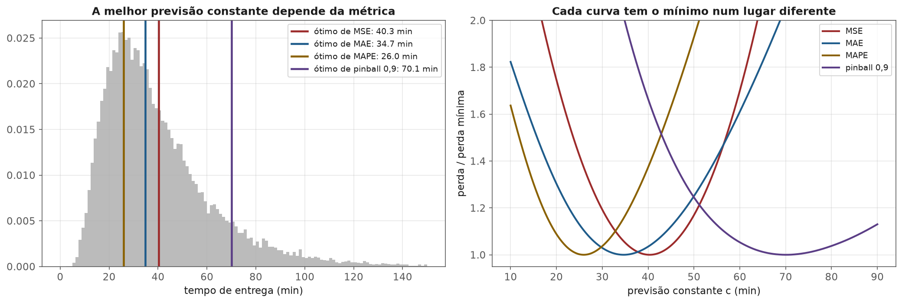
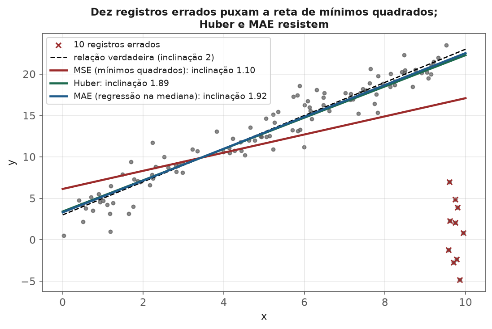
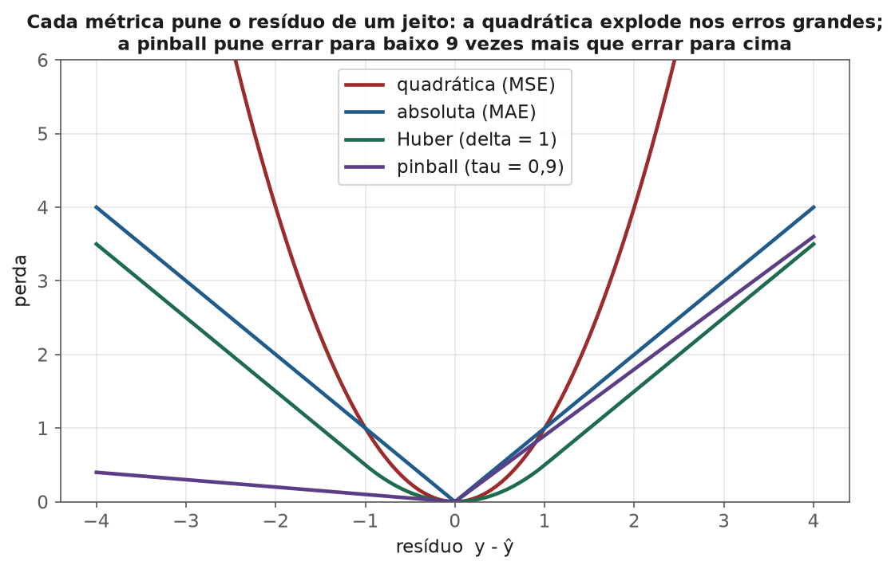
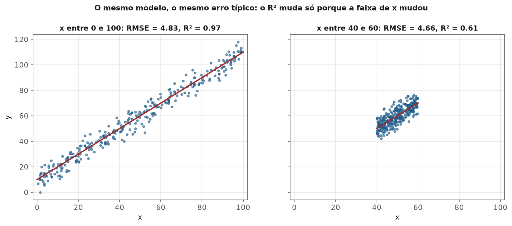
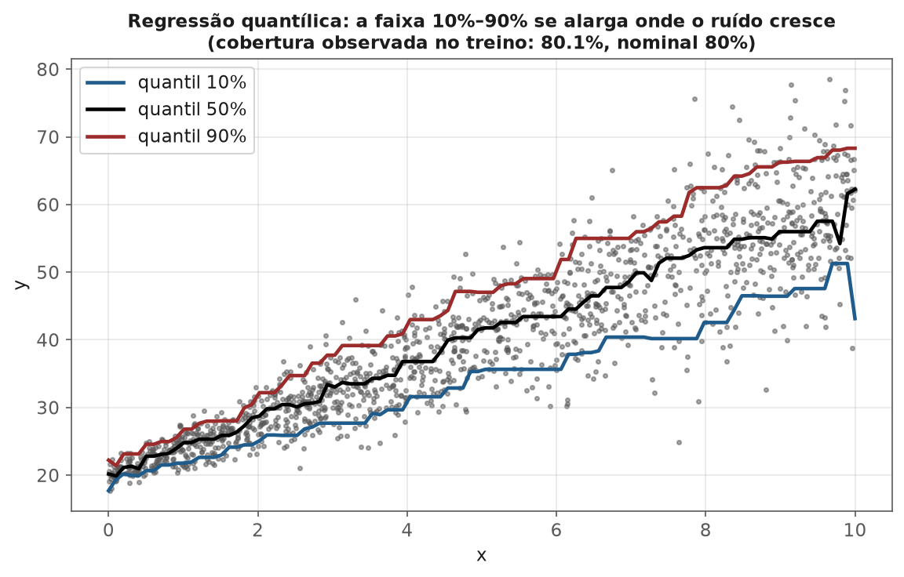

<!-- tema: Avaliação e Validação de Modelos > Métricas de Regressão -->
<!-- subtitulo: Toda métrica de regressão é uma pergunta sobre a distribuição de y — a média, a mediana ou um quantil -->
<!-- resumo: Em regressão, escolher a métrica é escolher qual estatística da distribuição do alvo o modelo vai estimar: o erro quadrático leva à média, o absoluto à mediana, a perda pinball a um quantil, e o MAPE a uma previsão sistematicamente baixa. Este material cobre MAE, MSE e RMSE, MAPE e suas patologias, WAPE, RMSLE, R² e o que ele não diz, a robustez a outliers (Huber), a perda pinball e a regressão quantílica, o problema do jornaleiro (quanto estocar quando faltar e sobrar custam diferente), intervalos de previsão e sua cobertura, previsão conformal, e as deviances de Poisson e Tweedie para contagens e sinistros. -->
<!-- nivel: Intermediário -->
<!-- prerequisitos: Métricas de Classificação (módulo anterior); Estatística Descritiva e Robustez (tema 1); Regressão Linear (tema 4) -->
<!-- duracao: 8 a 10 horas (leitura + 2 notebooks) -->
<!-- notebooks: 01-metricas-e-o-que-elas-punem · 02-erro-assimetrico-e-quantis · 99-exercicios -->
<!-- autor: Material do curso de ML & DL -->
<!-- versao: 1.0 -->

# Métricas de Regressão

## Por que este módulo existe

Em classificação, a pergunta "o modelo acertou?" tem resposta binária. Em
regressão, todo modelo erra — a pergunta é **como** ele erra, e qual erro
importa. Prever 50 unidades de um produto quando a demanda foi 60 é tão
grave quanto prever 70? Errar 10 minutos numa entrega de 15 minutos é o
mesmo que errar 10 minutos numa entrega de 2 horas? Um único erro de 100 é
pior que dez erros de 10?

Cada métrica de regressão responde a essas perguntas de um jeito, e a
consequência é mais profunda do que parece: **a métrica determina qual
estatística da distribuição do alvo o modelo aprende a estimar**. Um modelo
treinado com erro quadrático aprende a média condicional; com erro
absoluto, a mediana condicional; com a perda pinball, um quantil. Não são
detalhes de otimização — são produtos diferentes.

> [!ANALOGIA] Pergunte a três pessoas "quanto tempo leva para chegar ao
> aeroporto?". A primeira responde com a média das viagens (40 minutos). A
> segunda, com o tempo típico (35 minutos, a mediana). A terceira, que já
> perdeu um voo, responde "saia com 70 minutos, porque em 9 de cada 10
> viagens isso basta" (o quantil de 90%). As três respostas estão
> corretas — para perguntas diferentes. Uma métrica de regressão é a
> escolha da pergunta.

### O que você vai conseguir fazer ao final

- Calcular e interpretar MAE, MSE, RMSE, MAPE, WAPE, RMSLE e R², e dizer
  qual estatística do alvo cada uma premia.
- Reconhecer as patologias do MAPE e do R² antes que elas apareçam num
  relatório.
- Escolher uma perda robusta a outliers (Huber, absoluta) quando os dados
  têm erros de registro.
- Usar a perda pinball e a regressão quantílica para decisões com custos
  assimétricos, e resolver o problema do jornaleiro.
- Construir intervalos de previsão e verificar sua **cobertura** — com
  regressão quantílica e com previsão conformal.

---

## O catálogo básico

Com $e_i = y_i - \hat{y}_i$ o resíduo do exemplo $i$:

> [!FORMULA]
> $$\text{MAE} = \frac{1}{n}\sum_i |e_i| \qquad \text{MSE} = \frac{1}{n}\sum_i e_i^2 \qquad \text{RMSE} = \sqrt{\text{MSE}}$$
>
> $$\text{MAPE} = \frac{100\%}{n}\sum_i \left|\frac{e_i}{y_i}\right| \qquad \text{WAPE} = \frac{\sum_i |e_i|}{\sum_i |y_i|} \qquad R^2 = 1 - \frac{\sum_i e_i^2}{\sum_i (y_i - \bar{y})^2}$$

### Um exemplo numérico

Cinco lojas, demanda real $y = [100, 120, 80, 200, 50]$ e previsão
$\hat{y} = [110, 115, 90, 150, 55]$. Os resíduos são
$e = [-10, 5, -10, 50, -5]$.

- $\text{MAE} = (10 + 5 + 10 + 50 + 5)/5 = 16$.
- $\text{MSE} = (100 + 25 + 100 + 2.500 + 25)/5 = 550$, e
  $\text{RMSE} = \sqrt{550} \approx 23{,}5$.
- $\text{MAPE} = (10\% + 4{,}2\% + 12{,}5\% + 25\% + 10\%)/5 \approx 12{,}3\%$.
- $\text{WAPE} = 80/550 \approx 14{,}5\%$.
- Com $\bar{y} = 110$, a soma dos quadrados total é
  $100 + 100 + 900 + 8.100 + 3.600 = 12.800$, e
  $R^2 = 1 - 2.750/12.800 \approx 0{,}785$.

Repare no RMSE: ele é quase 50% maior que o MAE porque um único erro (o de
50 unidades, na loja 4) responde por 91% da soma dos quadrados. A razão
$\text{RMSE}/\text{MAE}$ é um diagnóstico útil: perto de 1, os erros são
parecidos entre si; muito acima de 1, poucos erros grandes dominam.

### MAE, MSE e o que cada um estima

A pergunta-chave: se o modelo pudesse prever **uma única constante** $c$
para todos os exemplos, qual $c$ minimizaria cada métrica?

> [!FORMULA]
> $$\arg\min_c \frac{1}{n}\sum_i (y_i - c)^2 = \bar{y} \ (\text{a média}) \qquad \arg\min_c \frac{1}{n}\sum_i |y_i - c| = \text{mediana}(y)$$
>
> A primeira sai de derivar e igualar a zero (tema 1). A segunda: a
> derivada de $|y_i - c|$ é $-1$ ou $+1$ conforme $y_i$ esteja acima ou
> abaixo de $c$, e a soma só zera quando há tantos pontos acima quanto
> abaixo — a mediana.

O mesmo vale **condicionalmente**: um modelo que minimiza o MSE estima
$E[y \mid x]$; um que minimiza o MAE estima $\text{mediana}(y \mid x)$. Para
alvos simétricos, as duas coincidem. Para alvos assimétricos — valores
monetários, tempos, demandas, sinistros — elas se afastam, e a escolha da
métrica muda a previsão.

> [!MERCADO] Em previsão de tempo de entrega, a escolha é explícita: o
> aplicativo que mostra ao cliente um tempo "típico" usa algo perto da
> mediana; o que promete um prazo que quase sempre é cumprido usa um
> quantil alto; o planejamento de frota, que precisa do total de horas,
> usa a média (a soma das médias é a média da soma — a soma das medianas
> não é a mediana da soma). Três modelos, três métricas, um mesmo alvo.

### Outliers: o quadrado amplifica

Como o MSE eleva o resíduo ao quadrado, um erro 10 vezes maior pesa 100
vezes mais. Isso é desejável quando erros grandes são **de fato** muito
mais graves (subestimar a carga de um servidor em 50% derruba o sistema)
e indesejável quando os resíduos grandes vêm de **erros de registro**: o
modelo distorce toda a previsão para acomodar alguns pontos que nem
deveriam estar ali.

> [!DEFINICAO] A **perda de Huber** é quadrática para resíduos pequenos e
> linear para grandes, com a transição em $\delta$:
>
> $$L_\delta(e) = \frac{1}{2}e^2 \ \text{ se } |e| \leq \delta, \qquad L_\delta(e) = \delta\left(|e| - \frac{\delta}{2}\right) \ \text{ caso contrário}$$
>
> Combina a eficiência do MSE quando os erros são normais com a robustez
> do MAE quando há contaminação.

## MAPE e as métricas relativas

O MAPE é popular por um bom motivo: é **adimensional** e fácil de
comunicar ("erramos 12% em média"), permitindo comparar a qualidade da
previsão de um produto que vende 10 unidades com a de um que vende 10.000.
E tem três patologias sérias.

> [!ARMADILHA] **1. Divisão por zero e explosão perto de zero.** Se algum
> $y_i = 0$ (um produto que não vendeu no dia), o MAPE é indefinido; se
> $y_i$ é pequeno, um erro pequeno vira um percentual enorme. Em varejo,
> com milhares de itens de baixo giro, o MAPE da carteira pode ser
> dominado por itens que vendem 1 ou 2 unidades por semana.
>
> **2. Assimetria.** Para um valor real fixo, errar para baixo tem um teto
> (prever 0 dá erro de 100%) e errar para cima, não. Com $y = 10$ e
> $\hat{y} = 30$, o erro é de 200%; com $y = 30$ e $\hat{y} = 10$, é de 67% —
> o mesmo erro absoluto de 20 unidades.
>
> **3. Viés para baixo.** Por causa da assimetria, o MAPE premia previsões
> **baixas**: o valor constante que minimiza o MAPE é uma mediana
> ponderada por $1/y_i$, sistematicamente abaixo da mediana. Nos tempos de
> entrega da figura anterior, o ótimo do MAPE foi 26,0 minutos, contra uma
> mediana de 34,7. Um modelo otimizado para MAPE **subestima** — e numa
> previsão de demanda, isso significa ruptura de estoque.

Alternativas mais saudáveis:

- **WAPE** (ou MAD/média): $\sum|e_i| / \sum|y_i|$ — um MAE relativo ao
  volume total. Não explode com $y_i$ pequeno e é ponderado pelo volume,
  o que costuma ser o que o negócio quer. É o padrão de muitos times de
  demanda.
- **sMAPE**: divide por $(|y_i| + |\hat{y}_i|)/2$; reduz, mas não elimina, a
  assimetria, e continua instável perto de zero.
- **MASE** (erro absoluto escalado): divide o MAE pelo MAE de uma previsão
  ingênua (repetir o último valor). Será central no tema 7, Séries
  Temporais.
- **RMSLE**: o RMSE sobre $\log(1 + y)$. Mede erro **relativo** (prever 110
  para 100 custa o mesmo que prever 1.100 para 1.000) e penaliza mais a
  subestimação que a superestimação do mesmo tamanho **absoluto** (com
  $y = 100$, prever 50 custa $\ln(101/51) \approx 0{,}68$; prever 150 custa
  $\ln(151/101) \approx 0{,}40$). Minimizar o
  RMSLE equivale a prever a média geométrica condicional (a média na
  escala log).

## R²: o que ele diz e o que ele não diz

O $R^2$ compara o erro do modelo com o erro de uma previsão constante — a
média de $y$. $R^2 = 0{,}785$ significa "o modelo reduz a soma dos
quadrados dos erros em 78,5% em relação a prever sempre a média".

> [!ARMADILHA] **O $R^2$ não é uma medida de erro.** Ele depende da
> variância de $y$ na amostra: o mesmo modelo, com o mesmo erro típico,
> tem $R^2$ alto numa amostra heterogênea e baixo numa homogênea. Na
> figura abaixo, o modelo é o verdadeiro nos dois painéis e o RMSE é
> praticamente o mesmo (4,8 e 4,7); o $R^2$ cai de 0,97 para 0,61 só
> porque a faixa de $x$ encolheu. Comparar $R^2$ entre bases diferentes, ou
> entre segmentos da mesma base, é comparar variâncias, não modelos.

Três outras observações que evitam leituras erradas:

- **$R^2$ pode ser negativo** fora da amostra de treino: basta o modelo
  errar mais que a média — o que acontece com um modelo sobreajustado
  avaliado no teste.
- **No teste, a referência deve ser a média do treino**, não a do teste
  (o `r2_score` do `scikit-learn` usa a média dos próprios dados passados
  a ele, o que dá ao baseline uma informação que ele não teria em
  produção).
- **$R^2$ baixo não significa modelo inútil.** Em finanças ou em
  comportamento humano, um $R^2$ de 0,05 pode valer muito dinheiro; em
  física, um de 0,95 pode ser inaceitável. Reporte sempre o erro em
  unidades do problema (MAE, RMSE) ao lado do $R^2$.

## Erro assimétrico e quantis

Muitas decisões têm custos assimétricos: faltar produto na prateleira
custa a margem perdida e o cliente irritado; sobrar custa o desperdício ou
o capital parado. Não faz sentido prever a média nesses casos — faz
sentido prever o quantil que equilibra os dois custos.

> [!FORMULA] A **perda pinball** (ou perda quantílica) no nível $\tau$:
>
> $$L_\tau(y, q) = \tau\,(y - q) \ \text{ se } y \geq q, \qquad L_\tau(y, q) = (1 - \tau)\,(q - y) \ \text{ se } y < q$$
>
> Seu minimizador é o **quantil** $\tau$ da distribuição de $y$ (condicional
> a $x$, quando é a perda de um modelo). Com $\tau = 0{,}5$, ela é metade do
> erro absoluto — e o minimizador é a mediana.

### O problema do jornaleiro

Um jornaleiro compra jornais pela manhã sem saber a demanda do dia. Cada
jornal que falta custa $c_u$ (a margem perdida, *underage*); cada um que
sobra custa $c_o$ (o encalhe, *overage*). A quantidade ótima a comprar é o
quantil da demanda no nível

$$\tau^* = \frac{c_u}{c_u + c_o}$$

— a mesma estrutura do limiar ótimo de classificação do módulo anterior.

**Exemplo numérico.** Uma padaria vende um pão especial com margem de
R\$ 3 por unidade; cada pão que sobra no fim do dia é descartado, com
custo de produção de R\$ 1. Então $\tau^* = 3/(3 + 1) = 0{,}75$: a padaria
deve produzir o **percentil 75** da demanda prevista, não a média. Se a
demanda do dia é aproximadamente normal com média 200 e desvio-padrão 30,
isso dá $200 + 0{,}674 \times 30 \approx 220$ pães — 20 a mais que a média,
porque faltar custa três vezes mais que sobrar.

> [!MERCADO] Essa é a lógica central do planejamento de estoques no
> varejo, da escala de funcionários em call centers (subdimensionar custa
> clientes na fila; superdimensionar, salários ociosos) e do provisionamento
> de servidores em nuvem. Um time que treina o modelo de demanda com MSE e
> depois usa a previsão diretamente como pedido de compra está resolvendo
> o problema errado — está pedindo a média quando o custo pede um quantil.

### Regressão quantílica e intervalos de previsão

Treinar um modelo com a perda pinball no nível $\tau$ produz uma
estimativa do quantil condicional $q_\tau(x)$. Treinar dois — em
$\tau = 0{,}1$ e $\tau = 0{,}9$ — produz um **intervalo de previsão** de
80%: a faixa em que, idealmente, 80% dos valores reais cairão. No
`scikit-learn`, `GradientBoostingRegressor(loss="quantile", alpha=τ)`,
`HistGradientBoostingRegressor(loss="quantile", quantile=τ)` e
`QuantileRegressor` (linear) fazem isso.

A diferença para um intervalo "média ± 2 desvios-padrão" é que a
regressão quantílica não supõe que o erro seja normal nem que tenha a
mesma variância em todo lugar (homocedasticidade, tema 4): o intervalo se
adapta à incerteza local.

> [!ARMADILHA] Um intervalo de previsão só vale se sua **cobertura** for a
> prometida — e ela deve ser medida **fora da amostra**. Modelos
> quantílicos flexíveis tendem a produzir intervalos estreitos demais no
> teste (cobertura de 70% quando se prometeu 80%), pelo mesmo motivo que
> qualquer modelo parece melhor no treino. Avalie sempre duas coisas: a
> cobertura empírica no teste e a largura média do intervalo. Um intervalo
> largo o bastante sempre cobre; a arte é cobrir com a menor largura.

### Previsão conformal: cobertura garantida

A **previsão conformal** (Vovk et al., 2005; Angelopoulos & Bates, 2021)
transforma qualquer modelo num gerador de intervalos com cobertura
garantida, sem supor distribuição nenhuma. A versão mais simples, a
**conformal por divisão**:

1. Treine o modelo num conjunto de treino.
2. Num conjunto de **calibração** separado, calcule os resíduos absolutos
   $r_i = |y_i - \hat{y}_i|$.
3. Tome $\hat{q}$ como o quantil $\lceil (n+1)(1-\alpha) \rceil / n$ desses
   resíduos.
4. Para um ponto novo, o intervalo é $[\hat{y} - \hat{q},\ \hat{y} + \hat{q}]$.

Se os dados de calibração e os novos são permutáveis (grosso modo, vêm da
mesma distribuição), a cobertura é de **pelo menos** $1 - \alpha$ — uma
garantia de amostra finita, não assintótica. A versão acima dá intervalos
de largura constante; a **regressão quantílica conformalizada** (CQR)
combina as duas ideias: usa os quantis de um modelo quantílico e os
corrige com os resíduos de calibração, obtendo intervalos adaptativos
**e** com cobertura garantida. O notebook `02-erro-assimetrico-e-quantis`
implementa as duas.

## Alvos de contagem e de valor: Poisson e Tweedie

Quando o alvo é uma **contagem** (número de chamados, de sinistros, de
itens vendidos) ou um **valor com muitos zeros** (valor de sinistro por
apólice: a maioria é zero, alguns são enormes), o MSE trata mal o
problema: supõe variância constante, quando a variância de uma contagem
cresce com a média.

- A **deviance de Poisson** é a perda natural para contagens (variância
  proporcional à média) — `loss="poisson"` no `HistGradientBoostingRegressor`.
- A **deviance Tweedie**, com potência entre 1 e 2, modela uma massa em
  zero seguida de uma cauda contínua positiva — o padrão de sinistros de
  seguros, e o modelo de prêmio puro da indústria de seguros (Poisson para
  a frequência × Gama para a severidade, numa só distribuição).

Essas deviances também são métricas: `mean_poisson_deviance` e
`mean_tweedie_deviance` no `scikit-learn`. Comparar modelos de contagem pelo
MSE favorece quem acerta os valores grandes e ignora o comportamento nos
pequenos, que são a maioria.

## Qual métrica para qual problema

| Situação | Métrica | Estatística estimada |
| :-- | :-- | :-- |
| Custo proporcional ao erro, sem assimetria | MAE | mediana |
| Erros grandes são desproporcionalmente graves | RMSE / MSE | média |
| Dados com erros de registro que não se pode limpar | Huber, MAE | robusta |
| Comparar itens de escalas diferentes | WAPE, MASE | — |
| Erro relativo importa (preços, volumes com várias ordens de grandeza) | RMSLE | média geométrica |
| Custo de faltar difere do custo de sobrar | pinball no nível c_u/(c_u+c_o) | quantil |
| Intervalo de previsão | cobertura + largura (pinball nos dois quantis) | par de quantis |
| Contagens, sinistros | deviance Poisson / Tweedie | média condicional com variância adequada |
| Comunicar "quanto do fenômeno o modelo explica" | R² (ao lado de MAE/RMSE) | — |

> [!NOTA] Treine e avalie com a **mesma** métrica, ou pelo menos com
> métricas coerentes. Um modelo treinado com MSE (que estima a média) e
> avaliado com MAE (que premia a mediana) será julgado por um critério que
> ele não tentou otimizar — e pode perder para um modelo pior que foi
> treinado com MAE. O notebook `01-metricas-e-o-que-elas-punem` mostra cada
> modelo vencendo nas métricas cuja estatística ele estima: os modelos de
> média no RMSE, o de mediana no MAE, o de quantil na pinball.

## Erros que custam caro — checklist

- Reportar só o $R^2$, sem o erro em unidades do problema.
- Comparar $R^2$ entre bases ou segmentos com variâncias diferentes.
- Usar MAPE com alvos que podem ser zero ou muito pequenos.
- Otimizar MAPE numa previsão de demanda e descobrir a ruptura de estoque
  depois — o MAPE puxa as previsões para baixo.
- Usar a previsão da média como decisão quando o custo de errar para cima
  e para baixo é diferente.
- Treinar com MSE em dados com erros de registro grosseiros.
- Prometer um intervalo de 90% sem medir sua cobertura fora da amostra.
- Avaliar um modelo de contagem ou de sinistros pelo MSE.
- Treinar com uma perda e avaliar com outra sem perceber que elas estimam
  estatísticas diferentes.

## Para ir além

- Hyndman & Koehler (2006), *Another look at measures of forecast
  accuracy* — a crítica clássica ao MAPE e a proposta do MASE.
- Gneiting (2011), *Making and Evaluating Point Forecasts* — a teoria de
  qual métrica corresponde a qual estatística (funções de perda
  "consistentes").
- Koenker, *Quantile Regression* — o livro-texto de regressão quantílica.
- Angelopoulos & Bates (2021), *A Gentle Introduction to Conformal
  Prediction and Distribution-Free Uncertainty Quantification*.
- Romano, Patterson & Candès (2019), *Conformalized Quantile Regression*.
