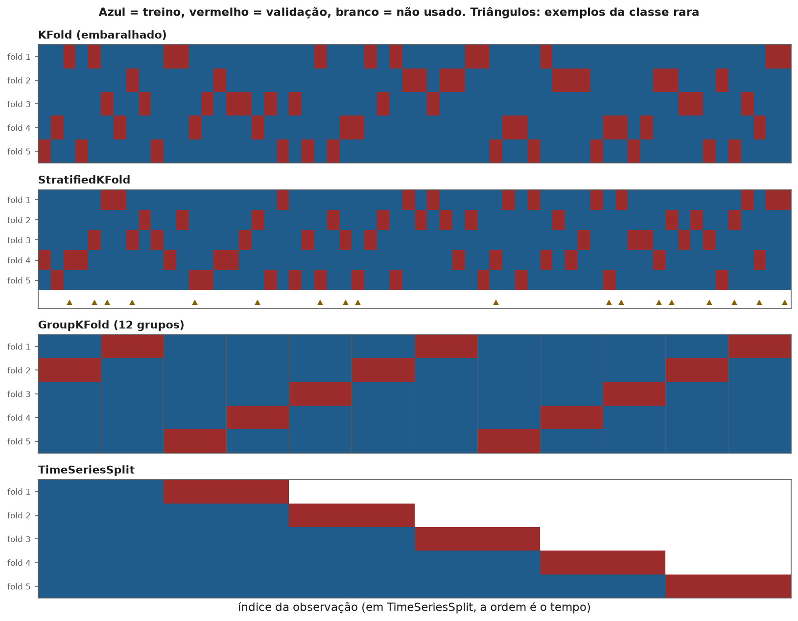
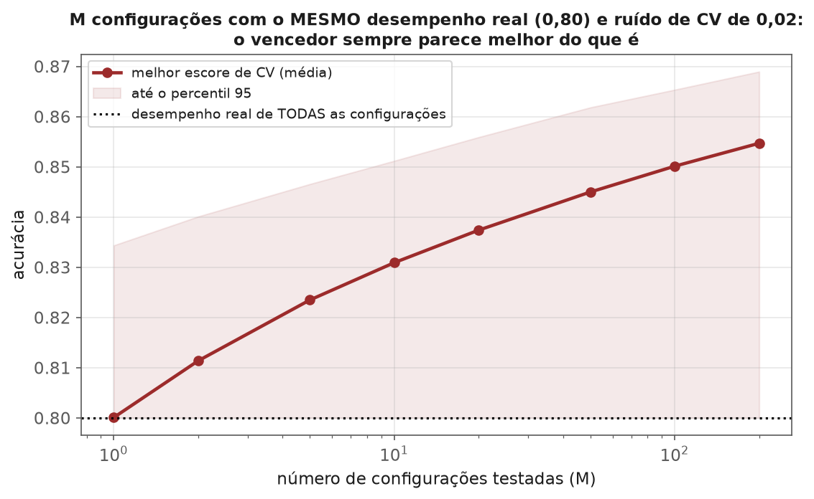
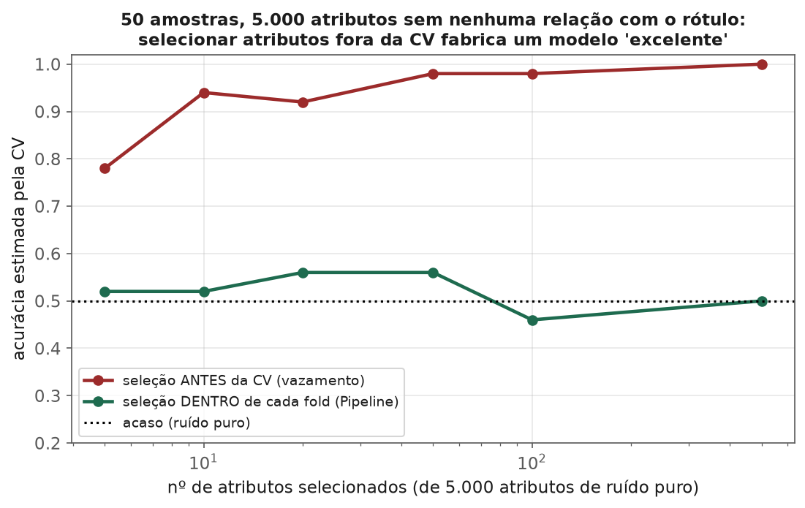

<!-- tema: Avaliação e Validação de Modelos > Validação Cruzada -->
<!-- subtitulo: O que a validação cruzada realmente estima, com que precisão — e as mil formas de ela mentir -->
<!-- resumo: A validação cruzada é a ferramenta mais usada para estimar o desempenho de um modelo, e uma das mais mal compreendidas. O livro dois do tema 4 apresentou o K-Fold e suas variantes; este módulo aprofunda o que a CV de fato estima (o desempenho médio do procedimento de treino, não o do seu modelo específico), o trade-off entre viés, variância e custo na escolha de K, por que o erro-padrão ingênuo entre folds subestima a incerteza e como comparar dois modelos com o teste t corrigido de Nadeau e Bengio, como escolher o esquema de divisão a partir da estrutura dos dados (estratos, grupos, tempo), o otimismo do melhor escore de CV (a maldição do vencedor) e a validação aninhada que o corrige, e um catálogo de vazamentos na validação — incluindo o experimento clássico em que a seleção de atributos fora da CV produz 98% de acurácia em ruído puro. -->
<!-- nivel: Intermediário/Avançado -->
<!-- prerequisitos: Métricas de Classificação e de Regressão (módulos anteriores); livro dois do tema 4 (teoria-avancada.pdf); Encoding, Escala e Vazamento (tema 3) -->
<!-- duracao: 10 a 12 horas (leitura + 3 notebooks) -->
<!-- notebooks: 01-esquemas-de-validacao · 02-validacao-aninhada · 03-vazamento-na-validacao · 99-exercicios -->
<!-- autor: Material do curso de ML & DL -->
<!-- versao: 1.0 -->

# Validação Cruzada

## Por que este módulo existe

O livro dois do tema 4 (`teoria-avancada.pdf`) já mostrou a mecânica: um
único `train_test_split` é uma loteria, e o K-Fold substitui a loteria pela
média de $K$ avaliações. Também apresentou as variantes — estratificada,
por grupos, temporal, aninhada. Este módulo parte daí e trata das
perguntas que a mecânica não responde:

- O número que a validação cruzada devolve é uma estimativa **de quê**,
  exatamente?
- Quão **precisa** é essa estimativa — e por que o desvio-padrão entre os
  folds engana?
- Como **comparar** dois modelos pela CV sem declarar vencedores por acaso?
- Quando o esquema de divisão está errado para os dados — e como
  descobrir antes que a produção descubra?
- Quais são as formas, algumas muito sutis, de a CV **vazar** informação e
  inflar o resultado?

> [!ANALOGIA] Validação cruzada é um ensaio geral. Uma orquestra que ensaia
> a sinfonia inteira cinco vezes, com públicos diferentes, tem uma boa
> ideia de como será a estreia. Mas o ensaio só prevê a estreia se imitar
> as condições dela: se nos ensaios os músicos puderem ler a partitura e
> na estreia tiverem de tocar de cor, o ensaio mede outra coisa. Toda
> falha de validação deste módulo é, no fundo, um ensaio que não imitou a
> estreia — um fold de validação com informação que o modelo não terá em
> produção.

### O que você vai conseguir fazer ao final

- Explicar o que a CV estima e por que isso não é o erro do modelo final.
- Escolher $K$ pelo trade-off entre pessimismo, variância e custo.
- Comparar dois modelos com o teste t corrigido para CV, em vez de com o
  erro-padrão ingênuo entre folds.
- Escolher o esquema de divisão a partir de uma única regra — imitar a
  separação entre treino e produção — e aplicá-la a estratos, grupos e
  tempo.
- Reconhecer o otimismo do melhor escore após o tuning e corrigi-lo com
  validação aninhada.
- Auditar um pipeline de validação contra os vazamentos mais comuns.

---

## O que a validação cruzada estima

Vale separar duas quantidades que costumam ser confundidas:

- $\text{Err}_{XY}$: o erro de generalização do **modelo específico** que
  você treinou com a **sua** amostra de treino.
- $\text{Err}$: o erro **médio** do procedimento de treino — a média de
  $\text{Err}_{XY}$ sobre todas as amostras de treino possíveis do mesmo
  tamanho, tiradas da mesma população.

Intuitivamente, espera-se que a CV estime o primeiro: "quão bom é **este**
modelo?". Um resultado importante (Bates, Hastie & Tibshirani, 2023) mostra
que ela estima, na verdade, o **segundo** — e muito mal o primeiro.

**O experimento da figura abaixo.** De uma população fixa, sorteamos 150
amostras de 80 observações. Em cada uma, treinamos uma regressão logística
e medimos (1) o erro **real** do modelo treinado com as 80 observações,
numa base de teste enorme, e (2) as estimativas de CV com $K = 2$, 5, 10 e
com *leave-one-out* (LOO). O erro real médio foi 0,289, com desvio-padrão
de apenas 0,013 entre as amostras. As estimativas de CV com $K = 10$
acertaram a média (0,285), mas com desvio-padrão de **0,048** — quase quatro
vezes maior que a variação do erro real — e correlação de apenas **0,15**
com o erro real de cada amostra.


> [!NOTA] A leitura prática: a CV é uma ótima ferramenta para responder
> "este **procedimento** (este algoritmo, com estes hiperparâmetros, neste
> tipo de dado e com este tamanho de amostra) funciona bem?". É uma
> ferramenta fraca para responder "este **modelo específico** é melhor que
> a média dos modelos que eu poderia ter obtido?". Com amostras pequenas, o
> ruído da estimativa domina — e duas CVs na mesma base, com sementes
> diferentes, podem discordar mais do que dois modelos diferentes
> discordam entre si.

## Escolhendo K: viés, variância e custo

Com $K$ folds, cada modelo é treinado com uma fração $(K-1)/K$ dos dados.
Três forças disputam a escolha:

- **Viés (pessimismo).** Modelos treinados com menos dados erram mais. Com
  $K = 2$, cada modelo vê só metade dos dados, e a CV **superestima** o
  erro — na figura, 0,310 contra 0,289. O pessimismo diminui com $K$ e é
  maior quando a curva de aprendizado (módulo 4) ainda está subindo.
- **Variância.** A média de $K$ avaliações é mais estável que uma
  avaliação única, mas os $K$ modelos compartilham dados de treino (com
  $K = 10$, dois modelos quaisquer compartilham $8/9$ das observações), e
  por isso seus erros são correlacionados — a média de avaliações
  correlacionadas reduz menos a variância do que $1/K$ sugere.
- **Custo.** $K$ treinos. Com LOO, $n$ treinos.

> [!NOTA] A fama de que LOO tem "variância alta" vale para modelos
> **instáveis** (árvores profundas, k-NN com $k$ pequeno), em que os $n$
> modelos quase idênticos respondem de forma errática aos pontos deixados
> de fora. Para modelos estáveis, como a logística do experimento, LOO teve
> até a menor variância (0,046). O argumento decisivo contra LOO costuma
> ser o **custo** — e o fato de que, para seleção de modelos, $K = 5$ ou
> $K = 10$ dão resultados equivalentes por uma fração do custo.

| K | Pessimismo | Variância | Custo | Uso típico |
| :-: | :-- | :-- | :-- | :-- |
| 2–3 | alto | alta | baixo | bases muito grandes, modelos caros |
| 5 | pequeno | moderada | 5 treinos | padrão para seleção de modelos |
| 10 | muito pequeno | moderada | 10 treinos | padrão para estimar desempenho |
| LOO (n) | quase nulo | depende da estabilidade | n treinos | bases minúsculas; modelos com atalho analítico (regressão linear, ridge) |
| K repetido r vezes | igual ao do K | menor (média de r CVs) | r·K treinos | reduzir o ruído da partição, comparar modelos |

> [!MERCADO] A repetição (`RepeatedKFold`, `RepeatedStratifiedKFold`) é o
> ajuste mais barato e mais subutilizado: 5 repetições de 5-fold custam 25
> treinos e eliminam boa parte da "sorte da partição". Se dois modelos
> trocam de posição quando se muda a semente do K-Fold, a comparação não
> estava decidida — e a repetição mostra isso antes de alguém tomar uma
> decisão com base num único sorteio.

## A incerteza da estimativa e a comparação de modelos

É tentador reportar "acurácia de 0,85 ± 0,02", com o $\pm$ sendo o
desvio-padrão dos $K$ escores divididos por $\sqrt{K}$ — o erro-padrão de
uma média de $K$ observações independentes. O problema é o
"independentes": os escores dos folds não são independentes, porque os
modelos compartilham dados de treino. Esse erro-padrão ingênuo
**subestima** a incerteza real, e Bengio & Grandvalet (2004) mostraram que
não existe estimador não viesado da variância da CV a partir de uma única
execução.

### O teste t corrigido para CV

Para comparar dois modelos A e B avaliados nos **mesmos** folds, olha-se a
diferença de desempenho em cada fold, $d_j$ ($j = 1, \dots, J$, com $J$ o
total de avaliações — por exemplo $J = 50$ em 5 repetições de 10-fold).
O teste t pareado ingênuo usa o erro-padrão $s_d/\sqrt{J}$. Nadeau &
Bengio (2003) propuseram uma correção que aproxima o efeito da
sobreposição entre conjuntos de treino:

> [!FORMULA] Teste t corrigido para reamostragem, com $n_{te}$ e $n_{tr}$ os
> tamanhos dos conjuntos de teste e de treino de cada fold:
>
> $$t = \frac{\bar{d}}{\sqrt{\left(\frac{1}{J} + \frac{n_{te}}{n_{tr}}\right) s_d^2}}$$
>
> comparado com uma t de Student com $J - 1$ graus de liberdade. O termo
> $n_{te}/n_{tr}$ — $1/9$ em 10-fold — é a correção: ele **não diminui**
> com $J$, o que impede que repetir a CV muitas vezes fabrique
> significância.

**Exemplo numérico.** Em 10-fold ($J = 10$, $n_{te}/n_{tr} = 1/9$), o
modelo A supera o B por $\bar{d} = 0{,}012$ de acurácia em média, com
desvio-padrão das diferenças $s_d = 0{,}020$. O teste ingênuo dá
$t = 0{,}012/(0{,}020/\sqrt{10}) \approx 1{,}90$ (p-valor bilateral perto de
0,09). O corrigido dá
$t = 0{,}012/\sqrt{(0{,}1 + 0{,}111) \times 0{,}0004} \approx 1{,}31$
(p-valor perto de 0,22). A diferença, que parecia "quase significativa",
está bem dentro do ruído.

> [!ARMADILHA] Repetir o K-Fold 100 vezes e aplicar o teste t ingênuo aos
> 1.000 escores é uma forma garantida de encontrar significância para
> qualquer diferença, por menor que seja: com $J = 1.000$, o erro-padrão
> ingênuo encolhe como $1/\sqrt{1000}$, mas a incerteza real — que vem de
> ter **uma única** amostra de dados — não encolhe. A repetição reduz o
> ruído da **partição**, não o ruído da **amostra**. O termo
> $n_{te}/n_{tr}$ do teste corrigido existe exatamente para isso.

## A divisão tem de imitar a produção

Uma única regra resolve quase todos os casos: **a separação entre treino e
validação deve reproduzir a separação entre os dados de treino e os dados
que o modelo verá em produção.** As variantes de K-Fold são aplicações
dessa regra a estruturas diferentes de dados.



### Estratos

Com uma classe rara, um fold pode receber, por azar, poucos exemplos
positivos — e a métrica daquele fold vira ruído puro. `StratifiedKFold`
reparte a classe rara igualmente entre os folds. Em regressão, pode-se
estratificar por faixas (quantis) do alvo. Não há motivo para **não**
estratificar em classificação.

### Grupos

Quando as observações vêm em grupos — várias consultas do mesmo paciente,
várias compras do mesmo cliente, vários dias da mesma loja, várias fotos do
mesmo objeto —, a pergunta de produção costuma ser: "como o modelo se sai
num paciente (cliente, loja) **novo**?". Um K-Fold comum espalha as
observações de cada grupo entre treino e validação, e o modelo é validado
em pacientes que ele **já viu**. Se o grupo tem características próprias
(a fisiologia de um paciente, o hábito de um cliente), o modelo aprende a
reconhecer o grupo, não o fenômeno — e a CV premia isso.

> [!ARMADILHA] O sintoma clássico: CV com K-Fold comum excelente, CV com
> `GroupKFold` muito pior, e produção parecida com a segunda. O notebook
> `01-esquemas-de-validacao` constrói um caso com pacientes em que a
> diferença é dramática. Se existe uma coluna de identidade (paciente,
> cliente, dispositivo, loja) e a produção vai lidar com identidades novas,
> `GroupKFold` (ou `StratifiedGroupKFold`) não é opcional.

### Tempo

Se o modelo vai prever o futuro a partir do passado, a validação precisa
fazer o mesmo: treinar com dados até uma data e validar com dados
**posteriores**. `TimeSeriesSplit` implementa a janela expansiva (cada fold
treina com tudo até um ponto e valida no bloco seguinte). Dois refinamentos
importantes:

- **Intervalo (*gap*)**: deixar um espaço entre o fim do treino e o início
  da validação quando o rótulo demora a ser conhecido (um alvo de "churn
  nos próximos 90 dias" só é conhecido 90 dias depois) ou quando features
  usam janelas que atravessariam a fronteira.
- **Embargo e purga** (finanças, López de Prado): remover do treino as
  observações cujo rótulo se sobrepõe no tempo às da validação.

O tema 7 (Séries Temporais) aprofunda a validação com origem móvel.

> [!NOTA] Estruturas podem se combinar: dados de clientes ao longo do
> tempo pedem validação por grupo **e** por tempo — clientes novos, em
> datas futuras. Quando nenhum esquema pronto serve, escreva o seu: um
> gerador de pares `(índices_treino, índices_validação)` pode ser passado
> diretamente como `cv=` para qualquer função do `scikit-learn`.

## A maldição do vencedor e a validação aninhada

Ao testar muitas configurações e escolher a de melhor escore de CV, o
escore do vencedor é uma estimativa **otimista** do seu desempenho real.
Não por vazamento de dados, mas por **seleção**: entre muitas estimativas
ruidosas, a maior tende a ser uma das que o ruído empurrou para cima — o
mesmo fenômeno das comparações múltiplas do tema 1.



> [!FORMULA] Se $M$ configurações têm o mesmo desempenho real $\mu$ e as
> estimativas de CV têm ruído aproximadamente normal com desvio $\sigma$,
> o valor esperado do máximo é aproximadamente
>
> $$E[\max] \approx \mu + \sigma \sqrt{2 \ln M}$$
>
> (uma aproximação assintótica, que superestima um pouco para $M$
> pequeno). Com $\sigma = 0{,}02$ e $M = 100$, o otimismo previsto é da
> ordem de $0{,}02 \times 3{,}03 \approx 0{,}06$; a simulação da figura dá
> 0,050.

A correção é a **validação aninhada**: um laço **externo** de CV estima o
desempenho, e, dentro de cada fold externo, um laço **interno** de CV
escolhe os hiperparâmetros usando só os dados de treino daquele fold. O
fold externo de validação nunca participa da escolha, e a média dos escores
externos estima o desempenho do **procedimento completo** — "treinar com
busca de hiperparâmetros" —, sem o otimismo da seleção.

```python
from sklearn.model_selection import GridSearchCV, cross_val_score, KFold

busca = GridSearchCV(modelo, grade, cv=KFold(5, shuffle=True, random_state=1))
escores_externos = cross_val_score(busca, X, y, cv=KFold(5, shuffle=True, random_state=2))
# escores_externos.mean(): desempenho honesto do procedimento "modelo + tuning"
```

> [!ARMADILHA] O custo é multiplicativo: 5 folds externos × 5 internos × 50
> configurações = 1.250 treinos. Duas saídas práticas: usar a validação
> aninhada só para o **relatório** final (o tuning do dia a dia pode ser
> simples), ou reservar um conjunto de **teste** que só é tocado uma vez,
> no fim — que é uma validação aninhada com um único fold externo. O que
> não se pode é reportar o melhor escore do `GridSearchCV` como estimativa
> de desempenho.

## Vazamento na validação

Vazamento é qualquer caminho pelo qual o fold de validação influencia o
modelo que será avaliado nele. O tema 3 (módulo 4) tratou do vazamento no
pré-processamento; na validação cruzada ele ganha formas novas, porque o
fluxo de dados passa por muitas etapas repetidas.

### O experimento de Ambroise e McLachlan

Em 2002, Ambroise & McLachlan mostraram que vários estudos de expressão
gênica publicados relatavam classificadores com erro quase zero... em dados
que, analisados corretamente, não tinham sinal suficiente para isso. O
padrão era sempre o mesmo: selecionar os genes mais associados ao rótulo
**usando todas as amostras**, e só depois fazer a CV com os genes
selecionados.

A figura reproduz o experimento com **ruído puro**: 50 amostras, 5.000
atributos sem nenhuma relação com o rótulo. Selecionando os $k$ atributos
mais "associados" ao rótulo antes da CV, a acurácia estimada chega a
**0,98**. Com a seleção feita dentro de cada fold (num `Pipeline`), a
estimativa fica em torno de 0,5 — o acaso, que é a verdade.



> [!NOTA] Por que funciona tão bem para enganar? Com 5.000 atributos de
> ruído e 50 amostras, alguns atributos se correlacionam com o rótulo **por
> puro acaso** — nessa amostra específica. Selecioná-los com todos os
> rótulos embute nos atributos escolhidos a informação dos rótulos de
> validação. O classificador depois "descobre" exatamente o padrão que a
> seleção plantou.

### Catálogo de vazamentos na validação

| Vazamento | Como acontece | Tamanho típico | Correção |
| :-- | :-- | :-- | :-- |
| Pré-processamento global | escalar, imputar ou reduzir dimensão com a base inteira | pequeno | tudo dentro de um `Pipeline` |
| Seleção de atributos global | escolher atributos pela associação com y na base inteira | enorme com p grande e n pequeno | seleção dentro do `Pipeline` |
| Target encoding global | média do alvo por categoria calculada com a base inteira | grande com categorias raras | encoder dentro do `Pipeline` (com CV interna) |
| Reamostragem antes do split | SMOTE ou oversampling antes de dividir | grande | reamostrar só no treino de cada fold (tema 3) |
| Duplicatas e quase-duplicatas | a mesma entidade em treino e validação | de pequeno a enorme | deduplicar; validar por grupo |
| Grupo | observações do mesmo paciente/cliente dos dois lados | grande | GroupKFold |
| Tempo | features ou rótulos com informação posterior à data de previsão | enorme | TimeSeriesSplit, gap, auditoria de features |
| Tuning no teste | escolher hiperparâmetros (ou o limiar) olhando o teste | moderado, cresce com o nº de tentativas | validação aninhada; teste tocado uma vez |

> [!MERCADO] Em imagens médicas, o caso é bem documentado: modelos de
> detecção de pneumonia em radiografias aprenderam a reconhecer **de qual
> hospital** vinha a imagem — por marcadores e características do
> equipamento — e usavam isso como atalho, porque a prevalência da doença
> diferia entre hospitais (Zech et al., 2018). Validado em imagens dos
> mesmos hospitais, o modelo parecia excelente; em um hospital novo, o
> desempenho caía. Casos parecidos se repetem na indústria: um modelo de risco de crédito
> que usa "número de contatos da cobrança" (que só acontecem **depois** do
> atraso) ou um modelo de churn que usa "motivo do cancelamento". O teste
> mais eficaz contra esse tipo de vazamento é humano: para cada feature,
> perguntar "**no instante da previsão, eu teria esse valor?**".

## Depois da CV: qual é o modelo final?

A CV treina $K$ modelos e os descarta. O modelo que vai para produção é,
em geral, **re-treinado com todos os dados** usando o procedimento
validado (algoritmo e hiperparâmetros escolhidos). O escore da CV é a
estimativa de desempenho **desse procedimento** — ligeiramente pessimista,
porque o modelo final vê mais dados que cada modelo dos folds.

Duas alternativas legítimas: usar os $K$ modelos dos folds como um
**ensemble** (média das previsões), prática comum em competições; ou, com
dados temporais, re-treinar com a janela mais recente, que é a mais
parecida com a produção.

## Erros que custam caro — checklist

- Tratar o escore de CV como o desempenho do seu modelo específico, e não
  do procedimento.
- Reportar o desvio-padrão entre folds dividido por $\sqrt{K}$ como erro-padrão.
- Comparar modelos com o teste t ingênuo sobre muitos folds repetidos.
- Declarar um vencedor sem verificar se ele se mantém com outra semente de
  partição.
- Usar K-Fold comum com observações agrupadas por entidade, quando a
  produção lida com entidades novas.
- Usar K-Fold embaralhado em dados com ordem temporal.
- Reportar o melhor escore de uma busca de hiperparâmetros como estimativa
  de desempenho.
- Selecionar atributos, codificar alvos ou reamostrar fora da CV.
- Usar features que não existiriam no instante da previsão.

## Para ir além

- Bates, Hastie & Tibshirani (2023), *Cross-validation: what does it
  estimate and how well does it do it?* — a origem da distinção entre
  $\text{Err}$ e $\text{Err}_{XY}$, e da validação aninhada para intervalos.
- Nadeau & Bengio (2003), *Inference for the Generalization Error* — o
  teste t corrigido.
- Bengio & Grandvalet (2004), *No Unbiased Estimator of the Variance of
  K-Fold Cross-Validation*.
- Ambroise & McLachlan (2002), *Selection bias in gene extraction on the
  basis of microarray gene-expression data*.
- Cawley & Talbot (2010), *On Over-fitting in Model Selection and
  Subsequent Selection Bias in Performance Evaluation* — a referência sobre
  validação aninhada.
- Kaufman, Rosset & Perlich (2012), *Leakage in Data Mining: Formulation,
  Detection, and Avoidance*.
- Zech et al. (2018), *Variable generalization performance of a deep
  learning model to detect pneumonia in chest radiographs* — o atalho
  pelo hospital de origem.
